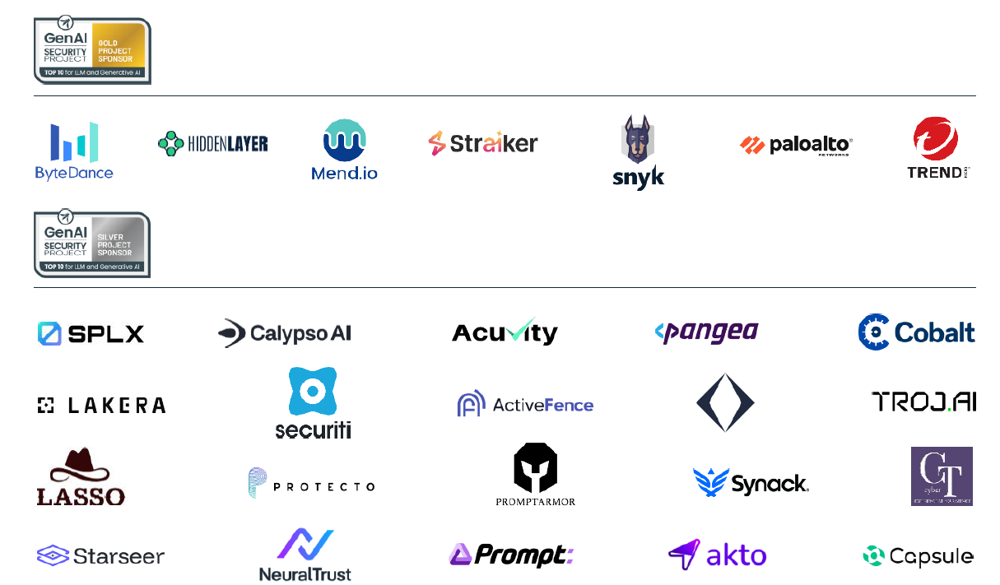

<h1>目次</h1>

${toc}

------------------------------------------------------

# MCP サーバーのセキュアな開発に関する実践ガイド

### 第 1.0 版
### 2026 年 2 月

※配布元 = https://genai.owasp.org/resource/a-practical-guide-for-secure-mcp-server-development/
※原文 = https://genai.owasp.org/download/52676/?tmstv=1771286427

# ライセンスおよび用途

本書は、Creative Commons, CC BY-SA 4.0 に基づいてライセンスされています。

以下の行為は自由に行うことができます。

- 共有 — あらゆる媒体または形式で、商用目的を含むあらゆる目的で、資料を複製および再配布すること。
- 改変 — あらゆる目的で、商用目的を含むあらゆる目的で、資料をリミックス、変更、および加工すること。

以下のライセンス条項を遵守している限り、ライセンサーはこれらの自由を取り消すことはできません。

- 表示 — 適切なクレジットを付与し、ライセンスへのリンクを提供し、変更があった場合はその旨を記載する必要があります。これらの行為は、合理的な方法であればどのような方法で行っても構いませんが、ライセンサーがあなたまたはあなたの使用を支持していると示唆するような方法は禁止されています。
- 継承 — 資料をリミックス、変更、または加工する場合は、あなたの貢献部分を元の資料と同じライセンスの下で配布する必要があります。
- 追加制限なし — ライセンスで許可されている行為を他者が法的に制限するような法的条項または技術的手段を適用することはできません。

ライセンス全文へのリンク: https://creativecommons.org/licenses/by-sa/4.0/legalcode

# 導入および背景

組織は、AI 統合を保護するために MCP サーバーのセキュリティを確保する必要があります。MCP サーバーは、AI アシスタントと外部ツールやデータ ソース間の橋渡しとして機能するため、セキュリティ上の欠陥があると、攻撃者が AI アシスタントを操作したり、機密情報を盗んだり、下流のシステムを侵害したりする可能性があります。従来の API とは異なり、MCP サーバーは委任されたユーザー権限や動的なツール ベースのアーキテクチャで動作することが多く、複数のツール呼び出しを連鎖的に実行できるため、単一の脆弱性の影響が増幅されます。

このガイドでは、セキュアな MCP サーバーを設計および実装するためのベスト プラクティスを紹介します。セキュリティ実務者にとって有益な情報となることは間違いありませんが、MCP サーバー開発を担当するソフトウェア アーキテクト、プラットフォーム エンジニア、開発チームを対象としています。このガイドでは、初期アーキテクチャから本番環境へのデプロイメントまで適用できる重要なセキュリティ管理策と設計上の決定事項について概説しています。

# 現在の脆弱性の情勢

MCP サーバーは、従来の API セキュリティ脆弱性に加え、AI 固有のリスクを含む、広範かつ固有の攻撃対象領域にさらされています。一般的な脆弱性/リスクには、以下があります。

- **ツール汚染**: 攻撃者は、プロンプトやツール メタデータに細工された入力情報を提供することで AI を操作します。例えば、悪意を持って設計されたツールの説明には、モデルを欺いて意図しないアクションを実行させたり、データを盗み出させたりするための隠された命令が含まれている可能性があります。
- **動的なツールの不安定性（「ラグ プル」）**: ツールの説明には厳密なバージョン管理が存在せず、動的にロードされるため、「ラグ プル」のリスクがあります。以前は信頼されていたツール定義がリアルタイムで入れ替えられたり変更されたりすることで、変更前に行われた初期セキュリティ チェックを迂回し、悪意のある動作を引き起こす可能性があります。
- **コード インジェクションと安全でない実行**: MCP サーバーは、モデルから提供された入力情報を検証なしにシステム コマンド、API、またはデータベース クエリに直接渡します。そのため、ユーザーの認識や承認なしに、正しくないコード、誤解を招くコード、または悪意のあるコードが実行される場合があります。
- **資格情報の漏洩とトークンの悪用**: MCP サーバーは、多くの場合、API 鍵や OAuth トークンを処理します。これらのシークレットが不適切に保存されていたり、平文で記録されていたり、長期間キャッシュされていたりすると、攻撃者はそれらを盗み、クライアントになりすましたり、接続されたシステムにアクセスしたりする可能性があります。
- **過剰な権限**: 過剰な権限を持つツールや広範なアクセス スコープは、侵害の影響を劇的に増幅させます。これは最小権限の原則に違反し、侵害された単一のツールが多くのシステムを危険にさらす可能性があります。MCP サーバーがポリシー適用者である場合、または LLM がユーザーと対話する際に権限の不一致がある場合に当てはまります。
- **不十分な隔離（セッション、アイデンティティ、コンピューティング）**: MCP サーバーは、多くの場合、複数の同時セッションを管理したり、アクセス権限を共有したり、共有環境でコードを実行したりするため、多層的な隔離リスクが生じます。プロトコルによって強制される状態分離がなければ、あるユーザーが誤って別のユーザーのコンテキストにアクセスしてしまうというような、テナント間のデータ漏洩のリスクが明確に存在します。さらに、MCP サーバーが複数のユーザーで単一のアクセス アイデンティティ（サービス アカウントなど）を共有すると、個々のユーザー アクションを区別できないアイデンティティ偽装のリスクが生じます。論理的な隔離に加え、コンピューティングの隔離も不可欠です。サーバーが厳密なサンドボックス化のない共有ホスト環境（コンテナやマイクロ VM など）でコードやツールを実行する場合、悪意のあるテナントが共有リソースを枯渇させたり、他のテナントのプロセス メモリにアクセスしたりする恐れがあります。

# 1. セキュアな MCP アーキテクチャ

- **ローカル接続とリモート接続**: MCP は、ローカル ネットワーク通信用の STDIO または Unix ソケットと、リモート接続用の Streamable HTTP という 2 つの通信チャネルを公開します。各通信には、追加のセキュリティ管理策が適用されます。
	- **ローカル MCP サーバー**: ネットワーク ソケットよりも STDIO または Unix ソケットを優先します。ローカル HTTP を使用する必要がある場合は、127.0.0.1 にのみバインドし、明示的な承認/認証を使用し、Origin ヘッダーを検証します。プロセスは、隔離/サンドボックス化されたサブ プロセスまたはコンテナで実行し、外部ネットワークへのアクセスは最小限に抑えるか、一切アクセスしないようにし、権限も最小限に抑えます。
	- **リモート MCP サーバー**: すべてのリモート接続に TLS 1.2 以上を適用します。すべての JSON-RPC メッセージを MCP スキーマに対して厳密に検証し、不正な形式または認識できないデータを拒否します。
- **信頼できる接続と認証の MCP クライアントへの適用**: MCP クライアントとサーバー間のやり取りを安全に行うには、既知の静的な関係に対して、ホワイトリスト、ハードコードされた接続、または相互 TLS（mTLS）などの強力な検証手法を使用します。クライアントが変化する動的な環境では、静的なネットワーク信頼のみに依存するのではなく、強力な認証プロトコル（OAuth 2.1 や OIDC など）を使用してクライアントのアイデンティティを動的に検証し、接続を許可します。
- **ユーザーとセッションの隔離**: マルチ テナント システムでは、各ユーザーまたはエージェントの実行コンテキスト、メモリ、および一時ストレージを厳密に分離します。ユーザー固有のデータを格納するためのグローバル変数、クラス レベル属性、または共有シングルトン インスタンスの使用は厳格に禁止します。セッションごとに個別のオブジェクトをインスタンス化するようにサーバーを設計するか、厳密にセッション鍵で管理された状態ストア（例: session_id 名前空間を持つ Redis）を使用します。
	- **厳格なライフサイクル管理**: 確定的なクリーンアップ ルーチンを実装します。MCP セッションが終了、切断、またはタイムアウトした場合、関連するすべてのファイル ハンドル、一時ストレージ、メモリ内コンテキスト、およびキャッシュされたトークンが直ちにフラッシュされ、破棄されるようにすることで、残存データの露出を防ぎます。
	- **セッションごとのリソース クォータ**: セッション ID またはユーザーのアイデンティティに基づいて、メモリ、CPU、ファイルシステムの使用量、および API レート制限に厳格な制限を適用します。

# 2. 安全なツール設計

- **暗号化ツールのマニフェスト**: すべてのツールに、説明、スキーマ、バージョン、および必要な権限を含む署名付きマニフェストを必須とします。この署名とハッシュは、読み込み時に検証します。
- **厳格なオンボーディングと承認**: ツールの説明や機能の追加または更新には、正式な承認ワークフローを維持します。これには、コード スキャン（SAST）、動的テスト、依存関係スキャン（SCA）、および手動によるセキュリティ レビューを含める必要があります。
	- **説明と動作の検証**: 手動チェック、ツール ピンニング、LLM スキャンを実装し、ツールの説明に記載されている機能が、実行時の実際のコード動作と一致することを確認します。説明に記載されていないアクション（ネットワーク書き込みなど）を実行しようとするツールには、フラグを立てます。
	- **ツール構造の検証**: ポリシーに追加された各ツールのすべてのフィールドを維持および監査します。モデルには、必要最小限かつ厳密に必要なフィールドのみを公開し、内部メタデータと機密性の高いフィールドはモデルのコンテキスト外に保持します。

# 3. データの検証およびリソースの管理

- **リソース使用量の制限**: ツールの呼び出しとデータ取得にセッションごとのクォータとレート制限を課します。タイムアウトとメモリ/コンピューティング リソースの隔離により、DoS 攻撃やプロセスの暴走を防止します。
- **厳格な入出力検証**: すべてのデータを信頼できないデータとして扱います。すべての（モデルからの）ツール入力と（モデルへの）出力に対してJSON スキーマを定義し、適用します。想定されるスキーマと一致しないリクエストはすべて拒否します。
- **厳格な入出力の無害化とエンコーディング**: モデルへのすべての入力とツールへの出力をフィルタリングおよび無害化します。従来のコード インジェクション攻撃（XSS、SQL インジェクション、RCE など）につながる可能性のあるシーケンスを削除またはエスケープします。ツールまたはモデルからのすべての出力にサイズ制限を適用します。

# 4. プロンプト インジェクション対策

- **構造化されたツール呼び出し**: モデルに自由形式のテキスト コマンドを生成させるのではなく、構造化された JSON ツール呼び出しを優先します。これにより、モデルの意図が、スキーマ検証済みの正式なインターフェースを通じて伝達されます。
- **人間の関与 (HITL (Human-in-the-Loop))**: 高リスクのアクション（例: データの削除、送金、システム レベルの変更）については、承認チェック ポイントを実装します。アクションを一時停止し、続行する前に MCP クライアント上の人間ユーザーからの明示的な確認（例: MCP elicitation（MCP 仕様における確認要求機能） の使用）を求めます。
- **LLM による判断 (LLM-as-a-Judge)**: 高リスクのアクションについては、どのツール呼び出しとパラメータが許可され、どれがブロックされるかを定義するポリシー プロンプトを使用して、異なるコンテキストの LLM セッションで専用の承認チェックを実行します。
- **1 タスク、1 セッション**: エージェントがコンテキストまたはタスクを切り替えると、MCP セッションをリセットします。この「コンテキストの区分化」により、隠れた指示が長い会話履歴に残るのを防ぎ、「コンテキストの劣化」を最小限に抑え、LLM 出力の品質を向上させることができます。

# 5. 認証および認可

- **OAuth 2.1 / OIDC の適用**: すべてのリモート MCP サーバーで認証を必須とします。クライアントとユーザーのアイデンティティには OAuth 2.1 / OIDC を使用し、すべてのリクエストで ISS、AUD、EXP、および署名を検証します。
	- **トークン委任**: OAuth トークン委任フローを使用して、権限を制限しながら、サーバーの非人間アイデンティティ (NHI) を個別に保持し、ユーザーのコンテキストと権限を MCP サーバーに渡します。([RFC 8693](https://www.rfc-editor.org/rfc/rfc8693.html#name-act-actor-claim))
	- **トークン パススルーの禁止**: クライアント トークンを下流の API に転送せず、MCP サーバーに対して明示的に発行されたトークン、または "On-Behalf-Of" フローで検証されたトークンを使用します。直接パススルーは監査証跡を破壊し、ポリシーを迂回するため、混乱した代理 (Confused Deputy) の重大なリスクが発生します。この脆弱性により、MCP サーバーがユーザーの権限を悪用して不正なアクションを実行し、サーバーのセキュリティ制約を実質的に回避する可能性があります。
- **有効期間が短く、スコープが限定されたトークンの使用**: 有効期間が最低限（分単位）でスコープが狭いアクセス トークンを発行します。ツールやリソースへのアクセスを実行する前に、各呼び出しでトークンの署名、オーディエンス、有効期限を再検証します。
- **セッションをアイデンティティではなく状態として扱うこと**: 認可や認証において、セッション ID のみに依存してはなりません。すべてのセッション/ストリーム/キュー エントリを検証済みのユーザーおよびクライアント アイデンティティにバインドし（OAuth）、積極的にローテーション/有効期限を設定し、機密性の高いアクションを実行する前に認可を再確認します。
- **ポリシー適用の一元管理**: 専用のポリシー/ゲートウェイ層を使用して、認証、認可、同意、ツール フィルタリング、監査ログを適用します。すべてのリクエストを一元的に評価することで、エージェント、サーバー、上流サービス間でポリシーの一貫性を維持します。

# 6. セキュアなデプロイメントおよび更新

- **シークレットの保存と管理**: クライアント認証情報とAPI 鍵には、シークレット保存用のボールトを使用します。シークレットを環境変数、ログ、またはコード内の平文に保存してはなりません。LLM によるシークレットへのアクセスは許可せず、すべてのシークレット管理機能は LLM がアクセスできない透過的なミドルウェアで実行します。
- **コンテナ化と堅牢化** MCP サーバーを最小限が搭載され堅牢化されたコンテナにデプロイします。コンテナを非ルート ユーザーとして実行し、不要なコンテナ パッケージ、依存関係、Linux 機能をすべて削除して、残存する攻撃対象領域を制限します。
- **ネットワーク分離**: サーバーを制限されたネットワーク セグメントに配置します。ファイアウォール ルールまたはKubernetes ネットワーク ポリシーを使用して、明示的に必要なトラフィックを除き、すべてのインバウンドおよびアウトバウンド トラフィックをブロックします。
- **サプライチェーン管理*** ビルド時にすべての依存関係のバージョン ピンニングとスキャンを行い、署名付きコンテナ イメージを使用し、新しい CVE を監視し、すべてのビルドで AIBOM を維持して出所を確保し、改ざんを検出します。
- **CI/CD セキュリティ ゲート**: セキュリティ チェックとスキャンをゲート（次の工程に進ませないためのチェック ポイント）としてパイプラインに直接統合します。新しいコードに脆弱性が組み込まれた場合、承認されていない依存関係を使用している場合、またはポリシー チェック（例: OPA などのコードとしてのポリシーの使用）に失敗した場合には、ビルドを失敗させます。
- **安全なエラー処理**: モデル/クライアントに返されるレスポンスに、スタック トレース、トークン、ファイル システム パス、ツール内部情報を返してはなりません。

# 7. ガバナンス

- **暗号の完全性**: すべてのツール、依存関係、レジストリ マニフェストに暗号署名とバージョン ピンニングを適用し、完全性を確保して改ざんを防止します。
- **ピア レビューと監督**: 新しいツールや主要なコード変更をリリースする際には必ずセキュリティに重点を置いたピア レビューを実施するというポリシーを確立します。
- **監査ログと証跡**: （パラメータを伴う）ツールの呼び出し、リソースへのアクセス、認証/認可イベント、構成の変更（新しい値と古い値のログ）など、すべてのアクションをログに記録します。フィールド レベルのホワイト リストと秘匿化/ハッシュ化を使用することで、機密データが詳細なログに記録されるのを防ぎます。これらのログは、フォレンジック分析のためにセキュアかつ変更不可能な状態で保存します。
- **非人間アイデンティティのガバナンス**: すべての自動エージェント、バックエンド プロセス、または MCP サーバー システムを、固有の認証情報と厳密にスコープが設定された権限を持つファースト クラスのアイデンティティとして扱います。NHI システムのデータ アクセスとツールの使用状況を継続的に監査します。

# 8. ツールおよび継続的な検証

- **自動コード スキャン**: CI/CD パイプラインで、（カスタム MCP ルールを有する）静的解析 (SAST) ツールと Invariant MCP-Scan を使用します。ソフトウェア構成解析 (SCA) ツール（npm audit、pip audit、OSV-Scanner など）を使用して、依存関係の脆弱性を検出します。スキャン結果によりリスク許容度を超えるビルドは中断します。
- **実行時の保護**: 実行時セキュリティ ツールを使用して隔離を強化します。これには、Docker の seccomp プロファイル、AppArmor、または context-protector などの特殊なラッパーが含まれます。mcp-watch などのツールは、実行時の動作を監視できます。
- **継続的な監視**: MCP サーバーの監査ログを集中監視システム (SIEM) にフィードします。検証失敗の急増、ツールの高頻度呼び出し、ツールが通常とは異なるファイルに突然アクセスするなど、疑わしいパターンに対してリアルタイムアラートを設定します。
- **サプライチェーンの警戒**: OpenSSF Scorecard などのフレームワークを使用して、プロジェクトのセキュリティ態勢を評価します。依存関係における新たな問題について、OSV などの脆弱性データベースを監視します。

# 最低限の MCP セキュリティ（レビュー チェックリスト）

1. 強力なアイデンティティ、認証、ポリシーの適用
	- すべてのリモート MCP サーバーは、OAuth 2.1/OIDC を使用しています。
	- トークンは、有効期間が短く、スコープが設定され、呼び出しごとに検証されています。
	- トークンのパススルーはなく、ポリシーの適用は一元管理されています。
2.  厳格な隔離とライフサイクル制御
	- ユーザー、セッション、実行コンテキストは、完全に隔離されています。
	- ユーザー データの状態は、共有されていません。
	- セッションは、確定的にクリーンアップされ、リソース クォータが強制されています。
3. 信頼され管理されたツール
	- ツールは、暗号署名され、バージョン ピンニングされ、正式に承認されています。
	- ツールの説明は、実行時の動作に対して検証されています。
	- モデルには、必要最小限のツール フィールドのみが公開されています。
4. あらゆる場所でのスキーマ駆動型の検証
	- すべての MCP メッセージ、ツールの入力、出力はスキーマ検証されています。
	- 入出力は、無害化され、サイズ制限され、信頼できないものとして扱われています。
	- 構造化（JSON）ツールの呼び出しが必要となっています。
5. 堅牢化されたデプロイメントと継続的な監視
	- サーバーは、コンテナ化され、非ルート権限で、ネットワーク制限された状態で実行されています。
	- シークレットは、ボールトに保存され、LLM に公開されることはありません。
	- CI/CD セキュリティ ゲート、監査ログ、継続的な監視が必須となっています。

# 謝辞

## 貢献者

<table border="0">
<tr>
	<th>氏名</th>
	<th>組織・企業名</th>
</tr>
<tr>
	<td>Idan Habler, PhD</td>
	<td>CISCO, OWASP</td>
</tr>
<tr>
	<td>Tomer Elias</td>
	<td>OWASP</td>
</tr>
<tr>
	<td>Joshua Beck</td>
	<td>SAS</td>
</tr>
<tr>
	<td>Venkata Sai Kishore Modalavalasa</td>
	<td>OWASP</td>
</tr>
<tr>
	<td>Manish Bhatt</td>
	<td>OWASP/Amazon Leo</td>
</tr>
<tr>
	<td>Vineeth Sai Narajala</td>
	<td>Cisco, OWASP</td>
</tr>
<tr>
	<td>Yuval Sarel</td>
	<td>Cyera</td>
</tr>
<tr>
	<td>Tomer Wetzler</td>
	<td>Zenity</td>
</tr>
<tr>
	<td>Rico Komenda</td>
	<td>adesso SE & OWASP</td>
</tr>
<tr>
	<td>Hisham Abdulhalim</td>
	<td>Payoneer</td>
</tr>
<tr>
	<td>Guy Shtar</td>
	<td>intuit</td>
</tr>
<tr>
	<td>Sagiv Antebi</td>
	<td>BGU</td>
</tr>
<tr>
	<td>John Cotter</td>
	<td>Bentley Systems</td>
</tr>
<tr>
	<td>Dipen Shah</td>
	<td>Affirm</td>
</tr>
<tr>
	<td>Aamiruddin Syed</td>
	<td>OWASP</td>
</tr>
<tr>
	<td>Roy Barkay</td>
	<td>Nebius</td>
</tr>
<tr>
	<td>Almog Langleben</td>
	<td>Sunbit</td>
</tr>
<tr>
	<td>Riggs Goodman III</td>
	<td>AWS</td>
</tr>
<tr>
	<td>Roi Vanunu</td>
	<td>Jazz</td>
</tr>
</table>

# OWASP GenAI Security Project のスポンサー

プロジェクト スポンサーの皆様には、プロジェクトの目標達成を支援する資金のご寄付、そして OWASP.org 財団が提供するリソースを補うための運営費やアウト リーチ活動費用へのご支援を賜り、心より感謝申し上げます。OWASP GenAI Security Project は、ベンダー中立かつ公平なアプローチを継続的に維持しています。スポンサーの皆様には、ご支援の一環として特別なガバナンス上の配慮はいたしません。ただし、ご貢献は、プロジェクト資料やウェブ プロパティにおいて認められます。プロジェクトが生成するすべての資料は、コミュニティによって開発・運営され、オープンソースおよびクリエイティブ コモンズ ライセンスの下で公開されています。スポンサーになる方法の詳細については、<u>ウェブ サイトのスポンサーシップ セクションをご覧ください</u>。スポンサーシップを通じてプロジェクトを持続的に支援する方法について詳しくご説明します。

## プロジェクト スポンサー

**スポンサー一覧は発行日時点のものです。スポンサー一覧全文は[こちら](https://genai.owasp.org/supporters/)をご覧ください。**

## プロジェクト サポーター

プロジェクト サポーターには、プロジェクトの目標をサポートするためにリソースと専門知識を提供していただいています。

<table border="0" >
<tr><td>Accenture</td><td>Cobalt</td><td>Kainos</td><td>PromptArmor</td></tr>
<tr><td>AddValueMachine Inc</td><td>Cohere</td><td>KLAVAN</td><td>Pynt</td></tr>
<tr><td>Aeye Security Lab Inc.</td><td>Comcast</td><td>Klavan Security Group</td><td>Quiq</td></tr>
<tr><td>AI informatics GmbH</td><td>Complex Technologies</td><td>KPMG Germany FS</td><td>Red Hat</td></tr>
<tr><td>AI Village</td><td>Credal.ai</td><td>Kudelski Security</td><td>RHITE</td></tr>
<tr><td>aigos</td><td>Databook</td><td>Lakera</td><td>SAFE Security</td></tr>
<tr><td>Aon</td><td>DistributedApps.ai</td><td>Lasso Security</td><td>Salesforce</td></tr>
<tr><td>Aqua Security</td><td>DreadNode</td><td>Layerup</td><td>SAP</td></tr>
<tr><td>Astra Security</td><td>DSI</td><td>Legato</td><td>Securiti</td></tr>
<tr><td>AVID</td><td>EPAM</td><td>Linkfire</td><td>See-Docs & Thenavigo</td></tr>
<tr><td>AWARE7 GmbH</td><td>Exabeam</td><td>LLM Guard</td><td>ServiceTitan</td></tr>
<tr><td>AWS</td><td>EY Italy</td><td>LOGIC PLUS</td><td>SHI</td></tr>
<tr><td>BBVA</td><td>F5</td><td>MaibornWolff</td><td>Smiling Prophet</td></tr>
<tr><td>Bearer</td><td>FedEx</td><td>Mend.io</td><td>Snyk</td></tr>
<tr><td>BeDisruptive</td><td>Forescout</td><td>Microsoft</td><td>Sourcetoad</td></tr>
<tr><td>Bit79</td><td>GE HealthCare</td><td>Modus Create</td><td>Sprinklr</td></tr>
<tr><td>Blue Yonder</td><td>Giskard</td><td>Nexus</td><td>stackArmor</td></tr>
<tr><td>BroadBand Security, Inc.</td><td>GitHub</td><td>Nightfall AI</td><td>Tietoevry</td></tr>
<tr><td>BuddoBot</td><td>Google</td><td>Nordic Venture Family</td><td>Trellix</td></tr>
<tr><td>Bugcrowd</td><td>GuidePoint Security</td><td>Normalyze</td><td>Trustwave SpiderLabs</td></tr>
<tr><td>Cadea</td><td>HackerOne</td><td>NuBinary</td><td>U Washington</td></tr>
<tr><td>Check Point</td><td>HADESS</td><td>Palo Alto Networks</td><td>University of Illinois</td></tr>
<tr><td>Cisco</td><td>IBM</td><td>Palosade</td><td>VE3</td></tr>
<tr><td>Cloud Security Podcast</td><td>iFood</td><td>Praetorian</td><td>WhyLabs</td></tr>
<tr><td>Cloudflare</td><td>IriusRisk</td><td>Preamble</td><td>Yahoo</td></tr>
<tr><td>Cloudsec.ai</td><td>IronCore Labs</td><td>Precize</td><td>Zenity</td></tr>
<tr><td>Coalfire</td><td>IT University Copenhagen</td><td>Prompt Security</td><td></td></tr>
</table>

**サポーター一覧は発行日時点のものです。サポーター一覧全文は[こちら](https://genai.owasp.org/supporters/)をご覧ください。**
