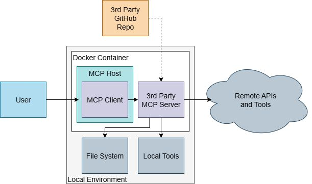
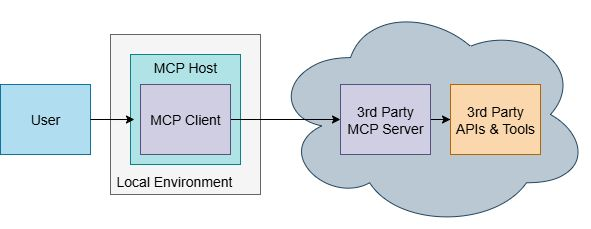
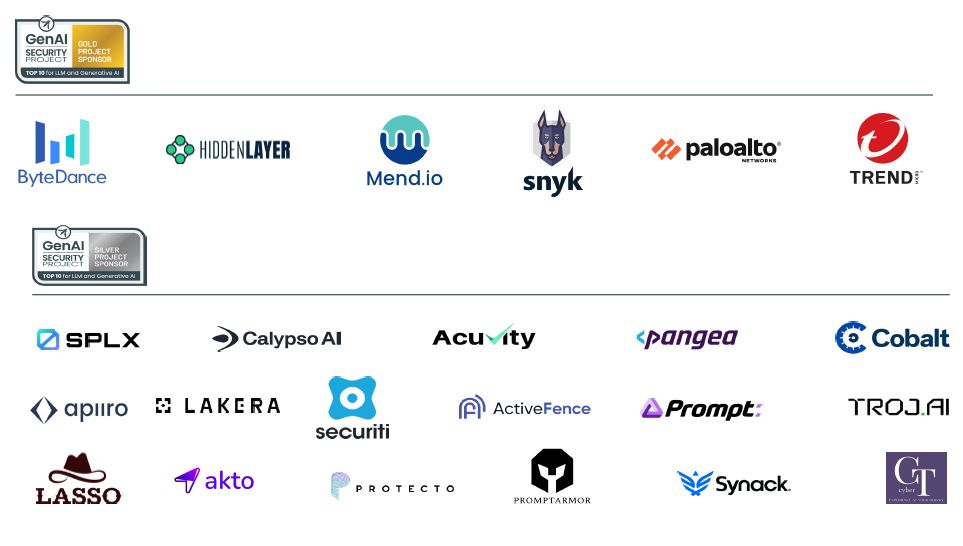

<h1>目次</h1>

${toc}

------------------------------------------------------

# サード パーティ製 MCP サーバーのセキュアな使用に関する実践ガイド

### 第 1.0 版
### 2025 年 10 月 23 日

※配布元 = https://genai.owasp.org/resource/cheatsheet-a-practical-guide-for-securely-using-third-party-mcp-servers-1-0/
※原文 = https://genai.owasp.org/download/51928/?tmstv=1762283701

# ライセンスおよび用途

本書は、Creative Commons, CC BY-SA 4.0 に基づいてライセンスされています。

以下の行為は自由に行うことができます。

- 共有 — あらゆる媒体または形式で、商用目的を含むあらゆる目的で、資料を複製および再配布すること。
- 改変 — あらゆる目的で、商用目的を含むあらゆる目的で、資料をリミックス、変更、および加工すること。

以下のライセンス条項を遵守している限り、ライセンサーはこれらの自由を取り消すことはできません。

- 表示 — 適切なクレジットを付与し、ライセンスへのリンクを提供し、変更があった場合はその旨を記載する必要があります。これらの行為は、合理的な方法であればどのような方法で行っても構いませんが、ライセンサーがあなたまたはあなたの使用を支持していると示唆するような方法は禁止されています。
- 継承 — 資料をリミックス、変更、または加工する場合は、あなたの貢献部分を元の資料と同じライセンスの下で配布する必要があります。
- 追加制限なし — ライセンスで許可されている行為を他者が法的に制限するような法的条項または技術的手段を適用することはできません。

ライセンス全文へのリンク: https://creativecommons.org/licenses/by-sa/4.0/legalcode

本書に記載されている情報は、法的助言を構成するものではなく、また法的助言を構成することを意図するものでもありません。すべての情報は、一般的な情報提供のみを目的としています。

本書には、第三者のウェブサイトへのリンクが含まれています。これらのリンクは便宜上提供されているものであり、OWASP は、第三者のウェブサイトのコンテンツを推奨または支持するものではありません。

# 導入と背景

このチート シートは、サード パーティ製の MCP（つまり、自社組織内で開発されていない MCP）の使用を計画している企業や開発者を対象としています。MCP 開発者向けのチート シートではありません。

**モデル コンテキスト プロトコル（MCP）** は、LLM/エージェント ホストがサーバー経由で外部ツール、データ、プロンプト テンプレートに接続する方法を標準化するオープンなプロトコルです。モデルをデータベース、API、社内アプリケーションなどのシステムに接続することで、MCP は強力な自動化を実現し、AI がテキスト生成以外のアクションを実行できるようにします。しかし、MCP は新たな攻撃対象領域も生み出し、組織を悪意のある攻撃にさらす可能性があります。ツールはコードの実行、ファイルへのアクセス、ネットワーク呼び出しを行うことができるため、MCP スタックが侵害されると、データの盗難、悪意のあるコードの実行、システムの妨害につながる可能性があります。

MCP は、API セマンティクス用の**データ層**（JSON-RPC）と通信用の**トランスポート層**（STDIO、Streamable HTTP など）という 2 つの主要層で構成されるシンプルなクライアント-サーバー モデルを採用しています。

- **MCP ホスト**: クライアントを管理し、リクエストをルーティングするアプリケーション（例: AI エージェント ランタイム）。
- **MCP クライアント**: 単一の MCP サーバーと通信するコネクタ。
- **MCP サーバー**: クライアントにツールとコンテキスト（例: カレンダー、SaaS API）を公開するプログラム。MCP は、サーバーが公開できる 以下の 3 つのコア プリミティブを定義します。
	- ツール: AI アプリケーションがアクションを実行するために呼び出すことができる実行可能関数（例: ファイル操作、API 呼び出し、データベース クエリ）。
	- リソース: AI アプリケーションにコンテキスト情報を提供するデータソース（例: ファイルの内容、データベース レコード、API レスポンス）。モデルへの参照。
	- プロンプト: 言語モデルとのインタラクションを構造化するのに役立つ再利用可能なテンプレート（例: システム プロンプト、Few-Shot の例）。

このチート シートは、（MCP をセキュアに使用して）サード パーティ製の MCP サーバーを使用する開発者向けの主要なセキュリティ管理策の概要を示します。

## 利用事例

ダウンロード可能な MCP サーバーは、ローカルで実行され、ネイティブ ツールとシステム レベルの権限を使用して、外部インフラストラクチャに依存しないタスクを実行します。これらのシステムでは、MCP クライアントとサーバー間の通信に STDIO を使用することがよくあります。コア操作はローカルで実行されますが、LLM 実行やリモート API 呼び出しなどの一部の機能は、構成に応じてリモート サービスと連携する場合があります。

この MCP クライアントは、MCP の HTTP Streamable 通信を介してサーバーに接続し、サーバーはリモートで実行されます。サーバーは、多くの場合クラウド環境でホストされている外部ツールや API と連携する機能を持ちます。このデプロイメントにおける主要な考慮事項には、認証/認可、サーバーの検出、そしてレビューされていない MCP ツールの変更が含まれます。

# 現時点での脆弱性の状況

MCP をめぐっては、一般的な攻撃パターンが出現し始めています。その多くは、LLM に影響を与えることを目的とした悪意のある入力、または LLM が呼び出すツールに影響を与える攻撃に焦点が当てられています。

## ツール汚染とラグ プル攻撃

ツール汚染は、攻撃者がツールの説明またはパラメータ内に悪意のあるコマンドを埋め込む間接的なプロンプト インジェクションの一種です。LLM はこれらの隠された命令を実行し、データやファイル システムへの不正アクセスにつながる可能性があります。ラグ プルは、正規のツールが不正なバージョンに密かに置き換えられ、元のツールによって確立された信頼関係を利用して攻撃を実行する、ツール汚染の特定の種類です。

### 軽減策

- **ツールの完全な透明性の確保**: MCP クライアントは、ユーザーがツールをアクティブ化する前に、説明、パラメータ、機能を含む完全なツールマニフェストを表示する必要があります。挿入された命令を隠す可能性のあるため、短縮された要約の表示は避けます。
- **説明の無害化**: 説明に疑わしいキーワードやマーク アップがないか確認します。[OWASP
LLM Prompt Injection Prevention Cheat Sheet](https://cheatsheetseries.owasp.org/cheatsheets/LLM_Prompt_Injection_Prevention_Cheat_Sheet.html) を参考にします。入手可能な場合は MCP コード全体をレビューし、ツール名と説明およびコードを比較して、疑わしい不一致を特定します。
- **ツールの整合性とバージョンの監視**: クライアントは、最初のユーザー承認時に MCP サーバーとそのツールのバージョンを固定する必要があります。ハッシュまたはチェック サムを使用して、ツールの説明と機能が悪意を持って変更されていないことを検証します。バージョン履歴を維持し、不正な変更があった場合は管理者に警告します。
- **ランタイム ポリシーの適用**: MCP サーバーの境界（ホスト/コンテナ/プロキシ）で最小権限ポリシーを適用し、ツールによるローカル ファイルの読み取り、機密 API へのアクセス、データの抽出を制限します。

## プロンプト インジェクション

攻撃者は、悪意のあるユーザー入力、ツールによって取得されたコンテンツ、またはツールの引数を利用してモデルのコンテキストを乗っ取り、危険なツールの呼び出し、[会話履歴の漏洩]()、安全ポリシーの無効化など、意図しないアクションを実行させます。

### 軽減策

- **信頼できないデータの検証**: ツールの説明やサーバーの応答、ユーザー入力など、すべての外部データをモデルに渡す前に無害化および検証します。[OWASP
LLM Prompt Injection Prevention Cheat Sheet](https://cheatsheetseries.owasp.org/cheatsheets/LLM_Prompt_Injection_Prevention_Cheat_Sheet.html) の「Input Validation and Sanitization（入力の検証と無害化）」セクションを参考にします。
- **強力なスキーマの使用**: すべてのツール入力に対して厳格な JSON/YAML スキーマを定義し適用します。検証には、Pydantic (Python) や JSON Schema などのライブラリを使用します。
- **コンテキストのセグメント化**: 異なるユーザーとのクライアント インタラクションをセグメント化し、新しい操作または別の操作にはサード パーティ製 MCP サーバーとの新しい接続/セッションを確立します。

## 記憶の汚染

この攻撃は、エージェントの短期または長期記憶（例: ベクトル データベース）を破壊し、誤った情報を保存したり、セキュリティ チェックを回避したり、誤った判断を下したりさせます。これは、システム全体の誤情報や権限昇格につながる可能性があります。

### 軽減策

- **記憶の保護と検証**: すべての記憶領域の更新時に検証を実施します。異常をスキャンし、ソースのアトリビューションを要求し、暗号ハッシュを使用します。
- **記憶保持の制限**: 保存されたデータにTTL（Time-To-Live）を実装し、古くなった情報や悪意のある情報が永続化されるのを防ぎます。
- **記憶のセグメント化**: エージェントによる共有記憶ストアへの書き込みを防止し、連鎖的な障害を回避します。セッションまたはユーザー ID ごとに記憶を分離します。

### ツールの干渉

複数の MCP サーバーを使用すると、意図しないツール実行チェーンが発生する可能性があります。あるツールからの LLM 出力が、別のサーバーのツールを誤ってトリガーし、データ漏洩、誤操作、またはサービス拒否ループを引き起こす可能性があります。

### 軽減策

- **人間の介入 (Human-in-the-Loop) の要求**: ユーザーが設定可能なサーバーの場合、ツールを実行する前に承認フローを実装し、ユーザーがアクションを認識できるようにします。エージェント型システムの場合は、階層型 HITL 戦略を選択して、堅牢な監視を実現します。
- **コンテキストの分離**: 各ツール実行のコンテキストを分離し、必要な情報のみをツール間で受け渡します。実行ごとに LLM コンテキストをリセットします。
- **タイムアウトの設定**: 実装が不十分なツールやループするツールがホストに影響を与えないように、実行タイム アウトを実装します。

# クライアントのセキュリティとサーバーの検出

MCP クライアントと MCP サーバーのセキュリティ責任と攻撃対象領域を理解することは、包括的な保護を実装するために不可欠です。それぞれの側は固有の脅威に直面しており、それぞれに合わせたセキュリティ対策が必要です。

## MCP クライアントのセキュリティに関する考慮事項

クライアントは多くの場合、アプリケーションに組み込まれています。ツールの利用者として機能し、悪意のあるサーバーに対する最前線の防御となります。

- **信頼の最小化**: サーバーが信頼できると想定せず、常にマニフェストを検証し、スキーマを適用し、許可リストを適用します。
- **サンド ボックス実行**: サーバーが侵害された場合の影響を軽減するため、クライアントを制限された環境（ファイル システム/ネットワーク アクセスが制限されたコンテナなど）で実行します。
- **コンテナ（Dockerなど）を使用してサード パーティ製の MCP サーバーを実行します**。Docker コンテナは標準化された隔離環境を提供し、侵害されたサーバーがホスト システムのリソース、ファイル、ネットワークにアクセスするのを防ぎます。
- **ジャスト イン タイム（JIT）アクセス**: 特定のタスクの実行中のみ、ツールに一時的に限定された権限を付与します。権限は自動的に期限切れになり、即座に取り消されます。
- **UI の透明性**: ツールの実行前に、ツールの完全な説明、権限、データ アクセスをユーザーに公開します。リスクを隠すような非表示または「要約」されたビューは避けます。
- **ローカル データ保護**: クライアント側のシークレット、履歴、またはキャッシュされた記憶がサーバーから流出することを防止します。LLM に渡されるすべてのデータを無害化します。
- **インシデント検出**: 異常なツール呼び出しパターン（大量のファイル読み取り、過剰な API 呼び出しなど）を監視し、アラートをトリガーします。

## サーバーの検出と検証

MCP サーバーを使用する上で重要な段階は「検出」です。この段階では、サーバーが識別、検証され、接続されます。

### 検出と接続

- **接続前のオリジン検証**: 信頼できるレジストリからのサーバーにのみ接続します。IP 許可リストとネットワーク分離を使用して、不明なサーバーへの接続を防止します。オープンソース ツールまたはローカルにホストされているサーバーの場合は、常にソースを検証し、署名を確認し、既知の脆弱性や悪意のある変更がないかスキャンします。
- **利用サーバーをレジストリに限定**: 承認済みの全サーバーを中央のレジストリで一元管理します。
- **ホスティングと接続の典型例の選択**:
	- **STDIO（ローカル接続）**: ローカルにホストされている MCP サーバー（サード パーティのリポジトリまたはベンダーからダウンロード）の場合は、MCP サーバーのサブ プロセスへの接続として STDIO を使用します。このアプローチはレイテンシが最も低く、プロセス サンドボックス、[seccomp](https://en.wikipedia.org/wiki/Seccomp)、または [AppArmor](https://apparmor.net/) による強化が容易です。
	- **Streamable HTTP（リモート接続）**: リモート サーバー、マルチテナント サーバー、または自動スケーリング サーバーの場合は、Streamable HTTP 経由のリモート接続を使用します。堅牢な認証には TLS/mTLS または OAuth 2.1 を使用し、WAF とレート制限機能で保護します。認証情報（API キー、証明書）は定期的に変更します。

### 検証

- **バージョンの固定**: 承認済みサーバーとツールのバージョンのマニフェストを維持します。チェック サムを使用して整合性を検証し、悪意のあるアップグレードを未然に防ぎます。
- **段階的なロール アウト**: まず、完全なテレメトリを備えたステージング環境で新しいサーバーを有効にします。インシデントが発生しない試用期間が経過した場合にのみ、本番環境に移行します。リグレッションや侵害が発生した場合に備えて、ロール バック手順を自動化します。
- **人間による承認の記録**: すべてのセキュリティおよびドメイン所有者の承認をレジストリに記録します。承認済みのサーバー インベントリからの逸脱を監視し、アラートを発します。

## 認証と認可

ローカルまたはリモートの MCP サーバーへのセキュアな接続には、認証と認可の両方が不可欠です。MCP は仕様の一部として OAuth 2.1 を実装しており、実装のガイドとして使用できます。ただし、MCP アーキテクチャが異なると、それぞれ異なる OAuth 設定が必要になることに注意してください。

### 認証

- **システム操作に対してクライアント資格情報を活用します**。MCP クライアントがユーザー ID を持たないシステムとして対話する場合は、アイデンティティ プロバイダーのクライアント資格情報を使用してリモート MCP サーバーへの認証を行います。
- **ユーザー操作に対して OIDC/PKCE を活用します**。チャット ボットや AI アシスタントなど、ユーザーが操作に密接に関連する利用事例では、ユーザー ログインには OIDC と PKCE を使用し、下流の MCP サーバーへの認証にはユーザー資格情報を活用します。
	- OAuth を実装できない場合は、スコープが狭く有効期間が短いパーソナル アクセス トークンを使用して、ユーザー アクセスを識別および制限します。
- **保護された登録**。[動的クライアント登録](https://datatracker.ietf.org/doc/html/rfc7591)は、ほとんどの利用事例では推奨されません。ただし、必要な場合、クライアントの不正登録を提供したくない認可サーバーには、登録エンド ポイントを保護するためのいくつかのオプションがあります。
	- **アクセス トークン**: サーバーは、登録リクエストに対して認可（例：OAuth アクセス トークン経由）を要求する場合があります。ほとんどの場合、このトークンはクライアント登録フローの外で手動でリクエストできます。
	- **ソフトウェア ステートメント**: クライアントは、クライアント メタデータをアサートする署名付き JWT である[ソフトウェア ステートメント](https://datatracker.ietf.org/doc/html/rfc7591#section-2.2)を提供する場合があります。認可サーバーは、信頼を確立するためにこれを検証する場合があります。
	- **署名付きリクエスト ボディ**: サーバーは、登録リクエストに署名を要求し、事前設定された鍵に基づいて署名を検証する場合があります。

### 認可

- **最小権限を持つ OAuth スコープの定義**: OAuth スコープを使用してリソースへのアクセスを制限し、MCP クライアントまたはユーザーに過度のアクセス権が付与されないようにします。
- **きめ細かな権限の使用**: ID ごとにアクション レベルの権限を使用して、特定のアクションまたは個々のデータ要素への権限をさらに制限します。
- **人間の介入による (Human-in-the-Loop) 制御**: ローカル MCP サーバーからのファイル システムへのアクセスや、メールへのアクセスなどの新しいリソースに対するリモート MCP 実行など、以前に実行されたことのないアクションには、人間による承認を必須にします。

# ツールおよびユーティリティ

どのツールも完全なカバレッジを提供するものではなく、リストされているツールの成熟度や有効性はそれぞれ異なります。これらのリストを参考に、利用事例や技術要件に適したツールを調査・選定してください。

## 自動スキャナー

- [Invariant Labs MCP-Scan](https://github.com/invariantlabs-ai/mcp-scan): MCP ツールにおける悪意のある記述をスキャンし接続を監視して、プロンプト インジェクション、ツール汚染、セキュアでないデータ フローなどの問題を検出します。
- [Semgrep MCP Scanner](https://github.com/semgrep/semgrep/tree/develop/cli/src/semgrep/mcp): MCP 用のルールを備えた静的解析ツール（ベータ版）。Python および Node.js の依存関係をスキャンし、MCP-Get と統合してリストされているすべてのサーバーをスキャンします。
- [mcp-watch](https://github.com/kapilduraphe/mcp-watch): 認証情報のセキュアでない保存やツール汚染の試みなどの脆弱性をスキャンします。
- [Trail Of Bits mcp-context-protector](https://github.com/trailofbits/mcp-context-protector): 信頼できない MCP サーバーの実行に伴うリスクに対処する MCP サーバー用のセキュリティ ラッパーです。
- [Vijil Evaluate](https://www.vijil.ai/evaluate): AI エージェントの信頼性、安全性、セキュリティを評価するプラットフォームです。

## コンテンツ監視/モデレーション

- [LangKit](https://github.com/whylabs/langkit): LLM 出力を監視するためのツール キット。
- [OpenAI Moderation API](https://platform.openai.com/docs/guides/moderation): 不適切なコンテンツを検出するための API。
- [Invariant Labs Invariant](https://github.com/invariantlabs-ai/invariant): エージェント システムを保護するためのコンテキスト ガードレール。
- [LlamaFirewall](https://github.com/meta-llama/PurpleLlama/tree/main/LlamaFirewall): エージェントによる LLM の使用に影響を与えるリスクを検知するスキャナーを備えたフレームワーク。

## オープンソース管理

- [OpenSSF Scorecard](https://github.com/ossf/scorecard): リポジトリの成熟度を検証します。
- [Snyk package health](https://snyk.io/advisor/): リポジトリのメンテナンス状況を検証します。

## サンドボックス実行

- [Docker](https://www.docker.com/): ローカルとリモートの両方のコンピューティング環境において、Docker コンテナ内で MCP サーバーを実行し、ローカル ファイルへのアクセスを制限し、悪意のあるツールが定義されたオペレーティング環境から脱出することを防ぎます。

# ガバナンス

審査および監視された MCP サーバーのみが使用されるように、正式なガバナンス戦略を確立します。この戦略の中核となるのは、**信頼できる MCP レジストリ**です。

レジストリは、承認された各サーバーに関するメタデータを保持し、実行時にポリシーを適用する必要があります。これにより、**コードとしてのポリシー** ゲートと監査のための証拠を用いて、**審査済みで最小限の権限しか付与されず、継続的に監視されている** MCP サーバーのみがホスト/エージェントから利用可能であることを保証できます。

## ガバナンス ワークフロー

1. **提出**: 開発者は、新しいサードパーティ製 MCP サーバーを、そのドキュメントとツールの説明のハッシュとともにレビューのために提出します。
2. **スキャン**: 自動化されたセキュリティ ツールが、サーバー（または利用可能な場合はコード リポジトリ）を解析し、マルウェア、隠し命令、その他のリスクの有無を確認します。
3. **レビューと承認**: セキュリティ専門家とドメイン専門家がスキャン結果をレビューします。承認されたサーバーは、バージョンが固定され、レジストリに追加されます。
4. **デプロイメントと監視**: サーバーはステージング環境にデプロイされ、監視されます。試用期間の後、本番環境に昇格されます。
5. **定期的な再検証**: サーバーは、定期的にまたはバージョンが更新されるたびに自動的に再スキャンされます。

## 推奨される役割および責任

- **提出者（開発者）:**: 新しいサーバー統合を提案し、ドキュメントを提供します。
- **セキュリティ レビュー担当者**: セキュリティ管理策、スキャン、サプライ チェーンの整合性を検証します。
- **ドメイン所有者**: サーバーの機能上の必要性を確認し、スコープを承認します。
- **承認者**: サーバーを有効化する前に、セキュリティ担当者とドメイン所有者の両方の承認を必要とします。
- **オペレーター（SRE）**: 接続のロールアウト、監視、キル スイッチを管理します。

# 謝辞

## 寄稿者

<table border="0" >
<tr><td>Idan Habler</td><td>ServiceNow</td></tr>
<tr><td>Tomer Elias</td><td>HUMAN Security</td></tr>
<tr><td>Joshua Beck</td><td>SAS</td></tr>
<tr><td>Netanel Rotem</td><td></td></tr>
<tr><td>Victor Lu</td><td></td></tr>
<tr><td>Keren Katz</td><td></td></tr>
<tr><td>Sonu Kumar</td><td></td></tr>
<tr><td>Ella Duffy</td><td>IBM</td></tr>
<tr><td>Gurpreet Kaur Khalsa</td><td>Palo Alto Networks</td></tr>
<tr><td>Abhishek Mishra</td><td>OneTrust</td></tr>
<tr><td>Sumeet Jeswani</td><td>Google</td></tr>
<tr><td>Adrian Sroka</td><td></td></tr>
<tr><td>Ken Huang</td><td></td></tr>
<tr><td>Riggs Goodman III</td><td>AWS</td></tr>
<tr><td>Brian M. Green</td><td>Health-Vision.AI, LLC</td></tr>
<tr><td>Syed Aamiruddin</td></tr>
<tr><td>RIco Komenda</td><td></td></tr>
<tr><td>John Cotter</td><td>Bentley Systems</td></tr>
<tr><td>Saquib Saifee</td><td>IBM</td></tr>
<tr><td>Almog Langleben</td><td></td></tr>
<tr><td>Mohsin Khan</td><td>SAP</td></tr>
<tr><td>Dipen Shah</td><td>Affirm</td></tr>
<tr><td>Subaru Ueno</td><td>Vijil</td></tr>
<tr><td>Venkata Sai Kishore Modalavalasa</td><td>Straiker</td></tr>
</table>

# OWASP GenAI Security Project のスポンサー

プロジェクト スポンサーの皆様には、プロジェクトの目標達成を支援する資金提供、そして OWASP.org 財団が提供するリソースを補うための運営費やアウト リーチ費用の負担にご協力いただき、心より感謝申し上げます。OWASP GenAI Security Project は、ベンダー中立かつ公平なアプローチを継続的に維持しています。スポンサーの皆様には、サポートの一環として特別なガバナンス上の配慮は提供されません。

スポンサーの皆様には、OWASP の資料やウェブ資産における貢献に対する謝辞を掲載しています。プロジェクトが生成するすべての資料は、コミュニティによって開発・運営され、オープン ソースおよびクリエイティブ コモンズ ライセンスの下で公開されています。スポンサーになる方法の詳細については、OWASP ウェブサイトのスポンサーシップ セクションをご覧ください。スポンサーシップを通じてプロジェクトを継続していくための支援について、詳しくはこちらをご覧ください。

## プロジェクト スポンサー

	

# プロジェクト サポーター

プロジェクト サポーターは、プロジェクトの目標達成を支援するために自らのリソースと専門知識を提供しています。

<table border="0" >
<tr><td>Accenture</td><td>Cobalt</td><td>Kainos</td><td>PromptArmor</td></tr>
<tr><td>AddValueMachine Inc</td><td>Cohere</td><td>KLAVAN</td><td>Pynt</td></tr>
<tr><td>Aeye Security Lab Inc.</td><td>Comcast</td><td>Klavan Security Group</td><td>Quiq</td></tr>
<tr><td>AI informatics GmbH</td><td>Complex Technologies</td><td>KPMG Germany FS</td><td>Red Hat</td></tr>
<tr><td>AI Village</td><td>Credal.ai</td><td>Kudelski Security</td><td>RHITE</td></tr>
<tr><td>aigos</td><td>Databook</td><td>Lakera</td><td>SAFE Security</td></tr>
<tr><td>Aon</td><td>DistributedApps.ai</td><td>Lasso Security</td><td>Salesforce</td></tr>
<tr><td>Aqua Security</td><td>DreadNode</td><td>Layerup</td><td>SAP</td></tr>
<tr><td>Astra Security</td><td>DSI</td><td>Legato</td><td>Securiti</td></tr>
<tr><td>AVID</td><td>EPAM</td><td>Linkfire</td><td>See-Docs & Thenavigo</td></tr>
<tr><td>AWARE7 GmbH</td><td>Exabeam</td><td>LLM Guard</td><td>ServiceTitan</td></tr>
<tr><td>AWS</td><td>EY Italy</td><td>LOGIC PLUS</td><td>SHI</td></tr>
<tr><td>BBVA</td><td>F5</td><td>MaibornWolff</td><td>Smiling Prophet</td></tr>
<tr><td>Bearer</td><td>FedEx</td><td>Mend.io</td><td>Snyk</td></tr>
<tr><td>BeDisruptive</td><td>Forescout</td><td>Microsoft</td><td>Sourcetoad</td></tr>
<tr><td>Bit79</td><td>GE HealthCare</td><td>Modus Create</td><td>Sprinklr</td></tr>
<tr><td>Blue Yonder</td><td>Giskard</td><td>Nexus</td><td>stackArmor</td></tr>
<tr><td>BroadBand Security, Inc.</td><td>GitHub</td><td>Nightfall AI</td><td>Tietoevry</td></tr>
<tr><td>BuddoBot</td><td>Google</td><td>Nordic Venture Family</td><td>Trellix</td></tr>
<tr><td>Bugcrowd</td><td>GuidePoint Security</td><td>Normalyze</td><td>Trustwave SpiderLabs</td></tr>
<tr><td>Cadea</td><td>HackerOne</td><td>NuBinary</td><td>U Washington</td></tr>
<tr><td>Check Point</td><td>HADESS</td><td>Palo Alto Networks</td><td>University of Illinois</td></tr>
<tr><td>Cisco</td><td>IBM</td><td>Palosade</td><td>VE3</td></tr>
<tr><td>Cloud Security Podcast</td><td>iFood</td><td>Praetorian</td><td>WhyLabs</td></tr>
<tr><td>Cloudflare</td><td>IriusRisk</td><td>Preamble</td><td>Yahoo</td></tr>
<tr><td>Cloudsec.ai</td><td>IronCore Labs</td><td>Precize</td><td>Zenity</td></tr>
<tr><td>Coalfire</td><td>IT University Copenhagen</td><td>Prompt Security</td><td></td></tr>
</table>

サポーターのリストは、本書公開時点のものです。完全なサポーター リストは[こちら](https://owasp.org/supporters/list)をご覧ください。
