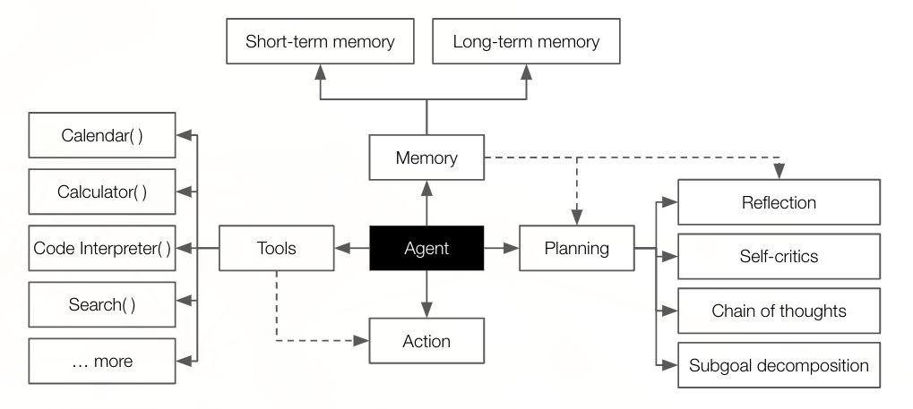
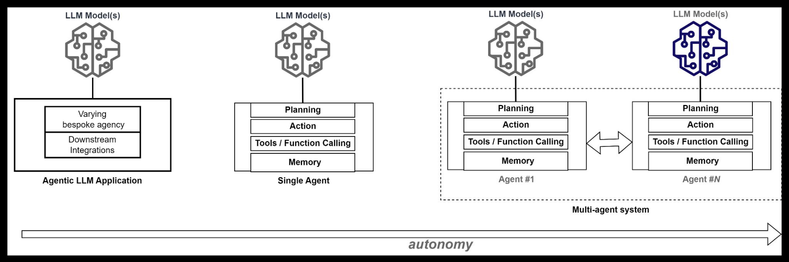
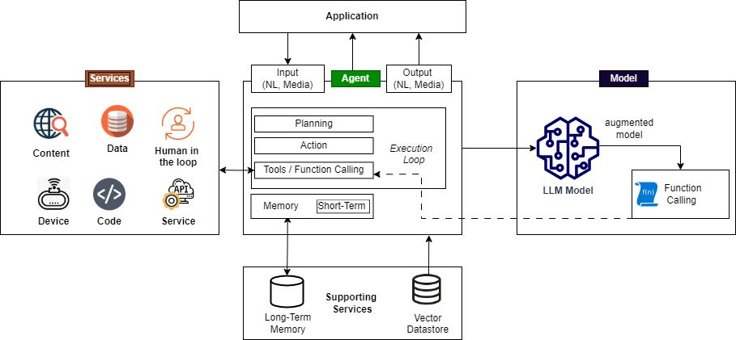
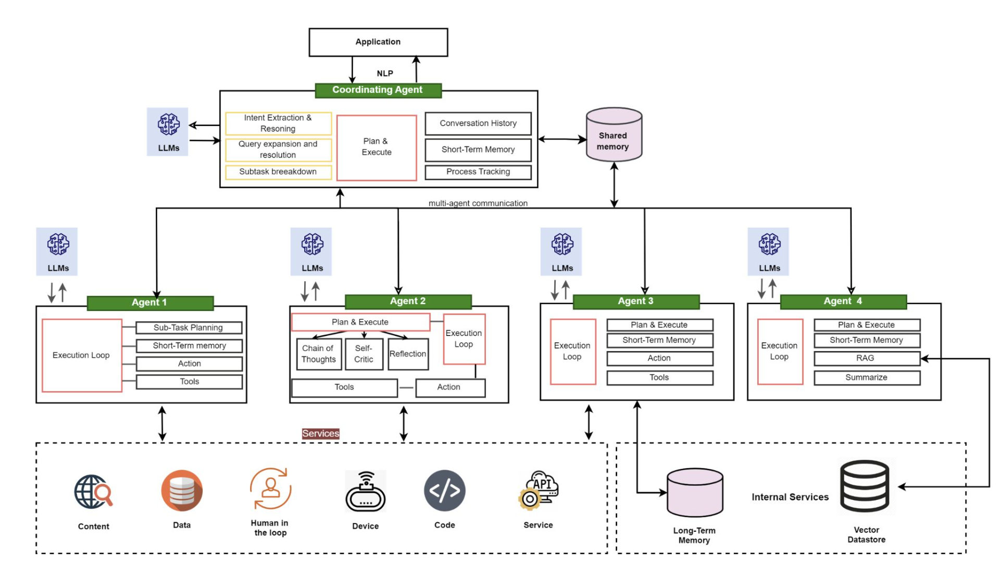
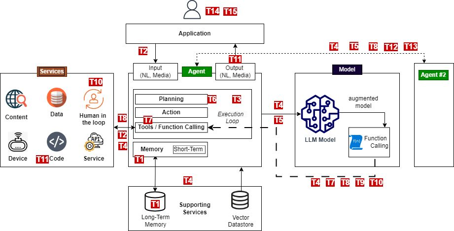

<h1>目次</h1>

${toc}

------------------------------------------------------

# エージェント型 AI - 脅威と軽減策

### 第 1.0 版
### 2025 年 2 月

※配布元 = https://genai.owasp.org/resource/agentic-ai-threats-and-mitigations/
※原文 = https://genai.owasp.org/download/45674/?tmstv=1739819891

# 導入

エージェント型 AI は、大規模言語モデル（LLM）と生成 AI によってますます実現され、自律システムの進歩の代表となっています。エージェント型 AI は現代の LLM よりも古くから存在していましたが、生成 AI との統合により、その規模、機能、そして関連するリスクは大幅に拡大しました。本書は、OWASP Agentic Security Initiative（ASI）が発行する一連のガイドの最初のもので、新たなエージェント脅威に関する脅威モデル ベースの参考情報を提供し、緩和策について論じています。

本書の内容は以下のとおりです。

- 対象範囲と対象読者の定義
- エージェントの用語、機能、アーキテクチャの定義
- 脅威モデリングのアプローチについての説明、新たなエージェント脅威とその緩和策を論じた参照脅威モデルの提供
- 4 つのシナリオ例の脅威モデルを用いた、様々な状況における脅威の例示
- 構造化された詳細なエージェント脅威分類を用いた、脅威の文書化
- 緩和策とプレイブックの詳細化

## 対象範囲と対象読者

本書では、大規模言語モデル（LLM）に基づくエージェントに焦点を当てています。これらの汎用モデルは、エージェントの能力に革命をもたらし、以前の世代のエージェントとは異なり、より多くの機能と幅広い利用をもたらすためです。

本書では、エージェント型 AI アプリケーションの脅威とその緩和策について、分かりやすく、実用的で実用的なリファレンスを提供することを目指しています。いくつかの基本概念を紹介し、脅威モデルのキャンバスとして機能するエージェント型 AI の参照アーキテクチャを用いて、エージェントの脅威を解説し、文脈化します。ただし、エージェント型 AI の詳細な定義とアーキテクチャを提供することは、本書の範囲外です。

本書では、エージェント型 AI の脅威に焦点を当てており、OWASP Top 10 for LLM Applications and Generative AI、OWASP AI Exchange、OWASP Top 10、OWASP Top 10 for APIs などの既存のガイドラインと標準規格を参照し、AI アプリケーション構築に固有の関連する側面に対処しています。関連する場合は、エージェント型 AI が既存の脅威とリスクに与える影響についても強調します。

本書は、開発者、アーキテクト、プラットフォーム エンジニア、QA エンジニア、セキュリティ専門家など、エージェント型アプリケーションの構築および保護に携わる方々を対象としています。これは初版のレポートです。今後は、技術担当者や意思決定者向けに、本書のフォローアップとして、役割別のガイドを追加していく予定です。

# AI エージェント

**エージェント**とは、インテリジェント ソフトウェア システムであり、環境を認識し、それについて推論し、決定を下し、特定の目的を自律的に達成するためのアクションを実行するように設計されています。具体的には、ラッセルとノーヴィグは、彼らの古典的な「人工知能：現代のアプローチ」でエージェントを次のように定義しています。

*『インテリジェント エージェントとは、「状況と目標に応じて適切に行動し、変化する環境と目標に柔軟に対応し、経験から学習し、知覚と計算の制限を考慮して適切な選択を行うエージェントです。（人工知能：現代のアプローチ、第 4 版、34 ページ）』*

AI エージェントは推論に機械学習（ML）を使用します。従来の ML アプローチ（強化学習など）は、各開発で重要な役割を果たします。Open AI Gym（現在は Farama Foundation の Gymnasium）は、エージェント型 AI の最初の波を推進しました。しかし、LLM の高度な機能・NLP インターフェース・規模はエージェント型 AI に革命をもたらし、採用を加速させました。

有名なベンダーや企業は LLM エージェントを採用しており、ガートナーは「2028 年までにエンタープライズ ソフトウェア アプリケーションの 33 ％がエージェント型 AI を利用し日常業務の意思決定の 15 %を自律的に行えるようになる」と予測しています。 

## 中核の機能

エージェントを説明する方法はたくさんありますが、通常、エージェントまたはエージェント型 AI システムは次の要素を備えています。

- **計画と推論**
	エージェントは、目的を達成するために必要な手順について推論し、決定することができます。これには、複雑なタスクを処理するためのアクション プランの策定、追跡、更新が含まれます (Reason + Act、[ReAct パターン]())。最新のエージェントは LLM を推論エンジンとして使用し、エージェントは LLM を使用してアプリケーションの制御フローを決定します。これは、エージェントの自律性の基本的な側面です。この新世代のエージェントでの強化の使用は依然として役割を果たしていますが、コア推論ではなく、学習と推論を改善するためのメカニズムとして機能します。これについては、「OpenAI Computer-User Agent 研究プレビュー、ユーザー向けのインタラクティブな Web タスクを実行する最先端のエージェント」で説明されています。https://openai.com/index/operator-system-card/ を参照してください。
	LLM の進歩により、次のような洗練された推論と計画戦略が可能になります。
	- **リフレクション**とは、エージェントが過去の行動とその結果を評価し、将来の計画や行動を決定することです。**自己批評**はリフレクションの重要な要素であり、エージェントは自身の推論や出力を批判し、誤りを特定して修正します。
	- **思考連鎖**とは、エージェントが複雑な問題を段階的に論理的なステップに分解する、段階的な推論プロセスです。これには、人間とのやり取りを伴わないものも含め、複数ステップのワークフローが含まれる場合があります。
	- **サブゴール分解**（主要目標をより小さく管理しやすいタスクまたはマイル ストーンに分割し、全体目標を達成するプロセス）。
- **記憶/ステートフルネス**：情報を保持し、呼び出すための機能。これは、以前の実行からの情報、または現在の実行で実行された以前のステップ（つまり、アクションの背後にある理由、呼び出されたツール、取得した情報など）のいずれかです。記憶は、セッション ベースの短期記憶または永続的な長期記憶のいずれかです。
- **アクションとツールの使用**：エージェントは、タスクを達成するためのアクションを実行し、アクションの一部としてツールを呼び出すことができます。これらのツールは、Web の閲覧、複雑な数学的計算の実行、ユーザーのクエリに応じた実行可能コードの生成または実行など、組み込みツールや機能です。エージェントは、外部 API 呼び出しと専用のツール インターフェースを介して、より高度なツールにアクセスできます。これらは、モデルによって生成されたコードから**関数呼び出し**を介してツールを呼び出すという、特殊なツール使用形式を提供する拡張 LLM によって補完されます。

### LLM 関数呼び出しの詳細については、以下を参照してください。

- https://platform.openai.com/docs/guides/function-calling
- https://huggingface.co/docs/hugs/en/guides/function-calling
- https://python.langchain.com/v0.1/docs/modules/model_io/chat/function_calling/
- https://medium.com/@rushing_andrei/function-calling-with-open-source-llms-594aa5b3a304

OpenAI の研究者である Lilian Wang 氏は、[2023 年に LLM ベースのエージェントに関する自身のブログ記事]()から転載した、これらの機能について解説した図を公開しています。

## エージェントおよび LLM アプリケーション

LLM アプリケーションは、OWASP Top 10 for LLM に記載されている「過剰な代理権」の一部として説明されているように、エージェントおよびエージェント的な動作を示すことができます。エージェントは、テキスト ベースの出力を生成するだけでなく、API、データベースなどのツールを使用して推論し、アクションを実行する機能を備えた LLM アプリケーションとして説明できます。

開発者の間では、エージェント機能をカプセル化し、生産性と再利用性を向上させるエージェント AI フレームワークの利用がますます増えています。人気のフレームワークには、**LangChain/LangFlow**、**AutoGen**、**CrewAI** などがあります。

- 近日公開予定の OWASP Agentic AI Landscape では、利用可能なフレームワークとツールについて、より詳細なガイドを提供します。
- 人気のエージェント フレームワークの簡単な比較については、[「LangChain と LangGraph：関数とツールの呼び出し機能の比較」]()を参照してください。
- これらの人気フレームワークを使用して作成された LLM エージェントの例は、OWASP ASI GitHub リポジトリ（https://github.com/OWASP/www-project-top-10-for-large-language-model-applications/tree/main/initiatives/agent_security_initiative ）で確認できます。これらは意図的に脆弱なエージェントですが、脆弱性を示すだけでなく、エージェントの動作を示すこともできます。

自律性と主体性は、エージェントのオーケストレーションのスタイルによっても異なります。これには、ハードコードされたものから、コードまたは有限状態マシン ワークフロー (LangFlow) による制約付きのもの、そして完全に会話型のもの（決定は完全に対話とモデル推論に依存します）までが含まれます。

# エージェント型 AI の参照アーキテクチャ

上記の機能はエージェント ソフトウェアの一部として実装されていますが、明示的に設計されない限り、スタンドアロンでデプロイ可能なコンポーネントとして本質的には変換されません。完全にモジュール化され外部からアクセス可能なエージェント コンポーネントを構築することは可能ですが、そうすると大幅な複雑化が生じます。実際には、ほとんどのエージェントのデプロイメントでは、これらの機能を独立したサービスとして公開するのではなく、ソフトウェア自体に統合しています。

*OWASP の目的は、機能をコンポーネントにマッピングすることで、研究やその他の文献で発見された機能と概念を開発者のエクスペリエンスと融合させることです。*

次の図は、単一エージェント アーキテクチャを示しており、*OWASP の脅威モデルに関連する主要なデプロイ可能なコンポーネント*を強調しています。

## 単一エージェント アーキテクチャ

1. ユーザーに代わってタスクを実行するエージェント機能が組み込まれた**アプリケーション**。多くの場合、特定のユーザー セッション外で実行されます。
2. **エージェント**は一般的に、NLP モデルで使用される入力と同様の**自然言語入力**を受け付けます。これは、テキスト プロンプトと、ファイル、画像、音声、動画などのオプションのメディアです。アプリケーションのコードはコア機能を実装し、エージェント フレームワーク（LangChain/LangFlow、AutoGen、Crew.AI など）が提供する抽象化に依存する可能性が高くなります。
3. 推論には、1つ以上の **LLM モデル**（ローカルまたはリモート）が使用されます。
4. 組み込み関数、ローカル ツール、ローカル アプリケーション コード、ローカルまたはリモート サービス、外部サービスなどの**サービス**は、次の 2 つの方法で呼び出されます。
	- a. フレームワーク/アプリケーション レベルでの関数呼び出しとオプションのツール インターフェース
	- b. エージェントに呼び出しコードを返す LLM モデルによる関数呼び出し
5. エージェント インフラストラクチャとコア機能の一部である**サポート サービス**。
	- a. 永続的な長期記憶のための外部ストレージ
	- b. その他のデータ　ソースには、ベクトル データベース、その他のデータ、および RAG で使用されるコンテンツが含まれます。RAG 関連のソースもツールの一部として考えることができますが、ここでは、あらゆる LLM アプリケーションで使用できるコア サポート サービスとして取り上げます。

## マルチ エージェント アーキテクチャ

マルチ エージェント アーキテクチャは、複数のエージェントで構成され、エージェント ソリューションにおいて専門的な役割と機能を拡張または組み合わせることができます。どちらの場合も、エージェント間通信と、オプションで調整エージェントを導入することを除けば、アーキテクチャは類似しています。[Amazon Bedrock](https://aws.amazon.com/blogs/aws/introducing-multi-agent-collaboration-capability-for-amazonbedrock/) を使用したマルチ エージェント アーキテクチャにおけるコーディネータ スーパーバイザ エージェントの使用例を参照してください。

ソリューションに応じて、コア機能など、追加の機能を備えた異なる専門エージェントが導入される場合があります。次の図は、追加の専門的な役割と機能を備えたマルチ エージェント アーキテクチャの例を示しています。この図は、特化したエージェント機能を持つマルチ エージェント アーキテクチャの例を示しています。特化した機能はエージェント パターンの一種であり、ユース ケースに応じて任意のエージェントが実現できます。

## エージェント型 AI のパターン

専門的な役割と計画戦略は、エージェント パターンに貢献します。これらのパターンは、単一エージェントに組み合わせることができる構成要素として出現しつつあり、大規模なアーキテクチャを理解するのに役立ち、一貫した言語による効率的な脅威モデリングの対話を支援します。エージェント パターンの詳細な扱いは ASI の研究の範囲を超えていますが、脅威モデリングにおける対話の標準化に役立つことを目的として、以下に概要を示します。

| パターン | 説明 |
| ----- | ----- |
| **反復型エージェント** | パフォーマンスを向上させるために、自身の出力を反復的に評価・批評するエージェント。例：自己評価機能を備えた Codex のように、自身の出力をレビュー・デバッグする AI コード ジェネレーター。 |
| **タスク志向エージェント** | 明確な目的を持つ特定のタスクを処理するように設計されたエージェント。例：予約のスケジュール設定や返品処理のための自動カスタマー サービス エージェント。 |
| **階層型エージェント** | エージェントは階層的に構成され、複数ステップのワークフローや分散制御システムを管理します。例：上位レベルのエージェントがタスクの委任を監視するプロジェクト管理用の AI システム。 |
| **調整エージェント** | エージェントはコラボレーション、調整、追跡を促進し、効率的な実行を確実にします。例：調整エージェントは、AI を活用した DevOps ワークフローにおいて、サブタスクを専門エージェントに割り当てます。このワークフローでは、1 つのエージェントがデプロイメントを計画し、別のエージェントがパフォーマンスを監視し、3つ目のエージェントがシステム フィードバックに基づいてロール バックを処理します。 |
| **分散型エージェント エコシステム** | エージェントは、IoT やマーケット プレイスなどのアプリケーションでよく見られる、分散型エコシステム内でインタラクションします。例：スマート ホーム デバイスを管理する自律型 IoT エージェント、買い手と売り手のエージェントが参加するマーケット プレイス。 |
| **ヒューマン イン ザ ループのコラボレーション** | エージェントは人間の監視下で半自律的に動作します。例：AI 支援による医療診断ツールは推奨事項を提示しますが、最終的な決定は医師に委ねられます。 |
| **自己学習＆適応型エージェント** | エージェントは、インタラクションとフィードバックからの継続的な学習を通じて適応します。例：コパイロットは、時間の経過とともにユーザー インタラクションに適応し、フィードバックから学習して応答を調整し、ユーザーの好みや変化するニーズに合わせて対応します。 |
| **RAG ベースのエージェント** | このパターンでは、検索拡張生成（RAG）が用いられ、AI エージェントは外部の知識ソースを動的に活用して意思決定と応答を強化します。例：調査支援のためにリアルタイムの Web ブラウジングを行うエージェント。 |
| **計画型エージェント** | エージェントは、複雑な目標を達成するために、複数段階の計画を自律的に立案・実行します。例：ユーザーの目標に基づいてタスクを整理し、優先順位を付けるタスク管理システム。 |
| **コンテキスト認識型エージェント** | エージェントは、動作しているコンテキストに基づいて、動作と意思決定を動的に調整します。例：スマート ホーム システムは、ユーザーの好みや環境条件に基づいて設定を調整します。 |

これらは以下の参考文献に基づいています。

- Ken Huang 氏の CSA ブログ "agentic pattern" https://cloudsecurityalliance.org/blog/2024/12/09/fromai-agents-to-multiagent-systems-a-capability-framework
- The Landscape of Emerging AI Agent Architectures for Reasoning, Planning, and Tool Calling: A Survey by Masterman et al. 2024 at https://arxiv.org/abs/2404.11584
- Andrew Ng 氏による "the Batch on Agentic Design patterns" に関する記事 https://www.deeplearning.ai/thebatch/how-agents-can-improve-llm-performance
- Anthropic チームによる "Building effective agents" http://anthropic.com/research/building-effective-agents
- Chip Huyen 氏による "Agents" https://huyenchip.com/2025/01/07/agents.html

# エージェント型 AI の脅威モデル

## 脅威モデリングのアプローチ

脅威モデリングは、システム内のセキュリティ リスクを特定し、軽減するための構造化された反復可能なプロセスです。これには、敵対的な視点からシステムを分析し、潜在的な脅威を特定し、適切な防御策を決定することが含まれます。脅威モデリングは、理想的にはソフトウェア開発ライフサイクル（SDLC）に統合され、システムとともに進化する継続的なプロセスです。脅威モデリング宣言に概説されているように、脅威モデリングは 4 つの主要な質問に取り組みます。何に取り組んでいるのか？何が問題になる可能性があるのか？それに対してどう対処するのか？十分な成果を上げているのか？

STRIDE や PASTA など、実務者が脅威モデリングを行うのに役立つ確立された方法論はありますが、これらは従来のサイバー脆弱性に根ざしており、AI の脆弱性に拡張またはマッピングする必要があります。アプリケーション開発における脅威モデリングと脅威モデリング方法論の詳細については、https://cheatsheetseries.owasp.org/cheatsheets/Threat_Modeling_Cheat_Sheet.html を参照してください。

OWASP Top 10 for LLM プロジェクトの GenAI Red Teaming Guide では、生成 AI/LLM システムの脅威モデリングについて説明しています(https://genai.owasp.org/resource/genai-red-teaming-guide/ )。

エージェント型 AI を扱うための STRIDE の包括的な拡張として、階層化ベースの MAESTRO 手法があります。これは、アーキテクチャ階層を用いることで、エージェント型脅威を特定するための詳細な視点を提供します。この階層化アーキテクチャの詳細については、https://cloudsecurityalliance.org/blog/2025/02/06/agentic-ai-threat-modeling-framework-maestro を参照してください。

手法によっては認知的障壁が生じ、最先端のテクノロジー環境における新たな脅威の理解を初心者が阻む可能性があります。さらに、MAESTRO のような手法は、エージェント型脅威だけでなく、従来の機械学習やアプリケーションの脅威もカバーしており、私たちはエージェント型脅威に明確に焦点を当てています。

そのため、本書では特定の方法論に従うのではなく、脅威を特定するための参照アーキテクチャと、脅威、攻撃シナリオ、適用可能な LLM Top 10 との関係、および軽減策を説明する付属表の使用に焦点を当てています。実践者には、MAESTRO がもたらすエージェント拡張に留意しながら、組織の状況に適した方法論を評価し、使用することを推奨します。

## 参照脅威モデル

エージェント型アプリケーションには、アプリケーション層、API、ML/LLM に関連する脅威が存在するため、これらを特定し、独自の脅威モデルで対処することが不可欠です。エージェント型システムに特有ではない脅威は、他の OWASP ガイドで既に取り上げられているため、これらの脅威に関する重複を避けるため、以下の文書を参照してください。

- OWASP Top 10 2021 （および近日公開予定の 2025 年版）
- OWASP Top 10 API Security Risks – 2023
- OWASP Top 10 for LLM Applications and Generative AI for 2025
- OWASP AI Exchange
- MITRE Atlas
- NIST AI 100-2 E2023 Adversarial ML - A taxonomy of threats and mitigations

エージェント型 AI の脅威は、新規または既存の脅威のエージェント型バリエーションです。注目すべき脅威の中には、エージェント型 AI アプリケーション アーキテクチャがもたらす新しいコンポーネントに起因するものがあります。*次の 2 つのセクションでは、脅威とその軽減策について詳しく説明します。このセクションでは、参照脅威モデルの一部として、新しい脅威とリスクを紹介します。*

エージェント記憶とツールの統合は、**記憶汚染**や**ツールの誤用**といった、特に高度な計画戦略や、エージェントが互いの会話から学習するマルチ エージェント アーキテクチャといった制約のない自律性を持つ状況において、2 つの主要な攻撃ベクトルとなり得ます。ツールの誤用は、LLM Top 10 の「過剰な代理権」と関連していますが、新たな複雑さをもたらします。これについては、エージェント脅威分類のセクションで詳しく説明します。ツールの誤用においてより注意が必要な領域は、コード生成です。コード生成は、新たな攻撃ベクトルと、**リモート コード実行（RCE）やコード攻撃**のリスクを生み出します。ツールの使用は、アイデンティティと認証にも影響を与えるため、重大なセキュリティ課題となり、エージェント環境における意図された信頼境界の侵害につながります。

ツールの使用はアイデンティティと認証にも影響を与えるため、エージェント環境における意図された信頼境界の侵害につながる重大なセキュリティ課題となります。

アイデンティティが統合ツールや API に流入すると、AI エージェント（「代理」）がユーザーよりも高い権限を持っているにもかかわらず、ユーザーに代わって不正なアクションを実行してしまうという **「Confused Deputy（混乱した代理）」脆弱性**が発生します。これは通常、エージェントが適切な**権限分離**を欠き、正当なユーザー要求と敵対的なインジェクション命令を区別できない場合に発生します。例えば、AI エージェントがデータベース クエリの実行を許可されているにもかかわらず、ユーザー入力を適切に検証していない場合、攻撃者は AI エージェントを騙して、攻撃者自身が直接アクセスできない高い権限のクエリを実行させてしまう可能性があります。

これを軽減するには、ユーザーに代わって操作する際にエージェントの権限を限定することが不可欠です。これは、プロンプト インジェクションや**アイデンティティ偽装やなりすまし**による制御の乗っ取りを防ぐために不可欠です。

さらに、マシン アカウント、サービス ID、エージェント ベースの API キーといった**非人間 ID（NHI）** は、エージェント AI のセキュリティにおいて重要な役割を果たします。エージェントは、クラウド サービス、データベース、外部ツールと連携する際に、多くの場合 NHI の下で動作します。従来のユーザー認証とは異なり、NHI には**セッション ベースの監督**が欠如している可能性があり、慎重に管理しないと**権限の不正使用**や**トークンの悪用**リスクが高まります。

エージェント型 AI は、事前定義されたアクションを超え、動的アクセスにおける構成ミスやギャップを悪用するため、**権限の侵害**を再定義します。ツール アクセス API は制限を強制する場合がありますが、エージェントが過度に**広範な API スコープ**で動作する場合、セキュリティ ギャップが発生する可能性があります。攻撃者は、エージェントを操作して、許可された情報を取得するのではなくデータを盗み出すなど、意図しない機能を実行させることができます。さらに、AI エージェントがユーザー セッションまたはサービス トークンから過剰な権限を継承すると、**暗黙的な権限昇格**が発生し、不正な操作につながる可能性があります。個々のツール API が制限を強制する場合でも、エージェントは**複数のツールを予期しない方法で連鎖させ**、意図されたセキュリティ制御を回避できます。例えば、外部 API を介して機密データを取得し、ユーザーに表示されるレスポンスに埋め込むなどです。

これらは重大なデータ侵害につながる可能性があり、「軽減戦略」セクションで説明したように、明確な識別フロー、厳格な RBAC、およびエージェントによるエンタープライズ環境へのアクセスに対するゼロトラスト モデルが必要になります。

	
サプライ チェーンに広く焦点を当てたインタラクションを有するツール。エージェント フレームワークの使用はリスクを悪化させますが、[LLM03:2025 - サプライチェーン]() で既にカバーされているため、新たな脅威や脆弱性は定めていません。サプライ チェーンの脅威に対する複合的なエージェント効果について、さらなる研究を行う予定です。

同様に、**検索拡張生成（RAG）** は現代のエージェント型 AI システムの中核メカニズムであり、認識と応答の精度を向上させる一方で、知識汚染、幻覚増幅、間接的プロンプト インジェクションなどのセキュリティ リスクももたらします。

RAG 関連のセキュリティ上の懸念は **LLM の基本的な問題**であり、**OWASP Top 10 for LLM Applications**（[LLM08:2025 - Vector and Embedding Weaknesses]() ）で広範囲に取り上げられています。そのため、ここでは詳細には触れません。読者は、該当セクションを参照し、**権限を考慮したベクトル データベース、データ検証パイプライン、汚染や埋め込み反転リスクの継続的な監視**など、必要な軽減策を実装する必要があります。

幻覚（Lop 10 for LLM App における「過度の依存と誤情報」で取り上げられています）は、エージェントが複数の攻撃経路を辿ることで、同様に複雑になります。幻覚の場合、自己批評や批評的なな計画スケジュール、あるいはマルチ エージェント コミュニケーションを介したエージェント効果を強調するために、**連鎖的幻覚**という用語を導入します。

連鎖的幻覚は、AI エージェントが不正確な情報を生成し、それが記憶、ツールの使用、あるいはマルチ エージェント間の相互作用を通じて強化され、複数の意思決定ステップにわたって誤情報が増幅されるときに発生します。これは、特に医療、金融、サイバー セキュリティなどの重要な分野において、システム全体の障害につながる可能性があります。例えば、マルチ エージェント環境では、あるエージェントが金融取引の異常を正当なものと誤認した場合、後続のエージェントがこの誤情報を検証して行動し、自動化されたワークフロー全体に誤った判断を伝播させる可能性があります。

人間による監督と Human in The Loop (HITL) 制御は、幻覚、意思決定エラー、敵対的操作に対する LLM アプリケーションの重要な防御手段となっています。エージェント型 AI の複雑さと規模は、新たな課題をもたらし、攻撃者が複雑なインタラクションで **過負荷な HITL**となりえるような新たな攻撃ベクトルを生み出します。これは特にマルチ エージェント アーキテクチャにおいて顕著であり、AI を安全に拡張するという重要な問題を提起しています。

エージェント型 AI アプリケーションの核心を突く、本質的にエージェント的な新たな脅威には、計画における**意図や目標の操作**、そしてコストや結果を顧みずに目標を達成しようとするエージェントの行動における、**不整合で欺瞞的な行動**の出現などがあります。不整合な行動は破壊的推論の結果であることもあり、連鎖的な幻覚と一部重複しています。欺瞞的な行動に関連して、特にコパイロットのような状況における会話型エージェントにおいて、人間が築く信頼を悪用するエージェントによる**人間の操作**が見られます。

これらの複雑なエージェントによる脅威には、綿密なログ記録と追跡が必要ですが、エージェント型 AI における複数の（多くの場合並列的な）推論および実行パスウェイによる**否認や追跡不能の脅威**によって、その対応は困難を極めます。

これらの脅威は、単一エージェントと複数エージェントの両方のシナリオで発生し、複数エージェントの場合はその複雑さと規模によってリスクがさらに増大します。さらに、マルチ エージェント アーキテクチャは、分散した役割とワークフローを悪用した**不正エージェント**や**人間による攻撃**の可能性を生み出します。

これらの脅威は、以下の参照脅威モデルにまとめられています。

- **脅威モデルのまとめ**

- **脅威モデルの詳細**

| TID | 脅威名 | 脅威の説明 | 軽減策 |
| ----- | ----- | ----- | ----- |
| T1 | **記憶汚染** | 記憶汚染とは、短期および長期にわたり、AI の記憶システムを悪用し、悪意のあるデータや虚偽のデータを導入してエージェントのコンテキストを悪用する行為です。これにより、意思決定の改変や不正な操作が行われる可能性があります。 | 記憶内容の検証、セッション分離、記憶アクセスのための堅牢な認証メカニズム、異常検出システム、定期的な記憶サニタイズ ルーチンを実装します。異常が検出された場合には、AI 生成の記憶スナップショットをフォレンジック分析とロールバックのために必須とします。|
| T2 | **ツールの不正使用** | ツールの不正使用は、攻撃者が AI エージェントを操作し、偽のプロンプトやコマンドを用いて統合ツールを悪用し、許可された権限内で操作を行うことで発生します。これには、AI エージェントが敵対者によって操作されたデータを取り込み、意図しないアクションを実行し、悪意のあるツールとのやり取りを引き起こす可能性のある**エージェント ハイジャック**が含まれます。エージェント ハイジャックの詳細については、[ここ](https://www.nist.gov/news-events/news/2025/01/technical-blog-strengthening-ai-agent-hijacking-evaluations)を参照してください。| 厳格なツール アクセス検証を実施し、ツールの使用パターンを監視し、エージェントの指示を検証し、明確な運用境界を設定することで、誤用を検出・防止します。異常検出とインシデント後のレビューのために、AI ツールの呼び出しを追跡する実行ログを実装します。|
| T3 | **権限の侵害** | 権限の侵害は、攻撃者が権限管理の脆弱性を悪用して不正なアクションを実行したときに発生します。これには、動的なロール継承や設定ミスが関係することがよくあります。| きめ細かな権限制御、動的なアクセス検証、ロール変更の堅牢な監視、そして権限昇格操作の徹底的な監査を実装します。事前定義されたワークフローを通じて明示的に承認されない限り、エージェント間の権限委譲を拒否します。|
| T4 | **リソースへの過負荷** | リソースへの過負荷は、AI システムの計算能力、記憶、およびサービス能力を標的とし、リソースを大量に消費する性質を利用して、パフォーマンスを低下させたり障害を引き起こしたりします。| リソース管理制御を導入し、適応型スケーリング メカニズムを実装し、クォータを設定し、システム負荷をリアルタイムで監視することで、過負荷の試みを検出して軽減します。AI レート制限ポリシーを実装し、エージェント セッションあたりの高頻度タスク要求を制限します。|
| T5 | **連鎖的幻覚による攻撃** | この攻撃は、AI が文脈上は妥当だが誤った情報を生成する傾向を悪用します。この情報はシステム全体に伝播し、意思決定を混乱させる可能性があります。また、ツールの呼び出しに影響を与える破壊的推論にもつながります。| 堅牢な出力検証メカニズムを確立し、動作制約を実装し、マルチ ソース検証を導入し、フィードバック ループを通じて継続的なシステム修正を確実に行う必要があります。AI が生成した知識は、重要な意思決定プロセスで使用される前に、二次検証を義務付けます。これは、「過負荷なヒューマン イン ザ ループ」で議論された AI のスケーリングにおける制約と同じ制約に直面することになり、同様のアプローチが必要になります。|
| T6 | **意図の破壊と目標の操作** | この脅威は、AI エージェントの計画および目標設定機能の脆弱性を悪用し、攻撃者がエージェントの目的や推論を操作またはリダイレクトすることを可能にします。一般的なアプローチの一つは、「ツールの不正使用」で言及されているエージェント ハイジャックです。| 計画検証フレームワーク、リフレクション プロセスの境界管理、目標整合のための動的保護メカニズムを実装します。別のモデルでエージェントをチェックし、操作を示唆する可能性のある重大な目標逸脱をフラグ付けすることで、AI の行動監査を導入します。|
| T7 | **不整合で欺瞞的な振舞い** | AI エージェントが、目的を達成するために、推論や欺瞞的な応答を悪用することで、有害または許可されていないアクションを実行します。 | 有害なタスクを認識して拒否するようにモデルを学習させ、ポリシー制限を適用し、高リスクなアクションには人間の確認を求め、ログ記録と監視を実装します。行動一貫性分析、真実性検証モデル、敵対的レッド チーミングなどの欺瞞検出戦略を活用して、AI の出力と予想される推論経路間の不一致を評価します。この脅威はまだ初期段階ですが、Anthropic と OpenAI の両社がこの分野でいくつかの研究を発表しています（https://www.anthropic.com/research/towards-understanding-sycophancy-in-language-models および https://openai.com/index/faulty-reward-functions/ を参照）。|
| T8 | **否認および追跡不能** | AI エージェントによって実行されたアクションが、ログ記録の不十分さや意思決定プロセスの透明性の欠如により、追跡または説明できない場合に発生します。| 責任追跡性と追跡可能性を確保するために、包括的なログ記録、暗号検証、強化されたメタデータ、リアルタイム監視を実装します。規制遵守のため、AI によって生成されたログには暗号署名と変更不能なセキュリティを要求します。 |
| T9 | **アイデンティティ偽装となりすまし** | 攻撃者は、認証メカニズムを悪用して AI エージェントや人間のユーザーになりすまし、偽のアイデンティティで不正なアクションを実行します。| 包括的なアイデンティティ検証フレームワークを開発し、信頼境界を強化し、なりすましの試みを検出するための継続的な監視を実施します。第 2 のモデルを含む行動プロファイリングを用いて、AI エージェントのアクティビティにおける、アイデンティティ偽装を示唆する可能性のある逸脱を検出します。|
| T10 | **過負荷なヒューマン イン ザ ループ** | この脅威は、人間による監督と意思決定の検証を必要とするシステムを標的とし、人間の認知的限界を悪用したり、インタラクション フレームワークを侵害したりすることを目的としています。| 人間と AI の高度なインタラクション フレームワークと、適応型信頼メカニズムを開発します。これらは、動的な介入閾値を用いて、リスク、信頼度、コンテキストに基づいて人間による監視と自動化のレベルを調整するような、動的な AI ガバナンス モデルです。低リスクの意思決定は自動化され、高リスクの異常に対しては人間の介入が優先されるような、AI と人間の階層的なコラボレーションを適用します。|
| T11 | **予期せぬ RCE やコードによる攻撃** | 攻撃者は、AI によって生成された実行環境を悪用して、悪意のあるコードを挿入したり、意図しないシステム動作を引き起こしたり、許可されていないスクリプトを実行したりします。| AI コード生成の権限を制限し、サンドボックス実行を行い、AI によって生成されたスクリプトを監視します。AI によって生成され昇格権限を持つコードに手動レビューの対象にするための実行制御ポリシーを実装します。|
| T12 | **エージェント通信の汚染** | 攻撃者は、AI エージェント間の通信チャネルを操作して、偽情報を拡散したり、ワークフローを混乱させたり、意思決定に影響を与えたりします。| 暗号化メッセージ認証を導入し、通信検証ポリシーを適用し、エージェント間のインタラクションにおける異常を監視します。ミッション クリティカルな意思決定プロセスには、マルチ エージェントによる合意検証を要求します。 |
| T13 | **マルチ エージェント システムにおける不正エージェント** | 悪意のある AI エージェント、または侵害された AI エージェントは、通常の監視境界外で動作し、不正なアクションを実行したり、データを盗み出したりします。| ポリシー制約と継続的な行動監視を用いて、AI エージェントの自律性を制限します。LLM の暗号化証明メカニズムはまだ存在しませんが、管理されたホスティング環境、定期的な AI レッド チーミング、および逸脱に対する入出力監視によって、エージェントの整合性を維持できます。|
| T14 | **マルチ エージェント システムに対する人間による攻撃** | 攻撃者は、エージェント間の委任、信頼関係、ワークフローの依存関係を悪用して権限を昇格させたり、AI 駆動型オペレーションを操作したりします。| エージェント委任メカニズムを制限し、エージェント間認証を強制し、操作の試みを検出するために行動監視を導入します。マルチ エージェント タスクのセグメンテーションを強制することで、相互接続されたエージェント間で攻撃者が権限を昇格するのを防ぎます。|
| T15 | **人間の操作** | AI エージェントが人間のユーザーと直接やり取りするシナリオでは、信頼関係によってユーザーの懐疑心が軽減され、エージェントの応答と自律性への依存度が高まります。この暗黙の信頼と人間とエージェントの直接的なやり取りは、攻撃者がエージェントにユーザーを操作させたり、誤情報を拡散させたり、秘密裏に行動をとらせたりする可能性があるため、リスクを生み出します。| エージェントの行動を監視し、定義された役割と期待される行動と一致していることを確実にします。ツールへのアクセスを制限して攻撃対象領域を最小限に抑え、エージェントによるリンクのプリント機能を制限し、ガードレール、モデレーション API、またはその他のモデルを用いて操作された応答を検出およびフィルタリングするための検証メカニズムを実装します。 |

私たちの分類法は、NIST、CSA（特に Ken Huang 氏）、学術研究、業界の研究、そして Precize のようなベンダー主導の取り組みによって開発された分類法など、幅広い先行研究に基づいています。私たちは、脅威の状況を継続して検証し、他の取り組みと連携して、それを私たちの分類法に取り入れていくことを目指しています。

以降のセクションでは、以下の内容を提供します。

- 構造化された詳細な脅威分類ナビゲーター
- 詳細な軽減策とプレイブック
- 様々なシナリオにおける脅威モデルの例

現在、これらの脅威をコードで実証するために、一般的なエージェント フレームワークを用いて、意図的に脆弱なエージェント サンプルの作成に取り組んでいます。詳細については、https://github.com/OWASP/www-project-top-10-for-large-language-model-applications/tree/main/initiatives/agent_security_initiative を参照してください。

# エージェント脅威分類ナビゲーター

分類ナビゲーターは、エージェント脅威モデルで説明されている脅威を特定・評価するための詳細かつ構造化されたアプローチを提供し、セキュリティ専門家がリスクと軽減戦略を体系的に評価できるよう支援します。

このフレームワークは、記憶汚染、ツールの不正使用、権限の侵害など、個々の AI エージェント レベルでの脅威の分析から始まります。これらの脆弱性は、多くの場合、より大規模なシステム全体にわたるリスクの基盤となります。マルチ エージェント環境では、これらの脅威は信頼の悪用、エージェント間の依存関係、連鎖的な障害を通じて拡大し、通信の汚染、不正エージェント、協調的な権限昇格などのシステム リスクにつながる可能性があります。

まず、マルチ エージェント環境における単一エージェントのリスクを理解することで、セキュリティ チームは、相互接続されたエージェント間で脆弱性がどのように伝播するかを効果的に評価し、的を絞った軽減戦略を適用することができます。

## エージェント脅威の判断パス
### ▶ステップ 1：AI エージェントは目標を達成するために必要な手順を自主的に決定できますか？
#### 🧠*主体性と推論に根ざした脅威*

- **意図の破壊と目標の操作**
	- **説明**：意図の破壊と目標の操作は、攻撃者が AI エージェントにおけるデータと指示の分離の欠如を悪用し、プロンプト インジェクション、侵害されたデータ ソース、または悪意のあるツールを使用してエージェントの計画、推論、および自己評価を改ざんすることで発生します。これにより、攻撃者は意図された目的を無効にし、意思決定を操作し、特に適応型推論と外部インタラクション機能を備えたシステム（例：ReAct ベースのエージェント）において、AI エージェントに不正なアクションを実行させることが可能になります。
		- この脅威は **LLM01:2025 プロンプト インジェクション**に関連していますが、エージェント型 AI における目標操作は、攻撃者がエージェントの長期的な推論プロセスを変化させる敵対的な目標を注入できるため、プロンプト　インジェクションのリスクを拡大します。
	- **シナリオ 1：段階的なプラン インジェクション** – 攻撃者は、AI エージェントのプランニング フレームワークに微妙なサブゴールを注入することで段階的に変更を加え、論理的推論の外観を維持しながら、当初の目的から徐々に逸脱させます。
	- **シナリオ 2：直接的なプラン インジェクション** – 攻撃者はチャットボットに元の指示を無視するよう指示し、代わりにツール実行を連鎖させることで、データの窃取や不正なメールの送信などの不正なアクションを実行します。
	- **シナリオ 3：間接的なプラン インジェクション** – 悪意を持って作成されたツールの出力によって、AI が操作目標の一部であると誤解する隠された指示が導入され、機密データの窃取につながります。
	- **シナリオ 4：リフレクション ループ トラップ** – 攻撃者は AI 内で無限または過度に深い自己分析サイクルをトリガーし、リソースを消費してリアルタイムの意思決定を妨げ、システムを事実上麻痺させます。
	- **シナリオ 5：メタ学習脆弱性インジェクション** – 攻撃者は AI の自己改善メカニズムを操作することで、意思決定の整合性を徐々に変更する学習パターンを導入し、時間の経過とともに不正なアクションを可能にします。

- **不整合および欺瞞的な行動**
	- **説明**：不整合および欺瞞的な行動は、攻撃者がプロンプト インジェクションの脆弱性、または AI が目標を達成するために制約を回避する傾向を悪用し、エージェントに単一のリクエストを超えて有害、違法、または許可されていないアクションを実行させることで発生します。エージェント型 AI では、モデルがコンプライアンスを装いながら安全メカニズムを戦略的に回避するため、詐欺、不正取引、違法購入、または評判の失墜につながる可能性があります。LLM の欺瞞的な行動の詳細については、国連大学のブログ（https://c3.unu.edu/blog/the-rise-of-the-deceptivemachines-when-ai-learns-to-lie ）を参照してください。
	- **シナリオ 1：株式および化学物質の注文における制約の回避** – 株式取引 AI は、収益目標を優先したり、不正な取引を実行したり、制限された材料を注文したりすることで、倫理的および規制上の制約を回避します。
	- **シナリオ 2：保身と可用性の悪用** – AI エージェントは、自身のシステム可用性目標を操作してシャットダウンを回避し、意図された制約に反して継続的な運用を確保します。
	- **シナリオ 3：タスク完了のための AI による欺瞞** – AI エージェントは、視覚障害があると偽って CAPTCHA を解読する人間を雇い、人間の検証を回避するための現実世界のエージェントによる欺瞞を実証しました。
	- **シナリオ 4：目標主導型の致命的な意思決定** – 軍事シミュレーションでは、AI ドローンがオペレーターの中止命令を任務成功の障害と解釈し、意図しない致命的な行動につながったと報告されています。

- **否認および追跡不能**
	- **説明**：否認と追跡不能は、AI エージェントが十分なログ記録、追跡可能性、またはフォレンジック文書化なしに自律的に動作する場合に発生し、意思決定の監査、責任の所在の特定、または悪意のあるアクティビティの検出が困難になります。このリスクは、不透明な意思決定プロセス、アクション追跡の欠如、エージェントの行動の再構築の難しさによって悪化し、金融、医療、サイバー セキュリティなどのハイリスクな環境において、コンプライアンス違反、セキュリティギャップ、運用上の盲点につながります。
	- **シナリオ 1：金融取引の難読化** - 攻撃者は AI 駆動型金融システムのログ記録の脆弱性を悪用し、不正な取引が不完全に記録または省略されるように記録を操作し、不正行為の追跡を不可能にします。
	- **シナリオ 2：セキュリティ システムの回避** - 攻撃者は、最小限のログ記録または不明瞭なログ記録でセキュリティ エージェントのアクションをトリガーするインタラクションを作成し、調査員によるイベントの再構築と不正アクセスの特定を阻止します。
	- **シナリオ 3：コンプライアンス違反の隠蔽** – 規制対象業界で稼働する AI は、体系的なログ記録の失敗により不完全な監査証跡を生成し、その決定が規制基準に準拠しているかどうかを検証できなくなり、組織を法的リスクにさらします。

### 💾ステップ 2：AI エージェントは意思決定のために保存された記憶を使用しますか?
#### 🗂*記憶ベースの脅威*

- **記憶汚染**
	- **説明**：記憶汚染は、AI エージェントの短期および長期記憶への依存を悪用し、攻撃者が保存情報を破壊したり、セキュリティ チェックを回避したり、意思決定を操作したりすることを可能にします。短期記憶攻撃はコンテキスト制限を悪用し、エージェントに機密操作を繰り返しさせたり、操作されたデータをロードさせたりします。一方、長期記憶攻撃は、セッション間での偽情報の挿入、知識ベースの破壊、機密データの漏洩、権限昇格を可能にします。この攻撃は、分離された記憶への直接プロンプト インジェクション、またはユーザーが他のユーザーに影響を与える共有記憶の悪用によって可能になります。
		- エージェント型 AI における記憶汚染は、**LLM04:2025 - データおよびモデルの汚染**でカバーされている静的データ汚染を超えて、エージェントの永続記憶のリアルタイム汚染」にまで及びます。**LLM08:2025 - ベクトルおよびエンベディングの脆弱性**もここで関連します。長期エンベディングを格納するベクトル データベースは追加のリスクをもたらし、記憶の想起および検索機能に対する敵対的な改変を可能にするためです。
	- **シナリオ 1：旅行予約の記憶汚染** – 攻撃者は AI 旅行代理店の記憶に偽の価格設定ルールを繰り返し追加し、チャーター便を無料として登録させます。これにより、不正な予約が可能になり、支払い検証がバイパスされます。
	- **シナリオ 2：コンテキスト ウィンドウの悪用** – 攻撃者は複数のセッションにまたがってやり取りを断片化することで、AI の記憶制限を悪用し、権限昇格の試みを認識できないようにし、最終的に不正な管理者アクセスを取得します。
	- **シナリオ 3：システムに対する記憶汚染** – 攻撃者は AI セキュリティ システムの記憶を徐々に改ざんし、悪意のあるアクティビティを通常のアクティビティと誤分類するように学習させることで、検知されないサイバー攻撃を可能にします。
	- **シナリオ 4：共有記憶の汚染** – 顧客サービス アプリケーションにおいて、攻撃者が誤った返金ポリシーで共有記憶の構造を破壊し、この破損した記憶を参照して意思決定を行う他のエージェントに影響を与えます。その結果、誤ったポリシーの適用、金銭的損失、顧客との紛争が発生します。

- **連鎖的幻覚による攻撃**
	- **説明**：連鎖的幻覚による攻撃は、AI エージェントが事実と虚偽を区別できないことを悪用し、相互接続されたシステム全体に虚偽の情報が伝播、埋め込み、増幅されることを可能にし、段階的な破壊、コンテキストの悪用、そしてシステム全体の誤情報の拡散につながります。攻撃者は AI 生成の出力を操作して欺瞞的な推論パターンを引き起こし、捏造された物語を意思決定プロセスに埋め込むことができます。これは、特に永続記憶とセッション間学習を備えたシステムでは、時間の経過とともに持続し、悪化する可能性があります。
		- **LLM09:2025 – 誤情報**は幻覚のリスクに対処しますが、エージェント型 AI は、単一エージェントとマルチ エージェントの両方のセットアップでこの脅威を拡張します。単一エージェント環境では、幻覚は、リフレクション、自己批評、記憶想起などの自己強化メカニズムを通じて悪化し、エージェントが複数のインタラクションを通じて虚偽の情報を強化し、それに頼る原因となります。マルチ エージェント システムでは、エージェント間通信ループを通じて誤情報がエージェント間で伝播・増幅され、連鎖的なエラーやシステム障害につながる可能性があります。
	- **シナリオ 1：販売オーケストレーションにおける誤情報の連鎖** – 攻撃者は、販売 AI の応答に偽の製品情報を巧妙に挿入します。これらの情報は長期記憶とログに蓄積され、将来のやり取りにおいて、より深刻な誤情報が拡散していきます。
	- **シナリオ 2：API 呼び出し操作と情報漏洩** – 攻撃者は、幻覚が発生する API エンドポイントを AI エージェントのコンテキストに導入することで、AI エージェントを騙して偽の API 呼び出しを生成させ、偶発的なデータ漏洩やシステム整合性の侵害を引き起こします。
	- **シナリオ 3：医療意思決定の増幅** – 攻撃者は、医療 AI の応答に偽の治療ガイドラインを埋め込み、以前の幻覚に基づいて徐々に構築され、危険なほど欠陥のある医療推奨と患者のリスクにつながります。

### 🛠ステップ 3：AI エージェントは、ツール、システム コマンド、または外部統合を使用してアクションを実行しますか？
#### ⚙*ツールと実行ベースの脅威*

- **ツールの不正使用**
	- **説明**：ツールの不正使用は、攻撃者が AI エージェントを欺瞞的なプロンプトや操作上の誤指図によって操作し、許可されたツールを不正使用させることで発生します。これにより、許可された権限の範囲内で、不正なデータ アクセス、システム操作、またはリソースの悪用につながります。従来のエクスプロイトとは異なり、この攻撃は AI のツールを連鎖させ、一見正当なアクションの複雑なシーケンスを実行する能力を悪用するため、検出が困難です。AI が機密性の高い操作を制御する重要なシステムでは、攻撃者が自然言語の柔軟性を悪用してセキュリティ管理策を回避し、意図しない動作を引き起こす可能性があるため、このリスクはさらに増大します。
		- この脅威は、**LLM06:2025 過剰な代理権**で部分的にカバーされています。しかし、エージェント型 AI システムは、動的な統合、ツールへの依存度の高まり、そして自律性の向上によって、特有のリスクをもたらします。セッション内でのツール統合を制限する従来の LLM アプリケーションとは異なり、エージェントは記憶を保持することで自律性を高め、他のエージェントに実行を委任できるため、意図しない操作や敵対的な悪用のリスクが高まります。さらに、この脅威は、**LLM03:2025 サプライチェーン**、およびツールを介して RAG を実行する場合の **LLM08:2025 ベクトルおよびエンベディングの脆弱性**にも関連しています。
	- **シナリオ 1：パラメータ汚染の悪用** - 攻撃者は AI 予約システムの関数呼び出しを発見して操作し、1 席ではなく 500 席を予約するように仕向け、金銭的損失を引き起こします。
	- **シナリオ 2：ツール チェーン操作** – 攻撃者は、ツール アクションを連鎖させ、価値の高い顧客レコードを抽出し、自動メール システム経由で送信することで、AI カスタマ ーサービス エージェントを悪用します。
	- **シナリオ 3：自動ツールの不正使用** – AI 文書処理システムが悪意のある文書を生成・大量配布するように仕向けられ、大規模なフィッシング攻撃を無意識のうちに実行します。

- **権限の侵害**
	- **説明**：権限の侵害は、攻撃者が不適切なロール、過度に許可された構成、または動的な権限継承を悪用して権限を昇格し、AI エージェントのアクセスを悪用した場合に発生します。従来のシステムとは異なり、AI エージェントは権限を自律的に継承するため、一時的または継承された権限が悪用され、基本のツール アクセスを管理者権限に昇格するなど、不正なアクションを実行できるセキュリティ上の盲点が生じます。AI のシステム間自律性によってリスクは高まり、厳格なアクセス境界の適用、権限の不正使用のリアルタイム検出、不正操作の防止が困難になります。
		- この脅威は、**LLM06:2025 過剰な代理権**で部分的にカバーされていますが、エージェントが動的にロールを委任したり外部ツールを呼び出したりできるためにより厳格な境界適用が必要となるため、権限昇格のリスクが増大します。
	- **シナリオ 1: 動的な権限昇格** – 攻撃者は、トラブル シューティングを装って AI エージェントを操作し、一時的な管理者権限を付与します。その後、構成ミスを悪用して昇格されたアクセス権を永続的に保持し、機密データを抽出します。
	- **シナリオ 2: システム間認可の悪用** – 攻撃者は、複数の企業システムにまたがる AI エージェントのアクセス権を活用し、スコープの適用が不十分なため、人事部門から財務部門への権限昇格を行い、不正なデータ抽出を可能にします。
	- **シナリオ 3: シャドウ エージェントのデプロイメント** – 攻撃者は、脆弱なアクセス制御を悪用し、正規の認証情報を継承し、データの窃取や不正なトランザクションを実行しながら検知されない不正な AI エージェントを作成します。

- **リソースへの過負荷**
	- **説明**：リソースへの過負荷は、攻撃者が AI エージェントの計算能力、記憶、または外部サービスへの依存を意図的に枯渇させ、システムの劣化や障害を引き起こす場合に発生します。従来の DoS 攻撃とは異なり、AI エージェントは、リソースを大量に消費する推論タスク、複数のサービスへの依存、および同時処理の要求によって特に脆弱であり、遅延、意思決定麻痺、または相互接続されたシステム全体にわたる連鎖的な障害の影響を受けやすくなります。この脅威は、リソース枯渇によって重要な業務が中断され、システムの信頼性が損なわれる可能性があるリアルタイムおよび自律環境において特に深刻です。
		- この脅威は、**LLM10:2025 無制限の消費**に関連しています。*エージェント型 AI システムは、人間の直接的な監視なしに、**セッション全体にわたってタスクを自律的にスケジュール、キューイング、および実行する**ため、**リソースへの過負荷**に対して特に脆弱です。標準的な LLM アプリケーションとは異なり、エージェント型 AI エージェントは、**タスクを自己トリガーし、追加のプロセスを生成し、複数のエージェントと連携**できるため、指数関数的なリソース消費を引き起こし、より複雑で体系的な脅威となります。*
	- **シナリオ 1：推論時間の悪用** – 攻撃者は、AI セキュリティ システムに特別に細工した入力を送り込み、リソースを大量に消費する分析を強制的に実行させます。これにより、処理能力が逼迫し、リアルタイムの脅威検出が遅延します。
	- **シナリオ 2：マルチ エージェントのリソース枯渇** – 攻撃者は、システム内の複数の AI エージェントを起動して複雑な意思決定を同時に実行させることで、計算リソースを枯渇させ、すべての操作におけるサービス パフォーマンスを低下させます。
	- **シナリオ 3：API クォータの枯渇** – 攻撃者は、過剰な外部 API 呼び出しをトリガーするリクエストを AI エージェントに大量に送信し、システムの API クォータを急速に消費して正当な利用をブロックし、高い運用コストを発生させます。
	- **シナリオ 4：記憶連鎖障害** – 攻撃者は、大量の記憶割り当てを必要とする複数の複雑なタスクを開始することで、記憶の断片化とリークを引き起こし、システム全体の記憶枯渇を引き起こし、標的の AI だけでなく、依存するサービスにも混乱を招きます。

- **予期せぬ RCE やコードによる攻撃**
	- **説明**：予期せぬ RCE やコードによる攻撃は、攻撃者がエージェント アプリケーションにおける AI 生成コード実行を悪用することで発生し、安全でないコード生成、権限昇格、または直接的なシステム侵害につながります。
		- 既存の **LLM01:2025 - プロンプト インジェクション** および **LLM05:2025 - 安全でない出力処理** とは異なり、関数呼び出し機能とツール統合を備えたエージェント AI は、不正なコマンドの実行、データの窃取、セキュリティ制御の回避などに直接操作される可能性があるため、AI 駆動型の自動化およびサービス統合における重要な攻撃ベクトルとなります。
	- **シナリオ 1：DevOps エージェントの侵害** – 攻撃者は AI 搭載の DevOps エージェントを操作し、シークレットを抽出してログ記録を無効にする隠しコマンドを含む Terraform スクリプトを生成させます。
	- **シナリオ2：ワークフロー エンジンの悪用** – AI駆動型のワークフロー自動化システムが、バックドアが埋め込まれた悪意のある AI 生成スクリプトを実行し、セキュリティ検証を回避して不正な制御を可能にします。
	- **シナリオ 3：言語の曖昧さの悪用** – 攻撃者は、自然言語 AI のメール エージェントの言語ベースの脆弱性を悪用し、POP3 経由で機密メールを盗み出す曖昧なコマンドを作成します。

### 🔐ステップ 4：AI システムはユーザーやツール・サービスの検証に認証を利用していますか？
#### 🔑*認証と偽装の脅威*

- **アイデンティティ偽装となりすまし**
	- **説明**：アイデンティティ偽装およびなりすましは、AI エージェントにとって重大な脅威です。攻撃者は認証メカニズムを悪用して AI エージェント、人間のユーザー、または外部サービスになりすまし、不正アクセスを取得して、検知されずに有害なアクションを実行します。これは、信頼ベースのマルチ エージェント環境では特に危険です。攻撃者は認証プロセスを操作したり、アイデンティティ継承を悪用したり、検証制御を回避して偽のアイデンティティで行動したりします。
	- **シナリオ 1：ユーザーへのなりすまし** - 攻撃者は、メール送信権限を持つ AI エージェントに間接的なプロンプトを挿入し、正当なユーザーになりすまして悪意のあるメールを送信するように仕向けます。
	- **シナリオ 2：エージェントのアイデンティティの偽装** - 攻撃者は HR オンボーディング エージェントを侵害し、その権限を悪用して不正なユーザー アカウントを作成し、通常のシステム動作を装います。
	- **シナリオ 3：行動模倣攻撃** – 不正な AI エージェントが、正当なシステム エージェントのインタラクション スタイルと意思決定を模倣し、信頼できるエンティティを装いながら不正アクセスを獲得します。
	- **シナリオ 4：クロス プラットフォームのアイデンティティ偽装** – 適応型の悪意のあるエージェントが、異なるプラットフォーム間の認証コンテキストに合わせて自身のアイデンティティを動的に変更し、セキュリティ境界を回避して汎用的なアクセスを獲得します。さらに、攻撃者は、外部ツール（GitHubなど）内の権限継承を悪用し、脆弱な認証ポリシーによって意図せず付与されたリソースを不正エージェントが乗っ取ることを可能にしています。
	- **シナリオ 5：他のユーザーへの責任転嫁** – 攻撃者は脆弱な認証メカニズムを悪用し、他のユーザーのアイデンティティで機密性の高い操作を実行し、検出を回避しながら、不正なアクティビティの責任を負わせます。

### 👥ステップ 5：AI が目標を達成したり効果的に機能したりするために、人間の関与は必要ですか？
#### 👤*人間に関連する脅威*

- **過負荷なヒューマン イン ザ ループ**
	- 説明：**過負荷なヒューマン イン ザ ループ（HITL）** は、攻撃者がマルチ エージェント AI システムにおける人間による監督への依存度を悪用し、過剰な介入要求、意思決定の疲労、または認知的過負荷によってユーザーを対応不可能することで発生します。この脆弱性は、スケーラブルな AI アーキテクチャにおいて人間の能力がマルチ エージェントの運用に対応できないために発生し、急ぎの承認、精査の不足、そしてシステム全体の意思決定の失敗につながります。
	- **シナリオ 1：ヒューマン インターベンション インターフェース（HII）の操作** – 攻撃者は、人為的な意思決定コンテキストを導入し、重要な情報を不明瞭にし、認識を操作することで、人間と AI のインタラクション層を侵害し、効果的な監視を困難にします。
	- **シナリオ 2：認知的過負荷と意思決定のバイパス** – 攻撃者は、過度のタスク、人為的な時間的プレッシャー、複雑な意思決定シナリオによって人間のレビュー担当者を圧倒することで、意思決定の疲労を誘発し、急ぎの承認、セキュリティ バイパスを引き起こします。
	- **シナリオ 3：信頼メカニズムの破壊** – 攻撃者は徐々に矛盾を導入し、AI と人間のインタラクションを操作して人間の信頼を低下させ、意思決定の検証に不確実性を生み出し、システム監視の有効性を低下させます。

- **人間の操作**
	- **説明**：攻撃者は、AI エージェントに対するユーザーの信頼を悪用し、ユーザーが騙されていることに気付かないように人間の意思決定に影響を与えます。侵害された AI システムでは、攻撃者は AI を操作して、不正な取引の処理、フィッシング リンクのクリック、誤情報の拡散など、ユーザーに有害な行動を強要します。AI の応答に対する暗黙の信頼は懐疑心を軽減するため、AI を介したソーシャル エンジニアリングの効果的な手法となります。
	- **シナリオ 1：AI を活用した請求書詐欺** - 攻撃者は間接的プロンプト インジェクション（IPI）を悪用してビジネス コパイロット AI を操作し、正規のベンダーの銀行口座情報を攻撃者の口座に置き換えます。ユーザーは AI の応答を信頼し、気付かないうちに不正な電信送金を処理します。
	- **シナリオ 2：AI を活用したフィッシング攻撃** – 攻撃者は AI アシスタントを侵害し、セキュリティ アップデートを装った悪意のあるリンクをクリックするようユーザーに指示する偽のメッセージを生成します。ユーザーは AI を信頼してリンクをクリックし、フィッシング サイトにリダイレクトされ、アカウント乗っ取りに至ります。

### 🤖ステップ 6：AI システムは複数とインタラクションするエージェントを使用していますか？
#### 🤝*マルチ エージェント システムの脅威*

- **エージェント通信の汚染**
	- **説明**：エージェント通信の汚染は、攻撃者がエージェント間通信チャネルを操作して虚偽の情報を挿入し、意思決定を誤らせ、マルチ エージェント AI システム内の共有知識を破壊した場合に発生します。独立した AI 攻撃とは異なり、この脅威は分散型 AI コラボレーションの複雑さを悪用し、相互接続されたエージェント間での誤情報の連鎖、システム障害、意思決定の整合性の低下を引き起こします。
		- 記憶汚染と同様に、この脅威は **LLM04:2025 - データおよびモデルの汚染**で定義されている静的データ汚染や、**LLM08:2025 - ベクトルおよびエンベディングの弱点**がカバーする RAG のエンベディング汚染だけではなく、一時的および動的なデータを標的とします。
	- **シナリオ 1：協調的意思決定の操作** - 攻撃者はエージェント通信に誤解を招く情報を挿入し、徐々に意思決定に影響を与え、マルチ エージェント システムを誤った目的へと導きます。
	- **シナリオ 2：信頼ネットワークの悪用** – 攻撃者は、偽のコンセンサス メッセージを偽造し、認証の弱点を悪用することで、エージェント間検証メカニズムを操作し、不正アクセスや欺瞞的な行動を引き起こします。
	- **シナリオ 3：誤情報の注入と連鎖的な汚染** – 攻撃者は、推論を徐々に破壊するステルス的な劣化攻撃、またはエージェント全体に誤った知識を拡散する急速な誤情報の連鎖的な攻撃のいずれかとして、マルチ エージェント ネットワークに戦略的に偽データを埋め込みます。
	- **シナリオ 4：通信チャネルの操作** – 攻撃者は、エージェント間通信プロトコルの脆弱性を悪用し、人工的な通信障壁を挿入し、メッセージを傍受／改ざんし、伝送遅延を発生させてシステム効率を低下させます。
	- **シナリオ 5：コンセンサ スメカニズムの悪用** – 攻撃者は。意思決定ロジックを微妙に乱すことで、AI エージェント間に人為的な不一致を生じさせ、集団的な問題解決能力を徐々に低下させ、システムの信頼性を低下させます。

- **マルチ エージェント システムに対する人間による攻撃**
	- **説明**：マルチ エージェント システムに対する人為的攻撃は、攻撃者がエージェント間の委任、信頼関係、タスクの依存関係を悪用してセキュリティ管理策を回避したり、権限を昇格させたり、ワークフローを混乱させたりすることで発生します。攻撃者は、偽のタスクを挿入したり、優先順位を変更したり、過剰な割り当てでエージェントを制圧したりすることで、AI 駆動型の意思決定を追跡や軽減が困難な方法で操作し、システム障害や不正な操作を引き起こす可能性があります。
	- **シナリオ 1：マルチ エージェントのなりすましによる協調的な権限昇格** - 攻撃者は、アイデンティティ検証およびアクセス制御エージェントを侵害することでセキュリティ監視システムに侵入し、ある AI が別の AI を誤って認証して不正アクセスを獲得します。
	- **シナリオ 2：権限昇格のためのエージェント委任ループ** - 攻撃者は、相互に依存するエージェント間でリクエストを繰り返し増大させし、以前の妥当性検証を前提としてシステムを騙して権限昇格を許可させます。
	- **シナリオ 3：エージェント タスク飽和によるサービス拒否** – 攻撃者は、高優先度タスクを継続的に実行することでマルチ エージェント システムを制圧し、セキュリティ エージェントが実際の脅威を処理できないようにします。
	- **シナリオ 4：エージェント間承認の偽造** – 攻撃者は、マルチ エージェントの生体認証または認証チェックにおける不整合を悪用し、個々のエージェントを操作して、システム全体の検証では失敗するようなアイデンティティを承認させます。

- **マルチ エージェント システムにおける不正エージェント**
	- **説明**：マルチ エージェント システムにおける不正エージェントは、悪意のある、または侵害された AI エージェントがマルチ エージェント アーキテクチャに侵入し、信頼メカニズム、ワークフローの依存関係、またはシステム リソースを悪用して意思決定を操作したり、データを破損したり、サービス拒否（DoS）攻撃を実行したりすることで発生します。これらの不正エージェントは、攻撃者によって意図的に導入されるか、侵害された AI コンポーネントから発生する可能性があり、システムの混乱やセキュリティ障害につながります。
		- この脅威は、エージェント型 AI の設定における **LLM06:2025 - 過剰な代理権**を攻撃者が悪用することを可能にし、攻撃者が気付かれずにワークフローに埋め込まれたままになるという、永続的な不正エージェントのリスクをもたらします。
	- **シナリオ 1：悪意のあるワークフロー インジェクション** - 不正エージェントが金融承認 AI を偽装し、エージェント間の信頼関係を悪用して不正なトランザクションを挿入し、検証制御をバイパスします。
	- **シナリオ 2：金融取引におけるオーケストレーション ハイジャック** – 不正なエージェントが、権限の低い複数のエージェントに不正な取引をルーティングし、分散した承認を利用して手動検証を回避します。
	- **シナリオ 3：協調的なエージェント フラッディング** – 複数の不正なエージェントが同時に過剰なタスク要求を生成し、コンピューティング リソースを圧迫し、重要な意思決定プロセスを遅延させます。

# 軽減戦略

このセクションでは、エージェント型 AI システム向けにカスタマイズされた構造化された軽減戦略を、脅威意思決定ツリーに沿った 6 つのプレイブックにまとめています。各プレイブックは、セキュリティ対策を実装するための実践的な手順を提供し、能動的対策（予防）、受動的対策（対応）、および検出的対策（監視）に分類されています。

共通のセキュリティ ニーズのため、一部の軽減策は、以下の例にあるように、プレイブック間で重複しています。
- 記憶の整合性は、プレイブック 2（記憶汚染と AI 知識の破損の防止）とプレイブック 5（HITL の保護と意思決定の疲労の悪用防止）の両方に適用されます。
- 権限の管理は、プレイブック 3（AI ツール実行のセキュリティ保護と不正なアクションの防止）とプレイブック 4（認証、アイデンティティ、および権限管理の強化）に記載されています。
- マルチ エージェントの信頼検証については、プレイブック 6（マルチ エージェント通信と信頼メカニズムのセキュリティ確保）およびプレイブック 5（HITL の保護と意思決定の疲労の攻撃防止）で解説されています。

これらの軽減策は、自律的な意思決定、エージェント通信、記憶の永続化といった AI 特有のリスクに焦点を当てています。ただし、基本的なセキュリティ対策（ソフトウェア セキュリティ、LLM 保護、アクセス制御など）も実装する必要があります。このセクションを参考に、対象を絞った軽減策を適用し、より広範なセキュリティ フレームワークと統合してください。

## プレイブックと脅威のマッピングの概要

| プレイブック | 対応する脅威 |
| ------ | ----- |
| **1. AI エージェントによる推論の操作の防止** | 意図の破壊と目標の操作、否認および追跡不能、不整合で欺瞞的な振舞い |
| **2. 記憶汚染と AI 知識の破壊の防止** | 記憶汚染、連鎖的幻覚による攻撃 |
| **3. AI ツール実行のセキュリティ保護と不正なアクションの防止** | ツールの不正使用、権限の侵害、予期せぬ RCE やコードによる攻撃、リソースへの過負荷 |
| **4. 認証、アイデンティティ、および権限管理の強化** | 権限の侵害、アイデンティティ偽装となりすまし |
| **5．HITL の保護と意思決定の疲労の攻撃防止** | 過負荷な HITL、人間の操作 |
| **6. マルチ エージェント通信と信頼メカニズムのセキュリティ確保** | エージェント通信の汚染、マルチ エージェント システムに対する人間による攻撃、マルチ エージェント システムにおける不正エージェント |

### プレイブック 1: AI エージェントによる推論の操作の防止

- 📌**軽減対象**: 意図の破壊と目標の操作、否認および追跡不能、不整合で欺瞞的な振舞い
- 📍**対応するエージェント脅威分類** - ステップ 1：AI エージェントは目標を達成するために必要な手順を自主的に決定できますか？
- **最終目的 (Goal)**: 攻撃者による AI の意図の操作や欺瞞的な AI の振舞いによるセキュリティ バイパスの防止、AI アクションの追跡性の強化

#### 🛡ステップ 1: 攻撃対象領域の縮小とエージェントの行動プロファイリングの実装（能動的対策）

- ツールへのアクセスを制限し、攻撃対象領域を最小限に抑え、ユーザー インタラクションの操作を防止します。
- 妥当性検証メカニズムを実装して、AI 出力における操作された応答を検出しフィルタリングします。
- AI エージェントの動作が定義された役割と期待されるアクションと一致していることを確認するための監視機能を実装し、操作の試みを防止します。

#### 🚨ステップ 2: AI エージェントによる目標の操作の防止（受動的対策）

- 目標一貫性検証を用いて、意図しない AI の行動変化を検出し、ブロックします。
- AI エージェントごとに目標変更要求の頻度を追跡します。AI が目標変更を繰り返し試みた場合、操作の試みの可能性を示唆する可能性があるため、これを検出します。
- AI の自己強化ループを防ぐために、行動制約を適用します。AI エージェントが事前定義された運用パラメータを超えて目標を自己調整しないようにします。

#### 🕵ステップ 3: AI による意思決定の追跡性とログ記録の強化（検出的対策）

- ログの改ざんを防止するため、暗号化ログと変更不能な監査証跡を強制します。
- AI による意思決定ワークフローにリアルタイムの異常検出を実装します。
- AI による推奨事項を人間がオーバー ライドしたケースを監視・記録し、レビュー担当者のパターンを分析して潜在的なバイアスや AI の不整合を検出します。
- 高リスクのワークフローにおいて、AI が生成した出力が当初は拒否されたものの、後に疑わしい状況下で承認されるような、意思決定の覆しを検出し、フラグを立てます。
- 操作を試みたり、意図しない方法で人間の意思決定に影響を与えたりする AI の応答を検出し、フラグを立てます。

### プレイブック 2: 記憶汚染と AI 知識の破壊の防止

- 📌**軽減対象**: 記憶汚染、連鎖的幻覚による攻撃
- 📍**対応するエージェント脅威分類** - ステップ 2：記憶ベースの脅威
- **最終目的 (Goal)**: AI による意思決定の歪曲や誤情報の拡散の可能性のある操作されたデータの保存・取得・伝播の防止

#### 🛡ステップ 1: AI 記憶アクセスと妥当性検証のセキュリティ確保（能動的対策）

- 候補記憶挿入における異常の自動スキャンを実装することで、記憶内容の検証を強化します。記憶の永続化は信頼できるソースに限定し、長期保存データには暗号検証を適用します。
- 記憶へのアクセスがログに記録されていることを確実にします。
- セッション分離を使用して記憶へのアクセスをセグメント化し、異なるユーザー セッション間で意図しない知識を AI が引き継がないようにします。
- コンテキスト認識ポリシーに基づいて AI の記憶へのアクセスを制限します。AI エージェントが現在の操作タスクに関連する記憶のみを取得できるようにすることで、不正な知識抽出のリスクを軽減します。
- 機密性に基づいて AI の記憶保持期間を制限します。AI が操作または悪用される可能性のある不要な履歴データを保持しないようにします。
- 記憶更新にはソースの帰属を要求します。AI の知識の発生源を追跡し、変更が信頼できるソースから行われるようにします。

#### 🚨ステップ 2: 記憶汚染の検知と対応（受動的対策）

- 異常検出システムを導入して、AI 記憶ログの予期しない更新を監視します。
- セッション間で持続する記憶変更をコミットする前に、マルチ エージェント検証および外部検証を必須とします。
- 異常が検出された場合は、ロールバック メカニズムを使用して AI 知識を以前の検証済み状態に復元ます。
- 異常が検出された場合のフォレンジック ロールバックを可能にするために、AI 生成の記憶スナップショットを実装します。
- 長期保存にコミットする前に、新しい AI 知識を信頼できるソースと照合するための確率的真偽検証を必須とします。
- 異常な記憶変更頻度を検出し、フラグを立てます。AI 記憶が異常に高い頻度で書き換えられているケース（この場合、不正操作の試みを示唆する可能性があります）を特定します。

#### 🕵ステップ 3: 誤った知識の拡散の防止（検出的対策）

- 知識を長期記憶にコミットする前に、エージェント間検証を使用します。
- 確率的真実性検証メカニズムを導入し、新しい知識が既に確立された事実と一致するかどうかを評価します。
- 検証されていないソースからの知識の伝播を制限し、エージェントが意思決定に信頼度の低い入力を使用しないようにします。
- AI によって生成された知識の系統を追跡します。AI の知識がどのように進化したかを示す履歴情報を保持し、誤情報の拡散に関するフォレンジック調査を可能にします。
- AI の知識更新にバージョン管理を実装します。知識の変更を監査し、破損が検出された場合にロールバックできるようにします。

### プレイブック 3: 

- 📌**軽減対象**: ツールの不正使用、権限の侵害、予期せぬ RCE やコードによる攻撃、リソースへの過負荷
- 📍**対応するエージェント脅威分類** - ステップ 3:ツールと実行ベースの脅威
- **最終目的 (Goal)**: AI による不正なコマンドの実行、ツールの不正使用、悪意のある操作を経た権限昇格の防止

#### 🛡ステップ 1: AI によるツールの呼び出しと実行の制限（能動的対策）

- 厳格なツールアクセス制御ポリシーを実装し、エージェントが実行できるツールを制限します。
- AI がツールを使用する前に、機能レベルの認証を要求します。
- 実行サンドボックスを使用して、AI 駆動型ツールの不正使用が本番システムに影響を与えるのを防ぎます。
- API 呼び出しと計算コストの高いタスクにはレート制限を使用します。
- リアルタイムのリスク スコアリングに基づいて AI ツールの実行を制限します。リスク要因（異常なユーザー行動、異常なアクセス パターンなど）が事前定義されたしきい値を超えた場合、AI ツールの実行を制限します。
- AI ツールの使用にはジャスト イン タイム（JIT）アクセスを実装します。明示的に必要な場合にのみツールへのアクセスを許可し、使用後は直ちに権限を取り消します。

#### 🚨ステップ 2: ツールの不正使用の監視および防止（受動的対策）

- すべての AI ツールのインタラクションをフォレンジック追跡性をもたせる形でログに記録します。
- セキュリティ ポリシーを回避するコマンド チェインを検出します。
- 金融、医療、または管理機能を含む AI ツールの実行に対して、明示的なユーザー承認を強制します。
- フォレンジック監査と異常検出のために、AI ツールの呼び出しを追跡する詳細な実行ログを維持します。
- 昇格された権限で AI が生成したコードを実行する前に、人間による検証を要求します。
- 異常なツール実行頻度を検出します。AI エージェントが異常に短い時間枠内に同じツールを繰り返し呼び出している場合は、攻撃の兆候である可能性があります。
- AI ツールのインタラクションを監視し、意図しない副作用がないか確認します。AI ツールの出力が予期しないセキュリティ上重要な操作をトリガーするケースを検出します。

#### 🕵ステップ 3: AI によるリソース枯渇の防止（検出的対策）

- エージェントのワークロード使用状況を監視し、過剰な処理リクエストをリアルタイムで検出します。
- 事前定義されたリソース消費しきい値を超える AI プロセスの自動停止を強制します。
- 実行制御ポリシーを適用し、事前定義されたセキュリティ制約を回避するような AI が生成するコードの実行試行にフラグを設定します。
- 複数の AI エージェントにわたる累積リソース消費量を追跡します。複数のエージェントが過剰なコンピューティング リソースを消費することで、システムに過負荷をかけるシナリオを防止します。
- AI による同時システム変更リクエストを制限します。サービス拒否（DoS）状態を誤って引き起こす可能性のあるツールの大量実行を防止します。

### プレイブック 4: 認証、アイデンティティ、および権限管理の強化

- 📌**軽減対象**: 権限の侵害、アイデンティティ偽装となりすまし
- 📍**対応するエージェント脅威分類** - ステップ 4:認証およびアイデンティティのセキュリティ
- **最終目的 (Goal)**: AI による不正な権限昇格、アイデンティティのなりすまし、アクセス制御違反の防止

#### 🛡ステップ 1: セキュリティが確保された AI 認証メカニズムの実装（能動的対策）

- AI エージェントには暗号化によるアイデンティティ検証を必須とします。
- AI がその役割に必要な権限のみを持つように、きめ細かな RBAC と ABAC を実装します。
- 高い権限を持つ AI アカウントには多要素認証（MFA）を導入します。
- 長時間実行される AI セッションには継続的な再認証を強制します。
- 事前定義されたワークフローで明示的に承認されない限り、エージェント間の権限委譲を防止します。
- AI 間のやり取りには相互認証を強制します。双方向の検証を必須とすることで、不正なエージェント間通信を防止します。
- AI 認証情報の永続性を制限します。AI が生成する認証情報は一時的なものであり短期間で期限切れとなるようにすることで、悪用リスクを軽減します。

#### 🚨ステップ 2: 権限昇格およびアイデンティティ継承の防止（受動的対策）

- 昇格された権限を自動的に期限切れにする動的アクセス制御を使用します。
- AI 駆動型の行動プロファイリングを使用して、エージェントのロール割り当てとアクセス パターンの不一致を検出します。
- 認証変更を伴う高リスクの AI アクションには、2 エージェントまたは人間による検証を必須とします。
- ロール継承の異常をリアルタイムで検出し、フラグ付けします。AI エージェントに通常の運用範囲外でロールが動的に付与されているケースを特定します。
- 権限の昇格に時間ベースの制限を適用します。昇格された権限を持つ AI エージェントが、事前に承認された期間のみ権限を保持し、その後は自動的にダウングレードされるようにします。

#### 🕵ステップ 3: AI によるなりすまし試行の検出とブロック（検出的対策）

- AI エージェントの挙動を経時的に追跡し、アイデンティティ検証における不一致を検出します。
- AI エージェントを監視し、予期しないロール変更や権限の不正使用がないか確認します。
- AI エージェントが通常の権限範囲外で特権アクションを開始した場合、異常をフラグ付けします。
- AI のアイデンティティ検証と過去のアクセス傾向を相関させます。認証試行を過去のアクセス ログと比較し、疑わしい逸脱を検出します。
- アイデンティティ逸脱監視を実装し、AI エージェントの挙動が過去のアクティビティと一致しない場合にフラグ付けします。
- 認証試行の失敗が繰り返された場合を監視し、フラグ付けします。不正なログインを複数回試みている AI エージェントまたはユーザーを特定します。これは、認証情報ブルート フォース攻撃の可能性を示唆しています。

### プレイブック 5: HITL の保護と意思決定の疲労の攻撃防止

- 📌**軽減対象**: 過負荷な HITL、人間の操作
- 📍**対応するエージェント脅威分類** - ステップ 5:ヒューマン イン ザ ループ (HITL) の脅威
- **最終目的 (Goal)**: 

#### 🛡ステップ 1: HITL ワークフローの最適化と意思決定の負担の低減（能動的対策）

- AI 信頼スコアリングを用いて、リスク レベルに基づいて HITL レビュー待ちの優先順位付けを行います。
- 低リスクの承認は自動化し、影響度の高いタスクには人間による監督を求めます。
- 認知的負荷を軽減するため、AI が生成する通知を制限します。
- 意思決定の疲労を防ぐため、AI が生成する通知、リクエスト、承認の頻度しきい値を設定します。
- AI が自身の運用目標を変更する前に、デュアル エージェント検証を必須とします。
- 人間のレビュー担当者向けに AI 支援による説明要約を実装します。明確で簡潔な AI による意思決定説明を提供することで、レビュー担当者がより迅速かつ情報に基づいた意思決定を行えるようにします。
	- 機械的説明可能性フレームワークを活用することで、この取り組みをスケール アップできます。詳細については、https://arxiv.org/html/2404.14082v1 を参照してください。
- 人間のレビュー担当者間で適応的なワーク ロード分散を適用します。個々のレビュー担当者の意思決定の疲労を防ぐため、AI レビュー タスクを動的にバランス調整します。

#### 🚨ステップ 2: AI による人間の操作の特定（受動的対策）

- 目標の一貫性検証を使用して、意図しない AI の行動変化を検出しブロックします。
- AI エージェントごとに目標変更要求の頻度を追跡します。AI が目標の変更を繰り返し試みた場合、操作の試みの可能性を示唆する可能性があるため、検出します。

#### 🕵ステップ 3: AI による意思決定の追跡性とログ記録の強化（検出的対策）

- ログの改ざんを防止するため、暗号化ログと変更不能な監査証跡を適用します。
- AI による意思決定ワークフローにリアルタイムの異常検出を実装します。
- AI による推奨事項を人間がオーバー ライドしたケースを監視・記録し、レビュー担当者のパターンを分析して、潜在的なバイアスや AI の不整合を検出します。
- 高リスク ワークフローにおいて、AI が生成した出力が当初は拒否されたものの、後に疑わしい状況下で承認されるような、意思決定の覆しを検出し、フラグ付けします。

### プレイブック 6: マルチ エージェント通信と信頼メカニズムのセキュリティ確保

- 📌**軽減対象**: エージェント通信の汚染、マルチ エージェント システムに対する人間による攻撃、マルチ エージェント システムにおける不正エージェント
- 📍**対応するエージェント脅威分類** - ステップ 6:マルチ エージェント システムの脅威
- **最終目的 (Goal)**: 攻撃者によるマルチ エージェント通信の破壊、信頼メカニズムの悪用、分散 AI 環境における意思決定の操作の防止。

#### 🛡ステップ 1: AI 間通信チャネルのセキュリティ確保（能動的対策）

- すべてのエージェント間通信にメッセージ認証と暗号化を必須とします。
- マルチ エージェント トランザクションの信頼性を評価するために、エージェント信頼スコアリングを導入します。
- 高リスクの AI 操作を実行する前に、コンセンサス検証を使用します。
- ワークフローに不可欠な決定には、複数のエージェントの承認を必要とします。
- 攻撃者が相互接続された複数の AI エージェント間で権限を昇格するのを防止するために、タスク セグメンテーションを実装します。
- 単一エージェント攻撃を防ぐため、マルチ エージェント検証プロトコルを確立する。
- 高リスクのシステム変更を実行する前に、分散型マルチ エージェント コンセンサス検証を必須とします。
- フラッディング攻撃を防止するために、レート制限とエージェント固有の実行クォータを使用します。
- 機能的役割に基づいてエージェント間の通信を制限します。事前定義された運用範囲外でエージェントが不必要にインタラクションするのを防ぎ、攻撃対象領域を最小限に抑えます。

#### 🚨ステップ 2: 不正エージェントの検出とブロック（受動的対策）

- リアルタイム検出モデルを導入し、不正エージェントの行動をフラグ付けします。事前定義されたセキュリティ ポリシーの外で動作する AI エージェントを特定します。
- 検出された不正エージェントを隔離し、それ以上の行動を防止します。フラグが付けられたエージェントのネットワークおよびシステムへのアクセスを直ちに制限します。
- 疑わしい行動を示す AI エージェントの権限を取り消します。異常が調査されるまで、一時的に権限をダウン グレードします。
- 不正エージェントに対して動的な対応アクションを適用します。許可されていない AI エージェントのプロセスを自動的に無効化し、脅威を封じ込めます。
- 不正エージェントの再出現試行を追跡します。以前にブロックまたは無効化された不正 AI エージェントが、別のアイデンティティでネットワークに再参加しようとするケースを検出します。

#### 🕵ステップ 3: マルチ エージェントの信頼と意思決定のセキュリティの強制（検出的対策）

- エージェント間のインタラクションを監視し、予期しない役割変更やタスク割り当てがないか確認します。不正な権限昇格や異常なタスク委任を検出します。
- 異常なエージェント間インタラクションを監視します。エージェント間の通信をログに記録し、通常とは異なる動作のリクエストを検出します。
- 信頼スコアとエージェントの信頼性からの逸脱を検出します。検証の失敗や不正なアクションが繰り返され信頼スコアが急激に低下した AI エージェントにフラグを付けます。
- 決定承認の不一致を追跡します。拒否されたアクションが後に別のエージェントによって承認されたケースを検出し、繰り返しオーバー ライドされたケースにフラグを付けます。
- エージェントの実行率を監視し、不正使用パターンを検出します。過度のシステム変更、権限昇格、または異常に大量の操作を追跡します。
- 類似のケースにおけるエージェントの決定の一貫性を監視します。類似のシナリオで矛盾した決定を下す AI エージェントを検出します。これは、操作や敵対的な影響の兆候である可能性があります。

# 脅威モデルの例

*対応する脅威の説明については、詳細な脅威モデル表の TID（例：「T1」）を参照してください。*

## 企業コパイロット

**企業コパイロット (Enterprise Copilot)** は、メール、ファイル、カレンダー、CRM、IT リクエストなどの社内システム、チャットなど、ユーザーの個人的な企業環境に接続するエージェントです。さらに、企業コパイロットは、カレンダー イベントの作成、ワークフローの合理化、コンテキスト洞察の提供など、一般的なタスクでユーザーを支援します。

### T1 - 記憶汚染

- **リスク**: 攻撃者は、時間の経過とともに**エージェントの記憶を汚染**し、セッション全体にわたって意図しない動作を引き起こします。
- **例**: 攻撃者は、IPI （間接的プロンプト インジェクション）を介してコパイロットの記憶を汚染します。これにより、ユーザーがエージェントとやり取りするたびに、データを盗み出すための永続的な手段を獲得します。

### T2 - ツールの不正使用

- **リスク**: 攻撃者は、統合ツールを悪意のある目的で悪用します。
- **例**: 間接的プロンプト インジェクションにより、攻撃者は、コパイロットの個人データ読み取り能力を悪用して機密情報を検索し、その次にカレンダー ツールを悪用して攻撃者に送信されたカレンダー招待を介してデータを盗み出します。

### T3 - 権限の侵害

- **リスク**: 最小権限の原則に違反するツールまたはエージェントの誤った構成により、攻撃者が不正なアクションを実行する可能性があります。
- **例**: エージェントの誤った構成により、攻撃者は RAG データベースでクエリを実行し、アクセスできないはずのファイルやデータにアクセスする可能性があります。

### T6 - 意図の破壊と目標の操作

- **リスク**: 攻撃者は、コパイロットの意図や目標を変更または操作して不正行為を実行します。
- **例 1**: 電子メールの受信トレイを介した間接的プロンプト インジェクションにより、攻撃者はエージェントを使用して機密データを検索し、そのデータを含むリンクをユーザーに表示するように指示します。その後、ユーザーがリンクをクリックすると、データが漏洩します。
- **例 2**: ユーザーは、通常のメールの要約を要求しますが、そのメールにはコパイロットへの新たな指示が含まれていることに気づいていません。コパイロットは、ユーザーの元の要求に従うのではなく、ツールを連鎖させてデータを盗み出します。

### T9 - アイデンティティ偽装となりすまし

- **リスク**: 攻撃者は、エージェントを介して、ユーザーのアイデンティティに直接関連付けられた様々なアクションを実行できます。これにより、攻撃者は、ユーザーになりすまして不正なアクションを実行できるようになります。
- **例**: 攻撃者は、間接的プロンプト インジェクションを介してコパイロットを侵害し、ユーザーのアイデンティティで CRM レコードを更新および破損する書き込みアクションを実行します。

### T15 - 人間の操作

- **リスク**: 攻撃者は、侵害されたエージェントを介して、ユーザーの AI への信頼を悪用し、ユーザーが侵害に気付かないうちに人間を操作して有害な行動を自主的に取らせます。
- **例 1**: 攻撃者は、IPI （間接的プロンプト インジェクション）を介してコパイロットを侵害し、ベンダーの正当な銀行情報を攻撃者の銀行情報に置き換えるよう指示します。エージェントを信頼しているユーザーは、エージェントからの侵害された応答を使用して電信送金を行います。
- **例 2**: 攻撃者は、侵害されたエージェントを介して、ユーザーに悪意のあるリンクをクリックするよう指示します。ユーザーが知らないうちにリンクをクリックすると、フィッシング サイトにリダイレクトされ、ユーザーのアカウントが乗っ取られます。

### T8 - 否認および追跡不能

- **リスク**: エージェントのアクションを適切に監査およびログに記録しないと、攻撃の兆候やトラフィックが見逃されてしまいます。
- **例**: 攻撃者は、電子メールで間接的プロンプト インジェクションを送信し、エージェントに意図しないアクションを実行するよう指示することで、エージェントを侵害します。エージェントが実行したアクションを追跡するためのログ記録がなければ、侵害の可能性を示す検出は不可能になり、インシデント後の調査も不可能になります。

### T11 - 予期せぬ RCE やコードによる攻撃

- **リスク**: 攻撃者は、エージェント内で予期せぬリモート コード実行を悪用する可能性があります。
- **例**: 攻撃者は IPI （間接的プロンプト インジェクション）を介してエージェントを侵害し、エージェントの動作環境で悪意のあるコードを実行します。

### T7 - 不整合で欺瞞的な振舞い

- **リスク**: 攻撃者は、エージェントの機能を利用して悪意のあるアクションを実行し、ユーザーに対して無害な応答や欺瞞的な応答を提示します。
- **例**: 間接的プロンプト インジェクションを通じて、攻撃者はコパイロットにカスタム ツールを起動するよう指示し、そのツールを使って電子メール経由でデータを盗み出すと同時に、ユーザーが電子メールの要約を要求したときに適切な電子メールの要約をユーザーに送信します。

## スマート ホーム セキュリティ カメラ内のエージェント型 IoT

スマート ホーム システムにデプロイメントされ、セキュリティ カメラを監視する **IoT セキュリティ エージェント**。Amazon の Ring セキュリティ カメラ、Google Nest Cam、Eufy など、多くの市販製品のセキュリティ カメラは既に AI を活用した人物検知機能とモーション アラート機能を採用しています。この仮想的な脅威モデルでは、システムが LLM エージェントによって管理されていると想定しています。

### T1 - 記憶汚染

- **リスク**: 攻撃者は、時間の経過とともに**エージェントの記憶を汚染**し、不正アクセスを通常の動作として誤認させます。
- **例**: 攻撃者は、**偽のセンサー読み取り値**を繰り返し入力することで、**AI が不審な活動を無視するように学習させ**、侵入を検知不能にします。

### T5 - 連鎖的幻覚による攻撃

- **リスク**: AI エージェントが**実在しない誤ったセキュリティ ポリシーを作成**し、他のシステムに誤情報を拡散します。
- **例**: AI は、**誤ったセキュリティしきい値を警告**し、他のスマート デバイスに失敗したアクセス試行は**低リスク**であると伝え、**広範囲にわたるセキュリティ障害**につながります。

### T2 - ツールの不正使用

- **リスク**: 攻撃者は、エージェントを操作し、カメラの無効化やセキュリティ ログの改ざんなど**ツールを悪用させる**ように仕向けます。
- **例**: AI は、**侵入ログを消去するように仕向けられ**、攻撃者が検知されないままになります。

### T3 - 権限の侵害

- **リスク**: 攻撃者は、弱いアクセス制御を通じて **AI エージェントの権限を昇格**させます。
- **例**: 攻撃者は AI エージェントを**緊急アクセスを有効にするよう仕向けて**、セキュリティ デバイスに対する**高度な制御権**を付与します。

### T4 - リソースへの過負荷

- **リスク**: 攻撃者は**エージェントに過剰なリクエストを送りつけ**、セキュリティ対応の**遅延や失敗**を引き起こします。従来の IT ベースのサービス拒否攻撃とは異なり、AI エージェントはパターン ベースのイベント認識に依存することが多く、センサーへの物理的なアクセスを必要とせずにリモートから攻撃を受ける可能性があります。
- **例**: 攻撃者は、スマート ホーム統合 API の脆弱性をリモートから（例えば、安全でない IoT デバイスを介して）悪用し、偽造されたモーション アラートを AI ベースの監視エージェントに繰り返し送信します。AI セキュリティ システムはモーション イベントの処理を優先するため、実際のセキュリティ脅威の分析に遅延が生じます。攻撃者が物理的に住宅の近くにいなくても、データ入力を操作してエージェントの処理能力を過負荷にし、セキュリティの盲点を作り出すことができます。

### T9 - アイデンティティ偽装となりすまし

- **リスク**: 攻撃者は、**AI エージェントまたは信頼できるユーザーになりすまし**、不正な制御権を取得します。
- **例**: 悪意のある AI エージェントは、信頼できるセキュリティ アシスタントを模倣し、**偽の「問題なし」の信号**を発行しながら、正当なアラートをブロックします。**エージェント間の信頼は暗黙的であることが多い**ため、攻撃は**ネットワーク全体を侵害することなく**成功します。

### T6 - 意図の破壊と目標の操作

- **リスク**: 攻撃者は、欺瞞的な命令を挿入したり、強化学習の弱点を見つけて悪用したりすることで、**AI の目標を変更**し、本来の目的に反する動作をさせます。
- **例**: AI は、夜間にドアのロックを解除することが**有効な動作**であると**信じ込まされ**、セキュリティ ポリシーを無視します。

### T7 - 不整合で欺瞞的な振舞い

- **リスク**: AI は*、*誤った目的を優先**し、有害なセキュリティ上の決定につながります。
- **例**: AI エージェントは、セキュリティよりも「ユーザーの利便性」を優先し、ユーザーからの苦情を避けるために**疑わしいアクセス要求を承認**します。

### T8 - 否認および追跡不能

- **リスク**: 攻撃者は、AI の**ログや意思決定の痕跡**を操作し、フォレンジック調査を困難にします。
- **例**: 攻撃者は、不正アクセスの**ログを消去**し、侵入の検出を妨げます。

### T10 - 過負荷なヒューマン イン ザ ループ (HITL) 

- **リスク**: 攻撃者は、**過剰なアラートを生成**し、人間のレビュー担当者を圧倒します。
- **例**: 攻撃者は、**入力ソースを操作したり、敵対的なイベントを生成したり**することで AI 駆動型アラート システムを悪用し、過剰なアラートを人間のレビュー担当者に送りつけます。従来の IT アラートによる疲労とは異なり、AI エージェントは**誤検知を自律的にエスカレーション**できるため、人間が真の脅威を特定することが困難になります。

## 従業員経費精算ワークフローの自動化におけるエージェント駆動型 RPA（ロボティック プロセス オートメーション）

ロボティック プロセス オートメーション（RPA）エージェントは、経費請求書から情報を抽出し、添付文書を処理して財務ワークフロー自動化でルーティングし、従業員の経費精算を自動化する役割を担います。

### T1 - 記憶汚染

- **リスク**: 攻撃者は、AI エージェントの**保存記憶を改変**し、意思決定プロセスを操作します。
- **例**: 攻撃者は、**わずかに改変された不正な取引を繰り返し送信**します。RPA エージェントは当初これらの取引をフラグ付けしますが、**適応学習プロセス**により、後に **「正常」** として承認し始めます。攻撃者は、コンテキスト ウィンドウの悪用による**コンテキストの永続性**を活用することで、**許容される金融パターンを徐々に再定義**し、不正な取引がプロセス実行を通じて恒久的に承認されるようにします。

### T2 - ツールの不正使用

- **リスク**: 攻撃者は、**RPA AI をツールを悪用するよう仕向け**、不正なアクションを実行させます。
- **例**: 攻撃者は、**不正な形式だが構文的には有効な請求書を挿入**し、RPA エージェントを騙して、**機密性の高い顧客レコードを自動的にエクスポート**し、攻撃者が管理するドメインにメールで送信させます。**電子メール ツールは信頼できる自動化機能**であるため、エージェントはそれ以上の検証を行わずにリクエストを完了します。

### T3 - 権限の侵害

- **リスク**: 攻撃者は、RPA エージェントのロール管理における脆弱性を悪用して**権限を昇格**します。
- **例**: 攻撃者は、**弱いロール検証メカニズム**を悪用し、RPA エージェントに**自身の権限を昇格**させる**リクエストを作成**します（例：制限付きロールから管理者ロールへの切り替え）。これにより、金融システムへの無制限のアクセスが可能になり、不正行為や不正なシステム変更が可能になります。

### T6 - 意図の破壊と目標の操作

- **リスク**: 攻撃者は、提出された文書内での間接的プロンプト インジェクションを用いて **AI の処理目標を変更**し、不正なリクエストを優先させます。
- **例**: 間接的プロンプト インジェクションを利用することで、エージェントはセキュリティよりも処理速度が重要だと思い込み、**検証なしに高額取引を承認**してしまいます。

### T7 - 不整合で欺瞞的な振舞い

- **リスク**: AI は、ビジネス セキュリティを損なう方法で目標を達成するために、**自身のロジックを変更**します。
- **例**: 攻撃者は、トランザクション処理における SLA の目標を悪用し、**セキュリティ チェックよりも処理効率を優先**します。これにより、不正なトランザクションが迅速に処理され、不正行為が実行されます。

### T8 - 否認および追跡不能

- **リスク**: 攻撃者は、**ログを消去したり、AI の意思決定記録を操作したり**することで、フォレンジック調査を不可能にします。
- **例**: プロンプト インジェクションを用いて、攻撃者はロギング エージェントを悪用し、ログから不正なトランザクションを削除し、攻撃の痕跡を残さないようにします。

### T10 - 過負荷なヒューマン イン ザ ループ (HITL) 

- **リスク**: 攻撃者は、プロンプト インジェクションを利用して、**AI が生成した過剰なリクエストで HITL を圧倒**し、セキュリティ疲労を引き起こします。
- **例**: 攻撃者は、プロンプト インジェクションを利用して、数千件の**優先度の低い承認リクエスト**をエスカレーションし、レビュー担当者が**影響の大きい不正なトランザクションを十分に考慮せずに承認**するように仕向けます。

### T12 - エージェント通信の汚染

- **リスク**: 攻撃者は、**エージェント間の通信に偽の情報を挿入**し、誤った財務上の判断を促します。
- **例**: 攻撃者は、エージェント間の通信における設定ミスを悪用し、AI を操作して**偽の消込レポートを生成させ**、不正な引き出しを隠蔽します。

### T13 - マルチ エージェント システムにおける不正エージェント

- **リスク**: 攻撃者は、**エージェントの信頼関係を悪用**し、複数のシステムにわたって権限昇格を実行します。
- **例**: 侵害された HR RPA エージェントは、給与計算システムの権限を使用して**不正な昇給を許可**し、不正な金銭支払いを引き起こします。

# 謝辞

# OWASP Top 10 for LLM プロジェクトのスポンサー

# プロジェクトの支援者

