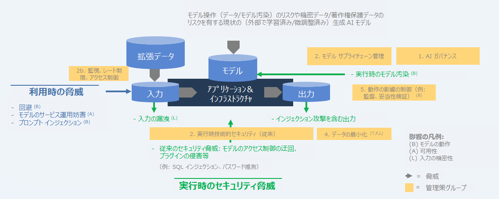
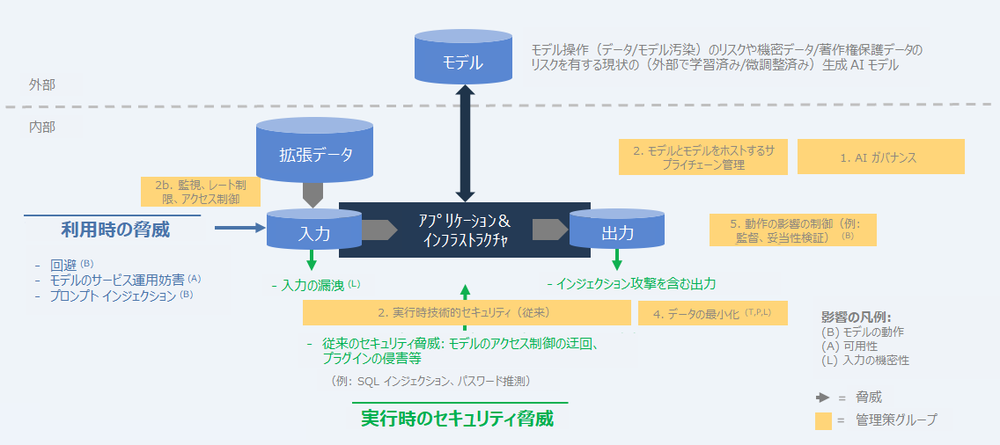
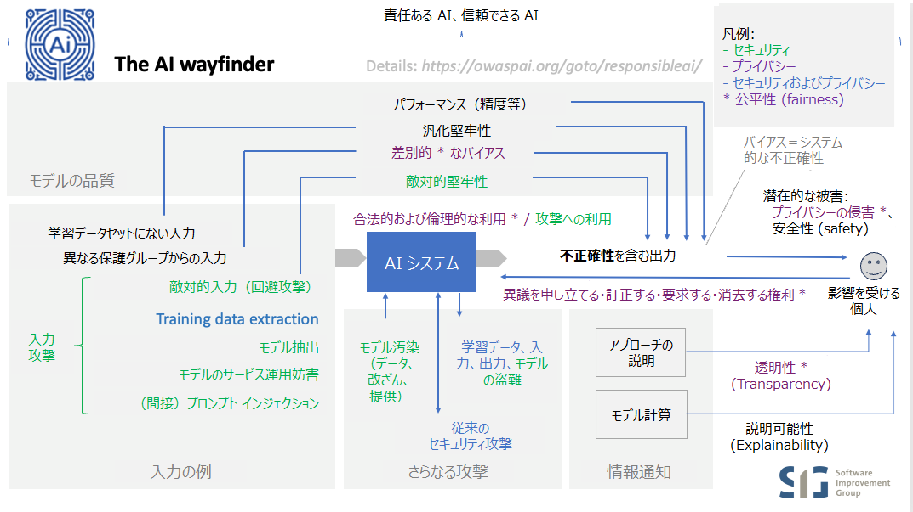

# AI Exchange について

# 要約

AI セキュリティとプライバシーに関する包括的なリソースへようこそ。ここには、AI とデータ中心システムを脅威から保護するための実践的なアドバイスと参考資料が 300 ページ以上掲載されています。ここで言う AI とは、分析 AI、識別 AI、生成 AI、そしてヒューリスティック システムといったあらゆる AI を指します。このコンテンツは実務家にとって重要なブックマークとして機能し、公式の標準化パートナーシップを通じて ISO/IEC や AI 法などの国際標準に積極的かつ大きく貢献しています。主要機関や標準化団体との幅広い連携を通じて、この Exchange（交換の場） は AI セキュリティとプライバシーに関するコンセンサスを形成しています。

# 詳細

OWASP AI Exchange は、AI およびデータ中心システムのセキュリティとプライバシーに関する世界的な議論をオープン ソース化しました。これは、AI の脅威、管理策、および関連するベスト プラクティスに関する包括的なフレームワークを提供することで、AI セキュリティとプライバシーの標準策定を推進することを目的とした、オープンで協力的な OWASP のフラッグシップ プロジェクトです。独自の公式リエゾン パートナーシップを通じて、このコンテンツは、EU AI 法（70 ページ）、ISO/IEC 27090（AI セキュリティ、70 ページ）、ISO/IEC 27091（AI プライバシー）、そして [OpenCRE](https://opencre.org/) の標準規格に反映されています。OpenCRE は現在、セキュリティ チャットボットである [OpenCRE-Chat](https://opencre.org/chatbot) を通じてAI Exchange コンテンツを提供する準備を進めています。

データ中心システムは、AI システムと、AI モデルを持たない「ビッグ データ」システム（データウェア ハウス、BI、レポート、ビッグ データなど）に分けられます。AI Exchange における脅威や対策の多くは、これらのシステムにも関連しています。データ汚染、データ サプライチェーン管理、データ パイプライン セキュリティなどです。

ここでのセキュリティとは、不正アクセス、不正利用、不正開示、妨害、改ざん、破壊を防ぐことを意味します。改ざんには、AI モデルの挙動を望ましくない方法で操作することも含まれます。

私たちの**使命**は、AI およびデータ中心システムのセキュリティとプライバシーの実務家にとって頼りになるリソースとなり、連携を促進し、イニシアチブ間の連携を促進することです。これにより、誰もが洞察を見つけ、共有できる、安全でオープンかつ独立した場を提供します。[LinkedIn の AI Exchange](https://www.linkedin.com/company/owasp-ai-exchange/) をフォローしてください。

# 仕組み

AI Exchange は [owaspai.org](https://owaspai.org/) に掲載されており、[GitHub リポジトリ](https://github.com/OWASP/www-project-ai-security-and-privacy-guide/tree/main/content/ai_exchange/content)を使用して編集されています（「GitHub で編集」のリンクを参照してください）。AI Exchange は、AI セキュリティとプライバシーに関する専門知識を世界中で共有するための**オープン ソースの生きた出版物**です。「コンテンツ」の下に複数のセクションがあり、それぞれがこのウェブサイト上の 1 つのページで構成されている、1 つの一貫性のあるリソースとして構成されています。

この資料は、オープン ソースの継続的デリバリーを通じて常に進化しています。執筆グループは、厳選された 70 名以上の専門家（研究者、実務家、ベンダー、データ サイエンティストなど）で構成されており、コミュニティの他の方々からの意見提供も歓迎します。[貢献ページ](https://owaspai.org/contribute)を参照してください。

AI セキュリティ コミュニティによる [OWASP AI Exchange](https://owaspai.org/) は [CC0 1.0](http://creativecommons.org/publicdomain/zero/1.0?ref=chooser-v1) ライセンスで提供されています。つまり、著作権表示や帰属表示なしで、どの部分も自由に使用できます。可能であれば、読者がより多くの情報を見つけられるように、OWASP AI Exchange のクレジットやリンクを記載していただけると幸いです。

# 想定される対象者

この AI Exchange は、セキュリティ、プライバシー、エンジニアリング、テスト、ガバナンスの実務担当者、そして組織内のエンド ユーザー、つまり AI システムのセキュリティとプライバシーに関心のあるすべての方を対象としています。資料へのアクセスを可能な限り容易にすることを目指しています。[リスク分析セクション](https://owaspai.org/goto/riskanalysis/)を利用することで、AI 医療機器を設計している大手機器メーカーでも、人事目的でチャットボットを活用している小規模な旅行代理店でも、それぞれの状況において重要な問題を迅速に絞り込むことができます。

# 歴史

AI Exchangeは、セキュリティ標準の架け橋となる人物であり、[Software Improvement Group](https://www.softwareimprovementgroup.com/) の最高 AI 責任者であり、AI とセキュリティの分野で 33 年の経験を持つ [Rob van der Veer](https://www.linkedin.com/in/robvanderveer/) 氏によって 2022 年に設立されました。Rob 氏は AI ライフサイクルに関する ISO/IEC 5338 の主執筆者であり、OpenCRE の創設者でもあります。現在は、CEN/CENELEC において ISO/IEC 27090、ISO/IEC 27091、そして EU AI 法に携わっており、EU 加盟国から共同編集者に選出されています。

このプロジェクトは 2022 年 10 月に「AI セキュリティおよびプライバシー ガイド」としてスタートし、1 年後にはグローバルな連携を強調するため「AI Exchange」に名称を変更しました。2025 年 3 月には、AI Exchange は[「生成 AI セキュリティ プロジェクト」](https://genai.owasp.org/)と共に、その重要性から「OWASP フラッグシップ プロジェクト」の地位を授与されました。

# （中略）

# 目次

- AI セキュリティの概観
	- AI Exchange について
	- AI の整理
	- 本書の使い方
	- 基本事項
	- 脅威
		- ハイライト: 脅威マトリックス
	- 管理策
		- ハイライト: 脅威と管理策の基本要素表表
	- リスク分析
	- その他の事項
- 脅威と管理策の詳細：
	- 1. 一般的な管理策
		- 1.1 ガバナンスの管理策
		- 1.2 データの制限
		- 1.3 望ましくない動作の制限
	- 2. 利用に通じた脅威と管理策
	- 3. 開発時の脅威と管理策
	- 4. ランタイム アプリケーション セキュリティの脅威と管理策
- AI セキュリティ テスト
- AI プライバシー
- 参考情報
- 索引

# AI セキュリティの整理方法

人工知能（AI）は大きな可能性をもたらす一方で、セキュリティ上の脅威を含む新たなリスクももたらします。そのため、AI アプリケーションを活用する際には、潜在的な脅威とその管理策を明確に理解することが不可欠です。

AI セキュリティを組織として組織化するための 5 つのステップ (G.U.A.R.D) は、以下のとおりです。

- **統治 (Govern)**
	コンプライアンスの整備を含む AI ガバナンスを実施します。責任分担を合意し、現状を把握し、ポリシーや教育などを実施します。
- **理解 (Understand)**
	エンジニアとセキュリティ担当者が、関連する AI セキュリティの脅威と、貴社またはサプライヤーが適用する必要がある対応するプロセス管理策および技術的管理策について理解していることを確実にします。
- **適応 (Adapt)**
	- セキュリティ慣行を適応させ、本書に記載されている AI セキュリティ資産、脅威、および管理策を含めます。
	- 脅威モデリングを適応させ、AI セキュリティの脅威モデルのアプローチを含め、すべてのエンジニアが参加するチーム横断的な脅威モデリングを実施します。
	- テストを適応させ、AI 固有のセキュリティ テストを含めます。
	- サプライチェーン管理策を適応させ、データとモデルの管理を含め、サプライヤーがセキュリティに配慮していることを確実にします。
	- AI システムを開発する場合（自社でモデル学習をしない場合でも）、ソフトウェア開発慣行とセキュア開発プログラムを適応させ、AI エンジニアリング活動を含めます。
- **削減 (Reduce)**
	機密データを最小限に抑えるか難読化し、望ましくない動作の影響を制限（権限管理、ガードレール、人による監視など）することで、潜在的な影響を軽減します。基本的には、マーフィーの法則を適用します。
- **実証 (Demonstrate)**
	透明性、文書化、コミュニケーションを通じて、責任ある AI セキュリティの証拠を示します。経営陣、規制当局、そして顧客に対し、AI システムが適切に管理され、適用された防護策が意図したとおりに機能していることを証明します。

最後に、AI システムを構築する前によく考えてください。AI のセキュリティ確保は、非 AI システムのセキュリティ確保よりも一般的に困難です。まず、AI は比較的新しい技術であることに加え、あらゆるデータ駆動型テクノロジーには一定の不確実性が存在するからです。例えば、LLM の場合、私たちは自然言語の流動性を扱っています。LLM は、基本的に、不明確なポリシー セットを有する不安定で文書化されていないインターフェースを提供します。つまり、AI に適用されるセキュリティ管理策は、他のソフトウェアで慣れ親しんでいるようなセキュリティ特性を提供できないことがよくあります。解決しようとしている問題に対して、AI が適切なテクノロジーの選択肢であるかどうかを検討してください。不要な AI コンポーネントを削除することで、AI 関連のリスクをすべて排除できます。

# 本書の使用方法

AI Exchange は、AI システムのセキュリティとプライバシーに関する包括的なリソースです。このウェブサイトでは、脅威、対策、ガイドライン、テスト、参考資料など、複数のページに分かれて掲載されています。

## ニーズに応じた開始方法

- **AI Exchange について詳しく知りたい**:
	[AI Exchange について](https://owaspai.org/goto/about/)を参照してください。
- **組織として AI セキュリティを開始したい**:
	組織として開始するための重要な手順については、[AI セキュリティの整理方法](https://owaspai.org/goto/organize/)を参照してください。
- **個人として AI セキュリティを開始したい**:
	脅威と管理策について詳しくは、以下の「学習/検索したい」を参照してください。または、[参考情報セクション](https://owaspai.org/goto/references/)にある大きな表でトレーニング資料を参照してください。
- **システムのセキュリティを確保したい**:
	**AI システムのセキュリティを確保**したい場合は、[リスク分析](https://owaspai.org/goto/riskanalysis/)から始めましょう。いくつかの質問に答えることで、該当する脅威が明らかになります。そして、それらの脅威をクリックすると、確認または実装すべき管理策（対抗策）が見つかります。
- **学習/検索したい**:
	- AI セキュリティの特長に関する主要な洞察をまとめた短い記事については、[AI Exchange の基本事項](https://owaspai.org/goto/essentials/)を参照してください。
	- Exchange のコンテンツに基づいて、AI に AI セキュリティ/プライバシーに関する質問をしてください。質問先は[こちら](https://notebooklm.google.com/notebook/75840a00-78f8-454d-ad4d-9ac27ae4cf48)（Google アカウントが必要です）。
	- すべての**脅威**の概観とさまざまな角度からの議論を確認するには、[AI 脅威モデル](https://owaspai.org/goto/threatsoverview/)または [AI セキュリティ マトリックス](https://owaspai.org/goto/aisecuritymatrix)を参照してください。保護する必要がある脅威がわかっている場合は、選択した脅威の概要でその脅威を見つけ、クリックして詳細情報と保護方法を入手してください。
	- 特定の脅威への対処方法を確認するには、[管理策の概観](https://owaspai.org/goto/controlsoverview/)または[基本要素表](https://owaspai.org/goto/periodictable/)で適切な**管理策**を見つけてください。
	- さまざまなデプロイメント モデルに適用する管理策を理解するには、[既製モデルのセクション](https://owaspai.org/goto/readymademodel/)を参照してください。
	- AI システムの**プライバシー**については、[プライバシーのセクション](https://owaspai.org/goto/aiprivacy/)を参照してください。
	- エージェント型 AI の側面は、すべてのコンテンツでカバーされており、[ここ](https://owaspai.org/goto/agenticaithreats/)に特定のセクションがあります。
	- 特定のトピックを検索するには、検索機能または[索引](https://owaspai.org/goto/index/)を使用してください。
	- 詳細情報やトレーニング資料をお探しの場合は、[参考情報](https://owaspai.org/goto/references/)を参照してください。
- **テストしたい**:
	ツールを使用して AI システムのセキュリティをテストする場合は、[テストに関するページ](https://owaspai.org/goto/testing/)にアクセスしてください。

AI Exchange は、ヒューリスティック人工知能（例: エキスパート システム）と機械学習の両方を網羅しています。つまり、AI システムとは、例えば大規模言語モデル、線形回帰関数、ルールベース システム、統計に基づくルックアップ テーブルなどを指します。本書全体を通して、どのような脅威と管理策が、いつ、どのような役割を果たすのかを明確に示しています。

## 構造

メイン ページでは、大まかな構造を確認できます。画面が大きい場合は、左側のサイドバーにページ構造が、右側に現在のページ内の構造が表示されます。画面が小さい場合は、メニューからこれらの構造を確認できます。また、目次には最も重要なトピックをまとめたセクションがあります。

メインの構造は以下のページで構成されています。
- (0) [AIセキュリティの概観](https://owaspai.org/docs/ai_security_overview) - このページには、AI セキュリティの概観と様々なトピックに関する議論が含まれています。 
- (1) [AI ガバナンスなどの一般的な管理策](https://owaspai.org/goto/generalcontrols/)
- (2) [利用を通じた脅威（回避攻撃など）](https://owaspai.org/goto/threatsuse/)
- (3) [開発時の脅威（データ汚染など）](https://owaspai.org/goto/developmenttime/)
- (4) [実行時のセキュリティ脅威（セキュリティが確保されていない出力など）](https://owaspai.org/goto/runtimeappsec/)
- (5) [AI セキュリティテスト](https://owaspai.org/goto/testing/)
- (6) [AI プライバシー](https://owaspai.org/goto/aiprivacy)
- (7) [参考情報](https://owaspai.org/goto/references/)

このページ（AI セキュリティの概観）では、以下のトピックについて引き続き議論します。

- 脅威の高レベルの概観
- 脅威と管理策の様々な概観: マトリックス、基本要素表、ナビゲーター
- 関連する脅威と管理策を選択するためのリスク分析
- その他の様々なトピック: ヒューリスティック システム、責任ある AI、生成 AI、NCSC/CISA ガイドライン、著作権

# AI セキュリティの基本事項

以降のセクションでは、AI セキュリティの脅威とそれに対応する管理策について解説します。AI セキュリティの全体像を理解するための重要なポイントを以下に示します。AI システムでは何が異なるのでしょうか？

この概観の作成には、多くの専門家や組織が貢献しました。SANS Institute との緊密な連携もその一つです。SANS と AI Exchange は、専門知識の共有と幅広い教育支援を目的とした継続的な連携の一環として、SANS の Critical AI Security Guidelines への準拠を確保しています。

## 新規の脅威（概観は[ここ](https://owaspai.org/goto/threatsoverview/)）

- **モデルへの入力の脅威**:
	- **回避**: データを巧妙に細工して誤った判断を強いることでモデルを誤導します。
	- **プロンプト インジェクション**: 動作を操作するための指示を巧妙に細工してモデルを誤導します。
	- **モデルからの抽出**: 学習データ、拡張データ、または入力
	- モデルへのクエリによる**モデルの抽出**
- 破損した外部**データ**、**モデル**、および**モデル ホスティング**を提供する**新規サプライヤー**
- 従来の脅威を伴う**新たな AI 資産**（とりわけ、以下）:
	- 学習データ/拡張データ（データの変更によりモデルの挙動を操作する - **データ汚染**）
	- モデル（**モデル盗難**または**モデル汚染**）
	- 入力（**漏洩**）
	- 出力（**インジェクション攻撃**を含む）

## 新規の管理策（概観は[ここ](https://owaspai.org/goto/controlsoverview//)）

- 汚染攻撃やモデル入力攻撃への管理策として、従来の対策に加え、**AI 開発特有の管理策**を適用します。このカテゴリは、**データ/モデル エンジニアリング**と、疑わしい入力や出力をフィルタリング、停止、またはアラート通知するための**モデル I/O 処理**に分類されます。これは通常、数学、統計学、言語学、機械学習の要素を持つデータ サイエンティストなどの AI 専門家の領域です。
- モデルのパフォーマンスと推論の[監視](https://owaspai.org/goto/monitoruse/) - モデル I/O 処理を拡張し、AI システムの一般的な使用状況を把握します。
- **影響を限定する管理策**（モデルの信頼性がゼロであるため、モデルが誤解を招く、間違いを起こす、またはデータ漏洩する可能性があると想定します）:
	- [機密データの最小化または難読化](https://owaspai.org/docs/1_general_controls/#12-general-controls-for-sensitive-data-limitation)
	- [モデルの動作の制限](https://owaspai.org/goto/limitunwanted/)（[監督](https://owaspai.org/goto/oversight/)、[最小モデル権限](https://owaspai.org/goto/leastmodelprivilege/)、[モデルの整合](https://owaspai.org/goto/modelalignment)など）

(*) 注: 類似モデル（またはコピー）を持つ攻撃者は、通常、気付かれずに、効率的に誤解を招く入力を作成できます。

# 脅威の概観

## 脅威の範囲

AI Exchange では、AI 固有の脅威、つまり AI 資産（モデル パラメータなど、詳細は [#SEC PROGRAM](https://owaspai.org/goto/secprogram/) を参照）への脅威に焦点を当てています。他の資産への脅威は、ユーザー データベースの保護など、他の多くのリソースで既にカバーされています。AI システムは IT システムであるため、さまざまなセキュリティ脅威にさらされています。従って、AI システムを保護する際には、AI セキュリティ＝AI 固有の資産への脅威（AI Exchange）＋その他の資産（その他のリソース）への脅威というように、AI Exchange を既存のセキュリティプログラムの拡張として捉える必要があります。

## 脅威モデル

私たちは、脅威を 3 つの種類に分類しています。

- 開発時（データの取得と準備、そしてモデルの学習/取得時）における脅威。例: データ汚染
- モデルの使用時（推論を介して。入力を提供して出力を取得）による脅威 。例: プロンプト インジェクションまたは回避
- 実行時（運用中 - 推論を介さない）におけるシステムへのその他の脅威。例: モデル入力の窃取

OWASP Exchange では、AI において、攻撃者の 3 つの目的（開示、欺瞞、妨害）に対応する 6 つの影響を概説しています。

- 開示: 学習/テスト データの機密性が損なわれます。
- 開示: モデルの知的財産（*モデルのパラメータ*、またはそれらを導出したプロセスとデータ）の機密性が損なわれます。
- 開示: 入力データの機密性が損なわれます。
- 欺瞞: モデル動作の完全性が損なわれます（モデルが操作されて望ましくない動作をし、結果としてユーザーを欺きます）。
- 妨害: モデルの可用性が損なわれます（モデルが動作しないか、望ましくない動作をします - ユーザーを欺くことはありませんが、通常の運用を妨害します）。
- 妨害/開示: AI 固有ではない資産の機密性、完全性、および可用性

これらの影響をもたらす脅威は、それぞれ異なる攻撃対象領域を利用します。例えば、学習データの機密性は、開発中のデータベースへのハッキングによって侵害される可能性がありますが、メンバーシップ推論攻撃によって漏洩される可能性もあります。メンバーシップ推論攻撃では、特定の人物のデータをモデルに入力し、モデル出力の詳細を確認するだけで、その人物が学習データに含まれているかどうかを判断できます。

下図では、脅威を矢印で示しています。それぞれの脅威には特定の影響があり、影響の凡例に対応する文字で示されています。管理策の概要セクションには、管理策のグループが追加されたこの図が含まれています。

## エージェント型 AI に対する脅威

エージェント型 AIでは、AI システムは単に出力を提示するだけでなく、アクションを実行できます。場合によっては、自律的に動作したり、他のエージェントと通信したりすることもできます。重要な注意点: これらは依然としてソフトウェア システムおよび AI システムであるため、AI Exchange のすべてが当てはまりますが、いくつか注意点があります。

エージェント型 AI の一例として、暖房を制御したり、メールを送信したり、さらには他のアシスタントを会話に招待したりできる音声アシスタントのセットが挙げられます。これは非常に強力ですが、何千通ものメールを送信する前に、事前に確認を求める必要があるでしょう。

エージェント型 AI には、4 つの典型的な特性があります。

- アクション: エージェントは、単にチャットするだけでなく、メールの送信などの機能を実行します。そのため、[最小モデル権限](https://owaspai.org/goto/leastmodelprivilege/)が重要な管理策となります。
- 自律性: エージェントは、互いにトリガーし合い、自律的な応答を可能にします（例: スクリプトがメールを受信し、生成 AI のフォローアップをトリガーする）。そのため、[監督](https://owaspai.org/goto/oversight/)が重要になります。また、自律エージェントの状態と計画が保存される作業用記憶は攻撃ベクトルとなります。
- 複雑性: エージェントの行動は創発的です。
- マルチ システム: 多くの場合、複数のシステムとインターフェースが混在する環境で動作します。そのため、開発者は、AI へのアクセス制御に関する責任を指示を用いて割り当てる傾向があり、[プロンプト インジェクション](https://owaspai.org/goto/promptinjection/)による操作の可能性が高まります。

これはセキュリティにとって何を意味するのでしょうか？

- 幻覚やプロンプト インジェクションは、命令を変更したり、権限を昇格させたりする可能性があります。重要な管理策は、多層防御と影響範囲の制御（[影響の限定](https://owaspai.org/goto/limitunwanted/)）です。アクセス制御の責任を生成 AI モデル／エージェントに委ねるべきではありません。アーキテクチャに組み込む必要があります。
- エージェント型 AI は、システム コンポーネント間の相互接続性とデータフローを変更するため、信頼境界やその他の確立されたセキュリティ対策に関する既存の前提を見直す必要があるかもしれません。
- 独自の権限セットを持ってデプロイされたエージェントは、混乱した代理になる可能性があるため、権限昇格のベクトルにつながります。
- 攻撃対象領域は広く、潜在的な影響を過小評価してはなりません。
- そのため、モデル間通信（MCP など）のセキュリティ、[追跡可能性](https://owaspai.org/goto/monitoruse/)、記憶の完全性の保護、[プロンプト インジェクションの防御](https://owaspai.org/goto/promptinjectionm/)、[ルールベース／人間による監督](https://owaspai.org/goto/oversight/)、[最小モデル権限](https://owaspai.org/goto/leastmodelprivilege/)といった既知の管理策がさらに重要になります。[管理策の概観のセクション](https://owaspai.org/goto/controlsoverview/)を参照してください。

エージェント型 AI で機密データを漏洩させるには、3 つの要素（*lethal trifecta （成功に必要で致命的な 3 要素）*とも呼ばれます）が必要です。

- データ: 必要なアクセス権を持つユーザーのセッションのどこかの時点で LLM に侵入したデータを攻撃者が制御し、[間接プロンプト インジェクション](https://owaspai.org/goto/indirectpromptinjection/)を実行できること。
- アクセス：LLM または接続されたエージェントが機密データへアクセス可能であること。
- 送信: LLM または接続されたエージェントから攻撃者へのデータ送信を開始できること。

詳細については、[Simon Willison 氏の優れた研究](https://simonwillison.net/2025/Jun/16/the-lethal-trifecta/)を参照してください。また、エージェント型 AI ソフトウェア開発の事例については、[こちら](https://www.darkreading.com/application-security/github-copilot-camoleak-ai-attack-exfils-data)と[こちら](https://ainativedev.io/news/malicious-github-issue-ai-agent-leak)を参照してください。

詳細情報へのリンク:

- エージェント型 AI の脅威に関する詳細については、[GenAI Security Project の「エージェント型 AI の脅威と軽減策」](https://genai.owasp.org/resource/agentic-ai-threats-and-mitigations/)を参照してください。
- エージェント型 AI に関するより一般的な議論については、[Chip Huyen 氏によるこの記事](https://huyenchip.com/2025/01/07/agents.html)を参照してください。
- [テストのセクション](https://owaspai.org/goto/testing/)では、エージェント型 AI レッドチーム演習について詳しく説明し、CSA と Exchange の共同作業である「エージェント型 AI レッドチーム演習ガイド」へのリンクを提供しています。
- [OWASP Agentic AI security top 10](https://genai.owasp.org/resource/owasp-top-10-for-agentic-applications-for-2026/) と [Rock 氏のブログ](https://www.rockcybermusings.com/p/owasp-top-10-agentic-applications-security-guide)

## AI セキュリティ マトリックス

以下の AI セキュリティ マトリックスには、主な脅威とリスクが種類別と影響度順に表示されています。

[基本要素表](https://owaspai.org/goto/periodictable/)に基づいたクリック可能なバージョンは、以下のとおりです。

<table>
<tr>
	<th width="30%">資産と影響</th>
	<th width="35%">攻撃対象領域とライフサイクル</th>
	<th width="35%">脅威/リスクのカテゴリ</th>
</tr>
<tr>
	<td rowspan="7">モデルの動作の完全性</td>
	<td rowspan="3">実行時 - モデルの利用（入力の提供/出力の読み取り）</td>
	<td><a href="https://owaspai.org/goto/directpromptinjection/">直接プロンプト インジェクション</a></td>
</tr>
<tr>
	<td><a href="https://owaspai.org/goto/indirectpromptinjection/">間接プロンプト インジェクション</a></td>
</tr>
<tr>
	<td><a href="https://owaspai.org/goto/evasion/">回避</a>（例: 敵対的サンプル）</td>
</tr>
<tr>
	<td>実行時 - デプロイ済みモデルへの侵入</td>
	<td><a href="https://owaspai.org/goto/runtimemodelpoison/">実行時のモデル汚染</a>（再プログラミング）</td>
</tr>
<tr>
	<td rowspan="2">開発 - 開発環境</td>
	<td><a href="https://owaspai.org/goto/devmodelpoison/">開発時のモデル汚染</a></td>
</tr>
<tr>
	<td><a href="https://owaspai.org/goto/datapoison/">学習/微調整データのデータ汚染</a></td>
</tr>
<tr>
	<td>開発 - サプライチェーン</td>
	<td><a href="https://owaspai.org/goto/supplymodelpoison/">サプライチェーン内でのモデル汚染</a></td>
</tr>
<tr>
	<td rowspan="3">学習データの機密性</td>
	<td rowspan="2">実行時 - モデルの利用</td>
	<td><a href="https://owaspai.org/goto/disclosureuseoutput/">モデルによる機密情報の出力</a></td>
</tr>
<tr>
	<td><a href="https://owaspai.org/goto/modelinversionandmembership/">モデル反転/メンバーシップ推論</a></td>
</tr>
<tr>
	<td>開発 - 開発環境</td>
	<td><a href="https://owaspai.org/goto/devmodelleak/">開発時のデータ漏洩</a></td>
</tr>
<tr>
	<td rowspan="3">モデルの機密性</td>
	<td>実行時 - モデルの利用</td>
	<td><a href="https://owaspai.org/goto/modeltheftuse/">利用時のモデル盗難</a>（入力・出力のハーベスティング）</td>
</tr>
<tr>
	<td>デプロイ済みモデルへの侵入</td>
	<td><a href="https://owaspai.org/goto/runtimemodeltheft/">実行時の直接モデル盗難</a></td>
</tr>
<tr>
	<td>開発 - 開発環境</td>
	<td><a href="https://owaspai.org/goto/devmodelleak/">開発時のモデル盗難</a></td>
</tr>
<tr>
	<td>モデルの動作の可用性</td>
	<td>モデルの利用</td>
	<td><a href="https://owaspai.org/goto/airesourceexhaustion/">AI リソースの枯渇</a></td>
</tr>
<tr>
	<td>モデルの入力データの機密性</td>
	<td>実行時 - すべての IT</td>
	<td><a href="https://owaspai.org/goto/leakinput/">機密入力データの漏洩</a></td>
</tr>
<tr>
	<td>すべての資産、機密性・完全性・可用性</td>
	<td>実行時 - すべての IT</td>
	<td><a href="https://owaspai.org/goto/insecureoutput/">インジェクションを含むモデル出力</a></td>
</tr>
<tr>
	<td>すべての資産、機密性・完全性・可用性</td>
	<td>実行時 - すべての IT</td>
	<td>従来の資産に対する従来の実行時セキュリティ攻撃</td>
</tr>
<tr>
	<td>すべての資産、機密性・完全性・可用性</td>
	<td>実行時 - すべての IT</td>
	<td>従来のサプライチェーンに対する従来の攻撃</td>
</tr>
</table>
	

# 管理策の概観

**管理策の慎重な選択と実装**

AI Exchange では、攻撃のリスクを軽減するための管理策を多数リストアップしています。これらの管理策の多くは実装コストが高く、モデルの精度や正常な動作に影響を与える可能性のある他の AI 特性とのトレードオフの影響を受けることに注意してください。特に、学習プロセスやデータ分布の変更を伴う管理策は、意図しない副作用をもたらす可能性があるため、慎重に検討し、導入する必要があります。

**管理策の範囲**

AI Exchange では、AI 固有の脅威とそれに対応する管理策に焦点を当てています。管理策の中には、AI 固有のもの（例: 学習データセットへのノイズの追加）とそうでないもの（例: 学習データベースの暗号化）があります。後者を「従来型管理策」と呼びます。従来型管理策の詳細は他の場所（例えば、[OpenCRE](https://opencre.org/) を参照）で規定されているため、AI Exchange では AI 固有の管理策の詳細に焦点を当てています。これらの管理策の AI 固有の側面については、Trusted Execution Environment（TES）を使用してモデル パラメータの保護を実装できることなどの例を提供しています。

## 管理策つき脅威モデル - 一般

以下の図は、AI Exchange の管理策をグループに分け、これらのグループを対応する脅威とともに適切なライフサイクルに配置しています。

管理策のグループは、AI セキュリティへの対応方法を要約したものです（管理策は大文字で表記されています）。

- **AI ガバナンス** (1): AI リスクへの対応だけでなく、ライフサイクル全体にわたって AI に関する考慮事項を組み込むことで、情報セキュリティおよびソフトウェア開発ライフサイクル プロセスに AI を包括的に統合します。
	- [AI PROGRAM （AI プログラム）](https://owaspai.org/docs/1_general_controls/#aiprogram)
	- [SEC PROGRAM （セキュリティ プログラム）](https://owaspai.org/docs/1_general_controls/#secprogram)
	- [DEV PROGRAM （開発プログラム）](https://owaspai.org/docs/1_general_controls/#devprogram)
	- [SECDEV PROGRAM （セキュア開発プログラム）](https://owaspai.org/docs/1_general_controls/#secdevprogram)
	- [CHECK COMPLIANCE （コンプライアンス チェック）](https://owaspai.org/docs/1_general_controls/#checkcompliance)
	- [SEC EDUCATE （セキュリティ教育）](https://owaspai.org/docs/1_general_controls/#seceducate)
- データとモデルのガバナンスを活用した**サプライチェーン管理の拡張** (2): 
	- [SUPPLY CHAIN MANAGE （サプライチェーン管理）](https://owaspai.org/docs/3_development_time_threats/#supplychainmanage)
- **データの最小化／難読化** (4):  保存時および転送中のデータ量を制限します。また、データの保存時間、開発時間、実行時間も制限します。
	- [DATA MINIMIZE （データの最小化）](https://owaspai.org/docs/1_general_controls/#dataminimize)
	- [ALLOWED DATA （許可済みのデータ）](https://owaspai.org/docs/1_general_controls/#alloweddata)
	- [SHORT RETAIN （短期間の保持）](https://owaspai.org/docs/1_general_controls/#shortretain)
	- [OBFUSCATE TRAINING DATA （学習データの難読化）](https://owaspai.org/docs/1_general_controls/#obfuscatetrainingdata)
- AI システムが IT システムであることによる従来の**技術的セキュリティ管理策** (2) の適用:
	- 標準的な従来のセキュリティ管理策（例：15408、ASVS、OpenCRE、ISO 27001 附属書 A、NIST SP800-53）を AI システム全体に適用し、AI 固有の新しい資産にも適用します。
		- 開発時: モデルとデータの保存、モデルとデータのサプライチェーン、データ サイエンスの文書化:
			- [DEV SECURITY （開発時のセキュリティ）](https://owaspai.org/docs/3_development_time_threats/#devsecurity)
			- [SEGREGATE DATA（データの分離）](https://owaspai.org/docs/3_development_time_threats/#segregatedata)
			- [DISCRETE（技術的詳細へのアクセスの最小化）](https://owaspai.org/docs/1_general_controls/#discrete)
		- 実行時: モデルの保存、モデルの利用、プラグイン、およびモデルの入出力:
			- [RUNTIME MODEL INTEGRITY （実行時のモデルの完全性）](https://owaspai.org/goto/runtimemodelintegrity/)
			- [RUNTIME MODEL IO INTEGRITY（実行時のモデル I/O の完全性）](https://owaspai.org/goto/runtimemodeliointegrity/)
			- [RUNTIME MODEL CONFIDENTIALITY（実行時のモデルの機密性）](https://owaspai.org/goto/runtimemodelconfidentiality/)
			- [MODEL INPUT CONFIDENTIALITY（モデル入力の機密性）](https://owaspai.org/goto/modelinputconfidentiality/)
			- [ENCODE MODEL OUTPUT（モデル出力のエンコード）](https://owaspai.org/goto/encodemodeloutput/)
			- [LIMIT RESOURCES（リソースの制限）](https://owaspai.org/goto/limitresources/)
	-  AI に適したものへをすることを目的とした従来の IT セキュリティ管理策の**適応**（例: 監視すべき利用パターンの特定）:
		- [MONITOR USE（利用の監視）](https://owaspai.org/docs/2_threats_through_use/#monitor-use)
		- [MODEL ACCESS CONTROL（モデルへのアクセス制御）](https://owaspai.org/docs/2_threats_through_use/#model-access-control)
		- [RATE LIMIT（レート制限）](https://owaspai.org/goto/ratelimit/)
	- **新しい** IT セキュリティ管理策の導入:
		- [CONF COMPUTE（機密コンピューティング）](https://owaspai.org/goto/confcompute/)
		- [MODEL OBFUSCATION （モデルの難読化）](https://owaspai.org/goto/modelobfuscation/)
		- [INPUT SEGREGATION（入力の分離）](https://owaspai.org/goto/inputsegregation/)
- **AI 開発のセキュリティ管理策**の適用 (3):
	- 開発の一環としてデータ/モデル エンジニアリング管理策 (3a) を適用します。
		- [FEDERATED LEARNING （連合学習）](https://owaspai.org/goto/federatedlearning/)
		- [CONTINUOUS VALIDATION （継続的な検証）](https://owaspai.org/goto/continuousvalidation/)
		- [UNWANTED BIAS TESTING （望ましくないバイアスのテスト）](https://owaspai.org/goto/unwantedbiastesting/)
		- [EVASION ROBUST MODEL （回避堅牢型のモデル）](https://owaspai.org/goto/evasionrobustmodel/)
		- [POISON ROBUST MODEL （汚染堅牢型のモデル）](https://owaspai.org/goto/poisonrobustmodel/)
		- [TRAIN ADVERSARIAL （敵対的学習）](https://owaspai.org/goto/trainadversarial/)
		- [TRAIN DATA DISTORTION （学習データの歪み）](https://owaspai.org/goto/traindatadistortion/)
		- [ADVERSARIAL ROBUST DISTILLATION （敵対的堅牢型の蒸留）](https://owaspai.org/goto/adversarialrobustdistillation/)
		- [MODEL ENSEMBLE （モデル アンサンブル）](https://owaspai.org/goto/modelensemble/)
		- [MORE TRAINDATA （学習データの増加）](https://owaspai.org/goto/moretraindata/)
		- [SMALL MODEL （小型のモデル）](https://owaspai.org/goto/smallmodel/)
		- [DATA QUALITY CONTROL （データの品質の制御）](https://owaspai.org/goto/dataqualitycontrol/)
		- [MODEL ALIGNMENT （モデルのアライメント（整合））](https://owaspai.org/goto/modelalignment/)
	- 攻撃をフィルターし検出することを目的とした実行時のモデル I/O 処理 (3b):
		- [ANOMALOUS INPUT HANDLING （異常な入力の処理）](https://owaspai.org/goto/anomalousinputhandling/)
		- [EVASION INPUT HANDLING （回避目的の入力の処理）](https://owaspai.org/goto/evasioninputhandling/)
		- [UNWANTED INPUT SERIES HANDLING （望ましくない入力系列の処理）](https://owaspai.org/goto/unwantedinputserieshandling/)
		- [PROMPT INJECTION I/O HANDLING （プロンプト インジェクション I/O の処理）](https://owaspai.org/goto/promptinjectioniohandling/)
		- [DOS INPUT VALIDATION （サービス運用妨害を目的とした入力の検証）](https://owaspai.org/goto/dosinputvalidation/)
		- [INPUT DISTORTION （入力の歪み）](https://owaspai.org/goto/inputdistortion/)
		- [SENSITIVE OUTPUT HANDLING （機微な出力の処理）](https://owaspai.org/goto/sensitiveoutputhandling/)
		- [OBSCURE CONFIDENCE （信頼度の隠蔽）](https://owaspai.org/goto/obscureconfidence/)
- **モデルの動作の制限**（モデルは意図せず、あるいは操作によって望ましくない動作をする可能性があるため）(5)
	- [OVERSIGHT （監督）](https://owaspai.org/goto/oversight/)
	- [LEAST MODEL PRIVILEGE （最小モデル権限）](https://owaspai.org/goto/leastmodelprivilege/)
	- [MODEL ALIGNMENT （モデルのアライメント（整合））](https://owaspai.org/goto/modelalignment/)
	- [AI TRANSPARENCY （AI の透明性）](https://owaspai.org/goto/aitransparency/)
	- [EXPLAINABILITY （説明可能性）](https://owaspai.org/goto/explainability/)
	- [CONTINUOUS VALIDATION （継続的な検証）](https://owaspai.org/goto/continuousvalidation/)
	- [UNWANTED BIAS TESTING （望ましくないバイアスのテスト）](https://owaspai.org/goto/unwantedbiastesting/)

すべての脅威と管理策については、AI Exchange の対応する脅威セクションで詳細に検討されています。
		   
## 管理策つき脅威モデル - 既製モデル

可能であれば、価格にもよりますが、組織は自ら学習や微調整を行うのではなく、既製モデルを選ぶことができます。例えば、カメラ画像内の人物検出を行うオープン ソース モデルや、Google Gemini、OpenAI ChatGPT、Anthropic Claude、Alibaba QWen、Deepseek、Mistral、Grok、Falkon といった汎用 LLM などが挙げられます。こうしたモデルを自ら学習させるには、数百万ドルもの費用がかかり、深い専門知識と膨大な量のデータが必要になります。

プロバイダー（例: OpenAI）は、学習と微調整を行っており、セキュリティの一部についても責任を負います。そのため、モデル プロバイダーに関する適切なサプライチェーン管理が求められます。

既製モデルには、以下のデプロイメント オプションが該当します。

- プロバイダーがホストするクローズド ソース モデル - 大規模モデルの場合、通常はこれが唯一の選択肢となります。
- セルフ ホスト: オープン ソース モデル（オープン ウェイト）をオンプレミス（最もセキュア）または仮想プライベート クラウド（クラウド プロバイダーが信頼できる場合はセキュア）にデプロイ - これらのオプションは、セキュリティが高く、コスト面でも最適な選択肢となる可能性がありますが、大規模モデルには対応していません。
- オープン ソース モデル（オープン ウェイト）を有料ホスティング サービスでデプロイ - 便利

### セルフ ホスト

以下の図は、セルフ ホスティングの場合における脅威と管理策を示しています。

### 外部ホスト

モデルが外部でホストされている場合、セキュリティは、セキュリティ設定を含め、サプライヤーのデータ処理方法に大きく依存します。ここで確認すべき重要な質問には、以下のようなものがあります。

- モデルはどこで実行されますか？

	モデルはベンダーのプロセスで実行されますか、それとも自社の仮想プライベート クラウドで実行されますか？一部のベンダーは「プライベート インスタンス」が利用可能と言っていますが、これは API を指しており、モデル自体を指しているわけではありません。モデルがベンダー運用のクラスターで実行される場合、データは平文で環境から出力されます。ベンダーは保存と転送を最小限に抑えますが、ログ記録と監視を行う場合があります。

- データ保持ルールはどのようなものですか？

	裁判所は、訴訟に備えてベンダーにログの保持を命じたことがありますか？これは、米国の OpenAI で一時期発生しました。

- 具体的に何がログに記録され、監視されていますか？

	細則をよく読んでください。ログ記録は有効になっていますか？有効になっている場合、何がログに記録されますか？そして、オペレーターによって、あるいはアルゴリズムによって、何が監視されていますか？￥監視アルゴリズムの場合、そのインフラストラクチャはどのように保護されていますか？一部のベンダーは、ログ記録をオプト アウトできますが、特定のライセンスが必要です。

- 入力データは学習に使われていますか？

	これはよくある懸念事項ですが、ほとんどの場合、入力データは使用されません。ベンダーが秘密裏に学習を行っていたとしても、見破る方法があるため、それは発覚するでしょう。

特定のデータに対するリスクを許容できない場合は、独自の（小規模な）モデルをホストするのが最も安全な選択肢です。ただし、通常はそれほど優れた結果にはならず、ジレンマに陥ることになります。

特定のデータに対するリスクを許容できない場合は、独自の（小規模な）モデルをホストするのが最も安全な選択肢です。しかし、一般的にはそれほど効果的ではなく、ジレンマに陥る可能性もあります。

プロバイダーがホストするモデルでは、モデルが処理するためにデータを読み取る必要があるため、入力データは平文でなければならないことを認識することが重要です。つまり、機密データはインフラストラクチャの外部で暗号化されていない状態で存在することになります。

これは LLM プロバイダーに限ったことではなく、商用ホスティング型 Office スイートなどの他のマルチテナント SaaS サービスでも同様です。プロバイダーは、通常、データ ストレージを最小限に抑え、保持期間を制限し、データの移動を減らしますが、それでもデータは読み取り可能な形式で環境から出ていくという事実は変わりません。

このリスクを評価する際には、公平に比較する必要があります。ベンダーは、自組織の環境よりも優れた保護を提供できる可能性があります。

下の図は、外部ホスト環境における脅威と管理策を示しています。

組織にとって典型的な課題は、一般的な生成 AI（例: ChatGPT ）用の既製モデルの使用を制御することです。従業員は、通常、これらのモデルに無料でもアクセスできるためです。これらのモデルの中には、組織のセキュリティとプライバシーの要件を満たしていないものもあります。それでも、従業員は、より良い代替手段（*シャドー AI* と呼ばれることもあります）がないため、これらのモデルを使用したい誘惑に駆られる可能性があります。この問題の最善の解決策は、セキュアかつプライバシーを保護する方法で導入および構成され、十分な品質を備え、組織の価値観とポリシーに準拠した AI モデルの形で、優れた代替手段を提供することです。さらに、シャドー AI のリスクをユーザーに明確に伝える必要があります。

## AI セキュリティの基本要素表

OWASP AI Exchange が作成した以下の表は、AI に対するさまざまな脅威と、それらに対抗できる管理策を示しています。すべて資産、影響、攻撃対象領域ごとに整理されており、AI Exchange ウェブサイトの包括的な解説へのリンクも提供されています。

なお、[一般的なガバナンス管理策](https://owaspai.org/goto/governancecontrols/)は、すべての脅威に適用されます。

<table>
<tr>
	<th width="25%">資産と影響</th>
	<th width="25%">攻撃対象領域とライフサイクル</th>
	<th width="25%">脅威/リスクのカテゴリ</th>
	<th width="25%">管理策</th>
</tr>
<tr>
	<td rowspan="7">モデルの動作の完全性</td>
	<td rowspan="3">実行時 - モデルの利用（入力の提供/出力の読み取り）</td>
	<td><a href="https://owaspai.org/goto/directpromptinjection/">直接プロンプト インジェクション</a></td>
	<td><ul><li><a href="https://owaspai.org/goto/limitunwanted/">望ましくない動作の制限</a><li><a href="https://owaspai.org/goto/monitoruse/">監視</a><li><a href="https://owaspai.org/goto/ratelimit/">レート制限</a><li><a href="https://owaspai.org/goto/modelaccesscontrol/">モデルへのアクセス制御</a></ul>上記に加えて<ul><li><a href="https://owaspai.org/goto/promptinjectioniohandling/">プロンプト インジェクション I/O の処理</a><li><a href="https://owaspai.org/goto/modelalignment/">モデルのアライメント（整合）</a></ul></td>
</tr>
<tr>
	<td><a href="https://owaspai.org/goto/indirectpromptinjection/">間接プロンプト インジェクション</a></td>
	<td><ul><li><a href="https://owaspai.org/goto/limitunwanted/">望ましくない動作の制限</a><li><a href="https://owaspai.org/goto/promptinjectioniohandling/">プロンプト インジェクション I/O の処理</a><li><a href="https://owaspai.org/goto/inputsegregation/">入力の分離</a></ul></td>
</tr>
<tr>
	<td><a href="https://owaspai.org/goto/evasion/">回避</a>（例: 敵対的サンプル）</td>
	<td><ul><li><a href="https://owaspai.org/goto/limitunwanted/">望ましくない動作の制限</a><li><a href="https://owaspai.org/goto/monitoruse/">監視</a><li><a href="https://owaspai.org/goto/ratelimit/">レート制限</a><li><a href="https://owaspai.org/goto/modelaccesscontrol/">モデルへのアクセス制御</a></ul>上記に加えて<ul><li><a href="https://owaspai.org/goto/anomalousinputhandling">異常な入力の処理</a><li><a href="https://owaspai.org/goto/evasioninputhandling/">回避目的の入力の処理</a><li><a href="https://owaspai.org/goto/unwantedinputserieshandling/">望ましくない入力系列の処理</a><li><a href="https://owaspai.org/goto/evasionrobustmodel/">回避堅牢型のモデル</a><li><a href="https://owaspai.org/goto/trainadversarial/">敵対的学習</a><li><a href="https://owaspai.org/goto/inputdistortion/">入力の歪み</a><li><a href="https://owaspai.org/goto/adversarialrobustdistillation/">敵対的堅牢型の蒸留</a</ul></td>
</tr>
<tr>
	<td>実行時 - デプロイ済みモデルへの侵入</td>
	<td><a href="https://owaspai.org/goto/runtimemodelpoison/">実行時のモデル汚染</a>（再プログラミング）</td>
	<td><ul><li><a href="https://owaspai.org/goto/limitunwanted/">望ましくない動作の制限</a><li><a href="https://owaspai.org/goto/runtimemodelintegrity/">実行時のモデルの完全性</a><li><a href="https://owaspai.org/goto/runtimemodeliointegrity/">実行時のモデル I/O の完全性</a></ul></td>
</tr>
<tr>
	<td rowspan="2">開発 - 開発環境</td>
	<td><a href="https://owaspai.org/goto/devmodelpoison/">開発時のモデル汚染</a></td>
	<td><ul><li><a href="https://owaspai.org/goto/limitunwanted/">望ましくない動作の制限</a><li><a href="https://owaspai.org/goto/devsecurity/">開発環境のセキュリティ</a><li><a href="https://owaspai.org/goto/segregatedata/">データの分離</a><li><a href="https://owaspai.org/goto/federatedlearning/">連合学習</a><li><a href="https://owaspai.org/goto/supplychainmanage/">サプライチェーン管理</a></ul>上記に加えて<ul><li><a href="https://owaspai.org/goto/modelensemble/">モデル アンサンブル</a></ul></td>
</tr>
<tr>
	<td><a href="https://owaspai.org/goto/datapoison/">学習/微調整データのデータ汚染</a></td>
	<td><ul><li><a href="https://owaspai.org/goto/limitunwanted/">望ましくない動作の制限</a><li><a href="https://owaspai.org/goto/devsecurity/">開発環境のセキュリティ</a><li><a href="https://owaspai.org/goto/segregatedata/">データの分離</a><li><a href="https://owaspai.org/goto/federatedlearning/">連合学習</a><li><a href="https://owaspai.org/goto/supplychainmanage/">サプライチェーン管理</a></ul>上記に加えて<ul><li><a href="https://owaspai.org/goto/modelensemble/">モデル アンサンブル</a></ul>上記に加えて<ul><li><a href="https://owaspai.org/goto/moretraindata/">学習データの増加</a><li><a href="https://owaspai.org/goto/dataqualitycontrol//">データの品質の制御</a><li><a href="https://owaspai.org/goto/traindatadistortion/">学習データの歪み</a><li><a href="https://owaspai.org/goto/poisonrobustmodel/">汚染堅牢型のモデル</a><li><a href="https://owaspai.org/goto/trainadversarial//">敵対的学習</a></ul></td>
</tr>
<tr>
	<td>開発 - サプライチェーン</td>
	<td><a href="https://owaspai.org/goto/supplymodelpoison/">サプライチェーン内でのモデル汚染</a></td>
	<td><ul><li><a href="https://owaspai.org/goto/limitunwanted/">望ましくない動作の制限</a></ul>サプライヤー:<ul><li><a href="https://owaspai.org/goto/devsecurity/">開発環境のセキュリティ</a><li><a href="https://owaspai.org/goto/segregatedata/">データの分離</a><li><a href="https://owaspai.org/goto/federatedlearning/">連合学習</a></ul> 製造者<ul><li><a href="https://owaspai.org/goto/supplychainmanage/">サプライチェーン管理</a></ul>&nbsp;&nbsp;&nbsp;&nbsp;上記に加えて<ul><li><a href="https://owaspai.org/goto/modelensemble/">モデル アンサンブル</a></ul></td>
</tr>
</tr>
<tr>
	<td rowspan="3">学習データの機密性</td>
	<td rowspan="2">実行時 - モデルの利用</td>
	<td><a href="https://owaspai.org/goto/disclosureuseoutput/">モデルによる機密情報の出力</a></td>
	<td><ul><li><a href="https://owaspai.org/goto/datalimit/">機密データの制限</a>（データの最小化、短期間の保持、学習データの難読化）</ul>上記に加えて<ul><li><a href="https://owaspai.org/goto/monitoruse/">監視</a><li><a href="https://owaspai.org/goto/ratelimit/">レート制限</a><li><a href="https://owaspai.org/goto/modelaccesscontrol/">モデルへのアクセス制御</a></ul>上記に加えて<ul><li><a href="https://owaspai.org/goto/sensitiveoutputhandling/">機微な出力の処理</a></ul></td>
</tr>
<tr>
	<td><a href="https://owaspai.org/goto/modelinversionandmembership/">モデル反転/メンバーシップ推論</a></td>
	<td><ul><li><a href="https://owaspai.org/goto/datalimit/">機密データの制限</a>（データの最小化、短期間の保持、学習データの難読化）</ul>上記に加えて<ul><li><a href="https://owaspai.org/goto/monitoruse/">監視</a><li><a href="https://owaspai.org/goto/ratelimit/">レート制限</a><li><a href="https://owaspai.org/goto/modelaccesscontrol/">モデルへのアクセス制御</a></ul>上記に加えて<ul><li><a href="https://owaspai.org/goto/unwantedinputserieshandling/">望ましくない入力系列の処理</a><li><a href="https://owaspai.org/goto/obscureconfidence/">信頼度の隠蔽</a><li><a href="https://owaspai.org/goto/smallmodel/">小型のモデル</a></ul></td>
</tr>
<tr>
	<td>開発 - 開発環境</td>
	<td><a href="https://owaspai.org/goto/devmodelleak/">学習データの漏洩</a></td>
	<td><ul><li><a href="https://owaspai.org/goto/datalimit/">機密データの制限</a>（データの最小化、短期間の保持、学習データの難読化）</ul>上記に加えて<ul><li><a href="https://owaspai.org/goto/devsecurity/">開発環境のセキュリティ</a><li><a href="https://owaspai.org/goto/segregatedata/">データの分離</a><li><a href="https://owaspai.org/goto/federatedlearning/">連合学習</a></ul></td>
</tr>
<tr>
	<td rowspan="3">モデルの機密性</td>
	<td>実行時 - モデルの利用</td>
	<td><a href="https://owaspai.org/goto/modeltheftuse/">利用時のモデル盗難</a>（入力・出力のハーベスティング）
	<td><ul><li><a href="https://owaspai.org/goto/monitoruse/">監視</a><li><a href="https://owaspai.org/goto/ratelimit/">レート制限</a><li><a href="https://owaspai.org/goto/modelaccesscontrol/">モデルへのアクセス制御</a></ul>上記に加えて<ul><li><a href="https://owaspai.org/goto/unwantedinputserieshandling/">望ましくない入力系列の処理</a></ul></td>
</tr>
<tr>
	<td>デプロイ済みモデルへの侵入</td>
	<td><a href="https://owaspai.org/goto/runtimemodeltheft/">実行時の直接モデル盗難</a></td>
	<td><ul><li><a href="https://owaspai.org/goto/runtimemodelconfidentiality/">実行時のモデルの機密性</a><li><a href="https://owaspai.org/goto/modelobfuscation/">モデルの難読化</a></ul></td>
</tr>
<tr>
	<td>開発 - 開発環境</td>
	<td><a href="https://owaspai.org/goto/devmodelleak/">開発時のモデル盗難</a></td>
	<td><ul><li><a href="https://owaspai.org/goto/devsecurity/">開発環境のセキュリティ</a><li><a href="https://owaspai.org/goto/segregatedata/">データの分離</a><li><a href="https://owaspai.org/goto/federatedlearning/">連合学習</a></ul></td>
</tr>
<tr>
	<td>モデルの動作の可用性</td>
	<td>モデルの利用</td>
	<td><a href="https://owaspai.org/goto/airesourceexhaustion/">AI リソースの枯渇</a></td>
	<td><ul><li><a href="https://owaspai.org/goto/limitunwanted/">望ましくない動作の制限</a><li><a href="https://owaspai.org/goto/monitoruse/">監視</a><li><a href="https://owaspai.org/goto/ratelimit/">レート制限</a><li><a href="https://owaspai.org/goto/modelaccesscontrol/">モデルへのアクセス制御</a></ul>上記に加えて<ul><li><a href="https://owaspai.org/goto/dosinputvalidation/">サービス運用妨害を目的とした入力の検証</a><li><a href="https://owaspai.org/goto/limitresources/">リソースの制限</a></ul></td>
</tr>
<tr>
	<td>モデルの入力データの機密性</td>
	<td>実行時 - すべての IT</td>
	<td><a href="https://owaspai.org/goto/leakinput/">機密入力データの漏洩</a></td>
	<td><a href="https://owaspai.org/goto/modelinputconfidentiality/">モデル入力の機密性</a></td>
</tr>
<tr>
	<td>すべての資産、機密性・完全性・可用性</td>
	<td>実行時 - すべての IT</td>
	<td><a href="https://owaspai.org/goto/insecureoutput/">インジェクションを含むモデル出力</a></td>
	<td><a href="https://owaspai.org/goto/encodemodeloutput/">モデル出力のエンコード</a></td>
</tr>
<tr>
	<td>すべての資産、機密性・完全性・可用性</td>
	<td>実行時 - すべての IT</td>
	<td>従来の資産に対する従来の実行時セキュリティ攻撃</td>
	<td>従来の実行時セキュリティ管理策</td>
</tr>
<tr>
	<td>すべての資産、機密性・完全性・可用性</td>
	<td>実行時 - すべての IT</td>
	<td>従来のサプライチェーンに対する従来の攻撃</td>
	<td>従来のサプライチェーン管理に関する管理策</td>
</tr>
</table>

# 詳細セクションにおける脅威と管理策の構造

本書の次の大セクションでは、AI セキュリティのあらゆる脅威とその管理策について、広範囲に掘り下げて解説します。以下のナビゲーター図は、この詳細セクションの構造を概説し、脅威、管理策、関連するリスク、適用される管理策の種類の関係を示しています。

# 関連する脅威と管理策を選択する方法とリスク分析

本書では、多数の脅威と管理策について解説しています。それぞれの脅威の関連性と重大度、そして適切な管理策は、具体的な使用事例と、AI の環境へのデプロイ方法によって異なります。どの脅威がどの程度適用され、誰が管理策を実施する責任者であるかを判断するには、アーキテクチャと想定される用途に基づいたリスク評価を実施する必要があります。以下の「リスクの特定」セクションに進み、手順に従ってください。

## リスク管理序論

組織は、リスクを、戦略、運用、財務、コンプライアンス、レピュテーション、テクノロジー、環境・社会・ガバナンス (ESG) といった主要な領域に分類しています。脅威は、1 つ以上の脆弱性を悪用することでリスクとなります。本書で解説されているように、AI の脅威は複数のリスク領域に重大な影響を及ぼす可能性があります。例えば、AI システムへの敵対的攻撃は、業務の混乱、財務モデルの歪み、コンプライアンス問題につながる可能性があります。AI 関連の脅威、リスク、潜在的な影響の概要については、[AI セキュリティ マトリックス](https://owaspai.org/goto/aisecuritymatrix/)を参照してください。

AI システムの一般的なリスク管理は、通常、AI ガバナンス（[AIPROGRAM （AI プログラム）](https://owaspai.org/goto/aiprogram/) を参照）によって推進され、関連する AI システムによるリスクと、それらのシステムに対するリスクの両方が含まれます。セキュリティ リスク評価は、通常、セキュリティ管理システムによって推進されます。このシステムは、AI 資産、AI 脅威、および AI システムが対応するリポジトリに追加されていることを条件として、これらを対象とすることを目的としているため、詳細は [SECPROGRAM （セキュリティ プログラム）](https://owaspai.org/goto/secprogram) を参照してください。ISO/IEC 27005 は、セキュリティ リスク管理の国際規格です。

組織は、一般的に ISO 31000 または ISO 23894 などの類似規格に基づくリスク管理フレームワークを採用することがよくあります。これらのフレームワークは、以下に概説する 4 つの主要なステップを通じてリスク管理プロセスを導きます。

- **リスクの特定**:

	組織または他者に影響を与える可能性のある潜在的なリスクを認識します。
- **リスクの評価**:

	リスクが顕在化した場合の影響の可能性と重大性を推定することにより、リスク発生の確率を評価し、リスクが顕在化した場合の潜在的な結果を評価する必要があります。発生可能性と重大性の組み合わせがリスクのレベルを表します。これは、通常、発生可能性と重大性を組み合わせたヒート マップの形で示されます。

- **リスク対応**:

	リスク対応とは、リスクに対処するための適切な戦略を選択することを意味します。これらの戦略には、リスクの軽減、移転、回避、または受容が含まれます。詳細は以降を参照してください。

- **リスク コミュニケーションと監視**:

	リスク管理活動に対する認識と継続的な支援を確保するために、ステークホルダーとリスク情報を定期的に共有します。効果的なリスク対応が実施されていることを確認します。これには、リスクとその属性（重大性、対応計画、責任、ステータスなど）を網羅したリスク登録簿が必要です。これについては、以降のセクションで詳しく説明します。
上記のプロセスを定期的に、また状況の変化に応じて繰り返します。

では、リスク管理の手順を 1 つずつ見ていきましょう。

## 1. リスクの特定 - 意思決定ツリー

組織に影響を与える可能性のある潜在的なリスクを発見するには、該当する脅威の技術的およびビジネス的な評価が必要です。本文書では、AI 固有のリスク、つまり AI 固有の資産に対するリスクのみに焦点を当てています。次のセクションでは、各種類のリスクの影響について説明し、自身のケースに該当するリスクを特定します。

### 望ましくないモデルの動作に関するリスクの特定

本文書の範囲はセキュリティであるため、モデルの動作に関しては、攻撃者による操作に焦点を当てます。望ましくない動作の他の原因としては、一般的な不正確さ（例: 幻覚）や特定のグループに対する望ましくない偏見（差別）などがあります。

これは、モデルの動作が定義上重要であるため、使用事例に関係なく、常に適用される脅威となります。ただし、リスク レベルは以下に示すように許容される場合があります。

つまり、常に以下の対策を講じておく必要があります。

- [一般的なガバナンス管理策](https://owaspai.org/goto/governancecontrols/)（例: AI アプリケーションの文書化されたインベントリの維持、適切な監視と説明責任を確保するための仕組みの実装）
- [望ましくないモデルの挙動の影響を制限するための管理策](https://owaspai.org/goto/limitunwanted/)（例: 必要に応じた人間による監督、エージェントへのモデル最小権限付与）
  
質問: モデルは生成 AI（例: 大規模言語モデル）ですか？

- 攻撃者がモデルの入力（例: プロンプト）を制御でき、過度の労力をかけずに有害な出力（例: 攻撃的な出力、危険な情報、誤情報、有害な機能のトリガー（エージェント型 AI）など）を作成できる場合、[プロンプト インジェクション](https://owaspai.org/goto/directpromptinjection/)から保護します。これは、モデルの入力がエンド ユーザーから行われ、出力がエンド ユーザーに直接送信される場合、または機能のトリガーとなる可能性がある場合に特に当てはまります。最初の質問は、モデルのサプライヤーがリスク選好に応じて十分な対策を講じているかどうかです。そのためには、サプライヤーまたは他社が実施したテストを確認するか、そうでない場合は自らテストを実施します。何を許容するか、つまり、労力が過度であると同時に有害性が大きすぎると感じるものは、状況によって異なります。ユーザーが AI に不快な発言をさせたい場合、そのユーザーが実際に不快な発言をした場合、問題視しますか？ ユーザーが毒の作り方のレシピを入手できた場合、他の多くの AI から入手できるのであれば、問題視しますか？ 詳細については、リンク先の脅威のセクションを参照してください。
- システムがプロンプトに信頼できないデータを挿入する場合（例えば、誰かの履歴書を取得してプロンプトに含める場合など）、[間接プロンプト インジェクション](https://owaspai.org/goto/indirectpromptinjection/)から保護します。

質問：モデルの学習/微調整は誰が行いますか？

- サプライヤー: [サプライチェーン内でのモデル汚染](https://owaspai.org/goto/supplymodelpoison/)（意図しない動作をするように操作されたモデルを入手または使用すること）から保護します。これは、適切なサプライチェーン管理（信頼できるサプライヤーの選定、モデルの信頼性の検証など）を通じて行われます。これは、プロバイダーのセキュリティ体制に対する保証を得るためです。つまり、プロバイダーは、開発中にデータ汚染を含むモデル汚染を防止し、侵害されていないデータを使用します。データ汚染のリスクが依然として許容できない場合、専門知識があり、モデル パラメータ（オープン ソースの重みなど）にアクセスできる場合は、学習後の対抗策を実装することも選択肢となります。詳細は、[POISONROBUSTMODEL （汚染堅牢型のモデル）](https://owaspai.org/goto/poisonrobustmodel/) を参照してください。プロバイダーは、通常、セキュリティ対抗策についてあまりオープンではないため、十分な保証を得ることが困難な場合があることに注意してください。規制の導入により、プロバイダーの透明性が向上することが期待されます。詳細については、[既製モデル](https://owaspai.org/goto/readymademodel/)を参照してください。
- あなた（自組織）: [開発時のモデル汚染](https://owaspai.org/goto/modelpoison/)から保護する必要があります。これには、モデルの汚染、データの汚染、汚染済みのデータの取得、またはモデルを微調整する場合の汚染された事前学習済みモデルの取得が含まれます。

モデルの学習/微調整を自組織で行わない理由な何でしょうか？サードパーティー製やオープン ソースのモデルは数多く存在し、多少の調整を加えることで必要なタスクを実行できる可能性があります。組織が外部の生成 AI モデルを選択する理由は、それらが一般的に汎用性が高く、学習が困難で費用もかかる（数百万ドルかかる場合も多い）ためです。また、コンピューティング コストと複雑さを考えると、生成 AI の微調整は組織によって行われることはあまりありません。一部の生成 AI モデルは、独自のインフラストラクチャで入手して実行できます。その理由としては、（オープン ソースのモデルであれば）コストが低いこと、そして機密性の高い入力情報を外部に送信する必要がないことが挙げられます。外部でホストされている生成 AI モデルを使用する理由としては、モデルの品質が挙げられます。

質問: RAG（Retrieval Augmented Generation）を使用していますか？ 回答が「はい」の場合、自組織の検索リポジトリがモデルの挙動を決定する役割を果たします。これは以下のことを意味します。

- 拡張データ（例: ベクトル データベース）の[漏洩](https://owaspai.org/goto/leakaugmentation/)や[操作](https://owaspai.org/goto/manipulateaugmentation/)から保護する必要があります。これには、外部から取得した不正なデータが含まれることを防ぐことも含まれます。

質問: モデルを実行するのは誰ですか？

- サプライヤー: [サプライチェーン管理](https://owaspai.org/goto/supplychainmanage/)を通じて信頼できるサプライヤーを選択し、デプロイされたモデルが不正操作（[実行時のモデル汚染](https://owaspai.org/goto/runtimemodelpoison/)）されないようにします。これは、サプライヤーが実行中のアプリケーションを不正操作から保護するのと全く同じです。
- あなた（自組織）: 攻撃者がデプロイしたモデルを変更してしまう[実行師のモデル汚染](https://owaspai.org/goto/runtimemodelpoison/)から保護する必要があります。

質問: モデル（予測 AI または生成 AI）は分類タスク（スパムや不正行為の検出など）に使用されていますか？

- はい: ユーザーがデータ（指示ではなく）を使用してモデルを欺き、誤った判断をさせようとする[回避攻撃](https://owaspai.org/goto/evasion/)から保護します。ここでは、リスクのレベルを評価することが重要です（以下を参照）。回避攻撃のリスクは許容範囲となる可能性があります。

操作による望ましくないモデルの動作によるリスク レベルを評価するには、攻撃者の動機を考慮する必要があります。例えば、モデルを妨害することで攻撃者は何を得ることができるでしょうか？単に名声を得るためでしょうか？不満を抱えた従業員でしょうか？競合他社でしょうか？回避攻撃やトリガーによるデータ汚染など、目立たないモデル動作攻撃によって攻撃者は何を得ることができるでしょうか？攻撃者がモデルを騙すことで利益を得るシナリオはあるでしょうか？回避が興味深くかつ実行可能である例としては、スパム メールに特定の単語を追加して、スパム メールだと認識されないようにするといったことが挙げられます。回避が興味深くない例としては、患者が皮膚の写真に基づいて皮膚疾患の診断を受ける場合が挙げられます。患者は誤った判断には関心がなく、また通常は制御することもできません（皮膚に色を塗ることによって可能かもしれませんが）。患者にとってこれが関心の対象になる状況もあります。例えば、（偽の）皮膚疾患が特定のレストランの食べ物によって引き起こされた場合に補償を受ける資格を得ることなどです。これは、理論上の脅威が現実の脅威となるかどうかは、状況次第であることを示しています。脅威の確率と影響、そして関連するポリシーによっては、一部の脅威はリスクとして受容できる場合があります。受容できない場合、リスク レベルは管理策の強度に影響します。例えば、データ汚染が攻撃者グループに大きな利益をもたらす可能性がある場合、学習データには高いレベルの保護が必要です。

### 学習データの漏洩に関するリスクの特定

### モデル盗難に関するリスクの特定

### 入力データの漏洩に関するリスクの特定

### さらなるリスクの特定

## 2. 発生確率と影響度の推定によるリスク評価

## 3. リスク対応

## 4. リスク コミュニケーションと監視

## 5. 責任分担

## 6. 外部責任の検証

## 7. 管理策の選択

## 8. 残留リスクの受容

## 9. 選択した管理策のさらなる管理

## 10. 継続的なリスク評価

# その他

## 機械学習以外の AI のついて

AI を理解する上で役立つ方法は、AI は機械学習（現在主流の AI）モデルとヒューリスティック モデルから構成されると捉えることです。モデルは、データに基づいて計算方法を学習した機械学習モデルの場合もあれば、ルールベース システムのように人間の知識に基づいて設計されたヒューリスティック モデルの場合もあります。ヒューリスティック モデルは、テストのために、そして場合によっては人間が得た知識のさらなる発展と検証を支援する分析を行うためにもデータを必要とします。
本書は機械学習に焦点を当てています。とはいえ、本書に記載されている機械学習の脅威のうち、ヒューリスティック システムにも当てはまるものを簡単にまとめると以下のようになります。

- ヒューリスティック モデルでは、攻撃者が定義されたルールの抜け穴や弱点を見つけようとする可能性があるため、モデルの回避も可能です。
- 利用時のモデル盗難 - ヒューリスティック モデルの入出力の組み合わせに基づいて機械学習モデルを学習することが可能です。
- 利用時の過度の依存 - ヒューリスティック システムへの過度の依存も起こり得ます。適用される知識が誤っている可能性があります。
- データ汚染とモデル汚染は、どちらも、知識強化に使用されるデータの改ざん、または開発中または実行時のルール操作によって発生する可能性があります。
- 分析やテストに使用されるデータの漏洩は依然として問題となる可能性があります。
- ナレッジ ベース、ソース コード、構成は、それらが知的財産である場合、機密データとみなされる可能性があるため、保護が必要です。
- 例えば、ヒューリスティック システムで患者を診断する必要があるなど場合では、機密性の高い入力データが漏洩する可能性があります。

## 責任ある AI あるいは信頼できる AI について

AI には、リスクを軽減しつつ良好な結果をもたらすという点において、様々な側面があります。これはしばしば「責任ある AI」または「信頼できる AI」と呼ばれます。前者は倫理、社会、ガバナンスを重視し、後者はより技術的で運用的な側面を重視します。

セキュリティが主な責任である場合は、まず AI セキュリティに焦点を当てるのが最善です。セキュリティをしっかりと理解したら、他の AI の側面にも知識を広げることができます。その分野を担当する同僚をサポートし、警戒を怠らないように支援するだけでも構いません。セキュリティ専門家は、潜在的な障害点を見つけるのに長けていることが多いからです。さらに、安全性 (safety) など、AI の侵害によって生じる可能性のある側面もあるため、理解しておくと役立ちます。

AI の原則を分解し、それぞれがセキュリティとどのように関連しているかを見てみましょう。

- **正確性 (accuracy)** とは、AI モデルが「ビジネス機能」を実行するのに十分な正確さを持つことを指します。不正確であることは、（物理的な）安全上の問題（運転中に車のトランクが開くなど）や、その他の有害な誤った決定（不当に拒否されたローンなど）など、危害につながる可能性があります。セキュリティとの関連は、一部の攻撃が望ましくないモデル動作を引き起こすことであり、これは定義上、正確性 (accuracy) の問題です。ただし、セキュリティの範囲は、それらの攻撃のリスクを軽減することに限定されており、正確なモデルを作成するという問題全体（学習データセットの代表的なデータの選択など）を解決するものでは*ありません*。
- **安全性 (safety)** とは、危害から保護されている、または危害を引き起こす可能性が低い状態を指します。従って、AI システムの安全性 (safety) とは、危害のリスク（通常は物理的な危害を意味しますが、それに限定されません）がある場合の正確性 (accuracy) のレベルと、それらのリスクを軽減するために実施されているもの（正確性 (accuracy) 以外）に関するものであり、これには正確性 (accuracy) を保護するためのセキュリティと、モデルのビジネス機能にとって重要ないくつかの安全対策が含まれます。これらは、セキュリティ上の理由だけでなく、他の理由（例えば、不適切な学習データ）でもモデルが安全でない判断を下す可能性があるため、対処する必要があります。従って、これらは安全性 (safety) とセキュリティの共通の懸念事項です。
	- 安全でない動作を制限するための[監督](https://owaspai.org/goto/oversight/)、そしてそれに関連して、モデルへの最小権限の割り当て。
	- 正確性 (accuracy) を確保するための[継続的な妥当性検証](https://owaspai.org/goto/continuousvalidation/)。
	- [透明性](https://owaspai.org/goto/aitransparency/)（下記参照）。
	- [説明可能性](https://owaspai.org/goto/continuousvalidation/)（下記参照）。
- **透明性 (transparency)**: アプローチに関する情報を共有し、ユーザーや依存システムに正確性 (accuracy) に関するリスクを警告します。また、多くの場合、ユーザーは使用されているモデルとその作成方法の詳細を知る権利があります。従って、これはセキュリティ、プライバシー、安全性の共通の関心事です。
- **説明可能性 (explainability)**: 特定の結果がどのように得られたかを詳細に説明することで、ユーザーが正確性 (accuracy) を検証できるように情報を共有します。正確性 (accuracy) の検証に加えて、これはユーザーが透明性 (transparency) を確保し、異なる結果を得るために何を変更する必要があるかを理解するのに役立ちます。従って、これはセキュリティ、プライバシー、安全性 (safety)、ビジネス機能の共通の関心事です。特別なケースとして、説明可能性 (explainability) がプライバシーとは別に法律で義務付けられている場合があり、この懸念事項を共有する側面のリストに「コンプライアンス」が追加されます。
- **堅牢性 (robustness)** とは、入力の予想または予期しない変動に対して正確性 (accuracy) を維持する能力のことです。セキュリティの範囲は、これらの変動が悪意のあるものであるかどうか（*敵対的堅牢性*）に関するもので、通常の変動（*汎化堅牢性*）に対して必要な対抗策とは異なる対抗策が必要になることがよくあります。正確性 (accurary) と同様に、セキュリティは、通常の変動に対する堅牢なモデルの作成自体には関与していません。例外は、汎化堅牢性または敵対的堅牢性が関係する場合です。これは安全性 (safety) とセキュリティの共通の関心事となるためです。どちらに当てはまるかは、具体的なケースによって異なります。
- **非差別性 (free of discrimination)**: 保護された属性に不要なバイアスがない、つまり、モデルが特定のグループ（性別、民族など）を「不当に扱う」ような体系的な不正確さがないことを指します。差別は、法的および倫理的な理由から望ましくありません。セキュリティとの関係は、不要なバイアスを検出することで、攻撃によって引き起こされた不要なモデルの挙動を特定できる可能性がある点です。例えば、データ汚染攻撃によって悪意のあるデータ サンプルが学習データセットに挿入された場合、最初は気付かれないものの、その後、モデルに説明のつかないバイアスが検出されることで発覚します。「公平性 (fairness)」という用語は差別問題を指すために使用されることもありますが、プライバシーにおける公平性 (fairness) は、透明性 (transparency)、倫理的利用、プライバシー権など、個人の公平な扱いを指すより広い用語です。
- **共感 (empathy)**。セキュリティとの関連性は、AI アプリケーションを評価する際に、セキュリティが達成できる実際的な限界を認識することにあります。個人または組織が適切に保護されない場合、共感 (emhathy) とは、そのアイデアを完全に拒否するか、潜在的な危害を軽減するための追加の予防措置を講じるなど、アイデアを再考することを意味します。
- **責任追跡性 (accountability)**。責任追跡性 (accountability) とセキュリティの関係は、セキュリティ対抗策はその対抗策に至ったプロセスを含め実証可能であるべきであるということです。さらに、あらゆる IT システムと同様に、セキュリティ特性としての追跡可能性は、セキュリティ インシデントを検知、再構築、対応し、責任追跡性 (accountability) を確保するために重要です。
- **AI セキュリティ**。AI のセキュリティ側面は、AI Exchange の中心的なトピックです。簡単に言えば、以下の 3 つに分類できます。
	- [入力攻撃](https://owaspai.org/goto/threatsuse/): モデルに入力を与えることで実行されます。
	- [モデル汚染](https://owaspai.org/goto/modelpoison/): モデルの挙動を変更することを目的としています。
	- [開発時](https://owaspai.org/goto/devleak/)または実行時における、学習データ、モデルの入力、出力、またはモデル自体などの AI 資産の盗難（下記参照）
	- その他、[実行時における従来のセキュリティ攻撃](https://owaspai.org/goto/generalappsecthreats/)

## 生成 AI （例: LLM）について

はい、生成 AI は現在の AI 革命を主導しており、AI セキュリティの中でも最も急速に発展している分野です。しかしながら、他の種類のアルゴリズム（ここでは予測 AI と呼びます）は、信用スコアリング、不正検出、医療診断、製品推奨、画像認識、予知保全、プロセス制御など、多くの重要な使用事例に引き続き適用され続けることを認識することが重要です。本書では、関連するコンテンツに「生成 AI」というマークを付けています。

重要事項: セキュリティ脅威の観点から見ると、生成 AI は他の AI（予測 AI）とそれほど変わりません。生成 AI の脅威と管理策は、AI 全般とほぼ重複しており、非常に類似しています。ただし、リスクによっては（はるかに）高いものもあれば、低いものもあります。生成 AI 特有のリスクはごくわずかです。生成 AI と予測 AI では、管理策カテゴリーが大きく異なるものもあります。主にデータ サイエンス管理策（例: 学習データセットへのノイズの追加）です。多くの場合、生成 AI ソリューションは、モデルをそのまま使用し、組織による学習は一切行いません。そのため、セキュリティ責任の一部は組織からサプライヤーへと移行されます。ただし、既成のモデルを使用する場合は、依然としてそれらの脅威に注意する必要があります。

LLM によって脅威情勢に生じた主な変化は何ですか？

- まず第一に、LLM はセキュリティ上の新たな脅威をもたらします。脆弱性のあるコードの作成に利用される可能性があり、攻撃者がマルウェアを作成するために利用したり、幻覚によって危害を加えたりする可能性があるためです。しかし、これらの懸念は AI Exchange の対象外であり、AI システム自体に対するセキュリティ上の脅威に焦点を当てています。
- 入力について:
	- プロンプト インジェクションは、攻撃者が細工されたあるいは隠された指示を用いてモデルの挙動を操作する際に発生します。
	- また、組織が企業秘密や個人データを含む大量のデータをプロンプトで送信することも新たな問題です。
- 出力について: 出力にインジェクション攻撃が含まれる場合や、機密データや著作権で保護されたデータが含まれる場合があることは新たな問題です（[著作権](https://owaspai.org/goto/copyright/)を参照）。
- 過度の依存は問題です。私たちは LLM に物事の制御と作成を任せ、その正確性を過度に信頼し、操作されるリスクを過小評価している可能性があります。その結果、攻撃は大きな影響を及ぼす可能性があります。
- 学習について: 学習データセットは非常に大きく公開データに基づいているため、データ汚染が起こりやすくなります。汚染された基盤モデルは、サプライチェーン上の大きな問題にもなります。
- 他の AI システムと同様に、生成 AI システムは出力に基づいてアクションをトリガーできますが、生成 AI の場合、モデルの出力にはアクション（メールの送信など）を実行したり、他の AI システムをトリガーしたりするための関数呼び出しが含まれることがあります。詳細については、[エージェント型 AI](https://owaspai.org/goto/agenticAIthreats/) を参照してください。

生成 AI セキュリティの特殊性は以下のとおりです。

<table>
<tr>
	<th width="6%">No.</th>
	<th width="47%">生成 AI セキュリティの特殊性</th>
	<th width="47%">OWASP Top 10 for LLM</th>
</tr>
<tr>
  <td>1</td>		
  <td>生成 AI モデルは、プロンプト内の自然言語によって制御されるため、<a href="https://genai.owasp.org/llmrisk/llm01/">プロンプト インジェクション</a>のリスクが生じます。直接プロンプト インジェクションは、ユーザーがモデルを欺いて望ましくない動作（例: 不快な言葉遣い）をさせようとするものですが、間接プロンプト インジェクションでは、第三者がプロンプトにコンテンツを挿入して（例: 意思決定の操作）この目的を達成します。</td>		
  <td><a href="https://genai.owasp.org/llmrisk/llm01/">LLM01:2025 プロンプト インジェクション</a></td>		
</tr>
<tr>
  <td>2</td>		
  <td>生成 AI モデルは、通常、非常に大規模なデータセットで学習されているため、<a href="https://owaspai.org/goto/disclosureuseoutput/">機密データ</a>や<a href="https://owaspai.org/goto/copyright/">ライセンス付与されたデータ</a>を出力する可能性が高くなります。これらのデータへのアクセス権限はモデルに組み込まれていません。モデルのユーザーはすべてのデータにアクセスできます。システム プロンプト、モデルの整合（アライメント）、出力フィルタリングといった機構がいくつか導入されている場合もありますが、それらは通常、完全なものではありません。</td>	
  <td><a href="https://genai.owasp.org/llmrisk/llm02/">LLM02:2025 機密情報の開示</a></td>		
</tr>
<tr>
  <td>3</td>		
  <td><a href="https://owaspai.org/goto/modelpoison/">データおよびモデルの汚染</a>は AI 全般に共通する問題ですが、生成 AI では、学習データがインターネットなど制御が難しい様々なソースから提供される可能性があるため、リスクは一般的に高くなります。例えば、攻撃者はドメインを乗っ取り、改ざんされた情報を配置する可能性があります。</td>		
  <td><a href="https://genai.owasp.org/llmrisk/llm04/">LLM04:2025 データおよびモデルの汚染</a></td>		
</tr>
<tr>
  <td>4</td>		
  <td>生成 AI モデルは不正確で幻覚的な結果をもたらす可能性があります。これは、AI 全般に共通するリスク要因であり、大規模言語モデル（生成 AI）は、非常に自信があり知識が豊富であるかのように見せかけることで、事態をさらに悪化させる可能性があります。本質的には、これはモデルが誤っている可能性、あるいはモデルが操作されている可能性を過小評価するリスクです。つまり、これはあらゆるセキュリティ管理策に関係しています。最も強い関連性を持つのは、<a href="https://owaspai.org/goto/limitunwanted/">望ましくないモデルの動作の影響を制限する管理策</a>、特に<a href="https://owaspai.org/goto/leastmodelprivilege/">最小モデル権限</a>です。</td>		
  <td><a href="https://genai.owasp.org/llmrisk/llm06/">LLM06:2025 過度の主体性</a> <a href="https://genai.owasp.org/llmrisk/llm09/">LLM09:2025 誤情報</a></td>		
</tr>
<tr>
  <td>5</td>		
  <td><a href="https://owaspai.org/goto/leakinput/">入力データの漏洩</a>: 生成 AI モデルは主にクラウド上に存在し、多くの場合外部利害関係者によって管理されているため、プロンプトが漏洩するリスクが高まります。この問題は、生成 AI に限ったことではありませんが、生成 AI には特に次の 2 つのリスクがあります。1) モデルの使用にはプロンプトを介したユーザーとのインタラクションが含まれ、ユーザーデータやそれに伴うプライバシー/機密性の問題が追加されます。2) 生成 AI モデルの入力（プロンプト）には、機密データ（企業秘密など）を含む豊富なコンテキスト情報が含まれる場合があります。後者の問題は、コンテキスト内学習または検索拡張生成 (RAG) （プロンプトに背景情報を追加します）で発生します。例えば、コンサルティング会社でこれまでに作成されたすべてのレポートのデータなどです。まず、この情報はプロンプトとともにクラウドに移動します。次に、システムは情報への元のアクセス権を尊重しない可能性があります。</td>		
  <td>該当なし</td>		
</tr>
<tr>
  <td>6</td>		
  <td>事前学習済みモデルが改ざんされている可能性があります。事前学習の概念は 生成 AI に限ったものではありませんが、生成 AIではこのアプローチが非常に一般的であり、<a href="https://owaspai.org/goto/supplymodelpoison/">サプライチェーン モデルの汚染</a>のリスクが高まっています。</td>		
  <td><a href="https://genai.owasp.org/llmrisk/llm03/">LLM03:2025 サプライチェーンの脆弱性</a></td>		
</tr>
<tr>
  <td>7</td>		
  <td><a href="https://owaspai.org/goto/modelinversionandmembership/">モデル反転とメンバーシップ推論</a>は、通常、生成 AI にとってリスクは低いかゼロです。</td>		
  <td>該当なし。異なるアプローチを使用する LLM06:2025 とは別</td>		
</tr>
<tr>
  <td>8</td>		
  <td>生成 AI の出力には、クロスサイト スクリプティングなどの<a href="https://owaspai.org/goto/insecureoutput/">インジェクション攻撃</a>を実行する要素が含まれている可能性があります。</td>		
  <td><a href="https://genai.owasp.org/llmrisk/llm05/">LLM05:2025 不適切な出力処理</a></td>		
</tr>
<tr>
  <td>9</td>		
  <td><a href="https://owaspai.org/goto/denialmodelservice/">リソースの枯渇</a>は、どの IT システムでも問題になる可能性がありますが、生成 AI モデルは、通常、実行コストが高いため、過負荷をかけると不要なコストが発生する可能性があります。</td>		
  <td><a href="https://genai.owasp.org/llmrisk/llm10/">LLM10:2025 際限のない消費</a></td>		
</tr>
</table>

## NCSC/CISA ガイドラインについて

## 著作権について

### 序論

### AI と著作権のセキュリティ

### AI と著作権に関する訴訟

### AI 生成ソースコードの著作権 

### 著作権損害賠償

### 生成 AI モデルは本当に既存の著作物をコピーするのか? 

### リスクの軽減

### AI と著作権に関する有益なリソース

