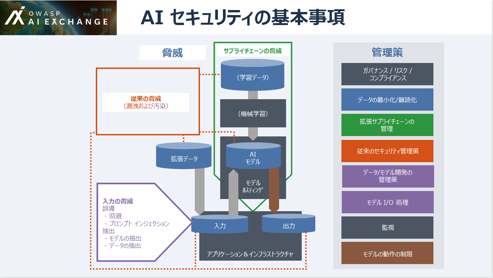
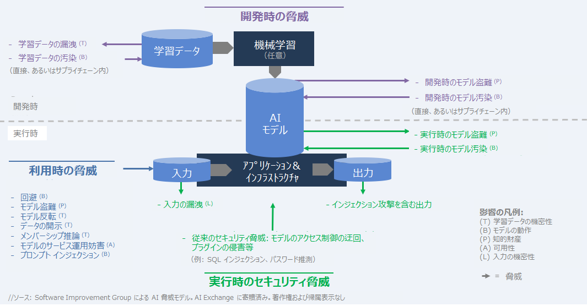
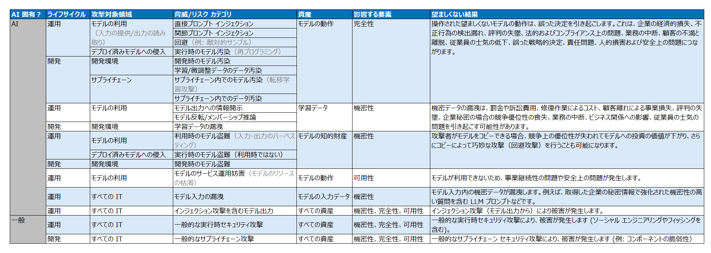
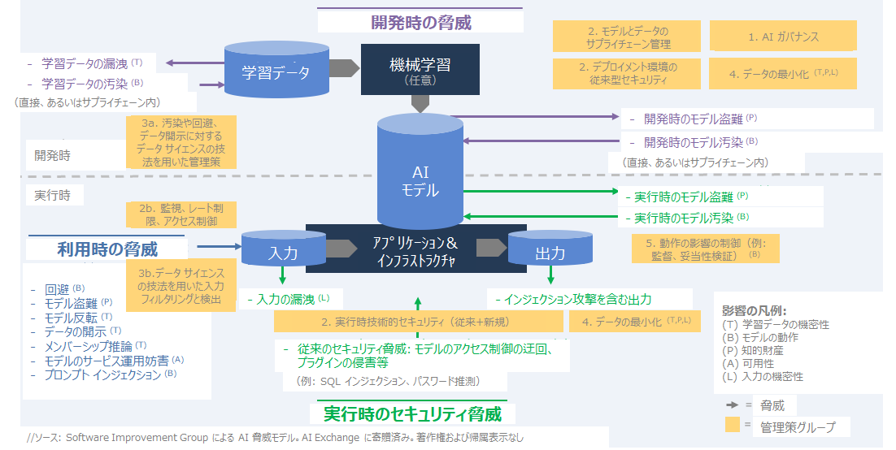

# AI Exchange について

## 要約

AI セキュリティとプライバシーに関する包括的なリソースへようこそ。ここには、AI とデータ中心システムを脅威から保護するための実践的なアドバイスと参考資料が 300 ページ以上掲載されています。ここで言う AI とは、分析 AI、識別 AI、生成 AI、そしてヒューリスティック システムといったあらゆる AI を指します。このコンテンツは実務家にとって重要なブックマークとして機能し、公式の標準化パートナーシップを通じて ISO/IEC や AI 法などの国際標準に積極的かつ大きく貢献しています。主要機関や標準化団体との幅広い連携を通じて、この Exchange（交換の場） は AI セキュリティとプライバシーに関するコンセンサスを形成しています。

## 詳細

OWASP AI Exchange は、AI およびデータ中心システムのセキュリティとプライバシーに関する世界的な議論をオープン ソース化しました。これは、AI の脅威、管理策、および関連するベスト プラクティスに関する包括的なフレームワークを提供することで、AI セキュリティとプライバシーの標準策定を推進することを目的とした、オープンで協力的な OWASP のフラッグシップ プロジェクトです。独自の公式リエゾン パートナーシップを通じて、このコンテンツは、EU AI 法（70 ページ）、ISO/IEC 27090（AI セキュリティ、70 ページ）、ISO/IEC 27091（AI プライバシー）、そして [OpenCRE](https://opencre.org/) の標準規格に反映されています。OpenCRE は現在、セキュリティ チャットボットである [OpenCRE-Chat](https://opencre.org/chatbot) を通じてAI Exchange コンテンツを提供する準備を進めています。

データ中心システムは、AI システムと、AI モデルを持たない「ビッグデータ」システム（データウェア ハウス、BI、レポート、ビッグ データなど）に分けられます。AI Exchange における脅威や対策の多くは、これらのシステムにも関連しています。データ汚染、データ サプライチェーン管理、データ パイプライン セキュリティなどです。

ここでのセキュリティとは、不正アクセス、不正利用、不正開示、妨害、改ざん、破壊を防ぐことを意味します。改ざんには、AI モデルの挙動を望ましくない方法で操作することも含まれます。

私たちの**使命**は、AI およびデータ中心システムのセキュリティとプライバシーの実務家にとって頼りになるリソースとなり、連携を促進し、イニシアチブ間の連携を促進することです。これにより、誰もが洞察を見つけ、共有できる、安全でオープン、かつ独立した場を提供します。[LinkedIn の AI Exchange](https://www.linkedin.com/company/owasp-ai-exchange/) をフォローしてください。

## 仕組み

AI Exchange は [owaspai.org](https://owaspai.org/) に掲載されており、[GitHub リポジトリ](https://github.com/OWASP/www-project-ai-security-and-privacy-guide/tree/main/content/ai_exchange/content)を使用して編集されています（「GitHub で編集」のリンクを参照してください）。AI Exchange は、AI セキュリティとプライバシーに関する専門知識を世界中で共有するための**オープン ソースの生きた出版物**です。「コンテンツ」の下に複数のセクションがあり、それぞれがこのウェブサイト上の 1 つのページで構成されている、1 つの一貫性のあるリソースとして構成されています。

この資料は、オープン ソースの継続的デリバリーを通じて常に進化しています。執筆グループは、厳選された 70 名以上の専門家（研究者、実務家、ベンダー、データ サイエンティストなど）で構成されており、コミュニティの他の方々からの意見提供も歓迎します。[貢献ページ](https://owaspai.org/contribute)を参照してください。

AI セキュリティ コミュニティによる [OWASP AI Exchange](https://owaspai.org/) は [CC0 1.0](http://creativecommons.org/publicdomain/zero/1.0?ref=chooser-v1) ライセンスで提供されています。つまり、著作権表示や帰属表示なしで、どの部分も自由に使用できます。可能であれば、読者がより多くの情報を見つけられるように、OWASP AI Exchange のクレジットやリンクを記載していただけると幸いです。

## 想定される対象者

この AI Exchange は、セキュリティ、プライバシー、エンジニアリング、テスト、ガバナンスの実務担当者、そして組織内のエンド ユーザー、つまり AI システムのセキュリティとプライバシーに関心のあるすべての方を対象としています。資料へのアクセスを可能な限り容易にすることを目指しています。[リスク分析セクション](https://owaspai.org/goto/riskanalysis/)を利用することで、AI 医療機器を設計している大手機器メーカーでも、人事目的でチャットボットを活用している小規模な旅行代理店でも、それぞれの状況において重要な問題を迅速に絞り込むことができます。

## 歴史

AI Exchangeは、セキュリティ標準の架け橋となる人物であり、[Software Improvement Group](https://www.softwareimprovementgroup.com/) の最高 AI 責任者であり、AI とセキュリティの分野で 33 年の経験を持つ [Rob van der Veer](https://www.linkedin.com/in/robvanderveer/) 氏によって 2022 年に設立されました。Rob 氏は AI ライフサイクルに関する ISO/IEC 5338 の主執筆者であり、OpenCRE の創設者でもあります。現在は、CEN/CENELEC において ISO/IEC 27090、ISO/IEC 27091、そして EU AI 法に携わっており、EU 加盟国から共同編集者に選出されています。

このプロジェクトは 2022 年 10 月に「AI セキュリティおよびプライバシー ガイド」としてスタートし、1 年後にはグローバルな連携を強調するため「AI Exchange」に名称を変更しました。2025 年 3 月には、AI Exchange は[「生成 AI セキュリティ プロジェクト」](https://genai.owasp.org/)と共に、その重要性から「OWASP フラッグシップ プロジェクト」の地位を授与されました。

## （中略）

## 目次

- AI セキュリティの概観
	- AI Exchange について
	- AI の整理
	- 本書の使い方
	- 基本事項
	- 脅威
		- ハイライト: 脅威マトリックス
	- 管理策
		- ハイライト: 脅威と管理策の周期表
	- リスク分析
	- その他の事項
- 脅威と管理策の詳細：
	- 1. 一般的な管理策
		- 1.1 ガバナンスの管理策
		- 1.2 データの制限
		- 1.3 望ましくない動作の制限
	- 2. 利用に通じた脅威と管理策
	- 3. 開発時の脅威と管理策
	- 4. ランタイム アプリケーション セキュリティの脅威と管理策
- AI セキュリティ テスト
- AI プライバシー
- 参考情報
- 索引

## AI セキュリティの整理方法

人工知能（AI）は大きな可能性をもたらす一方で、セキュリティ上の脅威を含む新たなリスクももたらします。そのため、AI アプリケーションを活用する際には、潜在的な脅威とその管理策を明確に理解することが不可欠です。

AI セキュリティを組織として組織化するための 5 つのステップ (G.U.A.R.D) は、以下のとおりです。

- **統治 (Govern)**
	コンプライアンスの整備を含む AI ガバナンスを実施します。責任分担を合意し、現状を把握し、ポリシーや教育などを実施します。
- **理解 (Understand)**
	エンジニアとセキュリティ担当者が、関連する AI セキュリティの脅威と、貴社またはサプライヤーが適用する必要がある対応するプロセス管理策および技術的管理策について理解していることを確実にします。
- **適応 (Adapt)**
	- セキュリティ慣行を適応させ、本書に記載されている AI セキュリティ資産、脅威、および管理策を含めます。
	- 脅威モデリングを適応させ、AI セキュリティの脅威モデルのアプローチを含め、すべてのエンジニアが参加するチーム横断的な脅威モデリングを実施します。
	- テストを適応させ、AI 固有のセキュリティ テストを含めます。
	- サプライチェーン管理策を適応させ、データとモデルの管理を含め、サプライヤーがセキュリティに配慮していることを確実にします。
	- AI システムを開発する場合（自社でモデル学習をしない場合でも）、ソフトウェア開発慣行とセキュア開発プログラムを適応させ、AI エンジニアリング活動を含めます。
- **削減 (Reduce)**
	機密データを最小限に抑えるか難読化し、望ましくない動作の影響を制限（権限管理、ガードレール、人による監視など）することで、潜在的な影響を軽減します。基本的には、マーフィーの法則を適用します。
- **実証 (Demonstrate)**
	透明性、文書化、コミュニケーションを通じて、責任ある AI セキュリティの証拠を示します。経営陣、規制当局、そして顧客に対し、AI システムが適切に管理され、適用された防護策が意図したとおりに機能していることを証明します。

最後に、AI システムを構築する前によく考えてください。AI のセキュリティ確保は、非 AI システムのセキュリティ確保よりも一般的に困難です。まず、AI は比較的新しい技術であることに加え、あらゆるデータ駆動型テクノロジーには一定の不確実性が存在するからです。例えば、LLM の場合、私たちは自然言語の流動性を扱っています。LLM は、基本的に、不明確なポリシー セットを有する不安定で文書化されていないインターフェースを提供します。つまり、AI に適用されるセキュリティ管理策は、他のソフトウェアで慣れ親しんでいるようなセキュリティ特性を提供できないことがよくあります。解決しようとしている問題に対して、AI が適切なテクノロジーの選択肢であるかどうかを検討してください。不要な AI コンポーネントを削除することで、AI 関連のリスクをすべて排除できます。

## 本書の使用方法

AI Exchange は、AI システムのセキュリティとプライバシーに関する包括的なリソースです。このウェブサイトでは、脅威、対策、ガイドライン、テスト、参考資料など、複数のページに分かれて掲載されています。

### ニーズに応じた開始方法

- **AI Exchange について詳しく知りたい**:
	[AI Exchange について](https://owaspai.org/goto/about/)を参照してください。
- **組織として AI セキュリティを開始したい**:
	組織として開始するための重要な手順については、[AI セキュリティの整理方法](https://owaspai.org/goto/organize/)を参照してください。
- **個人として AI セキュリティを開始したい**:
	脅威と管理策について詳しくは、以下の「学習/検索したい」を参照してください。または、[参考情報セクション](https://owaspai.org/goto/references/)にある大きな表でトレーニング資料を参照してください。
- **システムのセキュリティを確保したい**:
	**AI システムのセキュリティを確保**したい場合は、[リスク分析](https://owaspai.org/goto/riskanalysis/)から始めましょう。いくつかの質問に答えることで、該当する脅威が明らかになります。そして、それらの脅威をクリックすると、確認または実装すべき管理策（対抗策）が見つかります。
- **学習/検索したい**:
	- AI セキュリティの特長に関する主要な洞察をまとめた短い記事については、[AI Exchange の基本事項](https://owaspai.org/goto/essentials/)を参照してください。
	- Exchange のコンテンツに基づいて、AI に AI セキュリティ/プライバシーに関する質問をしてください。質問先は[こちら](https://notebooklm.google.com/notebook/75840a00-78f8-454d-ad4d-9ac27ae4cf48)（Google アカウントが必要です）。
	- すべての**脅威**の概観とさまざまな角度からの議論を確認するには、[AI 脅威モデル](https://owaspai.org/goto/threatsoverview/)または [AI セキュリティ マトリックス](https://owaspai.org/goto/aisecuritymatrix)を参照してください。保護する必要がある脅威がわかっている場合は、選択した脅威の概要でその脅威を見つけ、クリックして詳細情報と保護方法を入手してください。
	- 特定の脅威への対処方法を確認するには、[管理策の概観](https://owaspai.org/goto/controlsoverview/)または[周期表](https://owaspai.org/goto/periodictable/)で適切な**管理策**を見つけてください。
	- さまざまなデプロイメント モデルに適用する管理策を理解するには、[既製モデルのセクション](https://owaspai.org/goto/readymademodel/)を参照してください。
	- AI システムの**プライバシー**については、[プライバシーのセクション](https://owaspai.org/goto/aiprivacy/)を参照してください。
	- エージェント型 AI の側面は、すべてのコンテンツでカバーされており、[ここ](https://owaspai.org/goto/agenticaithreats/)に特定のセクションがあります。
	- 特定のトピックを検索するには、検索機能または[索引](https://owaspai.org/goto/index/)を使用してください。
	- 詳細情報やトレーニング資料をお探しの場合は、[参考情報](https://owaspai.org/goto/references/)を参照してください。
- **テストしたい**:
	ツールを使用して AI システムのセキュリティをテストする場合は、[テストに関するページ](https://owaspai.org/goto/testing/)にアクセスしてください。

AI Exchange は、ヒューリスティック人工知能（例: エキスパート システム）と機械学習の両方を網羅しています。つまり、AI システムとは、例えば大規模言語モデル、線形回帰関数、ルールベース システム、統計に基づくルックアップ テーブルなどを指します。本書全体を通して、どのような脅威と管理策が、いつ、どのような役割を果たすのかを明確に示しています。

### 構造

メイン ページでは、大まかな構造を確認できます。画面が大きい場合は、左側のサイドバーにページ構造が、右側に現在のページ内の構造が表示されます。画面が小さい場合は、メニューからこれらの構造を確認できます。また、目次には最も重要なトピックをまとめたセクションがあります。

メインの構造は以下のページで構成されています。
- (0) [AIセキュリティの概観](https://owaspai.org/docs/ai_security_overview) - このページには、AI セキュリティの概観と様々なトピックに関する議論が含まれています。 
- (1) [AI ガバナンスなどの一般的な管理策](https://owaspai.org/goto/generalcontrols/)
- (2) [利用を通じた脅威（回避攻撃など）](https://owaspai.org/goto/threatsuse/)
- (3) [開発時の脅威（データ汚染など）](https://owaspai.org/goto/developmenttime/)
- (4) [実行時のセキュリティ脅威（セキュリティが確保されていない出力など）](https://owaspai.org/goto/runtimeappsec/)
- (5) [AI セキュリティテスト](https://owaspai.org/goto/testing/)
- (6) [AI プライバシー](https://owaspai.org/goto/aiprivacy)
- (7) [参考情報](https://owaspai.org/goto/references/)

このページ（AI セキュリティの概観）では、以下のトピックについて引き続き議論します。

- 脅威の高レベルの概観
- 脅威と管理策の様々な概観: マトリックス、周期表、ナビゲーター
- 関連する脅威と管理策を選択するためのリスク分析
- その他の様々なトピック: ヒューリスティック システム、責任ある AI、生成 AI、NCSC/CISA ガイドライン、著作権

## AI セキュリティの基本事項

以降のセクションでは、AI セキュリティの脅威とそれに対応する管理策について解説します。AI セキュリティの全体像を理解するための重要なポイントを以下に示します。AI システムでは何が異なるのでしょうか？

この概観の作成には、多くの専門家や組織が貢献しました。SANS Institute との緊密な連携もその一つです。SANS と AI Exchange は、専門知識の共有と幅広い教育支援を目的とした継続的な連携の一環として、SANS の Critical AI Security Guidelines への準拠を確保しています。

### 新規の脅威（概観は[ここ](https://owaspai.org/goto/threatsoverview/)）

- **モデルへの入力の脅威**:
	- **回避**: データを巧妙に細工して誤った判断を強いることでモデルを誤導します。
	- **プロンプト インジェクション**: 動作を操作するための指示を巧妙に細工してモデルを誤導します。
	- **モデルからの抽出**: 学習データ、拡張データ、または入力
	- モデルへのクエリによる**モデルの抽出**
- 破損した外部**データ**、**モデル**、および**モデル ホスティング**を提供する**新規サプライヤー**
- 従来の脅威を伴う**新たな AI 資産**（とりわけ、以下）:
	- 学習データ/拡張データ（データの変更によりモデルの挙動を操作する - **データ汚染**）
	- モデル（**モデル盗難**または**モデル汚染**）
	- 入力（**漏洩**）
	- 出力（**インジェクション攻撃**を含む）

### 新規の管理策（概観は[ここ](https://owaspai.org/goto/controlsoverview//)）

- 汚染攻撃やモデル入力攻撃への管理策として、従来の対策に加え、**AI 開発特有の管理策**を適用します。このカテゴリは、**データ/モデル エンジニアリング**と、疑わしい入力や出力をフィルタリング、停止、またはアラート通知するための**モデル I/O 処理**に分類されます。これは通常、数学、統計学、言語学、機械学習の要素を持つデータ サイエンティストなどの AI 専門家の領域です。
- モデルのパフォーマンスと推論の[監視](https://owaspai.org/goto/monitoruse/) - モデル I/O 処理を拡張し、AI システムの一般的な使用状況を把握します。
- **影響を限定する管理策**（モデルの信頼性がゼロであるため、モデルが誤解を招く、間違いを起こす、またはデータ漏洩する可能性があると想定します）:
	- [機密データの最小化または難読化](https://owaspai.org/docs/1_general_controls/#12-general-controls-for-sensitive-data-limitation)
	- [モデルの動作の制限](https://owaspai.org/goto/limitunwanted/)（[監督](https://owaspai.org/goto/oversight/)、[最小モデル権限](https://owaspai.org/goto/leastmodelprivilege/)、[モデルの整合](https://owaspai.org/goto/modelalignment)など）

(*) 注: 類似モデル（またはコピー）を持つ攻撃者は、通常、気付かれずに、効率的に誤解を招く入力を作成できます。

## 脅威の概観

### 脅威の範囲

AI Exchange では、AI 固有の脅威、つまり AI 資産（モデル パラメータなど、詳細は [#SEC PROGRAM](https://owaspai.org/goto/secprogram/) を参照）への脅威に焦点を当てています。他の資産への脅威は、ユーザー データベースの保護など、他の多くのリソースで既にカバーされています。AI システムは IT システムであるため、さまざまなセキュリティ脅威にさらされています。従って、AI システムを保護する際には、AI セキュリティ＝AI 固有の資産への脅威（AI Exchange）＋その他の資産（その他のリソース）への脅威というように、AI Exchange を既存のセキュリティプログラムの拡張として捉える必要があります。

### 脅威モデル

私たちは、脅威を 3 つの種類に分類しています。

- 開発時（データの取得と準備、そしてモデルの学習/取得時）における脅威。例: データ汚染
- モデルの使用時（推論を介して。入力を提供して出力を取得）による脅威 。例: プロンプト インジェクションまたは回避
- 実行時（運用中 - 推論を介さない）におけるシステムへのその他の脅威。例: モデル入力の窃取

OWASP Exchange では、AI において、攻撃者の 3 つの目的（開示、欺瞞、妨害）に対応する 6 つの影響を概説しています。

- 開示: 学習/テスト データの機密性が損なわれます。
- 開示: モデルの知的財産（*モデルのパラメータ*、またはそれらを導出したプロセスとデータ）の機密性が損なわれます。
- 開示: 入力データの機密性が損なわれます。
- 欺瞞: モデル動作の完全性が損なわれます（モデルが操作されて望ましくない動作をし、結果としてユーザーを欺きます）。
- 妨害: モデルの可用性が損なわれます（モデルが動作しないか、望ましくない動作をします - ユーザーを欺くことはありませんが、通常の運用を妨害します）。
- 妨害/開示: AI 固有ではない資産の機密性、完全性、および可用性

これらの影響をもたらす脅威は、それぞれ異なる攻撃対象領域を利用します。例えば、学習データの機密性は、開発中のデータベースへのハッキングによって侵害される可能性がありますが、メンバーシップ推論攻撃によって漏洩される可能性もあります。メンバーシップ推論攻撃では、特定の人物のデータをモデルに入力し、モデル出力の詳細を確認するだけで、その人物が学習データに含まれているかどうかを判断できます。

下図では、脅威を矢印で示しています。それぞれの脅威には特定の影響があり、影響の凡例に対応する文字で示されています。管理策の概要セクションには、管理策のグループが追加されたこの図が含まれています。

### エージェント型 AI に対する脅威

エージェント型 AIでは、AI システムは単に出力を提示するだけでなく、アクションを実行できます。場合によっては、自律的に動作したり、他のエージェントと通信したりすることもできます。重要な注意点: これらは依然としてソフトウェア システムおよび AI システムであるため、AI Exchange のすべてが当てはまりますが、いくつか注意点があります。

エージェント型 AI の一例として、暖房を制御したり、メールを送信したり、さらには他のアシスタントを会話に招待したりできる音声アシスタントのセットが挙げられます。これは非常に強力ですが、何千通ものメールを送信する前に、事前に確認を求める必要があるでしょう。

エージェント型 AI には、4 つの典型的な特性があります。

- アクション: エージェントは、単にチャットするだけでなく、メールの送信などの機能を実行します。そのため、[最小モデル権限](https://owaspai.org/goto/leastmodelprivilege/)が重要な管理策となります。
- 自律性: エージェントは、互いにトリガーし合い、自律的な応答を可能にします（例: スクリプトがメールを受信し、生成 AI のフォローアップをトリガーする）。そのため、[監督](https://owaspai.org/goto/oversight/)が重要になります。また、自律エージェントの状態と計画が保存される作業用記憶は攻撃ベクトルとなります。
- 複雑性: エージェントの行動は創発的です。
- マルチ システム: 多くの場合、複数のシステムとインターフェースが混在する環境で動作します。そのため、開発者は、AI へのアクセス制御に関する責任を指示を用いて割り当てる傾向があり、[プロンプト インジェクション](https://owaspai.org/goto/promptinjection/)による操作の可能性が高まります。

これはセキュリティにとって何を意味するのでしょうか？

- 幻覚やプロンプト インジェクションは、命令を変更したり、権限を昇格させたりする可能性があります。重要な管理策は、多層防御と影響範囲の制御（[影響の限定](https://owaspai.org/goto/limitunwanted/)）です。アクセス制御の責任を生成 AI モデル／エージェントに委ねるべきではありません。アーキテクチャに組み込む必要があります。
- エージェント型 AI は、システム コンポーネント間の相互接続性とデータフローを変更するため、信頼境界やその他の確立されたセキュリティ対策に関する既存の前提を見直す必要があるかもしれません。
- 独自の権限セットを持ってデプロイされたエージェントは、混乱した代理になる可能性があるため、権限昇格のベクトルにつながります。
- 攻撃対象領域は広く、潜在的な影響を過小評価してはなりません。
- そのため、モデル間通信（MCP など）のセキュリティ、[追跡可能性](https://owaspai.org/goto/monitoruse/)、記憶の完全性の保護、[プロンプト インジェクションの防御](https://owaspai.org/goto/promptinjectionm/)、[ルールベース／人間による監督](https://owaspai.org/goto/oversight/)、[最小モデル権限](https://owaspai.org/goto/leastmodelprivilege/)といった既知の管理策がさらに重要になります。[管理策の概観のセクション](https://owaspai.org/goto/controlsoverview/)を参照してください。

エージェント型 AI で機密データを漏洩させるには、3 つの要素（*lethal trifecta （成功に必要で致命的な 3 要素）*とも呼ばれます）が必要です。

- データ: 必要なアクセス権を持つユーザーのセッションのどこかの時点で LLM に侵入したデータを攻撃者が制御し、[間接プロンプト インジェクション](https://owaspai.org/goto/indirectpromptinjection/)を実行できること。
- アクセス：LLM または接続されたエージェントが機密データへアクセス可能であること。
- 送信: LLM または接続されたエージェントから攻撃者へのデータ送信を開始できること。

詳細については、[Simon Willison 氏の優れた研究](https://simonwillison.net/2025/Jun/16/the-lethal-trifecta/)を参照してください。また、エージェント型 AI ソフトウェア開発の事例については、[こちら](https://www.darkreading.com/application-security/github-copilot-camoleak-ai-attack-exfils-data)と[こちら](https://ainativedev.io/news/malicious-github-issue-ai-agent-leak)を参照してください。

詳細情報へのリンク:

- エージェント型 AI の脅威に関する詳細については、[GenAI Security Project の「エージェント型 AI の脅威と軽減策」](https://genai.owasp.org/resource/agentic-ai-threats-and-mitigations/)を参照してください。
- エージェント型 AI に関するより一般的な議論については、[Chip Huyen 氏によるこの記事](https://huyenchip.com/2025/01/07/agents.html)を参照してください。
- [テストのセクション](https://owaspai.org/goto/testing/)では、エージェント型 AI レッドチーム演習について詳しく説明し、CSA と Exchange の共同作業である「エージェント型 AI レッドチーム演習ガイド」へのリンクを提供しています。
- [OWASP Agentic AI security top 10](https://genai.owasp.org/resource/owasp-top-10-for-agentic-applications-for-2026/)と [Rock 氏のブログ](https://www.rockcybermusings.com/p/owasp-top-10-agentic-applications-security-guide)

### AI セキュリティ マトリックス

以下の AI セキュリティ マトリックスには、主な脅威とリスクが種類別と影響度順に表示されています。

[周期表](https://owaspai.org/goto/periodictable/)に基づいたクリック可能なバージョンは、以下のとおりです。

<table>
<tr>
	<th width="30%">資産と影響</th>
	<th width="35%">攻撃対象領域とライフサイクル</th>
	<th width="35%">脅威/リスクのカテゴリ</th>
</tr>
<tr>
	<td rowspan="7">モデルの動作の完全性</td>
	<td rowspan="3">実行時 - モデルの利用（入力の提供/出力の読み取り）</td>
	<td><a href="https://owaspai.org/goto/directpromptinjection/">直接プロンプト インジェクション</a></td>
</tr>
<tr>
	<td><a href="https://owaspai.org/goto/indirectpromptinjection/">間接プロンプト インジェクション</a></td>
</tr>
<tr>
	<td><a href="https://owaspai.org/goto/evasion/">回避</a>（例: 敵対的サンプル）</td>
</tr>
<tr>
	<td>実行時 - デプロイ済みモデルへの侵入</td>
	<td><a href="https://owaspai.org/goto/runtimemodelpoison/">実行時のモデル汚染</a>（再プログラミング）</td>
</tr>
<tr>
	<td rowspan="2">開発 - 開発環境</td>
	<td><a href="https://owaspai.org/goto/devmodelpoison/">開発時のモデル汚染</a></td>
</tr>
<tr>
	<td><a href="https://owaspai.org/goto/datapoison/">学習/微調整データのデータ汚染</a></td>
</tr>
<tr>
	<td>開発 - サプライチェーン</td>
	<td><a href="https://owaspai.org/goto/supplymodelpoison/">サプライチェーン内でのモデル汚染</a></td>
</tr>
<tr>
	<td rowspan="3">学習データの機密性</td>
	<td rowspan="2">実行時 - モデルの利用</td>
	<td><a href="https://owaspai.org/goto/disclosureuseoutput/">モデルによる機密情報の出力</a></td>
</tr>
<tr>
	<td><a href="https://owaspai.org/goto/modelinversionandmembership/">モデル反転/メンバーシップ推論</a></td>
</tr>
<tr>
	<td>開発 - 開発環境</td>
	<td><a href="https://owaspai.org/goto/devmodelleak/">開発時のデータ漏洩</a></td>
</tr>
<tr>
	<td rowspan="3">モデルの機密性</td>
	<td>実行時 - モデルの利用</td>
	<td><a href="https://owaspai.org/goto/modeltheftuse/">利用時のモデル盗難</a>（入力・出力のハーベスティング）</td>
</tr>
<tr>
	<td>デプロイ済みモデルへの侵入</td>
	<td><a href="https://owaspai.org/goto/runtimemodeltheft/">実行時の直接モデル盗難</a></td>
</tr>
<tr>
	<td>開発 - 開発環境</td>
	<td><a href="https://owaspai.org/goto/devmodelleak/">開発時のモデル盗難</a></td>
</tr>
<tr>
	<td>モデルの動作の可用性</td>
	<td>モデルの利用</td>
	<td><a href="https://owaspai.org/goto/airesourceexhaustion/">AI リソースの枯渇</a></td>
</tr>
<tr>
	<td>モデルの入力データの機密性</td>
	<td>実行時 - すべての IT</td>
	<td><a href="https://owaspai.org/goto/leakinput/">機密入力データの漏洩</a></td>
</tr>
<tr>
	<td>すべての資産、機密性・完全性・可用性</td>
	<td>実行時 - すべての IT</td>
	<td><a href="https://owaspai.org/goto/insecureoutput/">インジェクションを含むモデル出力</a></td>
</tr>
<tr>
	<td>すべての資産、機密性・完全性・可用性</td>
	<td>実行時 - すべての IT</td>
	<td>従来の資産に対する従来の実行時セキュリティ攻撃</td>
</tr>
<tr>
	<td>すべての資産、機密性・完全性・可用性</td>
	<td>実行時 - すべての IT</td>
	<td>従来のサプライチェーンに対する従来の攻撃</td>
</tr>
</table>
	

## 管理策の概観

**管理策の慎重な選択と実装**

AI Exchange では、攻撃のリスクを軽減するための管理策を多数リストアップしています。これらの管理策の多くは実装コストが高く、モデルの精度や正常な動作に影響を与える可能性のある他の AI 特性とのトレードオフの影響を受けることに注意してください。特に、学習プロセスやデータ分布の変更を伴う管理策は、意図しない副作用をもたらす可能性があるため、慎重に検討し、導入する必要があります。

**管理策の範囲**

AI Exchange では、AI 固有の脅威とそれに対応する管理策に焦点を当てています。管理策の中には、AI 固有のもの（例: 学習データセットへのノイズの追加）とそうでないもの（例: 学習データベースの暗号化）があります。後者を「従来型管理策」と呼びます。従来型管理策の詳細は他の場所（例えば、[OpenCRE](https://opencre.org/) を参照）で規定されているため、AI Exchange では AI 固有の管理策の詳細に焦点を当てています。これらの管理策の AI 固有の側面については、Trusted Execution Environment（TES）を使用してモデル パラメータの保護を実装できることなどの例を提供しています。

### 管理策つき脅威モデル - 一般

以下の図は、AI Exchange の管理策をグループに分け、これらのグループを対応する脅威とともに適切なライフサイクルに配置しています。

管理策のグループは、AI セキュリティへの対応方法を要約したものです（管理策は大文字で表記されています）。

- **AI ガバナンス** (1): AI リスクへの対応だけでなく、ライフサイクル全体にわたって AI に関する考慮事項を組み込むことで、情報セキュリティおよびソフトウェア開発ライフサイクル プロセスに AI を包括的に統合します。
	- [AI PROGRAM （AI プログラム）](https://owaspai.org/docs/1_general_controls/#aiprogram)
	- [SEC PROGRAM （セキュリティ プログラム）](https://owaspai.org/docs/1_general_controls/#secprogram)
	- [DEV PROGRAM （開発プログラム）](https://owaspai.org/docs/1_general_controls/#devprogram)
	- [SECDEV PROGRAM （セキュア開発プログラム）](https://owaspai.org/docs/1_general_controls/#secdevprogram)
	- [CHECK COMPLIANCE （コンプライアンス チェック）](https://owaspai.org/docs/1_general_controls/#checkcompliance)
	- [SEC EDUCATE （セキュリティ教育）](https://owaspai.org/docs/1_general_controls/#seceducate)
- データとモデルのガバナンスを活用した**サプライチェーン管理の拡張** (2): 
	- [SUPPLY CHAIN MANAGE （サプライチェーン管理）](https://owaspai.org/docs/3_development_time_threats/#supplychainmanage)
- **データの最小化／難読化** (4):  保存時および転送中のデータ量を制限します。また、データの保存時間、開発時間、実行時間も制限します。
	- [DATA MINIMIZE （データの最小化）](https://owaspai.org/docs/1_general_controls/#dataminimize)
	- [ALLOWED DATA （許可済みのデータ）](https://owaspai.org/docs/1_general_controls/#alloweddata)
	- [SHORT RETAIN （短期間の保持）](https://owaspai.org/docs/1_general_controls/#shortretain)
	- [OBFUSCATE TRAINING DATA （学習データの難読化）](https://owaspai.org/docs/1_general_controls/#obfuscatetrainingdata)
- AI システムが IT システムであることによる従来の**技術的セキュリティ管理策** (2) の適用:
	- 標準的な従来のセキュリティ管理策（例：15408、ASVS、OpenCRE、ISO 27001 附属書 A、NIST SP800-53）を AI システム全体に適用し、AI 固有の新しい資産にも適用します。
		- 開発時: モデルとデータの保存、モデルとデータのサプライチェーン、データ サイエンスの文書化:
			- [DEV SECURITY （開発時のセキュリティ）](https://owaspai.org/docs/3_development_time_threats/#devsecurity)
			- [SEGREGATE DATA（データの分離）](https://owaspai.org/docs/3_development_time_threats/#segregatedata)
			- [DISCRETE（技術的詳細へのアクセスの最小化）](https://owaspai.org/docs/1_general_controls/#discrete)
		- 実行時: モデルの保存、モデルの利用、プラグイン、およびモデルの入出力:
			- [RUNTIME MODEL INTEGRITY （実行時のモデルの完全性）](https://owaspai.org/goto/runtimemodelintegrity/)
			- [RUNTIME MODEL IO INTEGRITY（実行時のモデル入出力の完全性）](https://owaspai.org/goto/runtimemodeliointegrity/)
			- [RUNTIME MODEL CONFIDENTIALITY（実行時のモデルの機密性）](https://owaspai.org/goto/runtimemodelconfidentiality/)
			- [MODEL INPUT CONFIDENTIALITY（モデル入力の機密性）](https://owaspai.org/goto/modelinputconfidentiality/)
			- [ENCODE MODEL OUTPUT（モデル出力のエンコード）](https://owaspai.org/goto/encodemodeloutput/)
			- [LIMIT RESOURCES（リソースの制限）](https://owaspai.org/goto/limitresources/)
	-  AI に適したものへをすることを目的とした従来の IT セキュリティ管理策の**適応**（例: 監視すべき利用パターンの特定）:
		- [MONITOR USE（利用の監視）](https://owaspai.org/docs/2_threats_through_use/#monitor-use)
		- [MODEL ACCESS CONTROL（モデルへのアクセス制御）](https://owaspai.org/docs/2_threats_through_use/#model-access-control)
		- [RATE LIMIT（レート制限）](https://owaspai.org/goto/ratelimit/)
	- **新しい** IT セキュリティ管理策の導入:
		- [CONF COMPUTE（機密コンピューティング）](https://owaspai.org/goto/confcompute/)
		- [MODEL OBFUSCATION （モデルの難読化）](https://owaspai.org/goto/modelobfuscation/)
		- [INPUT SEGREGATION（入力の分離）](https://owaspai.org/goto/inputsegregation/)
- **AI 開発のセキュリティ管理策**の適用 (3):
	- 開発の一環としてデータ/モデル エンジニアリング管理策 (3a) を適用します。
		- [FEDERATED LEARNING （連合学習）](https://owaspai.org/goto/federatedlearning/)
		- [CONTINUOUS VALIDATION （継続的な検証）](https://owaspai.org/goto/continuousvalidation/)
		- [UNWANTED BIAS TESTING （望ましくないバイアスのテスト）](https://owaspai.org/goto/unwantedbiastesting/)
		- [EVASION ROBUST MODEL （回避堅牢型のモデル）](https://owaspai.org/goto/evasionrobustmodel/)
		- [POISON ROBUST MODEL （汚染堅牢型のモデル）](https://owaspai.org/goto/poisonrobustmodel/)
		- [TRAIN ADVERSARIAL （敵対的学習）](https://owaspai.org/goto/trainadversarial/)
		- [TRAIN DATA DISTORTION （学習データの歪み）](https://owaspai.org/goto/traindatadistortion/)
		- [ADVERSARIAL ROBUST DISTILLATION （敵対的堅牢型の蒸留）](https://owaspai.org/goto/adversarialrobustdistillation/)
		- [MODEL ENSEMBLE （モデル アンサンブル）](https://owaspai.org/goto/modelensemble/)
		- [MORE TRAINDATA （学習データの増加）](https://owaspai.org/goto/moretraindata/)
		- [SMALL MODEL （小型のモデル）](https://owaspai.org/goto/smallmodel/)
		- [DATA QUALITY CONTROL （データの品質の制御）](https://owaspai.org/goto/dataqualitycontrol/)
		- [MODEL ALIGNMENT （モデルのアライメント（整合））](https://owaspai.org/goto/modelalignment/)
	- 攻撃をフィルターし検出することを目的とした実行時のモデル I/O 処理 (3b):
		- [ANOMALOUS INPUT HANDLING （異常な入力の処理）](https://owaspai.org/goto/anomalousinputhandling/)
		- [EVASION INPUT HANDLING （回避目的の入力の処理）](https://owaspai.org/goto/evasioninputhandling/)
		- [UNWANTED INPUT SERIES HANDLING （望ましくない入力の処理）](https://owaspai.org/goto/unwantedinputserieshandling/)
		- [PROMPT INJECTION I/O HANDLING （プロンプト インジェクション I/O の処理）](https://owaspai.org/goto/promptinjectioniohandling/)
		- [DOS INPUT VALIDATION （サービス運用妨害を目的とした入力の検証）](https://owaspai.org/goto/dosinputvalidation/)
		- [INPUT DISTORTION （入力の歪み）](https://owaspai.org/goto/inputdistortion/)
		- [SENSITIVE OUTPUT HANDLING （機微な出力の処理）](https://owaspai.org/goto/sensitiveoutputhandling/)
		- [OBSCURE CONFIDENCE （信頼度の隠蔽）](https://owaspai.org/goto/obscureconfidence/)
- **モデルの動作の制限**（モデルは意図せず、あるいは操作によって望ましくない動作をする可能性があるため）(5)
	- [OVERSIGHT （監督）](https://owaspai.org/goto/oversight/)
	- [LEAST MODEL PRIVILEGE （最小モデル権限）](https://owaspai.org/goto/leastmodelprivilege/)
	- [MODEL ALIGNMENT （モデルのアライメント（整合））](https://owaspai.org/goto/modelalignment/)
	- [AI TRANSPARENCY （AI の透明性）](https://owaspai.org/goto/aitransparency/)
	- [EXPLAINABILITY （説明可能性）](https://owaspai.org/goto/explainability/)
	- [CONTINUOUS VALIDATION （継続的な検証）](https://owaspai.org/goto/continuousvalidation/)
	- [UNWANTED BIAS TESTING （望ましくないバイアスのテスト）](https://owaspai.org/goto/unwantedbiastesting/)

すべての脅威と管理策については、AI Exchange の対応する脅威セクションで詳細に検討されています。
		   
### 管理策つき脅威モデル - 既製モデル

### AI セキュリティの周期表

