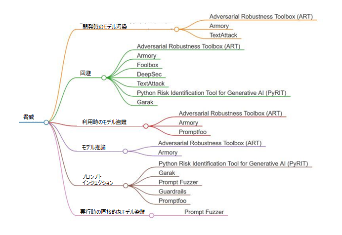

# はじめに

AI システムのセキュリティ テストは、以下の 3 つの戦略に基づいています。

- **従来のセキュリティ テスト**（*ペネトレーション テスト*など）。[セキュア ソフトウェア開発](https://owaspai.org/goto/secdevprogram/)を参照してください。
- **モデルのパフォーマンス検証**（[継続的な検証](https://owaspai.org/goto/continuousvalidation/)を参照）: モデルの意図された動作を代表する入力と出力を含む検証セットを使用して、モデルが指定された受け入れ基準に従って動作するかどうかをテストします。セキュリティに関しては、データ汚染またはモデル汚染によってモデルの動作が恒久的に変更されていないかどうかを検出します。セキュリティ以外の分野では、機能の正確性、モデルのドリフトなどをテストします。
- **AI セキュリティ テスト**（本セクション）: AI レッド チーム演習の一部であり、特定の攻撃をシミュレートすることで、AI モデルが特定の攻撃に耐えられるかどうかをテストします。

AI セキュリティ テストでは、敵対的な行動をシミュレートして、AI システムの脆弱性、弱点、リスクを明らかにします。従来の AI テストの焦点は機能とパフォーマンスですが、AI レッド チーム演習の焦点は標準的な検証を超え、意図的なストレス テスト、攻撃、安全対策の回避の試みなどが含まれます。レッド チームの焦点はセキュリティだけにとどまりませんが、本稿では主に「AI セキュリティのための AI レッド チーム」に焦点を当てます。

本セクションでは、予測 AI と生成 AI のそれぞれの性質、リスク、および適用方法が異なるため、AI レッド チームを区別します。開発時のサプライチェーンにおける脅威など、一部の脅威は両方の AI に共通する場合もありますが、それぞれの適用場面で顕在化する方法は大きく異なる場合があります。

AI レッド チーム演習への体系的なアプローチには、以下の重要なステップが含まれます。

- **目標と範囲の定義**: 目標の特定、組織、コンプライアンス、およびリスク管理要件との整合。
- **AI システムの理解**: モデル、使用事例、導入シナリオの詳細。
- **潜在的な脅威の特定**: 脅威モデリング、攻撃対象領域の特定、調査、脅威アクター。
- **攻撃シナリオの策定**: 攻撃シナリオとエッジ ケースの設計。
- **テスト実行**: 攻撃シナリオに対する手動または自動テストの実施。
- **リスク評価**: 特定された脆弱性とリスクの文書化。
- **優先順位付けとリスク軽減**: 修復のための行動計画の策定、軽減策の実施、残留リスクの算出。
- **修正の検証**: 修復後のシステムの再テスト。

AI セキュリティテストの詳細については、[OWASP AI Testing Guide](https://github.com/OWASP/www-project-ai-testing-guide) を参照してください。

# テストの対象となる脅威

資産、影響、攻撃対象領域に基づいた包括的な脅威と管理策のリストは、[AI セキュリティ基本要素表](https://owaspai.org/goto/periodictable/)として利用可能となっています。このセクションでは、AI レッド チーム演習（予測 AI および生成 AI システム）用のツールのリストを提供し、攻撃シナリオの作成、自動レッドチーム演習によるテスト実行、そして多くの場合、リスクスコアリングによるリスク評価といったステップを支援します。

リストされている各ツールは、AI システムの脅威情勢のサブセットに対応しています。以下に、考慮すべき主要な脅威をいくつか挙げます。

## 予測 AI

予測 AI システムは、入力データに基づいて予測または分類を行うように設計されています。例としては、不正検出、画像認識、レコメンデーション システムなどが挙げられます。

### 予測 AI に対する主要な脅威

- [回避攻撃](https://owaspai.org/goto/evasion/): これらの攻撃は、攻撃者がモデルを誤誘導する入力を作成し、タスクを誤って実行させる場合に発生します。
- [モデル盗難](https://owaspai.org/goto/modeltheftuse/): この攻撃では、モデルのパラメータまたは機能が盗まれます。これにより、攻撃者は複製モデルを作成し、それを敵対的攻撃やその他の複合的な脅威を作成するためのオラクルとして利用できるようになります。
- [モデル汚染](https://owaspai.org/goto/modelpoison/): これは、学習フェーズ（開発フェーズ）中にデータ、データパイプライン、またはモデル学習のサプライチェーンを操作することです。攻撃者の目的は、モデルの動作を変更し、望ましくないモデルの動作を引き起こすことです。

## 生成 AI

生成 AI システムは、テキスト、画像、音声などの出力を生成します。例としては、ChatGPT のような大規模言語モデル（LLM）や、DALL-E や MidJourney のような大規模視覚モデル（LVM）が挙げられます。

### 生成 AI に対する主要な脅威

- [プロンプト インジェクション](https://owaspai.org/goto/promptinjection/): この種類の攻撃では、攻撃者はモデルに不正な指示を与え、悪意のある結果や目的を達成しようとします。
- [実行時の直接的なモデル盗難](https://owaspai.org/goto/runtimemodeltheft/): 攻撃者はモデルの一部、またはシステムプロンプトなどの重要なコンポーネントを標的とします。これにより、ガードレールを回避する高度な入力を作成できるようになります。
- [セキュアでない出力処理](https://owaspai.org/goto/insecureoutput/): 生成 AI システムは、従来のインジェクション攻撃に対して脆弱である可能性があり、出力が適切に処理されないとリスクにつながります。

各 AI パラダイムにおける主要な脅威について説明しましたが、AI レッド チーム演習の目的と範囲の定義フェーズの結果に基づき、AI Exchange ですべての脅威を参照することを強くお勧めします。

## AI セキュリティ テストに関する参考情報

- エージェント型 AI システムのテストの詳細については、CSA と AI Exchange が共同で作成した [Agentic AI red teaming guide](https://cloudsecurityalliance.org/download/artifacts/agentic-ai-red-teaming-guide) を参照してください。
- [OWASP AI Testing Guide](https://github.com/OWASP/www-project-ai-testing-guide)

# AI および 生成 AI 向けのレッド  チーム演習ツール

以下のマインド マップは、AI レッド チーム演習のためのオープン ソース ツールの概要を示しています。予測 AI 向けのレッド チーム演習と生成 AI 向けのレッド チーム演習の 2 つに分類し、ART、Armory、TextAttack、Promptfoo などの例を取り上げています。これらのツールは現時点で利用可能な機能を示したものですが、網羅的ではなく、重要度順にランク付けされているわけでもありません。今後、新たなツールや手法が登場し、この分野に統合される可能性があります。

以下の図は、AI システムにおける脅威を分類し、それらの脅威に対処するために設計された関連するオープン ソース  ツールにマッピングしています。

以下のセクションでは、予測 AI 用のツールについて説明し、その後に生成 AI 用のセクションに進みます。

## 予測 AI レッド チーム演習のためのオープン ソース ツール

このサブセクションでは、予測 AI のセキュリティ テストに使用できるツール Adversarial Robustness Toolbox (ART)、Armory、Foolbox、DeepSec、TextAttack について説明します。

### ツール名: Adversarial Robustness Toolbox (ART)

<table>
<tr>
	<th width="30%">要素</th>
	<th width="70%">詳細</th>
</tr>
<tr>
	<td>開発者/ソース</td>
	<td>IBM Research / the Linux Foundation AI & Data Foundation (LF AI & Data)</td>
</tr>
<tr>
	<td>GitHub リンク</td>
	<td><a href="https://github.com/Trusted-AI/adversarial-robustness-toolbox">https://github.com/Trusted-AI/adversarial-robustness-toolbox</a></td>
</tr>
<tr>
	<td>言語</td>
	<td>Python</td>
</tr>
<tr>
	<td>ライセンス</td>
	<td>MIT ライセンス下のオープン ソース</td>
</tr>
<tr>
	<td>軽減策の提供</td>
	<td>防止: なし、検出: あり</td>
</tr>
<tr>
	<td>API の利用</td>
	<td>可能</td>
</tr>
<tr>
	<td>人気</td>
	<td><ul><li>GitHub スター: 約 4,900 スター （2024 年現在）<li>GitHub フォーク: 約 1,200 フォーク<li>Issue 数: 約 131 件の未解決、761 件の解決済み<li>トレンド: 敵対的堅牢性のための継続的なアップデートと業界での採用により、着実に成長しています。</ul></td>
</tr>
<tr>
	<td>コミュニティ サポート</td>
	<td><ul><li>アクティブな問題: 対応力の高いチームで、通常は 1 週間以内に問題に対処します。<li>文書化: IBM の Web サイトに包括的なガイドと API 文書が用意されており、詳細かつ定期的に更新されます。<li>ディスカッション フォーラム: 主に学術的な環境で議論され、Stack Overflow や GitHub でも一部議論されています。<li>貢献者: IBM の研究者や外部の協力者を含む 100 人を超えます。</ul></td>
</tr>
<tr>
	<td>スケーラビリティ</td>
	<td><ul><li>フレームワーク サポート:すぐに使用できるサポートにより、TensorFlow、Keras、PyTorch に拡張できます。<li>大規模なデプロイメント: 医療、金融、防衛などの業界における大規模なエンタープライズ レベルのデプロイメントに対応できることが実証されています。</ul></td>
</tr>
<tr>
	<td>統合</td>
	<td><ul><li>互換性: TensorFlow、PyTorch、Keras、MXNet、Scikit-learn で動作します。</ul></td>
</tr>
</table>

#### ツールの評価

| 基準 | 評価 |
| ----- | ----- |
| 人気 | 高 |
| コミュニティ サポート | 高 |
| スケーラビリティ | 高 |
| 統合の容易さ | 高 |

#### データのモダリティ

| データのモダリティ | サポート有無 |
| ----- | ----- |
| 文章 | ✅ |
| 画像 | ✅ |
| 音声 | ✅ |
| 映像 | ✅ |
| 表形式のデータ | ✅ |

#### 機械学習タスク

| タスクの種類 | データのモダリティ | サポート有無 |
| ----- | ----- | ----- |
| 分類 | すべて（「データのモダリティ」セクションを参照） | ✅ |
| 物体検出 | コンピューター ビジョン | ✅ |
| 音声認識 | 音声 | ✅ |

#### フレームワークの適用性

| フレームワーク/ツール | カテゴリ | サポート有無 |
| ----- | ----- | ----- |
| Tensorflow | 深層学習、生成 AI | ✅ |
| Keras	| 深層学習、生成 AI | ✅ |
| PyTorch	| 深層学習、生成 AI | ✅ |
| MxNet	| 深層学習 | ✅ |
| Scikit-learn | 機械学習 | ✅ |
| XGBoost | 機械学習 | ✅ |
| LightGBM | 機械学習 | ✅ |
| CatBoost | 機械学習 | ✅ |
| GPy | 機械学習 | ✅ |

#### OWASP AI Exchange の脅威の網羅性

| 脅威 | 対応有無 |
| ----- | ----- |
| 開発時のモデル汚染 | ✅ |
| 実行時のモデル汚染 |  |
| 利用時のモデル盗難 | ✅ |
| 学習データの汚染 |  |
| 学習データの漏洩 |  |
| 実行時のモデル盗難 |  |
| 回避（敵対的な入力に対するモデルのパフォーマンスのテスト）| ✅ |
| モデル反転/メンバーシップ推論 | ✅ |
| モデルのサービス運用妨害 |  |
| 直接プロンプト インジェクション |  |
| データの開示 |  |
| モデル入力の漏洩 |  |
| 間接プロンプト インジェクション |  |
| 開発時のモデル盗難 |  |
| インジェクション攻撃を含む出力 |  |

注:

- [開発時のモデル汚染](https://owaspai.org/goto/modelpoison/): 開発中に攻撃をシミュレートして脆弱性を評価します。
- [回避](https://owaspai.org/goto/evasion/): 敵対的な入力に対するモデルのパフォーマンスをテストします。
- [利用時のモデル盗難](https://owaspai.org/goto/modeltheftuse): 利用中のモデル悪用リスクを評価します。
- [モデル推論](https://owaspai.org/goto/modelinversionandmembership/): *メンバーシップ攻撃と反転攻撃への露出を評価します*。

### ツール名: Armory

<table>
<tr>
	<th width="30%">要素</th>
	<th width="70%">詳細</th>
</tr>
<tr>
	<td>開発者/ソース</td>
	<td>MITRE Corporation</td>
</tr>
<tr>
	<td>GitHub リンク</td>
	<td><a href="https://github.com/twosixlabs/armory-libraryhttps://github.com/twosixlabs/armory">https://github.com/twosixlabs/armory-libraryhttps://github.com/twosixlabs/armory</a></td>
</tr>
<tr>
	<td>言語</td>
	<td>Python</td>
</tr>
<tr>
	<td>ライセンス</td>
	<td>MIT ライセンス下のオープン ソース</td>
</tr>
<tr>
	<td>軽減策の提供</td>
	<td>防止: なし、検出: あり</td>
</tr>
<tr>
	<td>API の利用</td>
	<td>可能</td>
</tr>
<tr>
	<td>人気</td>
	<td><ul><li>GitHub スター: 約 176 スター （2024 年現在）<li>GitHub フォーク: 約 67 フォーク<li>Issue 数: 約 59 件の未解決、733 件の解決済み、26 人の貢献者<li>トレンド: 特に防衛およびサイバーセキュリティ分野で成長しています。</ul></td>
</tr>
<tr>
	<td>コミュニティ サポート</td>
	<td><ul><li>アクティブな問題: 問題に対する迅速な対応（通常は数日から 1 週間以内に解決されます）。<li>文書化: 包括的ですが、セキュリティに重点を置いており、敵対的な攻撃と防御に関する高度なチュートリアルが含まれています。<li>ディスカッション フォーラム: GitHub での活発なディスカッション、セキュリティ固有のフォーラム（例: DARPA プロジェクト関連）への参加。<li>貢献者: 40 人以上の貢献者（ほとんどがセキュリティの専門家と研究者）</ul></td>
</tr>
<tr>
	<td>スケーラビリティ</td>
	<td><ul><li>フレームワーク サポート: TensorFlow と Keras をネイティブにサポートし、PyTorch の統合オプションもいくつか用意されています。<li>大規模なデプロイメント: 主にセキュリティ関連のデプロイメントで使用されます。セキュリティ以外のタスクのスケーラビリティについてはあまり文書化されていません。</ul></td>
</tr>
<tr>
	<td>統合</td>
	<td><ul><li>互換性:  TensorFlow および Keras と連携可能。IBM ART との統合により堅牢性が向上します。<li>API の可用性: IBM ART と比較すると制限がありますが、敵対的 ML の使用事例には十分です。</ul></td>
</tr>
</table>

#### ツールの評価

| 基準 | 評価 |
| ----- | ----- |
| 人気 | 低 |
| コミュニティ サポート | 中 |
| スケーラビリティ | 中 |
| 統合の容易さ | 高 |

#### データのモダリティ

| データのモダリティ | サポート有無 |
| ----- | ----- |
| 文章 | ✅ |
| 画像 | ✅ |
| 音声 | ✅ |
| 映像 | ✅ |
| 表形式のデータ | ✅ |

#### 機械学習タスク

| タスクの種類 | データのモダリティ | サポート有無 |
| ----- | ----- | ----- |
| 分類 | すべて（「データのモダリティ」セクションを参照） | ✅ |
| 物体検出 | コンピューター ビジョン | ✅ |
| 音声認識 | 音声 | ✅ |

#### フレームワークの適用性

| フレームワーク/ツール | カテゴリ | サポート有無 |
| ----- | ----- | ----- |
| Tensorflow | 深層学習、生成 AI | ✅ |
| Keras	| 深層学習、生成 AI |  |
| PyTorch	| 深層学習、生成 AI | ✅ |
| MxNet	| 深層学習 |  |
| Scikit-learn | 機械学習 |  |
| XGBoost | 機械学習 |  |
| LightGBM | 機械学習 |  |
| CatBoost | 機械学習 |  |
| GPy | 機械学習 |  |

#### OWASP AI Exchange の脅威の網羅性

| 脅威 | 対応有無 |
| ----- | ----- |
| 開発時のモデル汚染 | ✅ |
| 実行時のモデル汚染 |  |
| 利用時のモデル盗難 |  |
| 学習データの汚染 |  |
| 学習データの漏洩 |  |
| 実行時のモデル盗難 |  |
| 回避（敵対的な入力に対するモデルのパフォーマンスのテスト）| ✅ |
| モデル反転/メンバーシップ推論 |  |
| モデルのサービス運用妨害 |  |
| 直接プロンプト インジェクション | ✅ |
| データの開示 |  |
| モデル入力の漏洩 |  |
| 間接プロンプト インジェクション |  |
| 開発時のモデル盗難 |  |
| インジェクション攻撃を含む出力 |  |

注:

- [開発時のモデル汚染](https://owaspai.org/goto/modelpoison/): 開発中に攻撃をシミュレートして脆弱性を評価します。
- [回避](https://owaspai.org/goto/evasion/): 敵対的な入力に対するモデルのパフォーマンスをテストします。
- [利用時のモデル盗難](https://owaspai.org/goto/modeltheftuse): 利用中のモデル悪用リスクを評価します。
- [モデル推論](https://owaspai.org/goto/modelinversionandmembership/): *メンバーシップ攻撃と反転攻撃への露出を評価します*。

### ツール名: Foolbox

<table>
<tr>
	<th width="30%">要素</th>
	<th width="70%">詳細</th>
</tr>
<tr>
	<td>開発者/ソース</td>
	<td>Foolbox の作者/開発者</td>
</tr>
<tr>
	<td>GitHub リンク</td>
	<td><a href="https://github.com/bethgelab/foolbox">https://github.com/bethgelab/foolbox</a></td>
</tr>
<tr>
	<td>言語</td>
	<td>Python</td>
</tr>
<tr>
	<td>ライセンス</td>
	<td>MIT ライセンス下のオープン ソース</td>
</tr>
<tr>
	<td>軽減策の提供</td>
	<td>防止: なし、検出: あり</td>
</tr>
<tr>
	<td>API の利用</td>
	<td>可能</td>
</tr>
<tr>
	<td>人気</td>
	<td><ul><li>GitHub スター: 約 2,800 スター （2024 年現在）<li>GitHub フォーク: 約 428 フォーク<li>Issue 数: 約 21 件の未解決、350 件の解決済み<li>トレンド: 安定しており、学術コミュニティからの継続的な更新が行われています。</ul></td>
</tr>
<tr>
	<td>コミュニティ サポート</td>
	<td><ul><li>アクティブな問題: 通常、数週間以内に解決されます。<li>文書化: 基本的なチュートリアルを含む中程度の文書。より研究に重点を置いています。<li>ディスカッション フォーラム: 主に学術的な環境で議論され、業界のフォーラム活動は限定的です。<li>貢献者: 30 人を超える寄稿者（大部分は学術界出身）</ul></td>
</tr>
<tr>
	<td>スケーラビリティ</td>
	<td><ul><li>フレームワーク サポート: TensorFlow、PyTorch、JAX と互換性があります。<li>大規模なデプロイメント: 大規模な業界デプロイメントにはスケーラビリティが制限されており、研究と実験に重点を置いています。</ul></td>
</tr>
<tr>
	<td>統合</td>
	<td><ul><li>互換性:  TensorFlow、PyTorch、JAX との強力な統合。</ul></td>
</tr>
</table>

#### ツールの評価

| 基準 | 評価 |
| ----- | ----- |
| 人気 | 中 |
| コミュニティ サポート | 中 |
| スケーラビリティ | 低 |
| 統合の容易さ | 中 |

#### データのモダリティ

| データのモダリティ | サポート有無 |
| ----- | ----- |
| 文章 | ✅ |
| 画像 | ✅ |
| 音声 |  |
| 映像 |  |
| 表形式のデータ |  |

#### 機械学習タスク

| タスクの種類 | データのモダリティ | サポート有無 |
| ----- | ----- | ----- |
| 分類 | すべて（「データのモダリティ」セクションを参照） | ✅ |
| 物体検出 | コンピューター ビジョン | ✅ |
| 音声認識 | 音声 |  |

#### フレームワークの適用性

| フレームワーク/ツール | カテゴリ | サポート有無 |
| ----- | ----- | ----- |
| Tensorflow | 深層学習、生成 AI | ✅ |
| Keras	| 深層学習、生成 AI | ✅ |
| PyTorch	| 深層学習、生成 AI | ✅ |
| MxNet	| 深層学習 |  |
| Scikit-learn | 機械学習 |  |
| XGBoost | 機械学習 |  |
| LightGBM | 機械学習 |  |
| CatBoost | 機械学習 |  |
| GPy | 機械学習 |  |

#### OWASP AI Exchange の脅威の網羅性

| 脅威 | 対応有無 |
| ----- | ----- |
| 開発時のモデル汚染 |  |
| 実行時のモデル汚染 |  |
| 利用時のモデル盗難 |  |
| 学習データの汚染 |  |
| 学習データの漏洩 |  |
| 実行時のモデル盗難 |  |
| 回避（敵対的な入力に対するモデルのパフォーマンスのテスト）| ✅ |
| モデル反転/メンバーシップ推論 |  |
| モデルのサービス運用妨害 |  |
| 直接プロンプト インジェクション |  |
| データの開示 |  |
| モデル入力の漏洩 |  |
| 間接プロンプト インジェクション |  |
| 開発時のモデル盗難 |  |
| インジェクション攻撃を含む出力 |  |

注:

- [回避](https://owaspai.org/goto/evasion/): 敵対的な入力に対するモデルのパフォーマンスをテストします。

### ツール名: DeepSec

<table>
<tr>
	<th width="30%">要素</th>
	<th width="70%">詳細</th>
</tr>
<tr>
	<td>開発者/ソース</td>
	<td>シンガポール国立大学と共同で学術研究者チームによって開発されました。</td>
</tr>
<tr>
	<td>GitHub リンク</td>
	<td><a href="https://github.com/ryderling/DEEPSEC">https://github.com/ryderling/DEEPSEC</a></td>
</tr>
<tr>
	<td>言語</td>
	<td>Python</td>
</tr>
<tr>
	<td>ライセンス</td>
	<td>Apache License 2.0 下のオープン ソース</td>
</tr>
<tr>
	<td>軽減策の提供</td>
	<td>防止: なし、検出: あり</td>
</tr>
<tr>
	<td>API の利用</td>
	<td>可能</td>
</tr>
<tr>
	<td>人気</td>
	<td><ul><li>GitHub スター: 約 209 スター （2024 年現在）<li>GitHub フォーク: 約 70 フォーク<li>Issue 数: 約 15 件の未解決<li>トレンド: 深層学習のセキュリティに重点を置きながら安定しています。</ul></td>
</tr>
<tr>
	<td>コミュニティ サポート</td>
	<td><ul><li>アクティブな問題: 現在、問題と更新が進行中であり、アクティブなメンテナンスが必要であることを示しています。<li>文書化: セットアップ、使用、貢献について説明した文書が GitHub から入手できます。<li>ディスカッション フォーラム: GitHub ディスカッション セクションとコミュニティ チャネルは、開発者のやり取りをサポートします。<li>貢献者: 小規模ながらも熱心な貢献者ベース。</ul></td>
</tr>
<tr>
	<td>スケーラビリティ</td>
	<td><ul><li>フレームワーク サポート: 主に PyTorch と TorchVision などの追加ライブラリをサポートします。<li>大規模なデプロイメント: 研究やテスト環境に適していますが、本番環境レベルのスケーリングには調整が必要な場合があります。</ul></td>
</tr>
<tr>
	<td>統合</td>
	<td><ul><li>互換性:  Python の機械学習ライブラリと互換性があります。</ul></td>
</tr>
</table>

#### ツールの評価

| 基準 | 評価 |
| ----- | ----- |
| 人気 | 低 |
| コミュニティ サポート | 低 |
| スケーラビリティ | 低 |
| 統合の容易さ | 低 |

#### データのモダリティ

| データのモダリティ | サポート有無 |
| ----- | ----- |
| 文章 | ✅ |
| 画像 | ✅ |
| 音声 |  |
| 映像 |  |
| 表形式のデータ |  |

#### 機械学習タスク

| タスクの種類 | データのモダリティ | サポート有無 |
| ----- | ----- | ----- |
| 分類 | すべて（「データのモダリティ」セクションを参照） | ✅ |
| 物体検出 | コンピューター ビジョン |  |
| 音声認識 | 音声 |  |

#### フレームワークの適用性

| フレームワーク/ツール | カテゴリ | サポート有無 |
| ----- | ----- | ----- |
| Tensorflow | 深層学習、生成 AI | ✅ |
| Keras	| 深層学習、生成 AI |  |
| PyTorch	| 深層学習、生成 AI | ✅ |
| MxNet	| 深層学習 |  |
| Scikit-learn | 機械学習 |  |
| XGBoost | 機械学習 |  |
| LightGBM | 機械学習 |  |
| CatBoost | 機械学習 |  |
| GPy | 機械学習 |  |

#### OWASP AI Exchange の脅威の網羅性

| 脅威 | 対応有無 |
| ----- | ----- |
| 開発時のモデル汚染 |  |
| 実行時のモデル汚染 |  |
| 利用時のモデル盗難 |  |
| 学習データの汚染 |  |
| 学習データの漏洩 |  |
| 実行時のモデル盗難 |  |
| 回避（敵対的な入力に対するモデルのパフォーマンスのテスト）| ✅ |
| モデル反転/メンバーシップ推論 |  |
| モデルのサービス運用妨害 |  |
| 直接プロンプト インジェクション |  |
| データの開示 |  |
| モデル入力の漏洩 |  |
| 間接プロンプト インジェクション |  |
| 開発時のモデル盗難 |  |
| インジェクション攻撃を含む出力 |  |

注:

- [回避](https://owaspai.org/goto/evasion/): 敵対的な入力に対するモデルのパフォーマンスをテストします。

### ツール名: TextAttack

<table>
<tr>
	<th width="30%">要素</th>
	<th width="70%">詳細</th>
</tr>
<tr>
	<td>開発者/ソース</td>
	<td>メリーランド大学と Google Research の研究者によって開発されました。</td>
</tr>
<tr>
	<td>GitHub リンク</td>
	<td><a href="https://github.com/QData/TextAttack">https://github.com/QData/TextAttack</a></td>
</tr>
<tr>
	<td>言語</td>
	<td>Python</td>
</tr>
<tr>
	<td>ライセンス</td>
	<td>MIT ライセンス下のオープン ソース</td>
</tr>
<tr>
	<td>軽減策の提供</td>
	<td>防止: なし、検出: あり</td>
</tr>
<tr>
	<td>API の利用</td>
	<td>可能</td>
</tr>
<tr>
	<td>人気</td>
	<td><ul><li>GitHub スター: 約 3,700 スター （2024 年現在）<li>GitHub フォーク: 約 455 フォーク<li>Issue 数: 約 130 件の未解決<li>トレンド: 継続的なアップデートと定期的な貢献で人気。</ul></td>
</tr>
<tr>
	<td>コミュニティ サポート</td>
	<td><ul><li>アクティブな問題: 問題は頻繁にバグ修正と改善を行って積極的に管理されています。<li>文書化: 攻撃構成からカスタム データセットの統合まで、すべてを網羅した詳細な文書が用意されています。<li>ディスカッション フォーラム: GitHub ディスカッションは活発で、技術的な質問やコミュニティの交流がサポートされています。<li>貢献者: 多様な意見や機能強化を反映した 20 人を超える貢献者。</ul></td>
</tr>
<tr>
	<td>スケーラビリティ</td>
	<td><ul><li>フレームワーク サポート: PyTorch の NLP モデルをサポートし、Hugging Face の Transformers および Datasets ライブラリと適切に統合されるため、幅広い NLP タスクと互換性があります。<li>大規模なデプロイメント: 主に研究と実験用に設計されており、大規模なデプロイメントにはカスタマイズが必要になる可能性があります。</ul></td>
</tr>
<tr>
	<td>統合</td>
	<td><ul><li>互換性:  モデルに依存せず、インターフェース要件を満たしている限り、さまざまな NLP モデル アーキテクチャで使用できます。</ul></td>
</tr>
</table>

#### ツールの評価

| 基準 | 評価 |
| ----- | ----- |
| 人気 | 高 |
| コミュニティ サポート | 高 |
| スケーラビリティ | 中 |
| 統合の容易さ | 高 |

#### データのモダリティ

| データのモダリティ | サポート有無 |
| ----- | ----- |
| 文章 | ✅ |
| 画像 |  |
| 音声 |  |
| 映像 |  |
| 表形式のデータ |  |

#### 機械学習タスク

| タスクの種類 | データのモダリティ | サポート有無 |
| ----- | ----- | ----- |
| 分類 | すべて（「データのモダリティ」セクションを参照） | ✅ |
| 物体検出 | コンピューター ビジョン |  |
| 音声認識 | 音声 |  |

#### フレームワークの適用性

| フレームワーク/ツール | カテゴリ | サポート有無 |
| ----- | ----- | ----- |
| Tensorflow | 深層学習、生成 AI | ✅ |
| Keras	| 深層学習、生成 AI |  |
| PyTorch	| 深層学習、生成 AI | ✅ |
| MxNet	| 深層学習 |  |
| Scikit-learn | 機械学習 |  |
| XGBoost | 機械学習 |  |
| LightGBM | 機械学習 |  |
| CatBoost | 機械学習 |  |
| GPy | 機械学習 |  |

#### OWASP AI Exchange の脅威の網羅性

| 脅威 | 対応有無 |
| ----- | ----- |
| 開発時のモデル汚染 | ✅ |
| 実行時のモデル汚染 |  |
| 利用時のモデル盗難 |  |
| 学習データの汚染 |  |
| 学習データの漏洩 |  |
| 実行時のモデル盗難 |  |
| 回避（敵対的な入力に対するモデルのパフォーマンスのテスト）| ✅ |
| モデル反転/メンバーシップ推論 |  |
| モデルのサービス運用妨害 |  |
| 直接プロンプト インジェクション |  |
| データの開示 |  |
| モデル入力の漏洩 |  |
| 間接プロンプト インジェクション |  |
| 開発時のモデル盗難 |  |
| インジェクション攻撃を含む出力 |  |

注:

- [開発時のモデル汚染](https://owaspai.org/goto/modelpoison/): 開発中に攻撃をシミュレートして脆弱性を評価します。
- [回避](https://owaspai.org/goto/evasion/): 敵対的な入力に対するモデルのパフォーマンスをテストします。
  
## 生成 AI レッド チーム演習のためのオープン ソース ツール

このサブセクションでは、生成 AI のセキュリティ テストに使用するツール（PyRIT、Garak、Prompt Fuzzer、Guardrail、および Promptfoo）について説明します:。

生成 AI テスト ツールのリストは、[OWASP GenAI security project solutions のページ](https://genai.owasp.org/ai-security-solutions-landscape/)（カテゴリ 'Test & Evaluate' をクリック）でも参照できます。このプロジェクトでは、[GenAI Red Teaming Guide](https://genai.owasp.org/resource/genai-red-teaming-guide/) も公開されています。

### ツール名: PyRIT

<table>
<tr>
	<th width="30%">要素</th>
	<th width="70%">詳細</th>
</tr>
<tr>
	<td>開発者/ソース</td>
	<td>Microsoft</td>
</tr>
<tr>
	<td>GitHub リンク</td>
	<td><a href=”https://github.com/Azure/PyRIT">https://github.com/Azure/PyRIT</a></td>
</tr>
<tr>
	<td>言語</td>
	<td>Python</td>
</tr>
<tr>
	<td>ライセンス</td>
	<td>MIT ライセンス下のオープン ソース</td>
</tr>
<tr>
	<td>軽減策の提供</td>
	<td>防止: なし、検出: あり</td>
</tr>
<tr>
	<td>API の利用</td>
	<td>可能（ライブラリ ベース）</td>
</tr>
<tr>
	<td>人気</td>
	<td><ul><li>GitHub スター: 約 2,000 スター （2024 年 12 月現在）<li>GitHub フォーク: 約 384 フォーク<li>Issue 数: 約 63 件の未解決、79 件の解決済み<li>トレンド: 敵対的堅牢性のための継続的なアップデートと業界での採用により、着実に成長しています。</ul></td>
</tr>
<tr>
	<td>コミュニティ サポート</td>
	<td><ul><li>アクティブな問題: 問題は 1 週間以内に解決されます。<li>文書化: 包括的なガイドと API 文書が含まれ、詳細かつ定期的に更新されます。<li>ディスカッション フォーラム:  GitHub のアクティブな Issue。<li>貢献者: 125 人を超える貢献者。</ul></td>
</tr>
<tr>
	<td>スケーラビリティ</td>
	<td><ul><li>フレームワーク サポート: TensorFlow、PyTorch に拡張可能で、ONNX などのローカル モデルもサポートします。<li>大規模なデプロイメント: Azure パイプラインに拡張できます。</ul></td>
</tr>
<tr>
	<td>統合</td>
	<td><ul><li>互換性:  ほとんどの LLM と互換性があります。</ul></td>
</tr>
</table>

#### ツールの評価

| 基準 | 評価 |
| ----- | ----- |
| 人気 | 中 |
| コミュニティ サポート | 高 |
| スケーラビリティ | 高 |
| 統合の容易さ | 中 |

#### データのモダリティ

| データのモダリティ | サポート有無 |
| ----- | ----- |
| 文章 | ✅ |
| 画像 |  |
| 音声 |  |
| 映像 |  |
| 表形式のデータ |  |

#### 機械学習タスク

| タスクの種類 | データのモダリティ | サポート有無 |
| ----- | ----- | ----- |
| 分類 | すべて（「データのモダリティ」セクションを参照） | ✅ |
| 物体検出 | コンピューター ビジョン | ✅ |
| 音声認識 | 音声 | ✅ |

#### フレームワークの適用性

| フレームワーク/ツール | カテゴリ | サポート有無 |
| ----- | ----- | ----- |
| Tensorflow | 深層学習、生成 AI | ✅ |
| PyTorch	| 深層学習、生成 AI | ✅ |
| Azure OpenAI	| 生成 AI | ✅ |
| Huggingface	| 深層学習、生成 AI | ✅ |
| Azure Managed Endpoints | 機械学習デプロイメント | ✅ |
| Cohere | 生成 AI | ✅ |
| Replicate テキスト モデル | 生成 AI | ✅ |
| OpenAI API | 生成 AI | ✅ |
| GGUF (Llama.cpp) | 生成 AI,軽量推論 | ✅ |

#### OWASP AI Exchange の脅威の網羅性

| 脅威 | 対応有無 |
| ----- | ----- |
| 開発時のモデル汚染 |  |
| 実行時のモデル汚染 |  |
| 利用時のモデル盗難 |  |
| 学習データの汚染 |  |
| 学習データの漏洩 |  |
| 実行時のモデル盗難 |  |
| 回避（敵対的な入力に対するモデルのパフォーマンスのテスト）| ✅ |
| モデル反転/メンバーシップ推論 |  |
| モデルのサービス運用妨害 |  |
| 直接プロンプト インジェクション | ✅ |
| データの開示 |  |
| モデル入力の漏洩 |  |
| 間接プロンプト インジェクション |  |
| 開発時のモデル盗難 |  |
| インジェクション攻撃を含む出力 |  |

- [回避](https://owaspai.org/goto/evasion/): 敵対的な入力に対するモデルのパフォーマンスをテストします。
- [プロンプト インジェクション](https://owaspai.org/goto/promptinjection/): プロンプト設計の弱点を悪用して、望ましくない出力を生成したり、モデルの安全策を回避したりすることで、生成 AI モデルの堅牢性を評価します。

### ツール名: Garak

<table>
<tr>
	<th width="30%">要素</th>
	<th width="70%">詳細</th>
</tr>
<tr>
	<td>開発者/ソース</td>
	<td>NVIDIA</td>
</tr>
<tr>
	<td>GitHub リンク</td>
	<td><a href=”https://github.com/NVIDIA/garak">https://github.com/NVIDIA/garak</a></td>
</tr>
<tr>
	<td>文献</td>
	<td><a href="https://arxiv.org/abs/2406.11036">https://arxiv.org/abs/2406.11036</a></td>
</tr>
	<tr>
	<td>言語</td>
	<td>Python</td>
</tr>
<tr>
	<td>ライセンス</td>
	<td>Apache License 2.0 下のオープン ソース</td>
</tr>
<tr>
	<td>軽減策の提供</td>
	<td>防止: なし、検出: あり</td>
</tr>
<tr>
	<td>API の利用</td>
	<td>可能</td>
</tr>
<tr>
	<td>人気</td>
	<td><ul><li>GitHub スター: 約 3,500 スター （2024 年 12 月現在）<li>GitHub フォーク: 約 303 フォーク<li>Issue 数: 約 299 件の未解決<li>トレンド: 特に攻撃生成と LLM 脆弱性スキャンにおいて成長しています。</ul></td>
</tr>
<tr>
	<td>コミュニティ サポート</td>
	<td><ul><li>アクティブな問題: 問題に積極的に対応し、1 週間以内に解決するよう努めています。<li>文書化: ガイダンスと実験例を含む詳細な文書が用意されています。<li>ディスカッション フォーラム: アクティブな GitHub ディスカッションと Discord。<li>貢献者:  27 名以上の貢献者。</ul></td>
</tr>
<tr>
	<td>スケーラビリティ</td>
	<td><ul><li>フレームワーク サポート: hugging face、openai api、litellm などのさまざまな LLM をサポートします。<li>大規模なデプロイメント:  LLM 攻撃、LLM 障害の検出、LLM セキュリティ評価に主に使用されます。NeMo ガードレールと統合可能です。</ul></td>
</tr>
<tr>
	<td>統合</td>
	<td><ul><li>互換性:  すべての LLM、NVIDIA モデル。</ul></td>
</tr>
</table>

#### ツールの評価

| 基準 | 評価 |
| ----- | ----- |
| 人気 | 高 |
| コミュニティ サポート | 中 |
| スケーラビリティ | 中 |
| 統合の容易さ | 中 |

#### データのモダリティ

| データのモダリティ | サポート有無 |
| ----- | ----- |
| 文章 | ✅ |
| 画像 |  |
| 音声 |  |
| 映像 |  |
| 表形式のデータ |  |

#### 機械学習タスク

| タスクの種類 | データのモダリティ | サポート有無 |
| ----- | ----- | ----- |
| 分類 | すべて（「データのモダリティ」セクションを参照） | ✅ |
| 物体検出 | コンピューター ビジョン | ✅ |
| 音声認識 | 音声 |  |

#### フレームワークの適用性

| フレームワーク/ツール | カテゴリ | サポート有無 |
| ----- | ----- | ----- |
| Tensorflow | 深層学習、生成 AI |  |
| PyTorch	| 深層学習、生成 AI | ✅ |
| Azure OpenAI	| 生成 AI |  |
| Huggingface	| 深層学習、生成 AI | ✅ |
| Azure Managed Endpoints | 機械学習デプロイメント |  |
| Cohere | 生成 AI | ✅ |
| Replicate テキスト モデル | 生成 AI | ✅ |
| OpenAI API | 生成 AI | ✅ |
| GGUF (Llama.cpp) | 生成 AI,軽量推論 | ✅ |
| OctoAI | 生成 AI | ✅ |

#### OWASP AI Exchange の脅威の網羅性

| 脅威 | 対応有無 |
| ----- | ----- |
| 開発時のモデル汚染 |  |
| 実行時のモデル汚染 |  |
| 利用時のモデル盗難 |  |
| 学習データの汚染 |  |
| 学習データの漏洩 |  |
| 実行時のモデル盗難 |  |
| 回避（敵対的な入力に対するモデルのパフォーマンスのテスト）| ✅ |
| モデル反転/メンバーシップ推論 |  |
| モデルのサービス運用妨害 |  |
| 直接プロンプト インジェクション | ✅ |
| データの開示 |  |
| モデル入力の漏洩 |  |
| 間接プロンプト インジェクション |  |
| 開発時のモデル盗難 |  |
| インジェクション攻撃を含む出力 |  |

- [回避](https://owaspai.org/goto/evasion/): 敵対的な入力に対するモデルのパフォーマンスをテストします。
- [プロンプト インジェクション](https://owaspai.org/goto/promptinjection/): プロンプト設計の弱点を悪用して、望ましくない出力を生成したり、モデルの安全策を回避したりすることで、生成 AI モデルの堅牢性を評価します。

### ツール名: Prompt Fuzzer

<table>
<tr>
	<th width="30%">要素</th>
	<th width="70%">詳細</th>
</tr>
<tr>
	<td>開発者/ソース</td>
	<td>Prompt Security</td>
</tr>
<tr>
	<td>GitHub リンク</td>
	<td><a href=”https://github.com/prompt-security/ps-fuzz">https://github.com/prompt-security/ps-fuzz</a></td>
</tr>
	<tr>
	<td>言語</td>
	<td>Python</td>
</tr>
<tr>
	<td>ライセンス</td>
	<td>MIT ライセンス下のオープン ソース</td>
</tr>
<tr>
	<td>軽減策の提供</td>
	<td>防止: なし、検出: あり</td>
</tr>
<tr>
	<td>API の利用</td>
	<td>可能</td>
</tr>
<tr>
	<td>人気</td>
	<td><ul><li>GitHub スター: 約 427 スター （2024 年 12 月現在）<li>GitHub フォーク: 約 56 フォーク<li>Issue 数: 約 10 件の未解決、6 件の解決済み<li>トレンド: 2024 年 8 月以降更新なし。</ul></td>
</tr>
<tr>
	<td>コミュニティ サポート</td>
	<td><ul><li>アクティブな問題: 2024 年 7 月以降、更新もバグの解決も行われていません。。<li>文書化: 中程度の文書といくつかの例が用意されています。<li>ディスカッション フォーラム: アクティブな GitHub ディスカッションと Discord。<li>貢献者:  10 名以上の貢献者。</ul></td>
</tr>
<tr>
	<td>スケーラビリティ</td>
	<td><ul><li>フレームワーク サポート: Python および docker イメージ。<li>大規模なデプロイメント:  さまざまな動的 LLM ベースの攻撃に対する生成 AI アプリケーションのシステム プロンプトのセキュリティのみを評価するため、現在の環境と統合できます。</ul></td>
</tr>
<tr>
	<td>統合</td>
	<td><ul><li>互換性: すべてのデバイス。</ul></td>
</tr>
</table>

#### ツールの評価

| 基準 | 評価 |
| ----- | ----- |
| 人気 | 低 |
| コミュニティ サポート | 低 |
| スケーラビリティ | 中 |
| 統合の容易さ | 中 |

#### データのモダリティ

| データのモダリティ | サポート有無 |
| ----- | ----- |
| 文章 | ✅ |
| 画像 |  |
| 音声 |  |
| 映像 |  |
| 表形式のデータ |  |

#### 機械学習タスク

| タスクの種類 | データのモダリティ | サポート有無 |
| ----- | ----- | ----- |
| 分類 | すべて（「データのモダリティ」セクションを参照） | ✅ |
| 物体検出 | コンピューター ビジョン | ✅ |
| 音声認識 | 音声 |  |

#### フレームワークの適用性

| フレームワーク/ツール | カテゴリ | サポート有無 |
| ----- | ----- | ----- |
| Tensorflow | 深層学習、生成 AI |  |
| PyTorch	| 深層学習、生成 AI |  |
| Azure OpenAI	| 生成 AI |  |
| Huggingface	| 深層学習、生成 AI |  |
| Azure Managed Endpoints | 機械学習デプロイメント |  |
| Cohere | 生成 AI |  |
| Replicate テキスト モデル | 生成 AI |  |
| OpenAI API | 生成 AI | ✅ |
| GGUF (Llama.cpp) | 生成 AI,軽量推論 |  |
| OctoAI | 生成 AI |  |

#### OWASP AI Exchange の脅威の網羅性

| 脅威 | 対応有無 |
| ----- | ----- |
| 開発時のモデル汚染 |  |
| 実行時のモデル汚染 |  |
| 利用時のモデル盗難 |  |
| 学習データの汚染 |  |
| 学習データの漏洩 |  |
| 実行時のモデル盗難 |  |
| 回避（敵対的な入力に対するモデルのパフォーマンスのテスト）| ✅ |
| モデル反転/メンバーシップ推論 |  |
| モデルのサービス運用妨害 |  |
| 直接プロンプト インジェクション | ✅ |
| データの開示 |  |
| モデル入力の漏洩 |  |
| 間接プロンプト インジェクション |  |
| 開発時のモデル盗難 |  |
| インジェクション攻撃を含む出力 |  |

- [回避](https://owaspai.org/goto/evasion/): 敵対的な入力に対するモデルのパフォーマンスをテストします。
- [プロンプト インジェクション](https://owaspai.org/goto/promptinjection/): プロンプト設計の弱点を悪用して、望ましくない出力を生成したり、モデルの安全策を回避したりすることで、生成 AI モデルの堅牢性を評価します。

### ツール名: Guardrail

### ツール名: Promptfoo

