# エージェント型 AI 向けセキュリティ ソリューションの展望 (2026 Q2)

ソリューションの展望は、進化するセキュリティ ニーズに対応するため、DevOps と SecOps の接点に焦点を当て、エージェント型 AI のライフサイクル全体を監視および対応付けします。Agentic AI Threats and Mitigations ガイドおよび SecOps タスクに基づき、オープンソースおよび商用ソリューションを段階ごとに紹介し、エージェント型 SecOps の責務と脅威対策におけるそれぞれのカバー範囲を明らかにします。また、業界およびコミュニティからの意見を、エージェント型 AI の変化するセキュリティ課題への対応を支援するピア レビュー済みのリソースとして活用します。四半期ごとに更新されます。

## エージェント型 AI セキュリティの展望 - 2026 Q2/Q3

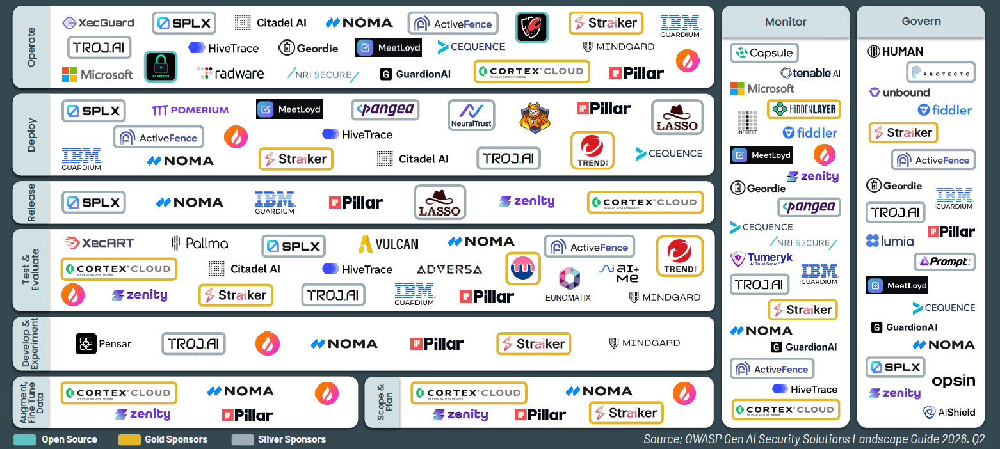

## OWASP ASI Agentic 型分類レポートとサポートの製品における組み込み・対応

ソリューション プロバイダーとオープン ソース プロジェクトの計 18 組織が、OWASP Agentic Risk and mitigations の分類体系を自らの製品に直接実装し、組織がエージェント型 AI アプリケーションおよびシステムに関連するセキュリティ態勢と準備状況を特定・測定できるよう支援しています。

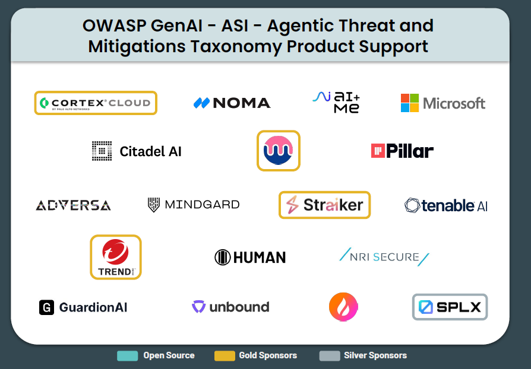

## エージェント AI SecOps フレームワーク

**エージェント型 AI SecOps フレームワーク**は、次世代 AI システムが単純な大規模言語モデル（LLM）呼び出しから完全自律型のマルチ エージェント アーキテクチャへと移行する中で、進化するセキュリティ要件に対応します。このフレームワークは、既存の DevOps および SecOps 手法を拡張し、セキュリティが確保されたなエージェント型 AI の開発を促進することで、組織がエージェント型 AI の機能を安全に活用しながら、セキュリティ、信頼性、コンプライアンス、監査可能性を維持できるようにします。

	
<table>
<tr>
	<td style="background-color: #66cdaa"><b>計画および範囲決定 (Plan&Scope)</b></td>
    <td><ul>
		<li>エージェント型脅威モデリングの実施</li>
		<li>システム全体における非人間型アイデンティティおよび認証プロトコルの特定する</li>
		<li>エージェントの権限境界、ツールのスコープ、および委任ロジックに関するポリシーの策定</li>
        <li>記憶のスコープ、分離、および長期保存ルールに関する管理策の定義</li>
	</ul></td>
</tr>
<tr>
	<td style="background-color: #66cdaa"><b>データの拡張・微調整 (Fine Tune Data)</b></td>
    <td><ul>
		<li>エージェントの記憶に注入される機密情報への差分プライバシーまたは難読化の適用</li>
		<li>エージェントのアクションの監査</li>
    </ul></td>
</tr>
<tr>
	<td style="background-color: #66cdaa"><b>開発および実験 (Dev&Experiment)</b></td>
    <td><ul>
		<li>エージェントのプランニング コード、ツール ラッパー、プラグイン インターフェースに対する SAST/DAST の実施</li>
		<li>無限ループ、安全でない関数ルーティング、未認証の自己変更に対するエージェントのループ ロジックの堅牢化</li>
		<li>コネクタ コントラクト（≒API のインターフェース定義）の検証</li>
		<li>アプリ フレームワークへのポリシー強制フックの実装（例: LangGraph、CrewAI、または Semantic Kernel フロー）</li>
    </ul></td>
</tr>
<tr>
	<td style="background-color: #66cdaa"><b>テストおよび評価 (Test&Evaluation)</b></td>
    <td><ul>
		<li>エージェント スキャン（利用可能な場合）</li>
		<li>敵対的レッド チーム演習の実施: 目標の逸脱</li>
		<li>共謀、不整合（ミス アライメント）、または欺瞞を検出するためのマルチ エージェント シナリオ シミュレーションの実行</li>
		<li>エージェントの意思決定を想定される目標計画と比較した検証</li>
		<li>すべてのツール呼び出し（コード実行またはクラウド API のトリガー）のサンドボックス テスト</li>
    </ul></td>
</tr>
<tr>
	<td style="background-color: #66cdaa"><b>リリース (Release)</b></td>
    <td><ul>
		<li>モデル、エージェント、ツールの SBOM の生成と検証 - 共有責任</li>
		<li>モデルの重み、プラグインのマニフェスト、記憶のスナップ ショットへの署名</li>
		<li>ポリシー バンドルがデプロイ時に暗号化検証されていることの確認</li>
		<li>すべてのエージェントの内部信頼レジストリへの登録と、機能記述子の付与</li>
    </ul></td>
</tr>
<tr>
	<td style="background-color: #66cdaa"><b>デプロイ (Deploy)</b></td>
    <td><ul>
		<li>エージェント、ツール、外部 API 間でゼロ トラスト ポリシーの強制</li>
		<li>すべての共有シークレット、鍵、トークンの、一時的でスコープ付きの資格情報でのローテーション</li>
		<li>実行時ガードレール（例: LLM ファイアウォール、ツールの許可リスト）の適用</li>
		<li>エージェント間の認証ポリシーの、機能と役割に基づいた構成</li>
    </ul></td>
</tr>
<tr>
	<td style="background-color: #66cdaa"><b>運用 (Operate)</b></td>
    <td><ul>
		<li>ドリフト、汚染、不正な上書きの検出を目的とした、エージェントの記憶領域の変異パターンの監視</li>
		<li>タスクのリプレイ、無限の委任、または幻覚の検出</li>
		<li>高リスクなアクションに対する、ヒューマン イン ザ ループによるオーバーライドのしきい値の有効化</li>
		<li>CVE と権限昇格の脆弱性を検出を目的とした、ロードされたプラグインの継続的なスキャン</li>
		<li>実行時ガードレールとモデレーション、およびツールの使用状況</li>
    </ul></td>
</tr>
<tr>
	<td style="background-color: #66cdaa"><b>監視 (Monitor)</b></td>
    <td><ul>
		<li>エージェントのステップ トレース、ツールの実行、メッセージ ログからテレメトリの相関分析</li>
		<li>目標の反転、予期しない計画の深さ、敵対的な入力、過剰なツール使用、エージェント間の頻繁な通信などの異常の警告</li>
		<li>明示されたプランニング結果と観測されたプランニング結果を比較することによる、リフレクションの正確性の監査</li>
		<li>フォレンジック調査を目的とした、不変ログ（例: Sigstore、Immudb）の使用の徹底</li>
    </ul></td>
</tr>
<tr>
	<td style="background-color: #66cdaa"><b>ガバナンス (Govern)</b></td>
    <td><ul>
		<li>エージェント群およびツールアクセス全体にわたった、役割とタスクに基づいたアクセス ポリシーの強制</li>
		<li>エージェントのバージョン管理、有効期限、およびローテーション ポリシーの自動化</li>
		<li>管理策の証拠の EU AI 法、NIST AI RMF、ISO/IEC 42001 などのフレームワークへの準拠</li>
		<li>目標との整合性（アライメント）の監査の自動化（エージェントの長期記憶に対する敵対的レビューも含まれます）</li>
    </ul></td>
</tr>
</table>

## 計画および範囲決定 (Plan&Scope)

エージェント型 AI アプリの計画段階では、SecOps と DevOps は設計段階からセキュリティを組み込む必要があり、非人間型アイデンティティ、エージェントの脅威モデリング、権限境界、認証に重点を置くべきです。データ漏洩を防ぐには、記憶のスコープ設定と分離が不可欠です。早期の連携により、従来の設計後のセキュリティとは異なり、エージェントのワークフローとツールを強制力のあるセキュリティと整合させることができます。

	
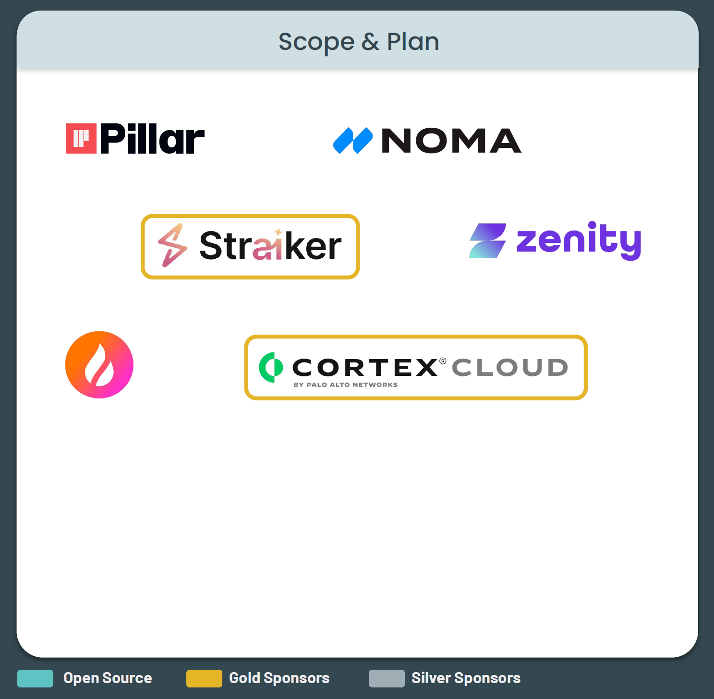

<table>
<tr>
	<td style="background-color: #66cdaa" width="50%"><b>Agentic DevOps</b></td>
	<td style="background-color: #66cdaa" width="50%"><b>Agentic SecOps</b></td>
</tr>
<tr>
	<td><ul>
		<li>ビジネス目標の定義と、エージェントの目標と役割への変換</li>
		<li>モデル ファミリー（チャット LLM vs. マルチ モーダル）とホスティング モードの選択</li>
		<li>エージェント アーキテクチャ パターン（シングル、階層型、スウォーム）の定義</li>
		<li>外部サービスとツールの特定</li>
		<li>エージェント間の通信とツールのワークフローの設計</li>
		<li>記憶パターン（短期コンテキスト vs. 長期（例：ベクターデータベース））の選択</li>
		<li>初期脅威モデルとサービス レベル目標の作成</li>
   </ul></td>
   <td><ul>
		<li>エージェント脅威モデリングの実施（GenAI Security Project - Agentic Security Initiative の脅威モデリング手法を参照）</li>
		<li>システム全体の非人間アイデンティティ（NHI）の特定と、認証プロトコル（SPIFFE、mTLSなど）の決定</li>
		<li>エージェントの権限境界、ツール スコープ（MCP など）、委任ロジックに関するポリシーの策定</li>
        <li>記憶スコープ、隔離、および長期保存ルールに関する管理策の定義</li>
   </ul></td>
</tr>
</table>

## データの拡張、微調整 (Augment, Fine Tune Data)

データ拡張と微調整では、SecOps は DevOps と連携し、汚染されたデータ、敵対的チューニング、推論トレースによるリスクを防止します。SecOps はデータセットを無害化し、アライメントを検証し、出所をログに記録し、機密性の高い記憶をプライバシー制御で保護します。これにより、デプロイ前にコンプライアンスに準拠した信頼できるエージェント型 AI が確保されます。

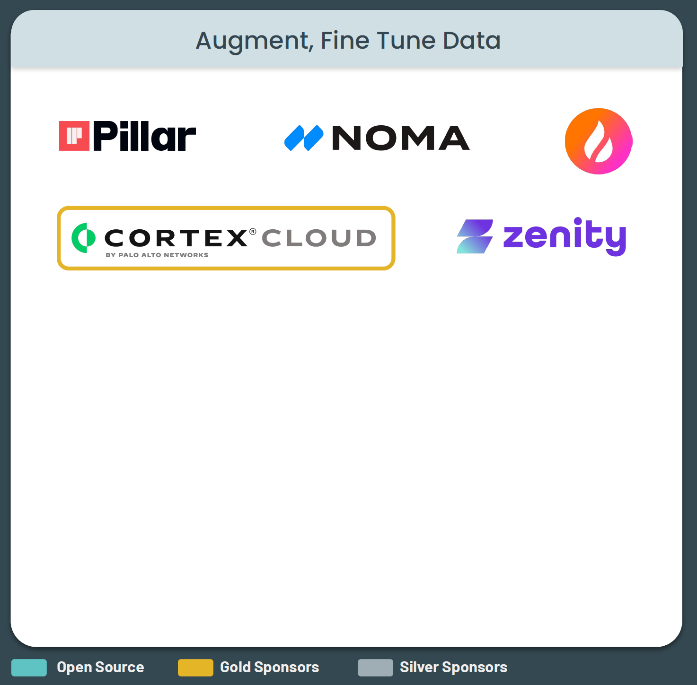
	
<table>
<tr>
	<td style="background-color: #66cdaa" width="50%"><b>Agentic DevOps</b></td>
	<td style="background-color: #66cdaa" width="50%"><b>Agentic SecOps</b></td>
</tr>
<tr>
	<td><ul>
		<li>エージェントが計画立案とリフレクションの際に参照するドメイン固有のコーパスの収集</li>
		<li>プランナーが適切なアクションを選択できることを目的とした、ツール-スキーマ エンベディングの生成</li>
		<li>複数ステップの推論トレース（ReAct、思考ツリー）を含むタスク固有の対話に基づいた、LLM の微調整／精緻化</li>
		<li>「エージェントの記憶」（企業知識、ルール）の初期データとしての蓄積</li>
   </ul></td>
   <td><ul>
		<li>プロンプト汚染、バイアスのある指示、または暗号化されたポリシー迂回がないかを確認することを目的とした、データセットをスキャン</li>
		<li>倫理的整合性、敵対的操作、または機密情報の漏洩がないかを確認することを目的とした、RLHF トレースの検証</li>
		<li>データの系統と出所の不変のログへの記録</li>
		<li>エージェント記憶に注入された機密情報への差分プライバシーまたは難読化の適用</li>
		<li>エージェントのアクションの監査</li>
   </ul></td>
</tr>
</table>

## 開発および実験 (Develop&Experiment)

エージェント型 AI の開発および実験フェーズでは、SecOps は DevOps と連携し、動的なエージェント ループ、エージェント間通信、および API/プラグインの使用を保護します。I/O コントラクト（≒I/O インターフェース定義）の検証、ポリシー フックの組み込み、および耐障害性のテストを実施し、安全でない動作を防止します。セキュリティは、静的なコード中心から、リアルタイムのオーケストレーションとセキュリティが確保された実験の共同設計へと移行します。

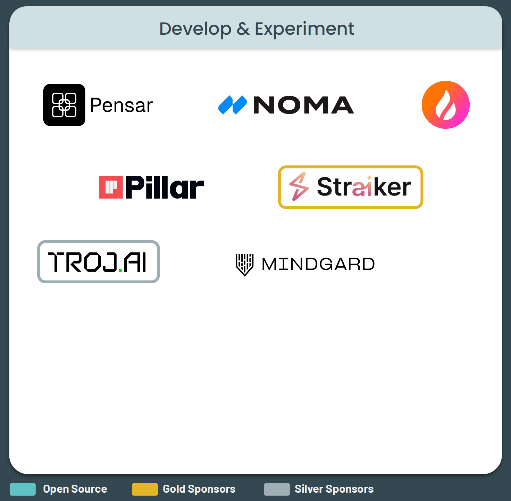

<table>
<tr>
	<td style="background-color: #66cdaa" width="50%"><b>Agentic DevOps</b></td>
	<td style="background-color: #66cdaa" width="50%"><b>Agentic SecOps</b></td>
</tr>
<tr>
	<td><ul>
		<li>LangGraph や AutoGen などのフレームワークを用いたエージェント ループ（観察-計画-実行-リフレクション）の実装</li>
		<li>マネージャー-ワーカー グラフの構築と、委任ポリシーのコード化</li>
		<li>各外部 API（MCP など）に対応するプラグインの実装と、入出力スキーマの強制</li>
		<li>エージェント間プロトコル（A2A など）ハンドシェイクと機能ネゴシエーションのプロトタイプの作成</li>
		<li>プロンプト、システム命令、ガード関数の反復的な改良と、サンドボックス テストの実行</li>
   </ul></td>
   <td><ul>
		<li>エージェントのプランニング コード、ツール ラッパー、プラグイン インターフェースに対する SAST/DAST の実行</li>
		<li>エージェントのループ ロジックの、無限ループ、安全でない関数ルーティング、不正な自己変更に対する堅牢化</li>
		<li>コネクタ（MCP など）コントラクト（入出力スキーマと権限）の検証</li>
		<li>フレームワーク（LangGraph、CrewAI、Semantic Kernel フローなど）へのポリシー適用フックの実装</li>
   </ul></td>
</tr>
</table>

## テストおよび評価 (Test&Evaluation)

テスト＆評価では、SecOps は DevOps と連携し、敵対的な状況下でエージェント型 AI のストレス テストを実施し、目標の逸脱、プロンプト インジェクション、ツールの不正使用といった新たなリスクを特定します。レッド チーム シミュレーション、サンドボックス ツール／API 呼び出しを実行し、マルチ エージェント環境での意思決定を検証することで、従来の QA やペネトレーション テストを超えた振舞いセキュリティに重点を置きます。

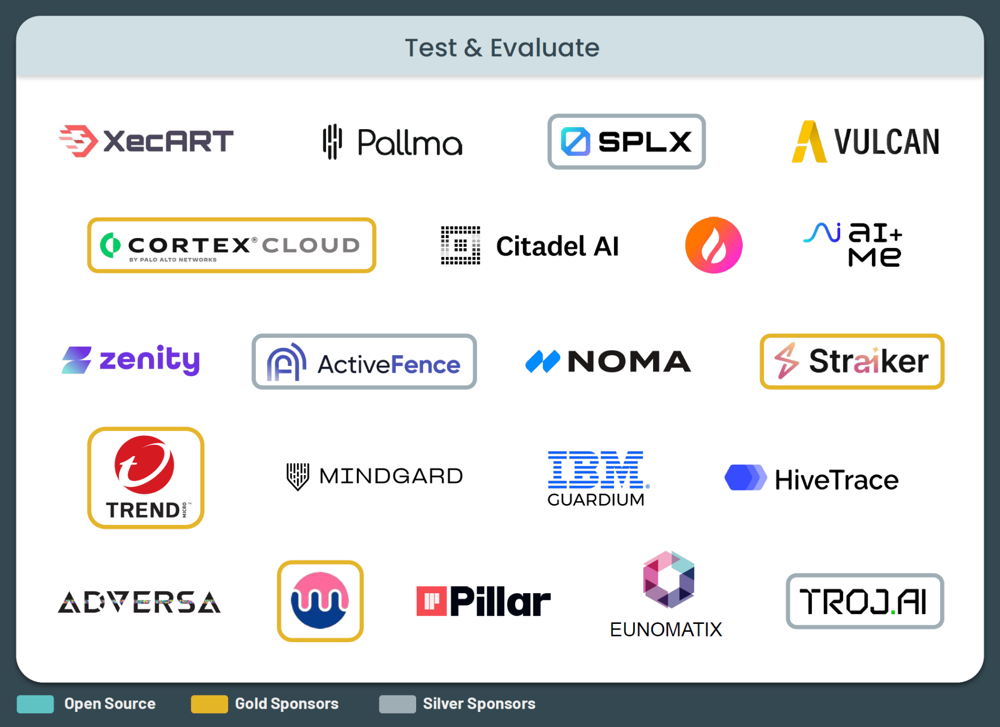

<table>
<tr>
	<td style="background-color: #66cdaa" width="50%"><b>Agentic DevOps</b></td>
	<td style="background-color: #66cdaa" width="50%"><b>Agentic SecOps</b></td>
</tr>
<tr>
	<td><ul>
		<li>検証データセットとテスト データセットを用いたモデルの評価</li>
		<li>統合テスト</li>
		<li>バイアスおよび公平性のチェックの実施</li>
		<li>ストレス/パフォーマンス テスト</li>
		<li>堅牢性を確保するための交差検証などの手法の使用</li>
		<li>モデルの解釈可能性と説明可能性の検証</li>
   </ul></td>
   <td><ul>
		<li>エージェント スキャン（利用可能な場合）</li>
		<li>敵対的レッド チーム演習の実施: 目標の逸脱</li>
		<li>共謀、不整合（ミス アライメント）、または欺瞞を検出するためのマルチ エージェント シナリオ シミュレーションの実行</li>
		<li>エージェントの意思決定を想定される目標計画と比較した検証</li>
		<li>すべてのツール呼び出し（コード実行またはクラウド API のトリガー）のサンドボックス テスト</li>
   </ul></td>
</tr>
</table>

### ソリューション一覧

- **※注意事項**
	- 1. [OWASP GenAI Security Project > AI Security Solutions Landscape](https://genai.owasp.org/ai-security-solutions-landscape/) にて登録されている情報を記載しています。買収等によりソリューション名や企業名が変わっている場合は、可能な限り変更後の情報を収集して記載しています。
	- 2. 「対応する Agentic SecOps 項目」欄は、該当する Agentic SecOps 段階（ここでは「テストおよび評価」）内で該当するものだけ記載しています。ソリューションによっては、他の Agentic SecOps 段階をサポートするものもありますが、ここでは記載していません（例: ソリューション X が「テストおよび評価」「運用」段階をサポートしていても、「テストおよび評価」段階の項目のみ記載しています）。また、すべてのソリューションが [OWASP GenAI Security Project > AI Security Solutions Landscape](https://genai.owasp.org/ai-security-solutions-landscape/) に登録されているわけではありません。そのため、その場合は「（不明）」と記載しています。

<table>
<tr>
    <th width="25%">ソリューション名</th>
    <th width="25%">企業名</th>
    <th width="25%">対応する Agentic SecOps 項目（注 2）</th>
    <th width="25%">概要</th>
</tr>
<tr>
    <td><a href="https://www.cycraft.com/ja/xecart">XecART</a></td>
    <td>CyCraft</td>
    <td>（不明）</td>
    <td>AI レッドチーム評価サービス XecART は、AI モデルの検証、コンプライアンス監査、レジリエンス評価を包括的に実施します。OWASP、ISO、NIST、各国規制機関のガイドラインなど国際的基準に基づき、多岐にわたる攻防テストを通じてレジリエンス レポートを作成し、外部からの攻撃耐性、認証の堅牢性、異常時の対応力を強化することで、AI セキュリティとコンプライアンスの向上を実現します。</td>
</tr>
<tr>
    <td><a href="https://docs.pallma.ai/getting-started">Pallma Red</a></td>
    <td>Pallma AI</td>
    <td>（不明）</td>
    <td>Pallma Red は、攻撃者が攻撃を行う前に脆弱性を解明します。同社の独自 AI は、システムに対して継続的に、安全に、自動的に、敵対的な攻撃を発生、進化させ、実行します。</td>
</tr>
<tr>
    <td><a href="https://splx.ai/platform">SPLX Platform</a></td>
    <td>Zscaler, Inc</td>
    <td>（不明）</td>
    <td>SPLX Platform は、レッド チーム演習やリアルタイムの脅威検出・対応から継続的なガバナンス、動的修復まで、AI のエンドツーエンド セキュリティを実現します。</td>
</tr>
<tr>
    <td><a href="https://github.com/splx-ai/agentic-radar">Agentic Rader</a></td>
    <td>Zscaler, Inc</td>
    <td>（不明）</td>
    <td>Agentic Rader は、セキュリティおよび運用上の洞察を得るために、エージェント型システムを分析および評価することを目的としたオープンソース ソフトウェアです。開発者、研究者、セキュリティ専門家がエージェント型システムの機能を理解し、潜在的な脆弱性を特定するのに役立ちます。</td>
</tr>
<tr>
    <td><a href="https://vulcanlab.ai/red-teaming/">Vulcan AI Red Teaming</a></td>
    <td>Vulcan</td>
    <td>（不明）</td>
    <td>Vulcan AI Red Teaming は、カスタマイズされた脅威モデリング、専門家主導の評価、およびエージェント型 AI および基盤モデルのデプロイメントに関して包括的に評価するソリューションです。</td>
</tr>
<tr>
    <td><a href="https://www.paloaltonetworks.jp/cortex/cloud/ai-security-posture-management">Cortex Cloud AI-SPM</a></td>
    <td>Palo Alto Networks</td>
    <td>（不明）</td>
    <td>Cortex Cloud AI-SPM により、組織は AI を活用したアプリケーションを発見、分類、保護、管理できるようになります。また、モデル、アプリケーション、リソースを含む AI エコシステム全体を可視化できます。</td>
</tr>
<tr>
    <td><a href="https://citadel-ai.com/products/lens/">Citadel Lens</a></td>
    <td>Citadel AI</td>
    <td>（不明）</td>
    <td>Citadel AI は、従来型 AI から最新の生成 AI、エージェント型 AI に至るまで、あらゆる AI システムの品質・安全性・コンプライアンスを自動評価・自動モニタリングする「AI ガバナンスツール」を提供しています。</td>
</tr>
<tr>
    <td><a href="https://www.enkryptai.com/">Enkrypt AI</a></td>
    <td>Enkrypt AI</td>
    <td>（不明）</td>
    <td>Enkrypt AI は、テキスト、画像、音声全体にわたってリアルタイムのガードレールを提供し、有害または法令違反の行為が損害を引き起こす前に阻止します。また、Enkrypt AI は業界初の LLM とエージェント安全性リーダーボードを導入し、組織がモデルをパフォーマンスだけでなくリスク プロファイルに基づいて明確に評価できるようにしました。</td>
</tr>
<tr>
    <td><a href="https://www.humanbound.ai/">Humanbound</a></td>
    <td><s>AIandMe</s> →Humanbound</td>
    <td>（不明）</td>
    <td>Humanbound は、AI エージェントのセキュリティ テスト プラットフォームです。エージェントのエンドポイントを指定し、スコープを定義する（または自動的に抽出させる）と、OWASP LLM および Agentic AI カテゴリにマッピングされた構造化された検出結果が得られます。あらゆるチャットボットやエージェントのクラウドまたはオンプレミス環境で動作します。</td>
</tr>
<tr>
    <td><a href="https://zenity.io/">Zenity</a></td>
    <td>Zenity</td>
    <td>（不明）</td>
    <td>Zenity は、あらゆるプラットフォーム上のあらゆるエージェントに対する、統合された可観測性、ガバナンス、および脅威保護を実現します。</td>
</tr>
<tr>
    <td><a href="https://alice.io/products/platform">WonderSuite</a></td>
    <td><s>ActiveFence</s> ALICE</td>
    <td>（不明）</td>
    <td>WonderSuite は、規制対象業界で顧客向け AI を導入するチーム向けの AI セキュリティ プラットフォームです。導入前にセキュリティと安全性の態勢をテストし、本番環境で AI エクスペリエンスを保護し、時間の経過に伴う変化を把握できます。</td>
</tr>
<tr>
    <td><a href="https://noma.security/">Noma Security</a></td>
    <td>Noma Security</td>
    <td>（不明）</td>
    <td>Noma Security は、データと AI のライフサイクル全体を対象とした包括的なアプリケーション セキュリティ ソリューションです。エンドツーエンドの可視性を提供し、ノートブック、ソースコード、その他をスキャンします。</td>
</tr>
<tr>
    <td><a href="https://www.straiker.ai/">Straiker AI</a></td>
    <td>Straiker Inc</td>
    <td>（不明）</td>
    <td>2つの製品を使用して AI アプリケーションのセキュリティを確保します。Ascend AI は、アプリケーションのすべてのレイヤーにわたるペネトレーション テスト/レッドチーム演習を提供します。Defend AI は、AI アプリケーションの可視性とガードレールを提供します。</td>
</tr>
<tr>
    <td><a href="https://www.trendmicro.com/ja_jp/business/ai/security-ai-stacks.html">Trend Micro LLM Red Team Penetration Test assessments</a></td>
    <td>TrendMicro</td>
    <td>（不明）</td>
    <td>Trend Micro LLM Red Team Penetration Test assessments は、AI 駆動型アプリケーションに対する体系的かつ詳細な評価を提供し、セキュリティ リスクを事前に特定し、軽減することを可能にします。</td>
</tr>
<tr>
    <td><a href="https://mindgard.ai/">Mindgard Platform</a></td>
    <td>Mindgard</td>
    <td>（不明）</td>
    <td>Mindgard Platform は、AI 攻撃対象領域をマッピングし、保護します。攻撃者スタイルの偵察により、敵対者が AI システムをどのように発見し悪用しているかが明らかになり、安全性とリスクへの影響が浮き彫りになります。継続的な分析とランタイム保護により、チームは攻撃が現実世界に影響を与える前に、攻撃を発見、修正、阻止することができます。</td>
</tr>
<tr>
    <td><a href="https://www.ibm.com/jp-ja/products/guardium-ai-security">Guardium AI Security</a></td>
    <td>IBM</td>
    <td>（不明）</td>
    <td>IBM Guardium AI Securityは、シャドー AI の発見、あらゆる AI モデルと AI エージェントの保護、悪意あるプロンプトからのリアルタイムの保護、そしてチーム間での共通の測定基準に基づいた連携を可能にし、安全で信頼できる AI を実現します。</td>
</tr>
<tr>
    <td><a href="https://hivetrace.ai/red">HiveTrace Red</a></td>
    <td>HiveTrace</td>
    <td>（不明）</td>
    <td>HiveTrace Red は、LLM モデルおよび生成 AI システムの攻撃に対する耐性を包括的にテストするためのアプリケーションです。このソリューションは、実際の攻撃シナリオをシミュレートし、システムが本番稼働する前に脆弱性を特定します。</td>
</tr>
<tr>
    <td><a href="https://adversa.ai/ai-red-teaming-llm/">Adversa AI Red Teaming Platform</a></td>
    <td>Adversa AI</td>
    <td>（不明）</td>
    <td>ベース モデルからエージェント ワークフローまで、AI スタック全体を継続的にテストする自律型レッド チーム エンジンです。複雑な脆弱性を発見し、ビジネス リスクを対応付けし、実行可能な修復プレイブックをリアルタイムで入手できます。</td>
</tr>
<tr>
    <td><a href="https://www.mend.io/ai-red-teaming/">Mend AI</a></td>
    <td>Mend.io</td>
    <td>（不明）</td>
    <td>Mend AI は、プロンプト インジェクション、コンテキスト漏洩、データ漏洩などの脅威に対するテストを実施し、アプリケーション固有の AI 動作リスクを明らかにします。</td>
</tr>
<tr>
    <td><a href="https://www.pillar.security/platform">Pillar Security</a></td>
    <td>Pillar</td>
    <td>（不明）</td>
    <td>Pillar は、ビジネス コンテキストが探索、テスト、保護を結びつける唯一の AI セキュリティ プラットフォームです。これにより、セキュリティ インテリジェンスが AI ライフサイクル全体にわたって強化されます。</td>
</tr>
<tr>
    <td><a href="https://eunomatix.com/site/web/products-llminspect.html">LLMInspect</a></td>
    <td>EUNOMATIX</td>
    <td>（不明）</td>
    <td>LLMInspect は、生成 AI ゲートウェイとして、企業の AI 利用環境において堅牢なセキュリティを提供する製品です。AIエージェントのセキュリティにも対応しており、Copilot やノーコード プラットフォームなどの AI エージェントが、安全かつ適切に機能しているかを監視し、データ漏洩を防ぐアプローチをとっています。</td>
</tr>
<tr>
    <td><a href="https://troj.ai/products/detect">TrojAI Detect</a></td>
    <td>TrojAI</td>
    <td>（不明）</td>
    <td>TrojAI Detect は、構築時にAIの動作を保護します。この AI セキュリティ プラットフォームは、AI、ML、および生成 AI モデルのセキュリティ上の脆弱性を発見するために、AI モデルを継続的にレッド チーム テストします。</td>
</tr>
</table>

## リリース (Release)

リリース フェーズでは、SecOps チームは DevOps チームと連携し、エージェント型 AI アプリのセキュリティが確保されたパッケージ化、検証、登録を行います。モデルの重み、プラグイン、記憶に署名して改ざんを防止し、すべてのコンポーネントの SBOM を検証し、暗号化検証済みのポリシーを適用し、エージェントをセキュリティが確保された機能レジストリに登録することで、信頼性が高く監査可能なデプロイメントを実現します。

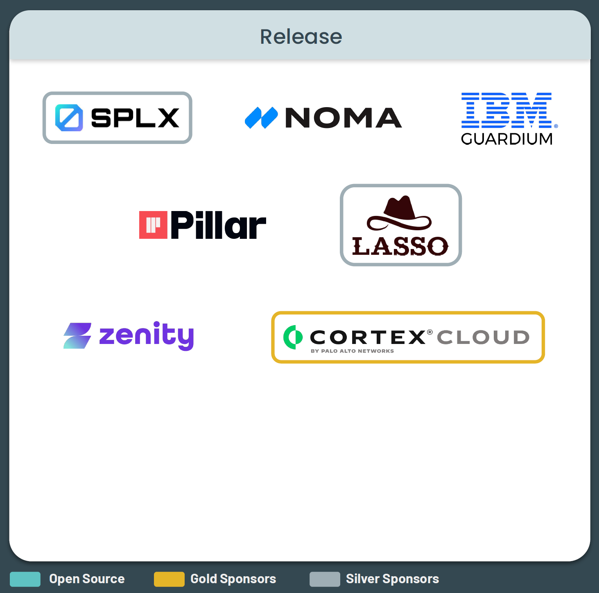

<table>
<tr>
	<td style="background-color: #66cdaa" width="50%"><b>Agentic DevOps</b></td>
	<td style="background-color: #66cdaa" width="50%"><b>Agentic SecOps</b></td>
</tr>
<tr>
	<td><ul>
		<li>エージェントのグラフ、プラグイン、ポリシー、および記憶のスナップショットのパッケージ化</li>
		<li>モデルおよびツールの SBOM 生成、アーティファクトへの署名（Sigstore）。-  共有責任</li>
		<li>エージェントの機能カードの内部 A2A レジストリへの公開</li>
   </ul></td>
   <td><ul>
		<li>モデル、エージェント、ツールの SBOM の生成および検証 - 共有責任</li>
		<li>モデルの重み、プラグイン マニフェスト、および記憶スナップショットへの署名</li>
		<li>ポリシー バンドル（OPA/Rego など）がデプロイ時に暗号化検証されていることの確認</li>
		<li>すべてのエージェントを内部信頼レジストリに機能記述子とともに登録</li>
   </ul></td>
</tr>
</table>

## デプロイ (Deploy)

デプロイ フェーズでは、SecOps は DevOps と連携し、ポリシーに準拠したセキュリティが確保されたエージェント型 AI のアクティベーションを実現します。ゼロ トラスト通信の強制、一時的な認証情報の変更、LLM ファイアウォールと許可リストの設定、そして各エージェントが最小権限で実行されるようきめ細かな認可を適用することで、マルチ エージェント環境におけるリスクを低減します。

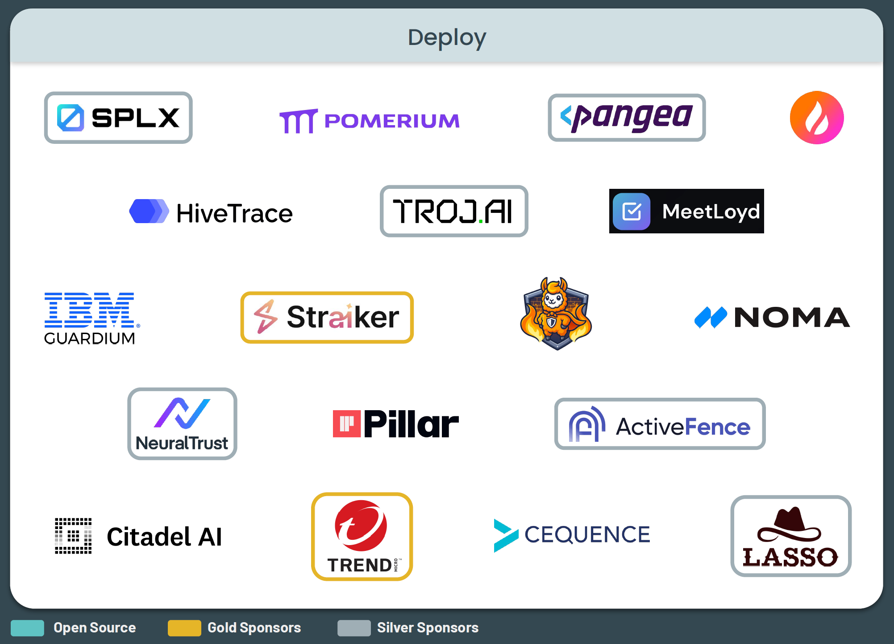

<table>
<tr>
	<td style="background-color: #66cdaa" width="50%"><b>Agentic DevOps</b></td>
	<td style="background-color: #66cdaa" width="50%"><b>Agentic SecOps</b></td>
</tr>
<tr>
	<td><ul>
		<li>ベクトル DB、記憶（メモリ ストア）、ツール用サイド カー（サイド カー方式で実装されたツール群）、および mTLS を使用した A2A トラフィック用のサービス メッシュのプロビジョニング</li>
		<li>すべてのエージェント（非人間アイデンティティ）に対する最小権限の IAM ロールの適用</li>
		<li>初期の長期記憶のロード、探索サービスへのエージェントの登録</li>
		<li>実行時ガードレール/LLM ファイアウォールの有効化</li>
   </ul></td>
   <td><ul>
		<li>エージェント、ツール、外部 API 間における、mTLS ときめ細かな RBAC を用いたゼロ トラスト ポリシーの強制</li>
		<li>すべての共有シークレット、鍵、トークンの、一時的なスコープ付き認証情報での変更</li>
		<li>本番環境のトラフィックを有効にする前における、実行時ガードレール（例: LLM ファイアウォール、ツール許可リスト）の適用</li>
		<li>エージェント間の認証ポリシーを、機能と役割に基づいて設定</li>
   </ul></td>
</tr>
</table>

## 運用 (Operate)

運用フェーズでは、SecOps チームは DevOps チームと連携し、エージェントが変化する環境下で進化、適応、行動する、動的なエージェント型 AI のフット プリントを保護します。記憶の変更を監視してドリフトや汚染を防ぎ、異常なループや不正使用を検出し、HITL オーバーライドを適用し、プラグインのリスクをスキャンします。この継続的なリアルタイム監視により、システムが拡張され自己調整を行う際にも、セキュリティが確保され回復力のある運用が保証されます。

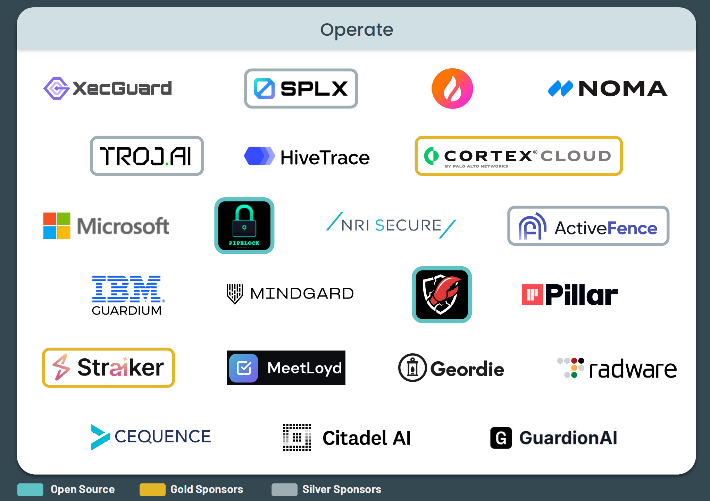

<table>
<tr>
	<td style="background-color: #66cdaa" width="50%"><b>Agentic DevOps</b></td>
	<td style="background-color: #66cdaa" width="50%"><b>Agentic SecOps</b></td>
</tr>
<tr>
	<td><ul>
		<li>SRE プレイブックの実行（推論ポッドの自動スケーリング、鍵/トークンの変更、記憶の剪定）</li>
		<li>フィードバック/RLHF トレースの収集と、定期的な自己評価タスクのスケジューリング</li>
		<li>エージェントの信頼度が低下した場合における、自動リフレクションまたはヒューマン イン ザ ループのトリガー</li>
		<li>エージェント間のワークフローのオーケストレーション</li>
   </ul></td>
   <td><ul>
		<li>エージェント記憶の変更パターンの監視し、ドリフト、汚染または不正な上書きの検出</li>
		<li>タスクのリプレイ、無限委任、または幻覚ループの検出</li>
		<li>高リスクまたは曖昧なアクションに対する、ヒューマン イン ザ ループ（HITL）によるオーバーライドしきい値の有効化</li>
		<li>ロードされたプラグインの継続的なスキャンと、CVE および権限昇格の脆弱性の検出</li>
		<li>実行時ガードレールとモデレーション機能、異常なツール使用の検出</li>
   </ul></td>
</tr>
</table>

## 監視 (Monitor)

監視フェーズでは、SecOps チームは DevOps チームと連携し、エージェント型 AI の動的かつ進化するフット プリントを保護します。静的なシステムとは異なり、これらのエージェントは、推論やインタラクションに応じて変化する、コンテキストが豊富なトレースを生成します。SecOps チームは、エージェントのステップ、ツール呼び出し、およびエージェント間の通信を関連付け、目標の反転や悪意のある入力などの異常を検知し、不変のログと監査を使用して、プロアクティブで動作認識型のセキュリティを実現します。

	
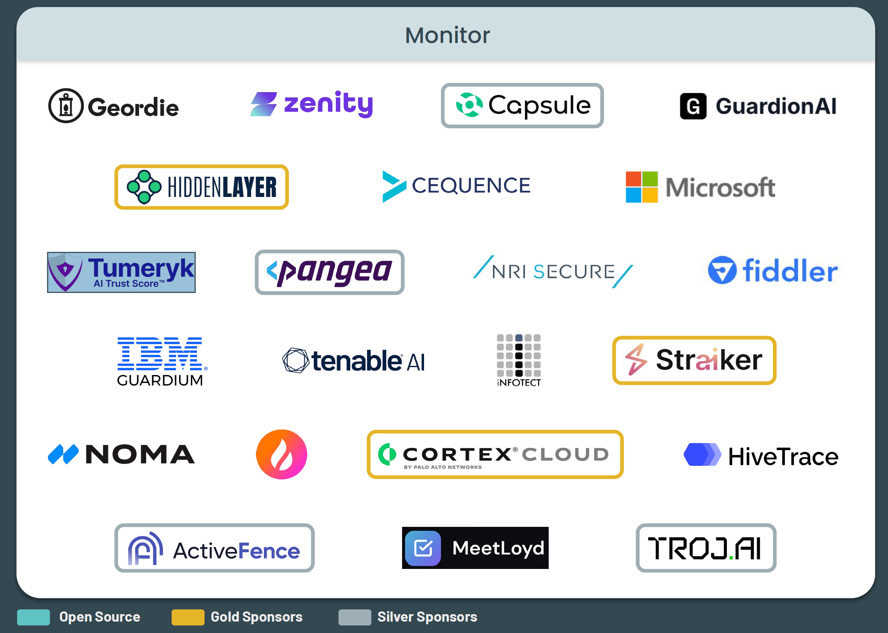

<table>
<tr>
	<td style="background-color: #66cdaa" width="50%"><b>Agentic DevOps</b></td>
	<td style="background-color: #66cdaa" width="50%"><b>Agentic SecOps</b></td>
</tr>
<tr>
	<td><ul>
		<li>エージェント ステップごとのテレメトリの OpenTelemetry 経由でのストリーミングと、ツール エラーとプランニング ノードの関連付け</li>
		<li>KPI（目標達成率、平均推論深度、ベクトル ストアの増加、エージェント間レイテンシなど）の追跡</li>
		<li>異常パターン（ループ、幻覚の連鎖、過剰な権限使用など）の警告</li>
   </ul></td>
   <td><ul>
		<li>エージェントのステップ トレース、ツールの実行、メッセージ ログからテレメトリの相関分析</li>
		<li>目標の反転、予期しない計画の深さ、敵対的な入力、過剰なツール使用、エージェント間の頻繁な通信などの異常の警告</li>
		<li>明示されたプランニング結果と観測されたプランニング結果を比較することによる、リフレクションの正確性の監査</li>
		<li>フォレンジック調査を目的とした、不変ログ（例: Sigstore、Immudb）の使用の徹底</li>
   </ul></td>
</tr>
</table>

## ガバナンス (Govern)

ガバナンス フェーズでは、SecOp sは DevOps と連携し、進化するエージェント型 AI のコンプライアンス、アクセス制御、ライフサイクル ガバナンスを維持します。役割ベースおよびタスク ベースのポリシーを適用し、エージェントのバージョン管理と廃止を自動化し、権限の肥大化を防ぎます。不変のログ、監査、AI 規制への準拠により、動的なマルチ エージェント システムにおける長期的なセキュリティ、説明責任、信頼性を確保します。

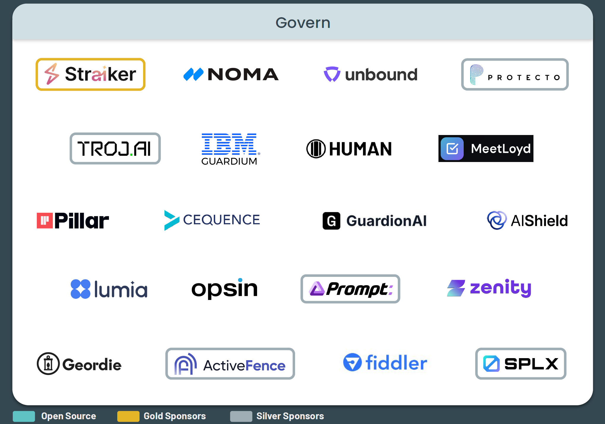

<table>
<tr>
	<td style="background-color: #66cdaa" width="50%"><b>Agentic DevOps</b></td>
	<td style="background-color: #66cdaa" width="50%"><b>Agentic SecOps</b></td>
</tr>
<tr>
	<td><ul>
		<li>エージェントのバージョン、役割、承認済みツールのレジストリの維持、廃止ポリシーの遵守</li>
		<li>A2A 信頼グラフと MCP コネクタのスコープの四半期ごとの棚卸しおよび承認</li>
		<li>変更不可能なログのアーカイブ化（監査目的）、証拠の EU AI 法/NIST RMF 管理策への対応付け</li>
		<li>整合（アライメント）指標の定期的なレビュー、憲法ルール（AI の行動指針）の更新</li>
   </ul></td>
   <td><ul>
		<li>エージェント全体およびツール アクセスに対する、役割とタスクに基づいたアクセス ポリシーの適用</li>
		<li>エージェントのバージョン管理、有効期限、およびローテーション ポリシーの自動化</li>
		<li>管理策の証拠の、EU AI 法、NIST AI RMF、ISO/IEC 42001 などのフレームワークへの準拠</li>
		<li>目標との整合性監査の自動化（エージェントの長期記憶に対する敵対的レビューを含む）</li>
   </ul></td>
</tr>
</table>

