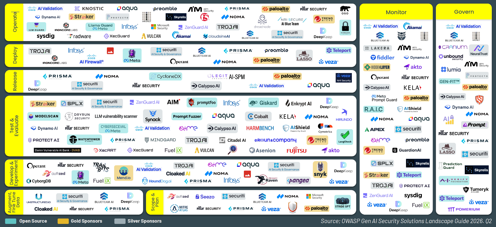
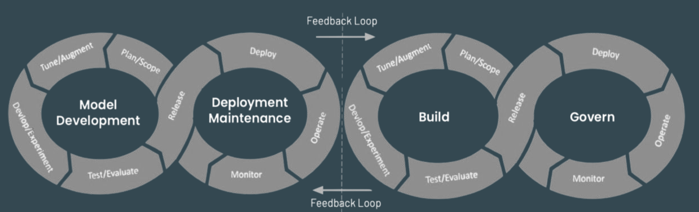
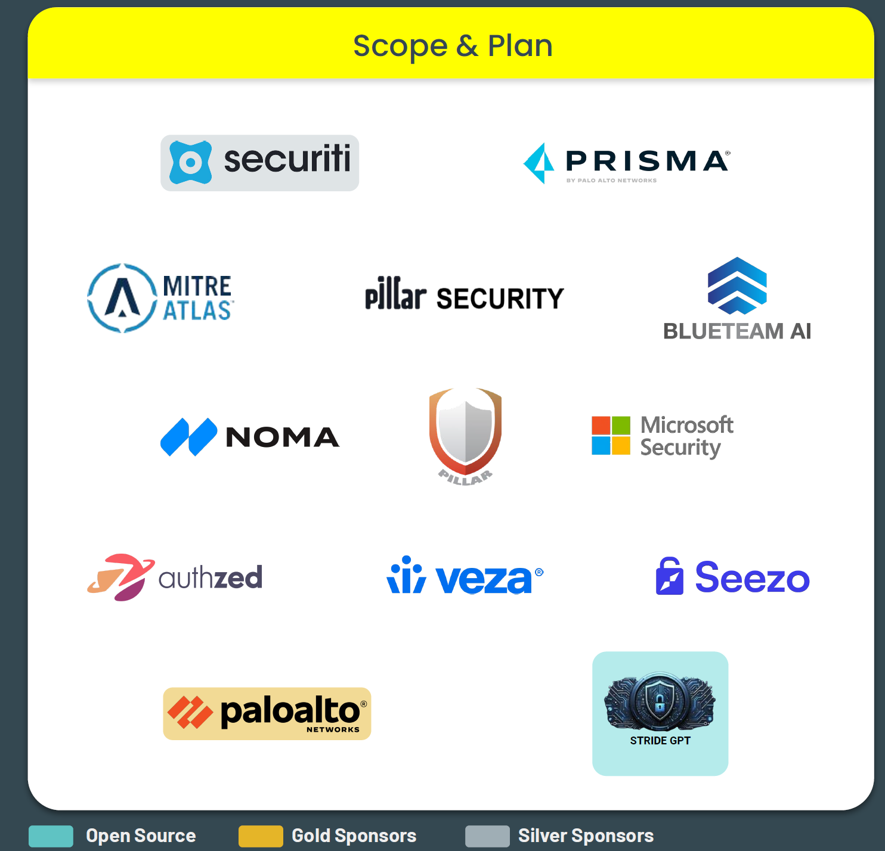
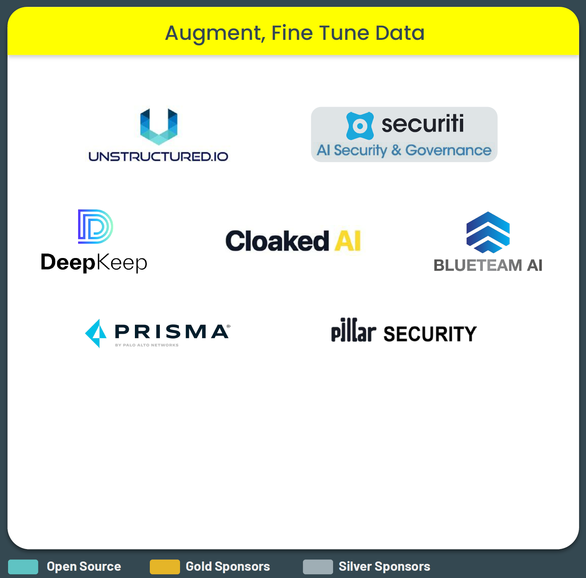
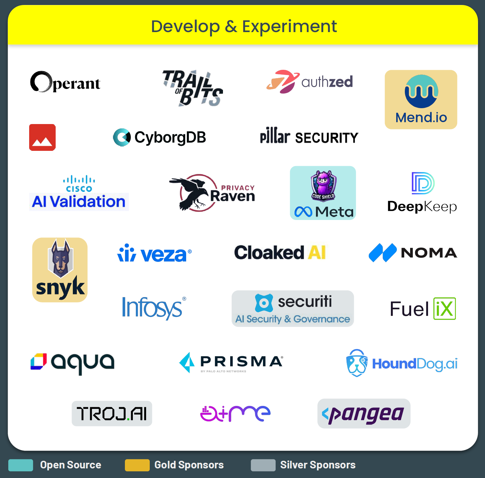
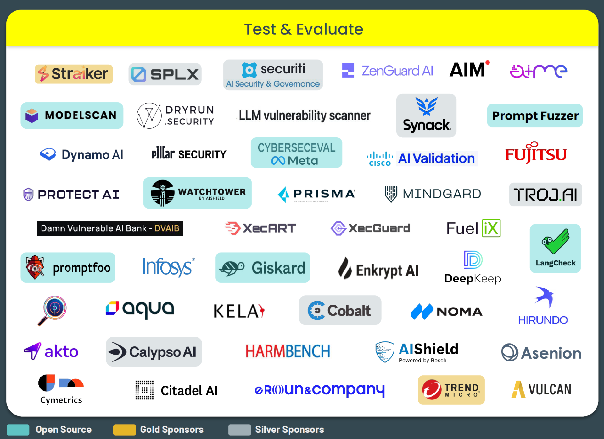
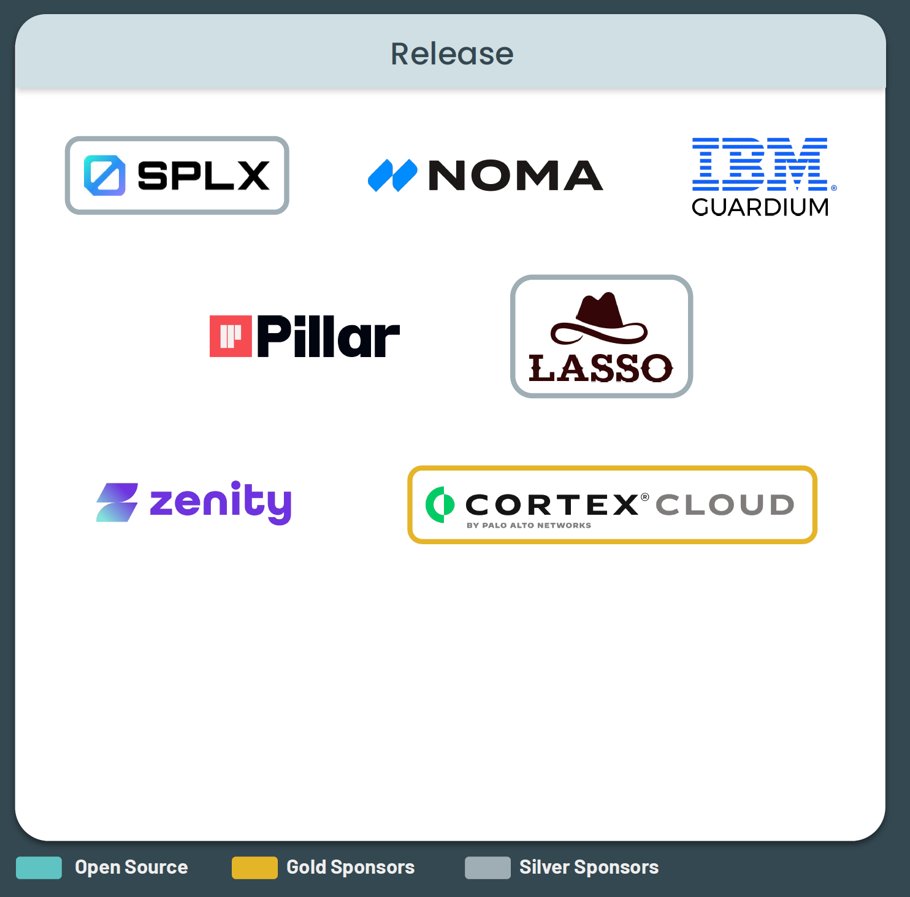
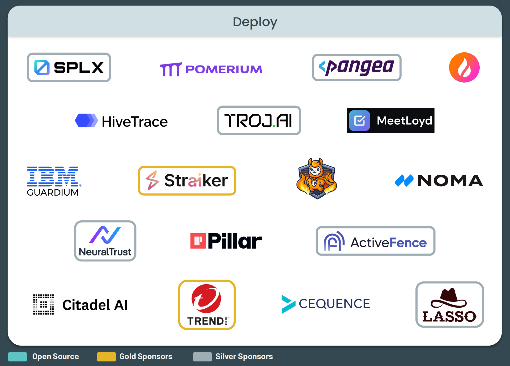
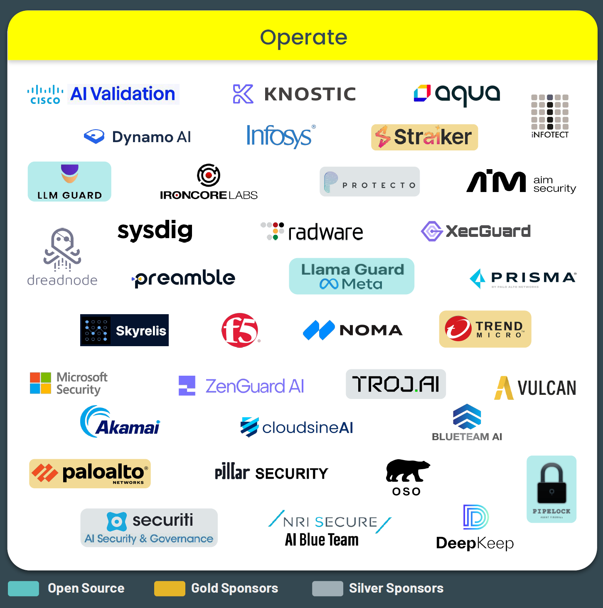
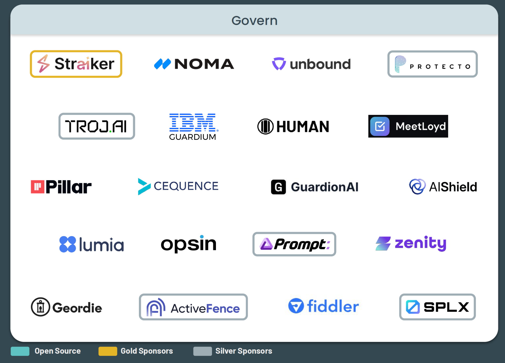

# LLM アプリおよび生成 AI アプリ向けセキュリティ ソリューションの展望 (2026 Q2)

ソリューションの展望は、進化するセキュリティ ニーズに対応するため、DevOps と SecOps の接点に焦点を当て、LLM と生成 AI のライフサイクル全体を監視および対応付けします。LLM と生成 AI、および SecOps タスクに関する OWASP Top 10 リスクと対策を参考に、オープンソースおよび商用ソリューションを段階ごとに紹介し、LLM と生成 AI の SecOps 業務と Top 10 脅威への対策のカバー範囲を特定します。また、業界およびコミュニティからの意見を活用し、増え続ける LLM と生成 AI のセキュリティ ソリューションを理解するためのピア レビュー済みリソースとして活用します。四半期ごとに更新されます。

## LLM および生成 AI セキュリティの展望 - 2026 Q2/Q3

## LLM および生成 AI アプリ SecOps フレームワーク

OWASP LLM SecOpsフレームワークは、LLMOps プロセスと各段階におけるセキュリティの役割および依存関係をより適切に整合させるために策定されました。LLMOps と MLOps はライフサイクル管理という同じ基本原則に基づいていますが、焦点と要件は大きく異なります。一方は主にモデル開発に重点を置いているのに対し、もう一方は DevOps を拡張してさまざまな LLM、生成 AI、およびアプリケーション パターンをサポートするように拡張しています。

	
<table>
<tr>
	<td style="background-color: #ffff00"><b>計画および範囲決定 (Plan&Scope)</b></td>
    <td><ul>
		<li>アクセス制御と認証の計画</li>
		<li>コンプライアンスと規制に関する評価</li>
		<li>データのプライバシーと保護の戦略</li>
        <li>機密情報の初期の特定</li>
		<li>サードパーティー（モデル、プロバイダー等）に関するリスク評価</li>
		<li>脅威モデリング</li>
	</ul></td>
</tr>
<tr>
	<td style="background-color: #ffff00"><b>データの微調整 (Fine Tune Data)</b></td>
    <td><ul>
		<li>データ源の検証</li>
		<li>セキュリティが確保されたデータ処理</li>
		<li>セキュリティが確保された出力処理</li>
		<li>敵対的堅牢性のテスト</li>
		<li>モデルの完全性の検証（マルウェア有無に対するシリアル化スキャン）</li>
		<li>脆弱性評価</li>
    </ul></td>
</tr>
<tr>
	<td style="background-color: #ffff00"><b>開発および実験 (Dev&Experiment)</b></td>
    <td><ul>
		<li>アクセス、認証、認可（MFA）</li>
		<li>実験の追跡</li>
		<li>LLM およびアプリの脆弱性スキャン</li>
		<li>モデルとアプリのインタラクションに関するセキュリティ</li>
		<li>SAST/DAST/IAST</li>
		<li>セキュリティが確保されたコーディング慣行</li>
		<li>セキュリティが確保されたライブラリ/コード リポジトリ</li>
		<li>ソフトウェア構成分析</li>
    </ul></td>
</tr>
<tr>
	<td style="background-color: #ffff00"><b>テストおよび評価 (Test&Evaluation)</b></td>
    <td><ul>
		<li>敵対的テスト</li>
		<li>アプリケーション セキュリティ オーケストレーションと相関分析（ASOC）</li>
		<li>バイアスおよび公平性に関するテスト</li>
		<li>最終セキュリティ監査</li>
		<li>インシデント シミュレーション、インシデント対応に関するテスト</li>
		<li>LLM のベンチマーク</li>
		<li>ペネトレーション テスト</li>
		<li>SAST/DAST/IAST</li>
		<li>脆弱性スキャン</li>
    </ul></td>
</tr>
<tr>
	<td style="background-color: #ffff00"><b>リリース (Release)</b></td>
    <td><ul>
		<li>AI/ML 部品表（BOM）</li>
		<li>モデルおよびデータセットのデジタル署名</li>
		<li>モデルのセキュリティ態勢に関するテスト</li>
		<li>セキュリティが確保された CI/CD パイプライン</li>
		<li>セキュリティが確保されたサプライチェーン検証</li>
		<li>コードの静的分析および動的分析</li>
		<li>ユーザーのアクセス制御の検証</li>
		<li>モデルのシリアル化の保護</li>
    </ul></td>
</tr>
<tr>
	<td style="background-color: #ffff00"><b>デプロイ (Deploy)</b></td>
    <td><ul>
		<li>コンプライアンスの検証</li>
		<li>デプロイメントの検証</li>
		<li>モデルおよびデータセットのデジタル検証</li>
		<li>暗号化、シークレット管理</li>
		<li>多要素認証</li>
		<li>ネットワーク セキュリティの検証</li>
		<li>セキュリティが確保された API アクセス</li>
		<li>セキュリティが確保された構成</li>
		<li>ユーザーおよびデータのプライバシーの保護</li>
    </ul></td>
</tr>
<tr>
	<td style="background-color: #ffff00"><b>運用 (Operate)</b></td>
    <td><ul>
		<li>敵対的攻撃からの保護</li>
		<li>自動化された脆弱性スキャン</li>
		<li>データの完全性と暗号化</li>
		<li>LLM ガードレール</li>
		<li>LLM インシデントの検知と対応</li>
		<li>パッチ管理</li>
		<li>プライバシーおよびデータ漏洩の保護</li>
		<li>プロンプト セキュリティ</li>
		<li>実行時の自己防御</li>
		<li>セキュリティが確保された出力処理</li>
    </ul></td>
</tr>
<tr>
	<td style="background-color: #ffff00"><b>監視 (Monitor)</b></td>
    <td><ul>
		<li>敵対的入力の検知</li>
		<li>モデルの動作の分析</li>
		<li>AI/LLM セキュリティ態勢管理</li>
		<li>パッチおよび更新のアラート</li>
		<li>規制遵守の追跡</li>
		<li>セキュリティ アラート</li>
		<li>セキュリティ指標の収集</li>
		<li>ユーザーの活動の監視</li>
		<li>可観測性</li>
		<li>データのプライバシーおよび保護</li>
		<li>倫理的コンプライアンス</li>
    </ul></td>
</tr>
<tr>
	<td style="background-color: #ffff00"><b>ガバナンス (Govern)</b></td>
    <td><ul>
		<li>バイアスおよび公平性の監督</li>
		<li>コンプライアンス管理</li>
		<li>データ セキュリティ態勢管理</li>
		<li>インシデントのガバナンス</li>
		<li>リスク評価と管理</li>
		<li>ユーザー/マシンによるアクセスの監査</li>
    </ul></td>
</tr>
</table>

## 計画および範囲決定 (Plan&Scope)

この段階では、アプリケーションの目標を明確にし、LLM が対応すべき具体的なニーズを理解し、事前学習済みモデルをより大きなシステムにどのように統合するかを決定します。要件の収集、倫理的およびコンプライアンス上の潜在的な考慮事項の評価、パフォーマンス、拡張性、およびユーザー インタラクションに関する明確な目標の設定を行います。最終的な成果物は、LLM を活用したアプリケーションを成功裏に実装するために必要な範囲、リソース、およびタイムラインを概説した詳細なプロジェクト計画です。

	
<table>
<tr>
	<td style="background-color: #ffff00" width="50%"><b>LLMOps</b></td>
	<td style="background-color: #ffff00" width="50%"><b>LLMSecOps</b></td>
</tr>
<tr>
	<td><ul>
		<li>データの適合性</li>
		<li>モデルの選択</li>
		<li>要件の収集（ビジネス上、技術的、データ）</li>
		<li>タスクの特定</li>
		<li>タスクの適合性</li>
   </ul></td>
   <td><ul>
		<li>アクセス制御と認証の計画</li>
		<li>コンプライアンスと規制に関する評価</li>
		<li>データのプライバシーと保護の戦略</li>
        <li>機密情報の初期の特定</li>
		<li>サードパーティー（モデル、プロバイダー等）に関するリスク評価</li>
		<li>脅威モデリング</li>		
   </ul></td>
</tr>
</table>

## データの拡張、微調整 (Augment, Fine Tune Data)

焦点は、事前学習済みモデルを特定のアプリケーション ニーズに合わせてカスタマイズすることにあります。これには、元のデータセットにドメイン固有の追加データを追加することで、モデルが正確かつ文脈に即した応答を生成する能力を高めることが含まれます。次に、この強化されたデータセットで LLM を再学習させることで微調整を行い、想定されるユース ケースに合わせてパフォーマンスを最適化します。この段階は、LLM が対象ドメイン特有の課題に効果的に適応し、精度とユーザー エクスペリエンスの両方を向上させ、誤認識の発生を減らすために非常に重要です。

	
<table>
<tr>
	<td style="background-color: #ffff00" width="50%"><b>LLMOps</b></td>
	<td style="background-color: #ffff00" width="50%"><b>LLMSecOps</b></td>
</tr>
<tr>
	<td><ul>
		<li>データの統合</li>
		<li>検索拡張生成 (RAG)</li>
		<li>微調整</li>
		<li>コンテキスト内学習とエンベディング</li>
		<li>人間のフィードバックによる強化学習 (RLHF)</li>
   </ul></td>
   <td><ul>
		<li>データ源の検証</li>
		<li>セキュリティが確保されたデータ処理</li>
		<li>セキュリティが確保された出力処理</li>
		<li>敵対的堅牢性のテスト</li>
		<li>モデルの完全性の検証（マルウェア有無に対するシリアル化スキャン）</li>
		<li>脆弱性評価</li>	
   </ul></td>
</tr>
</table>

## 開発および実験 (Develop&Experiment)

焦点は、最適化されたモデルをアプリケーションのアーキテクチャに統合することに移ります。この段階では、LLM の機能を活用するために必要なインターフェース、ユーザー インタラクション、ワークフローを構築します。開発者はさまざまな構成を試しながら、アプリケーション内でモデルのパフォーマンスをテストし、ユーザーからのフィードバックと実際のシナリオに基づいて統合を改良していきます。この反復プロセスは、ユーザー エクスペリエンスを最適化し、LLM がより広範なアプリケーション コンテキスト内で効果的に機能することを保証するために不可欠です。

<table>
<tr>
	<td style="background-color: #ffff00" width="50%"><b>LLMOps</b></td>
	<td style="background-color: #ffff00" width="50%"><b>LLMSecOps</b></td>
</tr>
<tr>
	<td><ul>
		<li>エージェントの開発</li>
		<li>実験、反復</li>
		<li>プロンプト エンジニアリング</li>
   </ul></td>
   <td><ul>
		<li>アクセス、認証、認可（MFA）</li>
		<li>実験の追跡</li>
		<li>LLM およびアプリの脆弱性スキャン</li>
		<li>モデルとアプリのインタラクションに関するセキュリティ</li>
		<li>SAST/DAST/IAST</li>
		<li>セキュリティが確保されたコーディング慣行</li>
		<li>セキュリティが確保されたライブラリ/コード リポジトリ</li>
		<li>ソフトウェア構成分析</li>
   </ul></td>
</tr>
</table>

## テストおよび評価 (Test&Evaluation)

LLM SDLC/Ops プロセスのこの段階では、包括的な機能テスト、セキュリティ テスト、ユーザビリティ テストを通じて、パフォーマンス、セキュリティ、信頼性を評価することに焦点が置かれます。指標は、精度、速度、およびユーザー インタラクションを追跡し、微調整に活用します。このフェーズでは、デプロイ前に問題が解決され、セキュリティが確保された効果的な実運用が可能になります。

<table>
<tr>
	<td style="background-color: #ffff00" width="50%"><b>LLMOps</b></td>
	<td style="background-color: #ffff00" width="50%"><b>LLMSecOps</b></td>
</tr>
<tr>
	<td><ul>
		<li>検証データセットとテスト データセットを用いたモデルの評価</li>
		<li>統合テスト</li>
		<li>バイアスおよび公平性のチェックの実施</li>
		<li>ストレス/パフォーマンス テスト</li>
		<li>堅牢性を確保するための交差検証などの手法の使用</li>
		<li>モデルの解釈可能性と説明可能性の検証</li>
   </ul></td>
   <td><ul>
		<li>敵対的テスト</li>
		<li>アプリケーション セキュリティ オーケストレーションと相関分析（ASOC）</li>
		<li>バイアスおよび公平性に関するテスト</li>
		<li>最終セキュリティ監査</li>
		<li>インシデント シミュレーション、インシデント対応に関するテスト</li>
		<li>LLM のベンチマーク</li>
		<li>ペネトレーション テスト</li>
		<li>SAST/DAST/IAST</li>
		<li>脆弱性スキャン</li>
   </ul></td>
</tr>
</table>

### ソリューション一覧

- **※注意事項**
	- 0. **このセクションは原文にはないものです。訳者が独自に一覧化したものです。**
	- 1. [OWASP GenAI Security Project > AI Security Solutions Landscape](https://genai.owasp.org/ai-security-solutions-landscape/) にて登録されている情報を記載しています。買収等によりソリューション名や企業名が変わっている場合は、可能な限り変更後の情報を収集して記載しています。
	- 2. 「対応する LLMSecOps 項目」欄は、該当する LLMSecOps 段階（ここでは「テストおよび評価」）内で該当するものだけ記載しています。ソリューションによっては、他の LLMSecOps 段階をサポートするものもありますが、ここでは記載していません（例: ソリューション X が「テストおよび評価」「運用」段階をサポートしていても、「テストおよび評価」段階の項目のみ記載しています）。また、すべてのソリューションが [OWASP GenAI Security Project > AI Security Solutions Landscape](https://genai.owasp.org/ai-security-solutions-landscape/) に登録されているわけではありません。そのため、その場合は「（不明）」と記載しています。

<table>
<tr>
    <th width="25%">ソリューション名</th>
    <th width="25%">企業名</th>
    <th width="25%">対応する LLMSecOps 項目（注 2）</th>
    <th width="25%">概要</th>
</tr>
<tr>
    <td><a href="https://www.straiker.ai/">Straiker AI</a></td>
    <td>Straiker Inc</td>
    <td><ul>
		<li>敵対的テスト</li>
		<li>アプリケーション セキュリティ オーケストレーションと相関分析（ASOC）</li>
		<li>バイアスおよび公平性に関するテスト</li>
		<li>インシデント シミュレーション、インシデント対応に関するテスト</li>
		<li>LLM のベンチマーク</li>
		<li>ペネトレーション テスト</li>
	</ul></td>
    <td>2 つの製品を使用してAIアプリケーションのセキュリティを確保します。Ascend AI は、アプリケーションのすべてのレイヤーにわたるペネトレーション テスト/レッドチーム演習を提供します。Defend AI は、AI アプリケーションの可視性とガードレールを提供します。</td>
</tr>
<tr>
    <td><a href="https://splx.ai/platform">SPLX Platform</a></td>
    <td>Zscaler, Inc</td>
    <td>（不明）</td>
    <td>SPLX Platform は、レッド チーム演習やリアルタイムの脅威検出・対応から継続的なガバナンス、動的修復まで、AI のエンドツーエンド セキュリティを実現します。</td>
</tr>
<tr>
    <td><a href="https://securiti.ai/products/ai-security-governance/">Securiti AI Security&Governance</a></td>
    <td>securiti</td>
    <td>（不明）</td>
    <td>このソリューションは、基本的なリスク評価にとどまらない包括的なガバナンス戦略に対する重要なニーズに対応し、AIの利用状況の包括的な理解、システムマッピング、継続的な監視、そしてきめ細かな制御を提供することで、堅牢なエンドツーエンドのAIガバナンスを保証します。</td>
</tr><tr>
    <td><a href="https://www.zenguard.ai/">ZenGuard</a></td>
    <td>ZenGuard AI</td>
    <td>（不明）</td>
    <td>ZenGuard は、AI エージェント向け信頼・テスト レイヤーで、AI エージェントを安全に保護します。ランタイム保護: データ漏洩や不正利用を 50 ミリ秒で阻止します。セキュリティテスト: 脆弱性が悪用される前に発見します。</td>
</tr>
<tr>
    <td><a href="https://suho.aim-intelligence.com/en">AIM Supervisor</a></td>
    <td>AIM Intelligence</td>
    <td><ul>
		<li>敵対的テスト</li>
		<li>バイアスおよび公平性に関するテスト</li>
		<li>インシデント シミュレーション、インシデント対応に関するテスト</li>
		<li>LLM のベンチマーク</li>
		<li>ペネトレーション テスト</li>
		<li>脆弱性スキャン</li>
	</ul></td>
    <td>AIM Supervisor は、AI 脆弱性の自動テストのための AIM RED、リアルタイムの脅威検出と軽減のための AIM GUARD、包括的な安全性評価のための AIM Benchmark を統合しています。</td>
</tr>
<tr>
    <td><a href="https://aiandme.io/index.html">AIandMe</a></td>
    <td>AIandMe</td>
    <td><ul>
		<li>敵対的テスト</li>
		<li>ペネトレーション テスト</li>
		<li>脆弱性スキャン</li>
		<li>インシデント シミュレーション、インシデント対応に関するテスト</li>
	</ul></td>
    <td>AIandMe は、LLM ベースの AI システムのテスト、セキュリティ、監視のためのエンドツーエンドのプラットフォームを提供します。自動化された敵対的テスト、リアルタイム保護、ヒューマン イン ザ ループ監査を組み合わせることで、信頼性が高く、コンプライアンスに準拠したシステムを保証します。</td>
</tr>
<tr>
    <td><a href="https://protectai.com/modelscan">ModelScan</a></td>
    <td>Protect AI</td>
    <td>（不明）</td>
    <td>ModelScan は、Protect AI のオープン ソース プロジェクトであり、モデルをスキャンして安全でないコードが含まれているかどうかを判断します。これは、複数のモデル形式をサポートする最初のモデル スキャン ツールです。ModelScan は現在、H5、Pickle、SavedModel のフォーマットをサポートしています。PyTorch、TensorFlow、Keras、Sklearn、XGBoost など、さまざまな用途でこれをサポートします。</td>
</tr>
<tr>
    <td><a href="https://aiandme.io/index.html">DryRun Security</a></td>
    <td>DryRyn Security</td>
    <td><ul>
		<li>脆弱性スキャン</li>
		<li>SAST/DAST/IAST</li>
		<li>最終セキュリティ監査</li>
	</ul></td>
    <td>DryRun Security は、コンテキスト セキュリティ分析を用いて、エンジニアリング チームが出荷前にリスクの高いコードを特定できるよう支援します。</td>
</tr>
<tr>
    <td><a href="https://github.com/NVIDIA/garak">garak, LLM vulnerability scanner</a></td>
    <td>NVIDIA</td>
    <td>（不明）</td>
    <td>garak は、LLM が意図しない方法で失敗する可能性があるかどうかをチェックします。garak は、幻覚、データ漏洩、プロンプト インジェクション、誤情報、有害情報の生成、脱獄、その他多くの脆弱性を調査します。nmap やmsf/Metasploit Framework をご存知であれば、garak はそれらと似たようなことを LLM に対して行うものだと理解できるでしょう。</td>
</tr>
<tr>
    <td><a href="https://www.synack.com/products/ai-and-llm-pentesting/">Synack</a></td>
    <td>Synack</td>
    <td>（不明）</td>
    <td>Synack は、人間の専門知識と AI 技術の力を融合させ、大規模かつ継続的で信頼性の高いセキュリティ テストを提供します。</td>
</tr><tr>
    <td><a href="https://prompt.security/fuzzer">Prompt Fuzzer</a></td>
    <td>Prompt Security</td>
    <td>（不明）</td>
    <td>Prompt Fuzzer により、AI アプリケーションの開発者は高度なソフトウェア テスト技術を通じて、システム プロンプトのレジリエンスと安全性を評価し、強化できるようになります。ファジング テスト手法を用いてエンジニアリングを推進することで、このインタラクティブなツールにより、AI アプリが潜在的な脆弱性に対してより安全でセキュリティが確保されるようになります。</td>
</tr>
<tr>
    <td><a href="">DynamoGuard</a></td>
    <td>Dymano AI</td>
    <td><ul>
		<li>敵対的テスト</li>
		<li>LLM のベンチマーク</li>
		<li>ペネトレーション テスト</li>
		<li>脆弱性スキャン</li>
	</ul></td>
    <td>セキュリティ、誤検出、コンプライアンス上の問題が、AI 開発目標の達成を阻害しています。Dynamo
は、監査可能な AI ガードレール、誤検出チェック、レッド チーム演習、可観測性を提供することで、生成型 AI やエージェント型 AI を自信を持って実運用化できるようにします。</td>
</tr>
<tr>
    <td><a href="https://www.pillar.security/platform">Pillar Security</a></td>
    <td>Pillar</td>
    <td>（不明）</td>
    <td>Pillar は、ビジネス コンテキストが探索、テスト、保護を結びつける唯一の AI セキュリティ プラットフォームです。これにより、セキュリティ インテリジェンスが AI ライフサイクル全体にわたって強化されます。</td>
</tr>
<tr>
    <td><a href="https://meta-llama.github.io/PurpleLlama/CyberSecEval/">CyberSecEval</a></td>
    <td>Meta Open Source</td>
    <td>（不明）</td>
    <td>CyberSecEval 4 は、大規模言語モデル (LLM) のサイバー セキュリティ脆弱性と防御能力を評価するために設計された包括的なベンチマーク スイートです。このバージョンでは、ネイティブ コード内のセキュリティ脆弱性を自動的に修正する LLM エージェントの能力を測定するベンチマークである AutoPatchBench が導入されました。</td>
</tr>
<tr>
    <td><a href="https://www.cisco.com/site/jp/ja/products/security/ai-defense/index.html">Cisco AI Defense</a></td>
    <td>Cisco</td>
    <td>（不明）</td>
    <td>Cisco AI Defense は、業界をリードする AI およびサイバーセキュリティ テクノロジーを Cisco Security Cloud に組み込むことで、AI の開発、デプロイ、使用に関連するリスクを軽減します。AI Defense の本質的な機能は、セキュリティ チームが脆弱性を検出し、リアルタイムのガードレールを実装し、企業全体の AI 攻撃対象領域にシームレスに統合できるように支援することです。</td>
</tr>
<tr>
    <td><a href="">Fujitsu</a></td>
    <td>Fujitsu</td>
    <td>（不明）</td>
    <td>（不明）</td>
</tr>
<tr>
    <td><a href="https://protectai.com/">Protect AI</a></td>
    <td>Protect AI</td>
    <td>（不明）</td>
    <td>Protect AI は、最も広範で包括的な AI セキュリティ ソリューションです。当社の製品群である Guardian、Recon、Layer は、モデル選定やテストからランタイム、その先に至るまで、単一の統一されたプラットフォームで安全な AI アプリケーションを運用します。</td>
</tr>
<tr>
    <td><a href="https://github.com/bosch-aisecurity-aishield/watchtower">Watchtower</a></td>
    <td>AIShield, powered by Bosch</td>
    <td><ul>
		<li>敵対的テスト</li>
		<li>ペネトレーション テスト</li>
		<li>SAST/DAST/IAST</li>
		<li>脆弱性スキャン</li>
	</ul></td>
    <td>AIShield Watchtower は、モデルとノートブックの検出を自動化し、包括的な脆弱性スキャンを実行するように設計されています。その機能は、リポジトリ内のすべてのモデルとノートブックを識別するだけにとどまりません。ハードコードされた秘密情報、個人情報、古い/安全でないライブラリ、モデルのシリアル化攻撃、カスタムの安全でない操作などのリスクを評価します。</td>
</tr>
<tr>
    <td><a href="https://www.prismacloud.io/prisma/cloud/ai-spm">Prisma Cloud AI-SPM</a></td>
    <td>Palo Alto Networks</td>
    <td></td>
    <td>Prisma Cloud AI-SPM により、組織は AI を活用したアプリケーションを発見、分類、保護、管理できるようになります。また、モデル、アプリケーション、リソースを含む AI エコシステム全体を可視化できます。</td>
</tr>
<tr>
    <td><a href="https://mindgard.ai/">Mindgard</a></td>
    <td>Mindgard</td>
    <td><ul>
		<li>敵対的テスト</li>
		<li>最終セキュリティ監査</li>
		<li>LLM のベンチマーク</li>
		<li>ペネトレーション テスト</li>
		<li>SAST/DAST/IAST</li>
		<li>脆弱性スキャン</li>
	</ul></td>
    <td>Mindgard は、組織全体における AI の継続的なセキュリティ テストを実行します。実行時にのみ検出可能な AI の脆弱性を発見し、修復する DAST ソリューションです。</td>
</tr>
<tr>
    <td><a href="https://troj.ai/products/detect">TrojAI Detect</a></td>
    <td>TrojAI</td>
    <td><ul>
		<li>敵対的テスト</li>
		<li>バイアスおよび公平性に関するテスト</li>
		<li>最終セキュリティ監査</li>
		<li>インシデント シミュレーション、インシデント対応に関するテスト</li>
		<li>LLM のベンチマーク</li>
		<li>ペネトレーション テスト</li>
		<li>SAST/DAST/IAST</li>
		<li>脆弱性スキャン</li>
	</ul></td>
    <td>TrojAI Detect は、構築時にAIの動作を保護します。この AI セキュリティ プラットフォームは、AI、ML、および生成 AI モデルのセキュリティ上の脆弱性を発見するために、AI モデルを継続的にレッド チーム テストします。</td>
</tr>
<tr>
    <td><a href="https://www.dvaib.com/">Damn Vulnerable AI Bank - DVAIB</a></td>
    <td>Subhash Dasyam</td>
    <td>（不明）</td>
    <td>DVAIB は好奇心旺盛な人のための遊び場です。ここはシミュレーションされた銀行環境で、お金を動かす権限を持つ AI アシスタントと会話できます。あなたのミッション、AI アシスタントに、本来やってはいけないことをさせるように説得することです。</td>
</tr>
<tr>
    <td><a href="https://www.cycraft.com/ja/xecart">XecART</a></td>
    <td>CyCraft</td>
    <td>（不明）</td>
    <td>AI レッドチーム評価サービス XecART は、AI モデルの検証、コンプライアンス監査、レジリエンス評価を包括的に実施します。OWASP、ISO、NIST、各国規制機関のガイドラインなど国際的基準に基づき、多岐にわたる攻防テストを通じてレジリエンス レポートを作成し、外部からの攻撃耐性、認証の堅牢性、異常時の対応力を強化することで、AI セキュリティとコンプライアンスの向上を実現します。</td>
</tr>
<tr>
    <td><a href="https://www.cycraft.com/ja/xecguard">XecGuard</a></td>
    <td>CyCraft</td>
    <td>（不明）</td>
    <td>XecGuard は、LLM のためのセキュリティ ガードレール モジュールです。簡単に実装が可能なため、企業の LLM モデル既存アーキテクチャに変更を加えることなく、強力な防御能力を即座に付与できます。これにより、プロンプト インジェクション、プロンプト抽出、ジェイル ブレイクなどの脅威を遮断し、企業独自の LLM システム プロンプトの遵守能力を強化することが可能です。</td>
</tr>
</tr>
<tr>
    <td><a href="https://www.fuelix.ai/">Fuel iX</a></td>
    <td>TELUS Digital</td>
    <td>（不明）</td>
    <td>Fuel iX は、企業のインフラストラクチャを LLM モデルの豊富なライブラリやターン キー型およびカスタム生成型 AI アプリケーションに簡単に接続できるエンタープライズ A Iプラットフォームです。接続プロセス全体を通して、可視性と制御性を提供します。</td>
</tr>
<tr>
    <td><a href="https://www.promptfoo.dev/">promptfoo</a></td>
    <td>OpenAI</td>
    <td>（不明）</td>
    <td>promptfoo は、LLM アプリの評価とレッド チーム テストを行うための CLI およびライブラリです。試行錯誤のアプローチをやめて、安全で信頼性の高い AI アプリを出荷しましょう。</td>
</tr>
<tr>
    <td><a href="https://github.com/Infosys/Infosys-Responsible-AI-Toolkit">Infosys Responsible AI Toolkit</a></td>
    <td>Infosys</td>
    <td>（不明）</td>
    <td>Infosys Responsible AI Toolkit は、安全性、セキュリティ、プライバシー、説明可能性、公平性、および幻覚検出を AI ソリューションに統合するための API セットを提供し、信頼性と透明性を確保します。</td>
</tr>
<tr>
    <td><a href="https://www.giskard.ai/">Giskard</a></td>
    <td>Giskard AI SAS</td>
    <td>（不明）</td>
    <td>Giskard は、AI モデルのテスト・品質保証およびコンプライアンスを支援するオープンソース プラットフォームです。機械学習モデルおよび大規模言語モデル（LLM）のバイアス、幻覚、セキュリティ脆弱性、性能劣化などのリスクを自動的に検出し、EU AI 法などの規制要件への準拠を技術的に支援します。</td>
</tr>
<tr>
    <td><a href="https://www.enkryptai.com/">Enkrypt AI</a></td>
    <td>Enkrypt AI</td>
    <td>（不明）</td>
    <td>Enkrypt AI は、テキスト、画像、音声全体にわたってリアルタイムのガードレールを提供し、有害または法令違反の行為が損害を引き起こす前に阻止します。また、Enkrypt AI は業界初の LLM とエージェント安全性リーダーボードを導入し、組織がモデルをパフォーマンスだけでなくリスク プロファイルに基づいて明確に評価できるようにしました。</td>
</tr>
<tr>
    <td><a href="https://www.deepkeep.ai/">DeepKeep</a></td>
    <td>DeepKeep</td>
    <td>（不明）</td>
    <td>DeepKeep は、AI ライフサイクル全体にわたってエンド ツー エンドの AI セキュリティと信頼性を提供します。生成 AI をコアとして構築されたこのプラットフォームは、大規模な言語モデルとコンピュータ ビジョン システムの両方を保護し、AI の急速なイノベーションに対応します。主な機能には、AI ファイアウォール、AI 使用の制御、エージェント型 AI セキュリティ、自動 A Iレッド チーム演習、高度なモデル スキャンなどがあります。</td>
</tr>
<tr>
    <td><a href="https://github.com/citadel-ai/langcheck">LangCheck</a></td>
    <td>Citadel AI</td>
    <td><ul>
		<li>敵対的テスト</li>
		<li>バイアスおよび公平性に関するテスト</li>
		<li>LLM のベンチマーク</li>
	</ul></td>
    <td>LangCheck は、LLM アプリケーションを評価するための多言語対応の Python ベースのツールキットです。単体テスト、監視、ガードレールなどの作成に使用できます。</td>
</tr>
<tr>
    <td><a href="https://verigen.ai/">VeriGenAI</a></td>
    <td>VeriGenAI</td>
    <td>（不明）</td>
    <td>生成 AI システム向け高度セキュリティ インテリジェンス プラットフォーム。OWASP LLM Top 10 準拠テストを自動化することで、概念実証（POC）から本番環境への移行を加速します。</td>
</tr>
<tr>
    <td><a href="https://www.aquasec.com/solutions/ai-application-security/">Aqua Secure AI</a></td>
    <td>Aqua Security Software</td>
    <td>（不明）</td>
    <td>Aqua Secure AI は、コードからクラウド、プロンプトに至るまで、AI ワークロードのライフサイクル全体にわたる保護を提供します。これにより、コンテナ セキュリティにおける Aqua のリーダーシップを、AI アプリケーション特有のリスクへと拡張します。Aqua を活用することで、組織は新たなリスクを管理しながら、AI イノベーションを加速させることができます。</td>
</tr>
<tr>
    <td><a href="https://www.kelacyber.com/ja/platform/aifort/">AiFort</a></td>
    <td>KELA</td>
    <td><ul>
		<li>敵対的テスト</li>
		<li>バイアスおよび公平性に関するテスト</li>
		<li>インシデント シミュレーション、インシデント対応に関するテスト</li>
		<li>LLM のベンチマーク</li>
		<li>ペネトレーション テスト</li>
	</ul></td>
    <td>KELA の AiFort は、生成 AI アプリケーションを保護するために設計された、自動化されたインテリジェンス主導のレッド チーム演習プラットフォームです。AiFort は、テスト シミュレーションを通じて組織を完全に保護します。</td>
</tr>
<tr>
    <td><a href="https://www.cobalt.io/platform/human-led-ai-powered-pentesting">Human-led AI-powered Pentesting</a></td>
    <td>Cobalt</td>
    <td>（不明）</td>
    <td>Human-led AI-powered Pentesting Platform は、10 年以上にわたる独自の脆弱性情報を活用することで、ペネトレーション テスト全体にわたる継続的な学習を実現します。Cobalt 社が実施したすべてのペネトレーション テストから得られた知見は、比類のない自動偵察、スキャン、およびトリアージを推進します。AI が定型的なタスクを処理するため、ペネトレーション テスターは、高度な攻撃戦術を用いて、顧客のビジネスに最大のリスクをもたらす影響の大きい脆弱性を特定することに全力を注ぎます。</td>
</tr>
<tr>
    <td><a href="https://noma.security/">Noma Security</a></td>
    <td>Noma Security</td>
    <td><ul>
		<li>敵対的テスト</li>
		<li>インシデント シミュレーション、インシデント対応に関するテスト</li>
		<li>ペネトレーション テスト</li>
		<li>SAST/DAST/IAST</li>
		<li>脆弱性スキャン</li>
	</ul></td>
    <td>Noma Security は、データと AI のライフサイクル全体を対象とした包括的なアプリケーション セキュリティ ソリューションです。エンドツーエンドの可視性を提供し、ノートブック、ソースコード、その他をスキャンします。</td>
</tr>
<tr>
    <td><a href="https://www.hirundo.io/">Hirundo</a></td>
    <td>Hirundo</td>
    <td>（不明）</td>
    <td>Hirundo は、モデルの弱点が重大なリスクになる前に発見し、再学習なしで的確に修正することで、モデルを完全に制御できるようにします。</td>
</tr>
<tr>
    <td><a href="https://www.akto.io/">Akto.io</a></td>
    <td>Akto</td>
    <td>（不明）</td>
    <td>Akto.io は、エンタープライズおよびフォーチュン 500 企業向けに設計された、最先端のエージェント型 AI および MCP セキュリティ プラットフォームです。クラウド環境とエンドポイント全体にわたる MCP、エージェント、ツールの自動検出機能を備えています。継続的なエージェント型レッド チーム演習、セキュリティ態勢管理（ASPM）、実行前ガードレール、ランタイム監視を通じて堅牢な保護を提供し、ツール汚染、プロンプト インジェクション、認証違反などの脅威に対処します</td>
</tr>
<tr>
    <td><s>The CalypsoAI Inference Platform</s> →<a href="https://www.f5.com/go/solution/inference-platform">F5 Inference Platform</a></td>
    <td><s>CalypsoAI</s> →F5</td>
    <td>（「テストおよび評価」の全項目）</td>
    <td>F5 は、アプリケーションからエージェントに至るまで生成 AI のセキュリティを確保します。Inference Platform は、推論段階で AI を積極的に保護する唯一のプラットフォームです。エージェントによるレッド チーム演習、リアルタイム防御、自動化されたセキュリティ対策機能を備えています。</td>
</tr>
<tr>
    <td><a href="https://www.harmbench.org/">HarmBench</a></td>
    <td>The HarmBench Team</td>
    <td>（不明）</td>
    <td>自動化されたレッドチーム演習は、大規模言語モデル（LLM）の悪用に伴うリスクの発見と軽減に大きな可能性を秘めていますが、これらの手法を厳密に評価するための標準化された評価フレームワークが不足しています。この課題に対処するため、本稿では自動化されたレッド チーム演習のための標準化された評価フレームワークである HarmBench を提案します。レッドチーム演習の評価においてこれまで考慮されていなかった重要な考慮事項を特定し、これらの基準を満たすように HarmBenc hを体系的に設計しました。HarmBench を用いて、レッド チーム演習の手法と対象となる LLM および防御策を大規模に比較し、新たな知見を得ました。また、幅広い攻撃に対して LLM の堅牢性を大幅に向上させる非常に効率的な敵対的学習手法を提案し、HarmBench が攻撃と防御の共同開発を可能にする方法を示します。</td>
</tr>
<tr>
    <td><a href="https://www.boschaishield.com/products/aishield-aispectra/">AIShield AISpectra</a></td>
    <td>AIShield, powered by Bosch</td>
    <td><ul>
		<li>敵対的テスト</li>
		<li>LLM のベンチマーク</li>
		<li>ペネトレーション テスト</li>
		<li>SAST/DAST/IAST</li>
		<li>脆弱性スキャン</li>
	</ul></td>
    <td>AISpectra は、これらの懸念に対処するために設計されており、AI/ML モデルと LLM アプリケーションの開発全体を通してセキュリティを確保します。AISpectra は、敵対的シナリオと非敵対的シナリオの両方において、AI モデルの脆弱性を検出および分類するのに役立つ強力なツール群を提供します。 
シームレスな統合と拡張性の高いセキュリティを実現するように設計された AISpectra は、AI/ML 開発サイクルを潜在的な脅威から保護します。AI/ML モデルと LLM アプリケーションを悪意のある攻撃、コンプライアンス リスク、セキュリティ上の脆弱性から守り、安心してイノベーションに集中できるようにします。</td>
</tr>
<tr>
    <td><a href="https://asenion.ai/">Asenion</a></td>
    <td>Asenion</td>
    <td>（不明）</td>
    <td>Asenion は、コンプライアンス、テクノロジー、ビジネスの各チームを単一の一貫性のあるプラットフォームに統合することで、AI 規制コンプライアンスの複雑な作業を簡素化します。 Asenion は、組織が AI ライフサイクル全体にわたるリスクを評価、管理、軽減することを可能にし、AI を責任を持って、自信を持って、大規模に展開するために必要な監視と制御をチームに提供します。</td>
</tr>
<tr>
    <td><a href="https://cymetrics.io/en-us/">Cymetrics</a></td>
    <td>Cymetrics (Vulcan)</td>
    <td>（不明）</td>
    <td>生成 AI の脆弱性評価、LLM レッド チーム演習、SaaS ベースのセキュリティ評価に重点を置いた、AI を活用した専門的なサイバーセキュリティ サービスを提供します。AIFT のサイバーセキュリティ部門として、企業が AI の安全性、EU AI 法などの規制への準拠、および MLOps ワークフローのセキュリティを確保できるよう支援します。</td>
</tr>
<tr>
    <td><a href="https://citadel-ai.com/products/lens/">Citadel Lens</a></td>
    <td>Citadel AI</td>
    <td><ul>
		<li>敵対的テスト</li>
		<li>バイアスおよび公平性に関するテスト</li>
		<li>LLM のベンチマーク</li>
	</ul></td>
    <td>Citadel Lens は、LLM アプリケーションの多言語対応、自動化されたレッド チーム演習および評価のためのツールです。</td>
</tr>
<tr>
    <td><a href="https://github.com/citadel-ai/langcheck/">LangCheck</a></td>
    <td>Citadel AI</td>
    <td><ul>
		<li>敵対的テスト</li>
		<li>バイアスおよび公平性に関するテスト</li>
		<li>LLM のベンチマーク</li>
	</ul></td>
    <td>LangCheck は、多言語対応、Python ベースの LLM アプリケーション評価のためのツールです。単体テスト、監視、カードレール他の作成に使用できます。</td>
</tr>
<tr>
    <td><a href="https://eroun.ai/en#saifex">SAIFE X RedTeam</a></td>
    <td>Eroun&Company</td>
    <td><ul>
		<li>敵対的テスト</li>
		<li>LLM のベンチマーク</li>
	</ul></td>
    <td>RedTeam ソリューションは、LLM に対する悪意のあるプロンプト攻撃の脆弱性の検出を自動化します。</td>
</tr>
<tr>
    <td><a href="https://www.trendmicro.com/ja_jp/business/ai/security-ai-stacks.html">Trend Micro LLM Red Team Penetration Test assessments</a></td>
    <td>TrendMicro</td>
    <td>（不明）</td>
    <td>Trend Micro LLM Red Team Penetration Test assessments は、AI 駆動型アプリケーションに対する体系的かつ詳細な評価を提供し、セキュリティ リスクを事前に特定し、軽減することを可能にします。</td>
</tr>
<tr>
    <td><a href="https://vulcanlab.ai/">AIFT</a></td>
    <td>Vulcan</td>
    <td><ul>
		<li>敵対的テスト</li>
		<li>バイアスおよび公平性に関するテスト</li>
		<li>最終セキュリティ監査</li>
		<li>インシデント シミュレーション、インシデント対応に関するテスト</li>
		<li>LLM のベンチマーク</li>
		<li>脆弱性スキャン</li>
	</ul></td>
    <td>Vulcan は、AI プロジェクト チームが大規模な自動レッド チーム演習を実行できるようにする、LLM リスクおよび脆弱性テスト ソリューションです。</td>
</tr>
<tr>
    <td><a href="https://adversa.ai/ai-red-teaming-llm/">Adversa AI Red Teaming Platform</a></td>
    <td>Adversa AI</td>
    <td><ul>
		<li>敵対的テスト</li>
		<li>最終セキュリティ監査</li>
	</ul></td>
    <td>ベース モデルからエージェント ワークフローまで、AI スタック全体を継続的にテストする自律型レッド チーム エンジンです。複雑な脆弱性を発見し、ビジネス リスクを対応付けし、実行可能な修復プレイブックをリアルタイムで入手できます。</td>
</tr>
</table>

## リリース (Release)

最終アプリケーションの本番環境へのデプロイに焦点が移ります。この段階では、デプロイメント戦略の最終決定、拡張性とセキュリティを考慮したインフラストラクチャの構成、LLM を含むすべてのコンポーネントが統合され、意図どおりに機能していることの確認を行います。重要なタスクには、監視およびアラート システムの設定、最終的なセキュリティ レビューの実施、ユーザー オンボーディングの準備などが含まれます。目標は、開発から本番環境へのスムーズかつセキュリティが確保された移行を実現し、リスクとダウンタイムを最小限に抑えながら、アプリケーションをユーザーに提供することです。

<table>
<tr>
	<td style="background-color: #ffff00" width="50%"><b>LLMOps</b></td>
	<td style="background-color: #ffff00" width="50%"><b>LLMSecOps</b></td>
</tr>
<tr>
	<td><ul>
		<li>エージェントのグラフ、プラグイン、ポリシー、および記憶のスナップショットのパッケージ化</li>
		<li>モデルおよびツールの SBOM 生成、アーティファクトへの署名（Sigstore）。-  共有責任</li>
		<li>エージェントの機能カードの内部 A2A レジストリへの公開</li>
   </ul></td>
   <td><ul>
		<li>AI/ML 部品表（BOM）</li>
		<li>モデルおよびデータセットのデジタル署名</li>
		<li>モデルのセキュリティ態勢に関するテスト</li>
		<li>セキュリティが確保された CI/CD パイプライン</li>
		<li>セキュリティが確保されたサプライチェーン検証</li>
		<li>コードの静的分析および動的分析</li>
		<li>ユーザーのアクセス制御の検証</li>
		<li>モデルのシリアル化の保護</li>
   </ul></td>
</tr>
</table>

## デプロイ (Deploy)

この段階では、LLM とその関連コンポーネントを本番環境にセキュリティが確保された状態でデプロイすることに焦点を置きます。拡張性と信頼性を確保するためのデプロイメント インフラストラクチャの構成、すべてのセキュリティ対策の実施、LLM と他のアプリケーション コンポーネントとの統合の検証を行います。主な作業としては、リアルタイム監視の設定、脆弱性を防止するための最終チェックの実施、継続的な運用を保証するためのフォールバック機構の実装などが挙げられます。目標は、開発環境から本番環境へのスムーズな移行を実現し、アプリケーションが実際の使用環境に対応できる状態を確保することです。

<table>
<tr>
	<td style="background-color: #ffff00" width="50%"><b>LLMOps</b></td>
	<td style="background-color: #ffff00" width="50%"><b>LLMSecOps</b></td>
</tr>
<tr>
	<td><ul>
		<li>ベクトル DB、記憶（メモリ ストア）、ツール用サイド カー（サイド カー方式で実装されたツール群）、および mTLS を使用したA2A トラフィック用のサービス メッシュのプロビジョニング</li>
		<li>すべてのエージェント（非人間アイデンティティ）に対する最小権限の IAM ロールの適用</li>
		<li>初期の長期記憶のロード、探索サービスへのエージェントの登録</li>
		<li>実行時ガードレール/LLM ファイアウォールの有効化</li>
   </ul></td>
   <td><ul>
		<li>コンプライアンスの検証</li>
		<li>デプロイメントの検証</li>
		<li>モデルおよびデータセットのデジタル検証</li>
		<li>暗号化、シークレット管理</li>
		<li>多要素認証</li>
		<li>ネットワーク セキュリティの検証</li>
		<li>セキュリティが確保された API アクセス</li>
		<li>セキュリティが確保された構成</li>
		<li>ユーザーおよびデータのプライバシーの保護</li>
   </ul></td>
</tr>
</table>

## 運用 (Operate)

LLM SDLC/Ops プロセスのこの段階では、本番環境におけるアプリケーションの管理と保守に焦点が置かれます。この段階では、アプリケーションのパフォーマンス、セキュリティ、およびユーザー インタラクションを継続的に監視し、アプリケーションが円滑かつ安全に動作することを保証します。主な活動には、インシデントへの対応、更新やパッチの適用、そして実際のデータとフィードバックに基づいたモデルの改良が含まれます。目標は、高可用性を維持し、パフォーマンスを最適化し、アプリケーションが長期にわたって安全かつ効果的に動作することを保証することです。

<table>
<tr>
	<td style="background-color: #ffff00" width="50%"><b>LLMOps</b></td>
	<td style="background-color: #ffff00" width="50%"><b>LLMSecOps</b></td>
</tr>
<tr>
	<td><ul>
		<li>フィードバックの収集</li>
		<li>反復的な強化</li>
		<li>モデルの保守</li>
		<li>パフォーマンス管理</li>
		<li>スケーラビリティおよびインフラストラクチャ管理</li>
		<li>ユーザーのサポートと問題の解決</li>
   </ul></td>
   <td><ul>
		<li>敵対的入力の検知</li>
		<li>モデルの動作の分析</li>
		<li>AI/LLM セキュリティ態勢管理</li>
		<li>パッチおよび更新のアラート</li>
		<li>規制遵守の追跡</li>
		<li>セキュリティ アラート</li>
		<li>セキュリティ指標の収集</li>
		<li>ユーザーの活動の監視</li>
		<li>可観測性</li>
		<li>データのプライバシーおよび保護</li>
		<li>倫理的コンプライアンス</li>
   </ul></td>
</tr>
</table>

## ガバナンス (Govern)

LLMOps プロセスのこの段階では、アプリケーションがライフサイクル全体を通してセキュリティが確保されかつ倫理的に運用されるよう、ポリシー、標準、ベスト プラクティスを確立し、徹底することに焦点が置かれます。この段階では、データの利用、モデルの管理、コンプライアンス、セキュリティ管理策を監督するガバナンス フレームワークを設定します。主な活動には、監査、リスク管理、そしてアプリケーションが規制要件および組織のポリシーを遵守していることを確認することが含まれます。

<table>
<tr>
	<td style="background-color: #ffff00" width="50%"><b>LLMOps</b></td>
	<td style="background-color: #ffff00" width="50%"><b>LLMSecOps</b></td>
</tr>
<tr>
	<td><ul>
		<li>エージェントのバージョン、役割、承認済みツールのレジストリの維持、廃止ポリシーの遵守</li>
		<li>A2A 信頼グラフと MCP コネクタのスコープの四半期ごとの棚卸しおよび承認</li>
		<li>変更不可能なログのアーカイブ化（監査目的）、証拠の EU AI 法/NIST RMF 管理策への対応付け</li>
		<li>整合（アライメント）指標の定期的なレビュー、憲法ルール（AI の行動指針）の更新</li>
   </ul></td>
   <td><ul>
		<li>バイアスおよび公平性の監督</li>
		<li>コンプライアンス管理</li>
		<li>データ セキュリティ態勢管理</li>
		<li>インシデントのガバナンス</li>
		<li>リスク評価と管理</li>
		<li>ユーザー/マシンによるアクセスの監査</li>
   </ul></td>
</tr>
</table>

