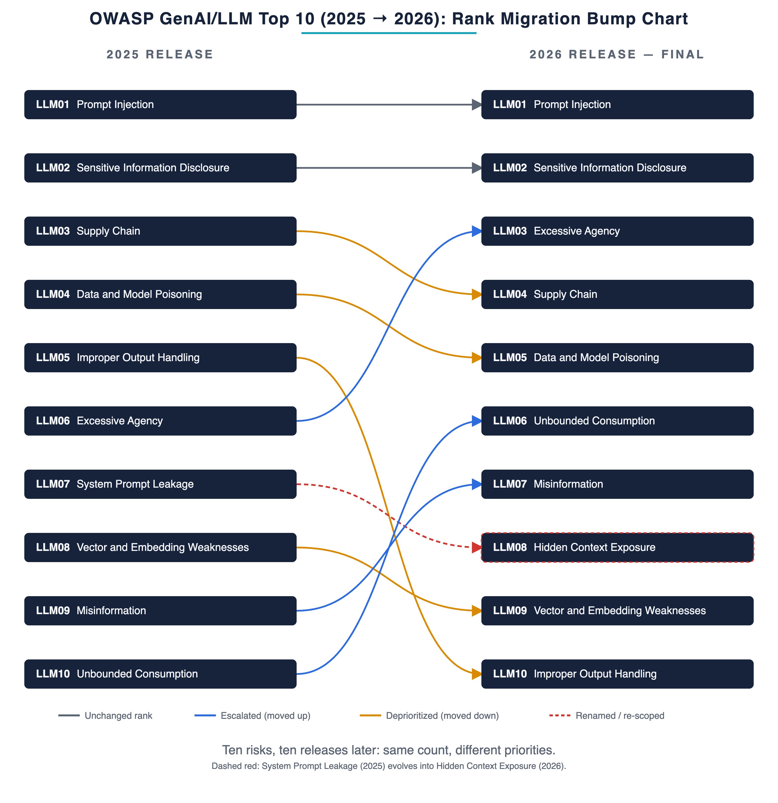

# 序文

## プロジェクト リーダーからのメッセージ

騙されないモデルを構築しようとするのはやめましょう。モデルが騙されたとしても（そして必ず騙されます）、重要なシステムが壊れないように、そのモデルを中心としたシステムを構築しましょう。この姿勢は、ここに挙げた 10 項目すべてに共通しています。今年は初めて、皆さんに信仰に頼るのではなく、証拠をお見せすることができます。

これまでのこのリストはすべて、判断に基づいて作成されていました。何百人もの実務家が、何が最も重要かを意見を述べました。その投票結果は今もリストの根幹であり、そこにあるべきものです。今年は、プロジェクト史上初めて、投票結果を実際に発生した問題の記録と照らし合わせて検証しました。公開されている脆弱性データベースと AI 被害データベースから 7,714 件の実際のインシデントを集め、それらを読み込む分類器を構築し、分類に必要な詳細情報を持つ 6,639 件を抽出しました。そして、私たちは率直な質問を投げかけました。「実務家が恐れていることは、インシデント記録が示すものと一致するのか？」

答えは「いいえ、必ずしも一致するとは限らない」でした。そして、それが驚きでした。投票結果とデータは、特定の重要な点で食い違いを見せ、その相違点から得られた教訓は、合意点から得られた教訓よりも多いものでした。

最も分かりやすい例は、プロンプト インジェクション攻撃です。実務担当者はこれを最大の脅威と位置付けています。しかし、実際のインシデント記録に基づいてカテゴリーをランク付けすると、上位	10 位から完全に外れてしまいます。この差は防御効果によるものです。チームはインジェクション攻撃に懸命に取り組んでいるため、クリーンなエクスプロイトが公開されるケースは少なくなり、公開されているインシデント件数は、成熟したチームが既に多額の費用を投じて対策を講じているリスクを過小評価しています。インジェクション攻撃の温床は、モデルが信頼できない入力を読み取るあらゆる場所、つまりあらゆる場所に依然として存在しているため、依然として最大の脅威であり続けます。この温床を完全に塞ぐことはできないため、いつか攻撃に利用される日に備えて対策を講じるしかありません。

一方、誤情報は逆の傾向を示しており、私が特に注意を促したいのはこの点です。投票では下位に位置付けられていますが、インシデント記録では上位に位置付けられています。投票結果が低く、証拠が上位にあるという、最も深刻なギャップが存在しています。このリストでは依然として誤情報は中位に位置しています。投票結果の方が重みがありますが、証拠によって順位が上がりました。意見の相違こそが重要なのです。モデルの流暢で自信に満ちた出力が意思決定やツール選択の判断基準となる場合、誤った回答は誤った行動につながり、実際の結果は投票結果が想定するよりも障害が頻繁に発生することを示しています。

コミュニティ投票は全体の 4 分の 3 の重みを持ち、残りの 4 分の 1 はインシデント データに基づいています。私たちは意図的に投票結果を重視しました。このリストは合意形成の産物であり、ノイズの多い 1 年分のデータだけで、作業に携わった人々の判断が覆されることはありません。信念と証拠の乖離が大きい場合、4 分の 1 の重みでも項目を 1 段階上げるのに十分です。不完全なデータだけでリストを書き換えることはできません。そのバランスが、Top 10 の最終順位を決定づけました。

### 2026 年版 Top 10の最新情報

*図 1: 2025 年版から 2026 年版 OWASP GenAI/LLM Top 10 への順位変動。変動状況（横ばい、順位上昇、順位低下、名称変更/範囲変更）に応じて色分けされています。*

順位変動は過去数年よりも大きく、その動きは、認識と証拠の間のギャップを反映しています。「過剰な主体性」が 3 位に上昇したことは、今回のランキングで最も重要な動きです。これは、エージェントのデプロイメントが被害の主要因であるという点で、投票結果と実績が一致しているためです。無制限の消費は、リソースとコストの枯渇を以前よりも重視する実務家によって 4 ランク上昇しました。不適切な出力処理は最も大きく順位を下げ、5 位から 10 位になりました。プロンプト インジェクションは、投票の強さとそれを支える防御効果によってトップの座を維持しました。機密情報の漏洩は 2 位を維持しました。これは、信念と証拠が一致し、私たちの確信が最も高いトップの座です。以前はシステム プロンプトの漏洩と呼ばれていたものは、現在は隠されたコンテキストの暴露という、本来アクセスできないはずの情報に対する信頼の欠如という同じ問題に対するより広範なフレームワークとなっています。

いくつかの項目も順位を上げました。より新しく、より深刻なリスクを、既にそれらを包含している項目に統合しました。薄っぺらな新しいカテゴリを新たに設けることは、リストを細分化するだけで何のメリットももたらさないでしょう。プロンプト インジェクションは、画像や音声トラックの中に指示を隠すような、クロス モーダル攻撃を包含するようになりました。サプライチェーンは、プロモートされたモデル アーティファクトが主張するものと異なる場合の信頼の欠如を包含するようになりました。データとモデルの汚染は、微調整の改ざんを包含するようになりました。不適切な出力処理は、アシスタントが大規模に生成するセキュリティが確保されていないでないコード全体に及ぶようになりました。これらのリスクの背後にあるインシデントは常に現実のものでした。今、それらは本来あるべき場所で評価されるようになりました。

ある境界が年々重要性を増しています。このリストは、モデルがアプリケーション内のコンポーネントである場合のリスクを所有しています。モデルが、呼び出し可能なツール、セッション間で保持するメモリ、下流で引き起こす結果を持つアクターになった瞬間、リスクは別の場所に移動します。

## 今後の展望

このリストは信頼できるものであり、今日から活用できます。このリストは、これらのシステムを攻撃・防御する実務家の判断と、現場で実際に発生した問題の記録を統合し、相互に検証しています。このような確固たる根拠は、以前のバージョンでは約束することしかできませんでした。10	項目すべてに取り組み、最上位から順に、モデルが自分に不利に働く日に備えて、それぞれを準備してください。そうすることで、この分野が最も恐れていることと、既に経験してきたことの両方に対応できます。

このリストは、対象となるテクノロジーと同様に、コミュニティの成果です。開発者、データ	サイエンティスト、セキュリティ実務家が、それぞれの判断と、今年はインシデント記録を提供して作成しました。貢献し、議論し、証拠に基づいて私たちの考えを検証するよう促してくれたすべての方々に感謝します。このリストが、皆さんが構築しているシステムを守る一助となることを願っています。

#### Steve Wilson

OWASP Top 10 for LLM Applications プロジェクトリーダー

LinkedIn: <https://www.linkedin.com/in/wilsonsd/>

#### Rock Lambros

OWASP Top 10 for LLM Applications 共同リーダー

LinkedIn: <https://www.linkedin.com/in/rocklambros>

